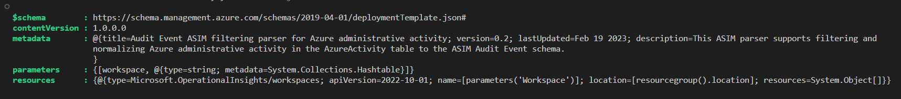

# ConvertFrom-ASim

## Description

This PowerShell script can be used to convert an ASIM function in YAML format in to a deployable ARM template.</br>

## Usage

### Example 1

This example will convert the `vimAuditEventAzureAdminActivity` to an ARM template and output it in the same folder

```powershell
    ConvertFrom-ASim.ps1 -FilesPath 'C:\Users\RogierDijkman\Parsers\vimAuditEventAzureAdminActivity.yaml'
```

### Example 2 - using alias
```powershell
    ConvertFrom-ASim.ps1 -templates 'C:\Users\RogierDijkman\Parsers\vimAuditEventAzureAdminActivity.yaml'
```

### Example 3

This example will convert the `vimAuditEventAzureAdminActivity` to an ARM template and output it the folder C:\output

```powershell
    ConvertFrom-ASim.ps1 -FilesPath 'C:\Users\RogierDijkman\Parsers\vimAuditEventAzureAdminActivity.yaml' -OutputFolder 'C:\output'
```
### Example 4 - using alias

```powershell
    ConvertFrom-ASim.ps1 -templates 'C:\Users\RogierDijkman\Parsers\vimAuditEventAzureAdminActivity.yaml' -dest 'C:\output'
```

### Example 5

This example will convert the `vimAuditEventAzureAdminActivity` to and return the template as an object.
> Returning the ARM template as an object can be useful in situations where the YAML files are converted and deployed an automation pipeline

```powershell
    ConvertFrom-ASim.ps1 -FilesPath 'C:\Users\RogierDijkman\Parsers\vimAuditEventAzureAdminActivity.yaml' -ReturnObject
```

