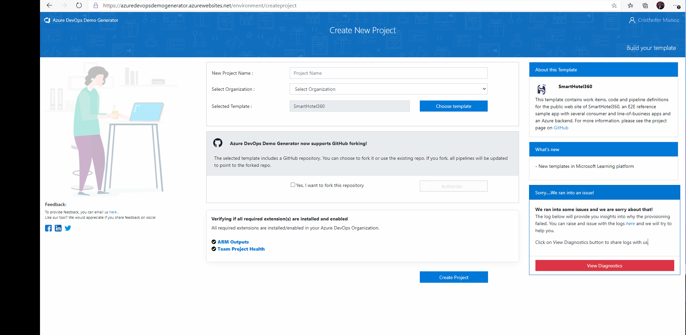

# Azure DevOps Generator

Organizations struggle with the number of tasks to adopt a cloud technology due the lack of an agile methodology to plan, execute,  validate its initial success and deploy into production.
Adopting a cloud native SIEM

The objective is helping customers to quickly deploy Azure Sentinel following the best practices using  Azure DevOps board with agile practices.

**Requirements:**

1. Create or use an existing Azure DevOps organization
2. [Access to Azure Sentinel DevOps Template](https://nam06.safelinks.protection.outlook.com/?url=https%3A%2F%2Fdocs.microsoft.com%2Fen-us%2Fazure%2Fdevops%2Forganizations%2Faccounts%2Fcreate-organization%3Fview%3Dazure-devops&data=02%7C01%7Ccrmuno%40microsoft.com%7Cd340cee195414944089708d7e20b9512%7C72f988bf86f141af91ab2d7cd011db47%7C1%7C0%7C637226411708890912&sdata=sUZ77jIq42KnMWF8%2BCTtEyaoGDDQ1xk9OE1HJGitlaI%3D&reserved=0)
3. [Access to Azure DevOps Generator](https://azuredevopsdemogenerator.azurewebsites.net/)

**Steps**:

1. Sign in to [Azure DevOps Generator]()

2. Create a new project, Specify a Project Name i.e. “Azure Sentinel POC” then select your organization.

3. Click “Choose template”, select Github. Past the raw udirrl: (<https://raw.githubusercontent.com/microsoft/AzureSentinelDevOps/master/Azure%20-Sentinel-DevOps.zip)>

4. Click “Submit” then “Create Project”

5. An Azure DevOps project will be created in your organization

6. Click on “Backlogs”, you should be able to see “Features” and “User Stories” providing guidance.
This should help your team to discuss, agree on acceptance criteria,  delegate ownership, create iterations, track the progress and efficiently deploy Azure Sentinel.
