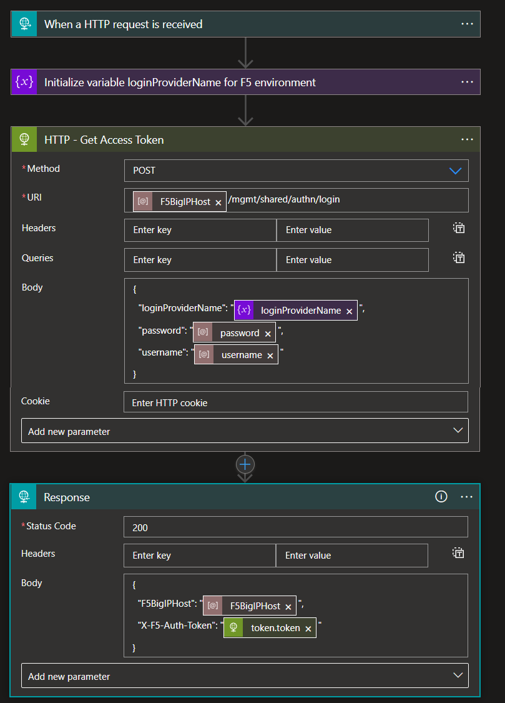

# F5 BIG-IP Base Playbook 

 ## Summary
This is F5 BIG-IP base playbook which is used to generate access token which is used in actual F5 BIG-IP Playbooks. This playbook gets triggered when a new HTTP request is created and this is being called from other F5 BIG-IP playbooks.

### Prerequisites 

1. F5 BIG-IP Host url should be known.
2. F5 BIG-IP firewall username and password should be known.
3. F5 BIG-IP environment should be accessible with the credentials.

### Deployment instructions 
1. Deploy the playbook by clicking on "Deploy to Azure" button. This will take you to deploying an ARM Template wizard.

  

2. Fill in the required parameters:

|Parameter|Description|
|-------------|------------|
|**Playbook Name**|Enter name for F5 BIG-IP Playbook without spaces.|
|**Host URL**|Enter value for F5 BIG-IP Host URL.|
|**Username**|Enter the F5 BIG-IP username.|
|**Password**|Enter the F5 BIG-IP password.|
    
    
## Playbook steps explained

### When a Http request is received
When a http request is received from another playbook or if this playbook is run manually, this playbook will be triggered.

### Initialize variable Login Provider Name
Initialize a string variable which holds the Login Provider Name.

### Initialize parameters

* F5 BIG-IP Host: This parameter stores Host URL value.
* Username: This parameter stores Username.
* Password: This parameter stores Password.

### HTTP - Get Access Token
This action will get the Access Token from F5 BIG-IP using Login Provider Name, Host URL, Username and Password as inputs.

### Response
This holds the access token and F5 BIG-IP host URL.
