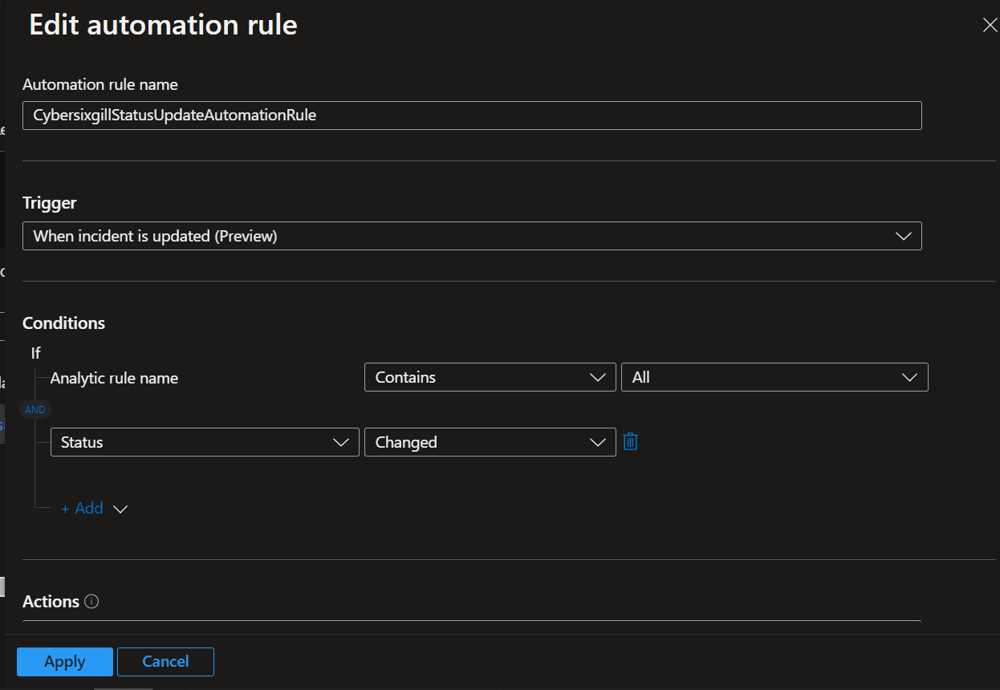

# CybersixgillAlertStatusUpdate
Author: Loginsoft

This playbook will update status of Actionable alerts in Cybersixgill Portal. When incident is updated in Microsoft Sentinel, playbook will run and update status Actionable alerts from Cybersixgill Portal 

# Prerequisites

We will need the following data to do one time setup.
1. Cybersixgill Client ID (client_id)
2. Cybersixgill Client Secret (client_secret)

Client ID and Client Secret can be obtained from [Cybersixgill Developer Portal](https://developer.cybersixgill.com/dashboard)
* You can skip below step if you already have Client ID and Client Secret.
* Visit [Cybersixgill Developer Portal](https://developer.cybersixgill.com/dashboard)
* Click on Create an application.
* Enter Application name and brief description and optional Application image
* All other fields can be left to default.
* Once done click on Create the app.
* Copy Client ID, Client Secret and Organization ID.

# Deployment instructions
1. Deploy the playbook by clicking on "Deploy to Azure" button. This will take you to deploying an ARM Template wizard.

2. Fill in the required parameters:
    * Playbook Name: Enter the playbook name here (Ex: CybersixgillAlertStatusUpdate)
    * Keyvault name : Enter the key vault name where secret key is stored.
    * Client ID key name: Key name for Cybersixgill Client ID stored api secret.
    * Client Secret key name: Key name for Cybersixgill Client Secret the stored api secret.
    * Organization ID key name: Key name for Cybersixgill organization ID

### Post-Deployment 
#### a. Authorize connections (Perform this action if needed)
Once deployment is complete, you will need to authorize each connection.
1.	Click the Microsoft Sentinel connection resource
2.	Click edit API connection
3.	Click Authorize
4.	Sign in
5.	Click Save

#### b. Configurations in Sentinel
Create new automation rule, ex: CybersixgillStatusUpdateAutomationRule
   * Trigger = When Incident is updated
   * Condition = Status Changed

*Automation rule example*

#### c. Assign Playbook Microsoft Sentinel Responder Role
1. Select the Playbook (Logic App) resource
2. Click on Identity Blade
3. Choose System assigned tab
4. Click on Azure role assignments
5. Click on Add role assignments
6. Select Scope - Resource group
7. Select Subscription - where Playbook has been created
8. Select Resource group - where Playbook has been created
9. Select Role - Microsoft Sentinel Responder
10. Click Save (It takes 3-5 minutes to show the added role.)
#### d. Assign access policy on key vault for Playbook to fetch the secret key
1. Select the Keyvault resource where you have stored the secret
2. Click on Access policies Blade
3. Click on Create
4. Under Secret permissions column , Select Get , List from "Secret Management Operations"
5. Click next to go to Principal tab and choose your deployed playbook name
6. Click Next leave application tab as it is .
7. Click Review and create
8. Click Create