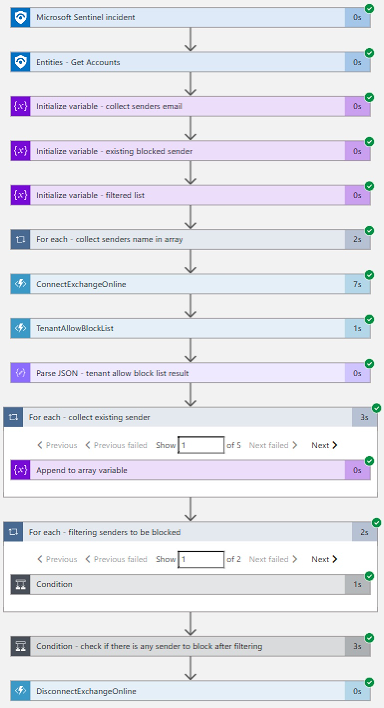

# o365-BlockSender Info Playbook
 ## Summary
 When a new Microsoft Sentinel incident is created, this playbook gets triggered and performs below actions
 1. Fetches the list of earlier blocked senders .
 2. Fetches the new senders from incidents and compare them with existing one and update the blacklist . 
 
 
 

### Prerequisites 
1. Defender for office 365 function app custom connector needs to be deployed prior to the deployment of this playbook under the same subscription.
2. Custom connector [readme.md](../../CustomConnector/O365_Defender_FunctionAppConnector/readme.md) file should be followed properly before using any of the Defender for office 365 playbooks.

### Deployment instructions 
1. Deploy the playbook by clicking on "Deploy to Azure" button. This will take you to deploying an ARM Template wizard.

2. Fill in the required parameters:
    * Playbook Name: Enter the playbook name here
    * Applicationid: Enter the application ID , which you got during app registration.
    * Organization Name : Enter the organization name (ex : abc@pay.onmicrosoft.com then orgname will be : pay.onmicrosoft.com).
	* Key vault name : Your Key vault name where certificate thumbprint is saved. 
	* Certificate_key_name : Your secret key name under which certificate thumbprint is stored.
	* Functions App Name : Enter your function app name (Default : o365def ,Recommend : don’t change it)

### Post-Deployment instructions 
#### a. Authorize connections (Perform this action if needed)
Once deployment is complete, you will need to authorize each connection.
1.	Click the Microsoft Sentinel connection resource
2.	Click edit API connection
3.	Click Authorize
4.	Sign in
5.	Click Save
6.	Repeat steps for all connections
#### b. Configurations in Sentinel
1. In Microsoft sentinel analytical rules should be configured to trigger an incident with risky Account.
2. Configure the automation rules to trigger this playbook, mapping of account is necessary
3. Refer to Screenshot below

 
#### c. Assign Playbook Microsoft Sentinel Responder Role
1. Select the Playbook (Logic App) resource
2. Click on Identity Blade
3. Choose System assigned tab
4. Click on Azure role assignments
5. Click on Add role assignments
6. Select Scope - Resource group
7. Select Subscription - where Playbook has been created
8. Select Resource group - where Playbook has been created
9. Select Role - Microsoft Sentinel Responder
10. Click Save (It takes 3-5 minutes to show the added role.)
#### d. Assign access policy on key vault for Playbook to fetch the secret key
1. Select the Keyvault resource where you have stored the secret
2. Click on Access policies Blade
3. Click on Create
4. Under Secret permissions column , Select Get , List from "Secret Management Operations"
5. Click next to go to Principal tab and choose your deployed playbook name
6. Click Next leave application tab as it is .
7. Click Review and create
8. Click Create
