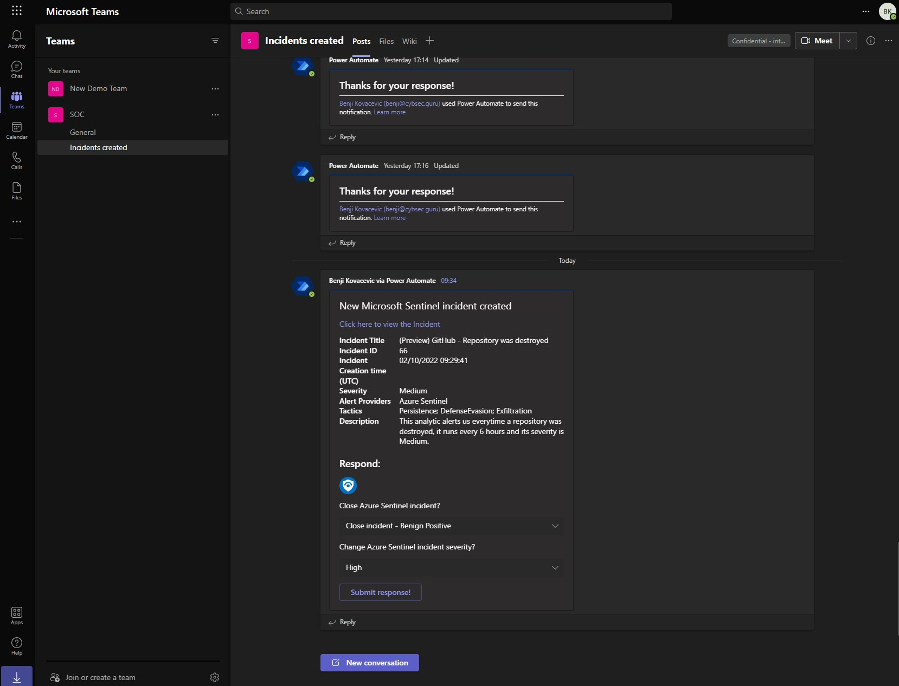

#  Send-Teams-adaptive-card-on-incident-creation

Author: Benjamin Kovacevic

This playbook will send Microsoft Teams Adaptive Card on incident creation, with the option to change the incident's severity and/or status.

# Prerequisites

1. Get Teams Group ID and Teams Channel ID. (instructions available on - https://www.linkedin.com/pulse/3-ways-locate-microsoft-team-id-christopher-barber-/). It is possible to choose Teams group and channel after deployment as well.

# Quick Deployment
**Deploy with incident trigger**

After deployment, attach this playbook to an **automation rule** so it runs when the incident is created.

[Learn more about automation rules](https://docs.microsoft.com/azure/sentinel/automate-incident-handling-with-automation-rules#creating-and-managing-automation-rules)

 

# Post-deployment
1. Assign Microsoft Sentinel Responder role to the Playbook's Managed Identity
2. Authorize Microsoft Teams connector

## Screenshots
**Incident Trigger**

**Teams Notification**

