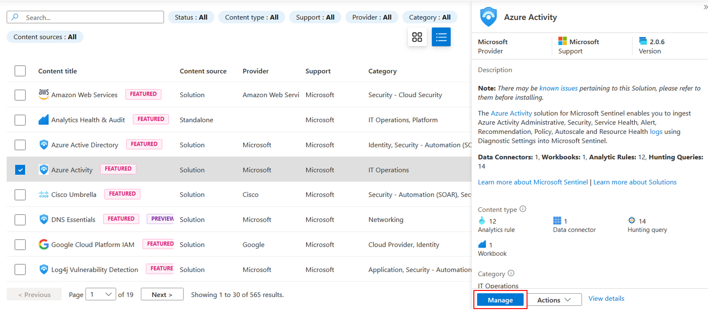

# Module 2 - Data Connectors

#### 🎓 Level: 100 (Beginner)
#### ⌛ Estimated time to complete this lab: 15 minutes

## Objectives

In this module you will learn how to install and enable Data Connectors in Microsoft Sentinel to bring in alerts and/or telemetry from different sources.

#### Prerequisites

This module assumes that you have completed [Module 1](Module-1-Setting-up-the-environment.md), as you will need a Microsoft Sentinel workspace provisioned.

Some of the data connectors that will be used in this lab require specific permissions on the workspace or your Azure subscription. If you don't have the appropriate permissions, you can still continue doing the rest of the labs.

### Exercise 1: Enable the Azure Activity connector

This exercise shows you how to enable the Azure Activity data connector. This connector imports logs from Azure management plane activities, which lets you track Azure administrative activity within the subscription.

**NOTE**: Your user account must have at least *Reader* permissions to any subscription you want to monitor, in order to perform this exercise.

1. Open your Microsoft Sentinel instance by typing *Sentinel* into the search box, clicking the Sentinel service, and then your workspace.

2. Open **Content Hub** and search for the *Azure Activity* content solution.

3. Tick the **Azure Activity** solution and click either **Install** button.

4. When the deployment completes, select **Data Connectors** in the **Configuration** section of your Sentinel workspace.

5. In the data connectors screen, click the **Azure Activity** connector. If you already have lots of connectors, you can type *activity* into the search bar to narrow down the list. **Note** if the connector has only just been installed, you might need to press the **Refresh** button to see it.
   
6. Select the **Azure Activity** connector and click on **Open connector page** in the right-hand panel.

7. On the Azure Activity connector page, scroll down through the Configuration instructions until you get to number 2, **Connect your subscriptions through diagnostic settings new pipeline**. This method leverages Azure Policy and it brings many improvements compared to the older direct settings method (details about these improvements can be found [here](https://techcommunity.microsoft.com/t5/azure-sentinel/moving-azure-activity-connector-to-an-improved-method/ba-p/2479552)).

8. Click on **Launch Azure Policy Assignment wizard**, which will redirect you to the policy creation page.

9. In *Scope*, select your **subscription**.

    **Note**: Policy lets you deploy a setting to multiple possible targets - for example, if you have Owner permission at a Management Group level, you can assign a policy to configure collection of Azure Activity logs from all subscriptions under that group.

    

10. Go to the **Parameters** tab. On the **Primary Log Analytics workspace** select the Microsoft Sentinel workspace:

    

11. We'll use the *deployIfNotExists* (DINE) feature of Azure Policy to deploy the setting directly to any Activity logs in scope.
    To do this, tick **Create a remediation task**. 
    Leave the *Managed Identity* set to a *System Managed Identity*, and pick a region proximate to your subscription. 

    

12. Press **Review and Create**, and then **Create** to save the policy.

13. It is normal if you don't immediately see the connector showing as *connected* and with a green bar, as Azure Policy can take some time to apply.

    **Note:** each Subscription has a maximum of 5 destinations for its Azure Activity logs. If this limit is already reached, the policy created as part of this exercise won't be able to add an additional destination to your Microsoft Sentinel workspace. If this is the case, you can use the Diagnostic Settings for the Activity Log to remove older settings directly. You can also use Diagnostic Settings to directly connect Activity logs to Sentinel.

14. Head back to the Content Hub and click on the *Azure Activity* solution, and click the **Manage** button at the bottom of the panel on the right. 

    
    
15. From the *Manage* view, the contents of the solution are displayed: any connectors, analytics rules, workbooks, hunting queries and other content included in the solution pack are visible here. Now these have been installed, they will each appear in the relevant section of the Sentinel interface (e.g. Analytics rule templates, Workbook templates and so on).

Now we've connected Activity, we'll move on to some other connectors.

### Exercise 2: Enable the Microsoft Defender for Cloud Data Connector

This exercise shows you how to enable the **Microsoft Defender for Cloud** data connector. This connector allows you to stream security alerts from Microsoft Defender for Cloud into Microsoft Sentinel, so you can incorporate Alerts from Defender, view Defender data in workbooks, and investigate and respond to incidents.

**NOTE**: To do this exercise, your user must have the *Security Reader* role in the subscription. If not done already, you will also need to enable any of the Defender plans in Microsoft Defender for Cloud.

1. Open your Microsoft Sentinel workspace and click on the **Content Hub**.

2. Search for *defender* in the search bar, select the *Microsoft Defender for Cloud* content solution, and click **Install**.

3. After deployment finishes, click the **Manage** button at the bottom right. (Note you can also browse to the newly-installed connector via the Connectors blade as we did in the last exercise - we're going to do it another way this time.)

4. In the list of content, tick the *Microsoft Defender for Cloud* connector and click **Open Connector Page**

5. In the *Microsoft Defender for Cloud* connector page, check that your permissions are sufficient as noted in the panel at the top. If you don't have the required permissions, you can continue to the next exercise.

6. From the list of subscriptions at the bottom of the page, select the desired subscription and click on *Connect*. Wait for the operation to complete. You may wish to enable bi-directional sync for the connector, which means that alerts/incidents closed in either product will be reflected in the other.

You've now connected alerts from Microsoft Defender for Cloud. This connector populates the `SecurityAlerts` table when a Defender for Cloud alert is raised, but at this stage, that alert *won't* be promoted into an Incident. We'll cover a rule to promote the alerts in the next module.

### Exercise 3: Enable Microsoft Defender Threat Intelligence connector

In this exercise, we'll add the **Microsoft Defender Threat Intelligence** ([MDTI](https://learn.microsoft.com/en-us/defender/threat-intelligence/what-is-microsoft-defender-threat-intelligence-defender-ti)) connector to your Sentinel workspace, which ingests Microsoft Threat Intelligence indicators automatically into the `ThreatIntelligenceIndicator` table. MDTI provides a set of indicators and access to the https://ti.defender.microsoft.com portal at no additional cost, with the premium features of the MDTI portal and API requiring licensing.

The *Threat Intelligence* content solution includes the data connectors for all supported forms of Threat Intelligence.

**NOTE:** Sentinel also supports importing Threat Intelligence indicators via the TAXII protocol using the **Threat Intelligence - TAXII** data connector, so if you have your own preferred TI source, you can add that to your workspace instead.

1. Open your Microsoft Sentinel workspace and click on the **Content Hub**.

2. Search for *threat intel* in the search bar, select the *Threat Intelligence* content solution, and click **Install**.

3. After deployment finishes, click the **Manage** button at the bottom right.

4. Select the *Microsoft Defender Threat Intelligence (preview)* connector and click **Open Connector Page** at the bottom right.

5. On the Connector page, from the *Import indicators* list, select an option for which indicators to import, or leave the default "All available" selected, and click **Connect**.

Threat Intelligence indicators will start being ingested into your `ThreatIntelligenceIndicator` table.

#### Next Step

If you're onboarding a custom TAXII feed, continue to the next exercise. 

Otherwise, you can now continue to **[Module 3 - Analytics Rules](./Module-3-Analytics-Rules.md)**.

### Exercise 4: (optional) Enable Threat Intelligence TAXII data connector

This exercise shows you how to enable the Threat Intelligence - TAXII data connector. This connector allows you to send threat indicators from TAXII servers to Microsoft Sentinel. Threat indicators can include IP addresses, domains, URLs, and file hashes.

1. Open your Microsoft Sentinel workspace and click on the **Content Hub**.

2. Search for *threat intel* in the search bar, select the *Threat Intelligence* content solution, and click **Install**.
   

3. After deployment finishes, click the **Manage** button at the bottom right.

4. Open the Connector page for the *Threat intelligence - TAXII* connector

5. Obtain feed information and credentials for a TAXII feed. Your organization may have a subscription, or some third-party services may offer free or low-cost signup for access to their feed(s).

6. Go to your Microsoft Sentinel workspace and select *Data Connectors*, under the *Configuration* section.

7. In the Connectors screen, type *taxii* in the search bar, select the *Threat intelligence - TAXII* connector and click on **Open connector page**.

8. In the *Threat Intelligence - TAXII* connector page, add your feed information under the *Configuration* heading.

   
9.  Click **Add** and wait until the operation completes.

Threat indicators should soon start being ingested into your `ThreatIntelligenceIndicator` table.

#### Next Step

**Congratulations, you have completed Module 2!**. Continue to **[Module 3 - Analytics Rules](./Module-3-Analytics-Rules.md)**
