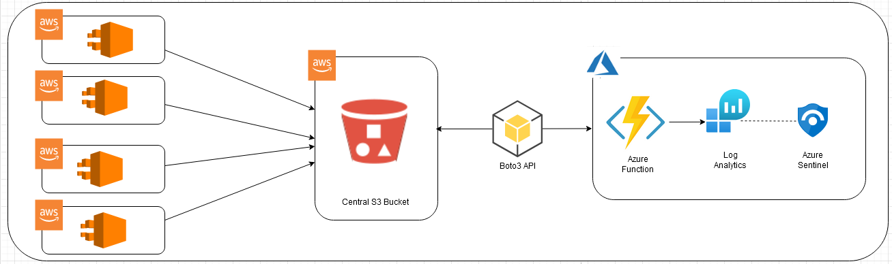

# Azure native Data connector to ingest AWS CloudTrail Logs  
**Author: Sreedhar Ande**  

Azure native Sentinel Data connector to ingest AWS CloudTrail Logs from centralized AWS S3 bucket - Receiving CloudTrail Log Files from Multiple Accounts 

AWS CloudTrail logs are audit type events from all/any AWS resources in a tenancy. Each AWS resource has a unique set of Request and Response Parameters. Azure Log Analytics has a column per table limit of 500, (plus some system columns) the aggregate of AWS parameter fields will exceed this quickly leading to potential loss of event records

Code does the following things with the logs it processes. 
1.	Takes the core fields of the record. i.e. all fields except for the Request and Response associated fields and puts them in a LogAnalyticsTableName_ALL. Providing a single table with all records with core event information.	
2.	Looks at each event and puts it into a table with an extension <AWSREsourceType> i.e. LogAnalyticsTableName_S3 
3.	Exception to 2 above is for EC2 events, the volume of fields for EC2 Request and Response parameters exceeds 500 columns. EC2 data is split into 3 tables, Header, Request & Response. 
	Ex: LogAnalyticsTableName_EC2_Header
4.	In future if other AWS datatypes exceed 500 columns a similar split may be required for them as well. 

**Note**  

To avoid additional billing and duplication:
1. You can turn off LogAnalyticsTableName_ALL using additional Environment Variable **CoreFieldsAllTable** to **false**
2. You can turn off LogAnalyticsTableName_AWSREsourceType using additional Environment Variable **SplitAWSResourceTypeTables** to **false**

**Either CoreFieldsAllTable or SplitAWSResourceTypeTables must be true or both can be true**

## **Function Flow process**
**CloudTrail Logs --> AWS S3 --> Azure Function --> Azure Log Analytics**


## Installation / Setup Guide

1. Click  Deploy To Azure/Deploy to Azure Gov  
[](https://portal.azure.com/#create/Microsoft.Template/uri/https%3A%2F%2Fraw.githubusercontent.com%2FAzure%2FAzure-Sentinel%2Fmaster%2FDataConnectors%2FAWS-CloudTrail-AzFunc%2Fazuredeploy_awscloudtrail.json)
[](https://portal.azure.us/#create/Microsoft.Template/uri/https%3A%2F%2Fraw.githubusercontent.com%2FAzure%2FAzure-Sentinel%2Fmaster%2FDataConnectors%2FAWS-CloudTrail-AzFunc%2Fazuredeploy_awscloudtrail.json)


2. Select the preferred **Subscription**, **Resource Group** and **Location**  
   **Note**  
   Best practice : Create new Resource Group while deploying - all the resources of your custom Data connector will reside in the newly created Resource 
   Group
3. Enter the following value in the ARM template deployment
	```	
	"Workspace Id": Azure Log Analytics Workspace Id​
	"Workspace Key": Azure Log Analytics Workspace Key
	"AWS Access Key Id": AWS Access Key
	"AWS Secret Key ID": AWS Secret Key
	"AWS Region Name" : AWS SecurityHub Region
	"S3 Bucket": AWS S3 Bucket URI
	"CustomLogTableName": Azure Log Analytics Custom Log Table Name	
	"CoreFieldsAllTable": To Turn on/off LogAnalyticsTableName_ALL
	"SplitAWSResourceTypeTables": To Turn on/off SplitAWSResourceTypeTables
	```

## Post Deployment Steps

1. The `TimerTrigger` makes it incredibly easy to have your functions executed on a schedule. This sample demonstrates a simple use case of calling your function based on your schedule provided while deploying. If the time interval needs to be modified, it is recommended to change the Function App Timer Trigger accordingly update environment variable **"Schedule**" (post deployment) to prevent overlapping data ingestion.
   ```
   a.	Go to your Resource Group --> Click on Function App `<<functionappname>><<uniqueid>>`
   b.	Click on Function App "Configuration" under Settings 
   c.	Click on "Schedule" under "Application Settings"
   d.	Update your own schedule using cron expression.
   ```
   **Note: For a `TimerTrigger` to work, you provide a schedule in the form of a [cron expression](https://en.wikipedia.org/wiki/Cron#CRON_expression)(See the link for full details). A cron expression is a string with 6 separate expressions which represent a given schedule via patterns. The pattern we use to represent every 10 minutes is `0 */10 * * * *`. This, in plain text, means: "When seconds is equal to 0, minutes is divisible by 10, for any hour, day of the month, month, day of the week, or year".**
   
 
2. Parameterized AWS S3 fresh event duration using environment variable "FreshEventTimeStamp". Value must be in minutes.  
   **Note**  
   Azure Function trigger schedule and FreshEventTimeStamp
   Ex: If you want to trigger function every 30 min then values must be
   FreshEventTimeStamp=30
   Schedule=0 */30 * * * *
      
4. AWSAccessKey, AWSSecretAccessKey and Workspace Key will be placed as "Secrets" in the Azure KeyVault `<<functionappname>><<uniqueid>>` with only Azure Function access policy. If you want to see/update these secrets,

	```
		a. Go to Azure KeyVault "<<functionappname>><<uniqueid>>"
		b. Click on "Access Policies" under Settings
		c. Click on "Add Access Policy"
			i. Configure from template : Secret Management
			ii. Key Permissions : GET, LIST, SET
			iii. Select Prinicpal : <<Your Account>>
			iv. Add
		d. Click "Save"

	```