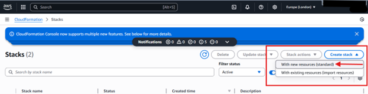
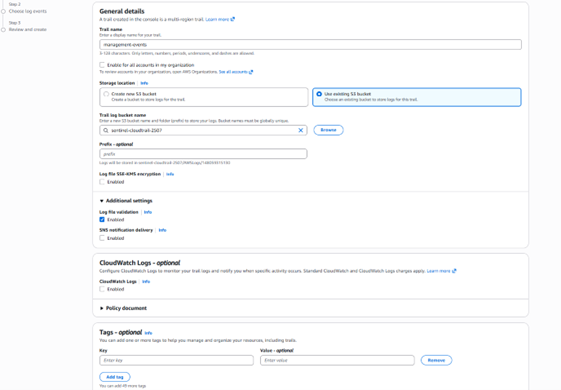
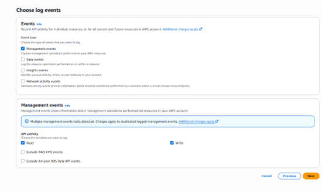
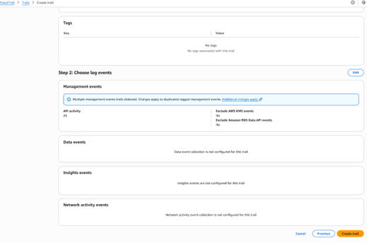

### 1. Microsoft Sentinel configuration

1. Sign in to the **Azure portal**.
2. Navigate to **Microsoft Sentinel** and then to **Content Hub**.
3. Install the connector **Amazon Web Services S3**.

4. Navigate to **Data connectors** and open the **Amazon Web Services S3** connector page.

---

### 2. Create the CloudFormation stack

1. Sign in to the **AWS Management Console**.
2. In the search bar, search for **CloudFormation** and open the **CloudFormation** service.

3. Select **Create stack** → **With new resources (standard)**.

---

#### 2.1 Step 1 – Specify template

1. Under **Prepare template**, select **Choose an existing template**.
2. Under **Template source**, select **Upload a template file**, then choose and upload the provided template file.
3. Click **Next**.

---

#### 2.2 Step 2 – Specify stack details

Fill in the following parameters:

- **Stack name**: Enter a name for the stack.  
- **AwsRoleName**: Enter the IAM role name (the name must start with `OIDC_`).  
- **LogBucketName**: Enter the name of the S3 bucket where CloudTrail will write logs and from which Microsoft Sentinel will read.  
  - If you want to use an existing bucket, enter its name here and set **CreateNewBucket** to `false`.  
- **CreateNewBucket**: Leave as `true` to let the stack create and configure the S3 bucket, or set to `false` if you are using an existing bucket (you will configure its bucket policy and event notifications manually).  
- **CloudTrailTrailName**: Name of the existing CloudTrail trail that delivers logs to the S3 bucket (for example, `management-events`).  
- **SentinelSQSQueueName**: Enter the name of the Amazon SQS queue that will receive S3 event notifications for CloudTrail log objects.  
- **LogFileSuffix**: S3 object key suffix for CloudTrail log files used in the notification filter (default `.gz`).  
- **SentinelWorkspaceId**: Enter the Workspace ID from the Azure Log Analytics workspace page:  
  - In the Azure portal, go to **Log Analytics workspace → Overview** and copy the **Workspace ID**.

After filling all required fields, click **Next**.

---

#### 2.3 Step 3 – Configure stack options

1. Leave the default options unchanged.
2. Acknowledge that AWS CloudFormation might create IAM resources with custom names by selecting the required checkbox.

3. Click **Next**.

---

#### 2.4 Step 4 – Review

1. Review all settings and confirm that all required fields are correctly populated.

2. Click **Submit** to create the stack.

Monitor the stack creation:

1. In **CloudFormation → Stacks → Events**, monitor the progress status.
2. When the status indicates completion, verify in the left panel that the stack has been successfully created.

---

### 3. Export CloudTrail logs

1. Go to the **CloudTrail** dashboard and create a trail (if one does not already exist).

2. Configure the trail:

   - **Trail name**: Enter the trail name that you used in the CloudFormation stack in the previous steps (for example, `management-events`).  
   - **Enable for all accounts in organization**: Optional, if there are other accounts in the organization.  
   - **Storage location**: Choose **Use existing S3 bucket** and enter the **ARN** of the S3 bucket that was created by CloudFormation.  
   - **Log file SSE-KMS encryption**: Disable.  

   Click **Next**.

3. **Choose log events** (minimum configuration):

   - **Management events**: Enabled.  
   - **API activity**: **Read** and **Write**.  

   Click **Next**.

4. Click **Create trail**.

