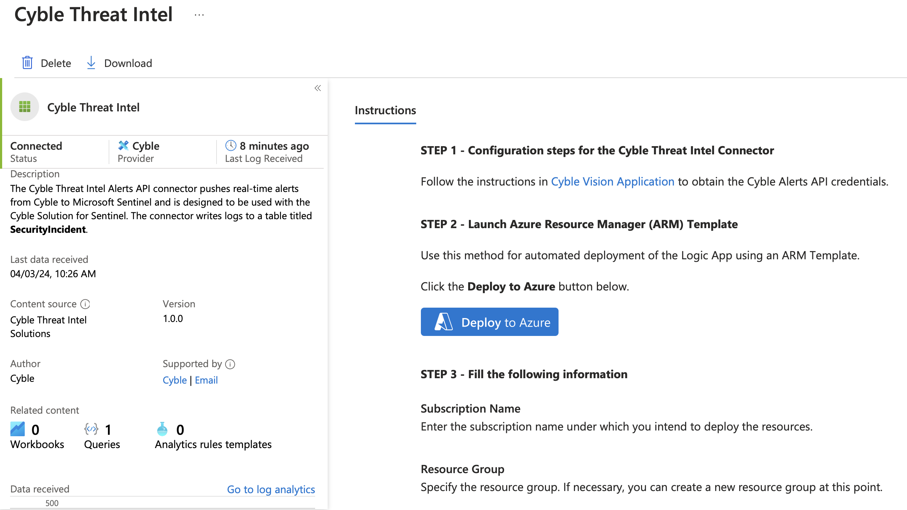

# Cyble Threat Intel Connector for Microsoft Sentinel

**Authors:** Pragya Mishra

The Cyble Threat Intel Connector facilitates the retrieval of logs from the Cyble Alerts API into Microsoft Sentinel.

> **NOTE:** This connector operates to establish a connection with the Cyble Alerts API, enabling the retrieval of its logs for Microsoft Sentinel workspace. Pulling logs into Sentinel via logic app could lead to extra charges related to data ingestion. For a detailed understanding of these potential costs, it's advisable to consult the [Azure Logic App pricing page](https://azure.microsoft.com/pricing/details/logic-apps/) for details.

## Configuration Steps to Deploy Logic App

### Pre-requisites

A Cyble Alerts Token and Cyble Alerts Endpoint is required for authentication. Obtain your unique from [Cyble Vision Application](https://cyble.ai) for deployment.

Read and Write Access to your Sentinel Workspace is required.

## Screenshots

### Deploy Logic App

1. Install Cyble Threat Intel Connector from Data Connectors in Content Hub.

2. Click on Deploy to Azure
   - 

3. Select the preferred **Subscription**, **Resource Group**, and **Location**.
   > **Note:** Best practice: Create a new Resource Group while deploying; all the resources of your custom Data connector will reside in the newly created Resource Group.

4. Enter the following values in the ARM template deployment:
    - **Cyble Endpoint:** Specify the endpoint to establish the correct API endpoint.
    - **Cyble Alerts Token:** Provide your unique access token for authentication.
    - **Frequency Minutes:** Determine how often the workflow should run.

## Post Deployment Steps

1. **Incident Structure:**

   - **Title:** [Threat Incident Title]
   - **Incident ID:** [Threat Incident Incident ID]
   - **Owner:** [Specify the owner]
   - **Status:** [Threat Incident status] (Editable by user)
   - **Severity:** [Threat Incident severity] (Editable by user)
   - **Description:** [Threat Incident Description]

   **Tags:** [Tags for Cyble Incidents] 

   **Note:** Incidents from Cyble can be filtered by the tag "Cyble-Incidents."

2. **Next Steps: Edit Incident Details**

   - After the deployment, you can dynamically edit multiple incident details like:
     - **Owner:** Edit the owner of the incident as needed.
     - **Status:** Update the status of the incident based on its progression.
     - **Severity:** Adjust the severity level of the incident according to its impact.

   - Follow the [Incident Investigation Process](https://learn.microsoft.com/en-us/azure/sentinel/investigate-incidents) to keep the information up-to-date and relevant to the evolving situation.
