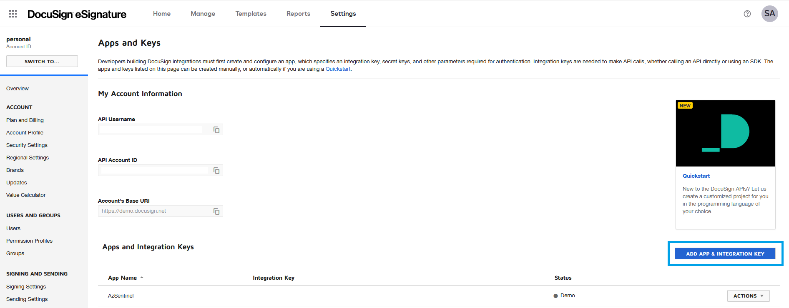
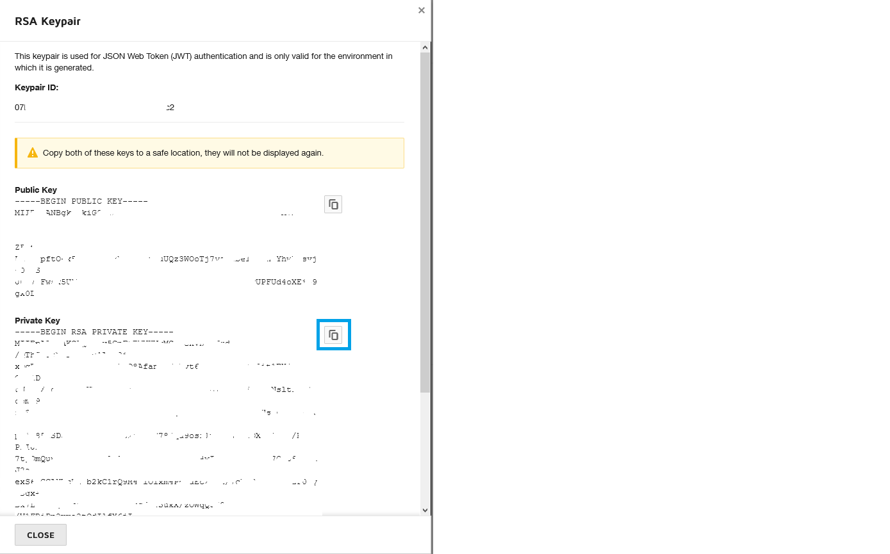
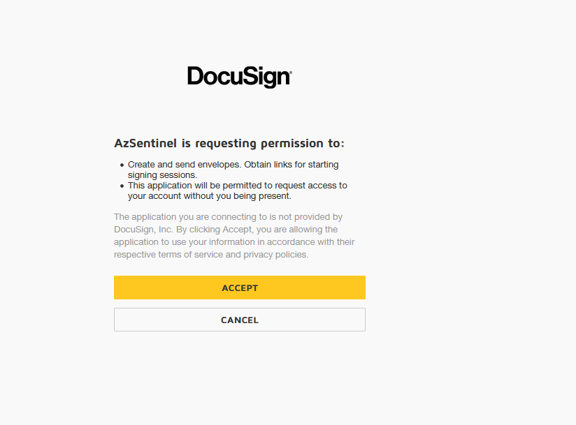

# Ingest DocuSign Security Events
**Author: Sreedhar Ande**

DocuSign-SecurityEvents Data connector ingests   
	1. Security Events for your DocuSign account into Azure Log Analytics Workspace using DocuSign Monitor REST API  
	2. DocuSign Account Users into Azure Log Analytics Workspace using DocuSign Users REST API  

Technical Blog
https://techcommunity.microsoft.com/t5/azure-sentinel/protecting-your-docusign-agreements-with-azure-sentinel/ba-p/2085502

**Note**  
Above API's resumes getting records from the spot where the previous call left off to avoid duplication of records in DocuSignSecurityEvents_CL and DocuSignUsers_CL Log Analytics Workspace custom tables

## **Pre-requisites**
1. Login to your DocuSign Account  

2. To create new "Integration Key", click on "Add & Integration Key"  

     
   
3. You’ll see a dialog box to enter your app name. Give your app a short, but descriptive name, such as "Azure Sentinel Integration"  

4. Select ADD to add your app. Your app is automatically assigned an integration key (GUID) value that cannot be changed, as shown here  

     
   
5. Under Authentication, Select "Authorization Code Grant" as Azure Sentinel Data Connector uses JWT Grant Flow to get "Access Token" to communicate with DocuSign Monitor API and Users API  
 
6. Select ADD SECRET KEY, which creates a new, automatically generated GUID value that represents a secret key  
   **Note**  
   Copy the secret key to a safe location by selecting the copy icon shown in the image.After your integration settings are saved, secret keys are masked for security reasons and cannot be revealed again. If you don’t copy them first, your only option will be to delete the secret key in question and add a new one.  
   
7. Set a redirect URI for your app which DocuSign will redirect the browser after authentication when using the Authorization Code Grant.  

8. Under Additional Settings, Select "ADD URI", which displays a new text box for you to enter the URI add in the following **redirect uri** `http://localhost:8080/authorization-code/callback` where your authenticated users will be redirected.  

9. RSA key pair is required to use the JWT Grant authentication flow. To generate navigate to Service Integration, Click on "ADD RSA KEYPAIR", which creates a new, automatically generated GUID value that represents the ID for the private and public key pair
   **Note:**  
   You are only able to view your RSA key pair immediately after creating it, so be sure to save it or record it to a safe place. To ensure the key pair’s security, there is no way to go back and view it again after you close the window.  

10. **Important** Copy the **private_key** into the file **"DocuSignRSAPrivateKey.key"**  If you don’t copy them first, your only option will be to delete the RSA key pair and add a new one. Select OK, then select SAVE.  
   

### Request Application Consent

1. Run **[Application_Consent.ps1.](./Application_Consent.ps1)** and provide values for the following  
   ```
   DocuSignEnvironment: Enter value as Developer or Production  
   IntegrationKey: Enter DocuSign App Integration Key  
   ```
 
2. Script will construct a URI value matching the "DocuSignEnvironment". This path differs depending on whether your app is in the development environment or in production.  
   For the developer demo environment, the base URI is https://account-d.docusign.com/oauth/auth  
   For the production platform, the base URI is https://account.docusign.com/oauth/auth  

3. Script will prompt you to log in to your DocuSign account and be presented with a request to grant signature and impersonation permissions to your app, as shown by the screenshot.  

4. Click on Accept, After you grants permission, you’ll be able to use the OAuth JWT Grant flow to impersonate that user and make API calls.  
   

**Note**  
It’s only one-time step to collect consent  


## Configuration Steps to Deploy Function App
1. Click on Deploy to Azure (For both Commercial & Azure GOV)  
[](https://aka.ms/sentinel-docusignconnector-azuredeploy)
  

2. Select the preferred **Subscription**, **Resource Group** and **Location**  
   **Note**  
   Best practice : Create new Resource Group while deploying - all the resources of your custom Data connector will reside in the newly created Resource 
   Group
   
3. Enter the following value in the ARM template deployment
	```
	"DocuSign Integration Key": DocuSign App Integration Key
	"DocuSignAdminUserGUID" : Admin User Name GUID
	"DocuSignAccountAPIID" : DocuSign Account API ID
	"Workspace Id": Azure Log Analytics Workspace Id​
	"Workspace Key": Azure Log Analytics Workspace Key
	```
	
## Post Deployment Steps
1. **Important**  
   After successful deployment, Navigate to Resource Group and search for storage account, named - `<<FunctionAppName>><<uniqueid>>` and upload previously saved file **"DocuSignRSAPrivateKey.key"** to "docusign-monitor" container  	

2. DocuSignIntegrationKey, DocuSignAdminUserGUID, DocuSignAccountID and Workspace Key will be placed as "Secrets" in the Azure KeyVault `<<FunctionAppName>><<uniqueid>>` with only Azure Function access policy. If you want to see/update these secrets,

	```
		a. Go to Azure KeyVault "<<FunctionAppName>><<uniqueid>>"
		b. Click on "Access Policies" under Settings
		c. Click on "Add Access Policy"
			i. Configure from template : Secret Management
			ii. Key Permissions : GET, LIST, SET
			iii. Select Prinicpal : <<Your Account>>
			iv. Add
		d. Click "Save"

	```
	After granting permissions, If you want to update/change value for any Secrets
	** Step 1 : Update existing Secret Value **
	```
		a. Go to Azure KeyVault "<<FunctionAppName>><<uniqueid>>"
		b. Click on "Secrets" and select "Secret Name"
		c. Click on "New Version" to create a new version of the existing secret.
		d. Copy "Secret Identifier"
	```
	
	** Step 2 : Update KeyVault Reference in Azure Function **
	```
	   a. Go to your Resource Group --> Click on Function App `<<FunctionAppName>><<uniqueid>>`
	   b. Click on Function App "Configuration" under Settings 
	   c. Click on envionment variable that has value in KeyVault under "Application Settings"
	   d. Update value @Microsoft.KeyVault(SecretUri=<<Step 1 copied Secret Identifier URI>>).
	   e. Before clicking OK, make sure the status is "Resolved"
    ```

3. The `TimerTrigger` makes it incredibly easy to have your functions executed on a schedule. The default **Time Interval** is set to pull the last ten (10) minutes of data. If the time interval needs to be modified, it is recommended to change the Function App Timer Trigger accordingly update environment variable **"Schedule**" to prevent overlapping data ingestion.
   ```
   a.	Go to your Resource Group --> Click on Function App `<<FunctionAppName>><<uniqueid>>`
   b.	Click on Function App "Configuration" under Settings 
   c.	Click on "Schedule" under "Application Settings"
   d.	Update your own schedule using cron expression.
   ```
   **Note: For a `TimerTrigger` to work, you provide a schedule in the form of a [cron expression](https://en.wikipedia.org/wiki/Cron#CRON_expression)(See the link for full details). A cron expression is a string with 6 separate expressions which represent a given schedule via patterns. The pattern we use to represent every 10 minutes is `0 */10 * * * *`. This, in plain text, means: "When seconds is equal to 0, minutes is divisible by 10, for any hour, day of the month, month, day of the week, or year".**

4. To target your DocuSign Environment, Update the Environment Variable "DocuSignEnvironment"
   ```
   a.	Go to your Resource Group --> Click on Function App `<<FunctionAppName>><<uniqueid>>`
   b.	Click on Function App "Configuration" under Settings 
   c.	Click on "DocuSignEnvironment" under "Application Settings"
   d.	By Default its "Developer". Update your target environment  
        Ex: Developer or Production`

   ```
5. You can Switch On/Off DocuSign Users Ingestion using "NeedDocuSignUsers" boolean Environment Variable
   ```
   a.	Go to your Resource Group --> Click on Function App `<<FunctionAppName>><<uniqueid>>`
   b.	Click on Function App "Configuration" under Settings 
   c.	Click on "NeedDocuSignUsers" under "Application Settings"
   d.	By default its "True", you can set it "False" if you dont want DocuSign Users information into your LA Workspace
   
   ```
   
6. To interact with DocuSign UserInfo API, Update the Environment Variable "DocuSignUserInfoBaseURI" with baseuri
   ```
   a.	Go to your Resource Group --> Click on Function App `<<FunctionAppName>><<uniqueid>>`
   b.	Click on Function App "Configuration" under Settings 
   c.	Click on "DocuSignUserInfoBaseURI" under "Application Settings"
   d.	By Default its "https://demo.docusign.net" targeting Demo envionment          `

   ```

7. You can edit/update LA Table Name for DocuSign SecurityEvents
   ```
   a.	Go to your Resource Group --> Click on Function App `<<FunctionAppName>><<uniqueid>>`
   b.	Click on Function App "Configuration" under Settings 
   c.	Click on "LATableDSMAPI" under "Application Settings"
   d.	By default its "DocuSignSecurityEvents" 

   ```

8. You can edit/update LA Table Name for DocuSign Users
   ```
   a.	Go to your Resource Group --> Click on Function App `<<FunctionAppName>><<uniqueid>>`
   b.	Click on Function App "Configuration" under Settings 
   c.	Click on "LATableDSUsers" under "Application Settings"
   d.	By default its "DocuSignUsers" 

   ```
