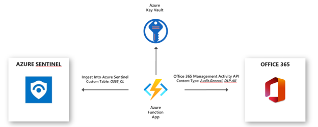
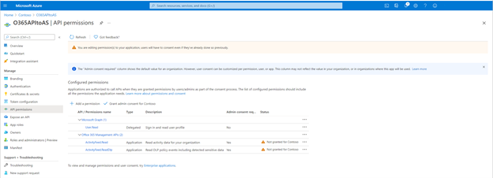
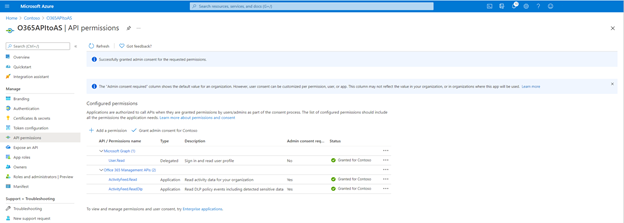
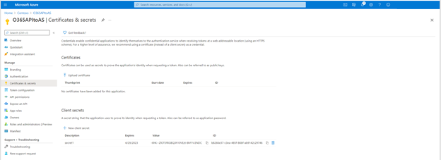
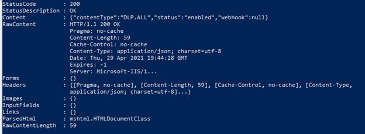
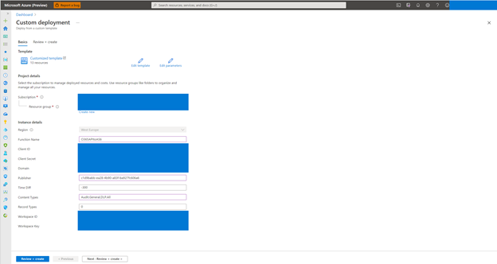
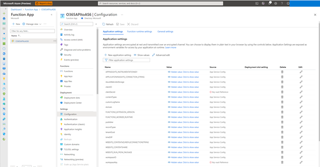
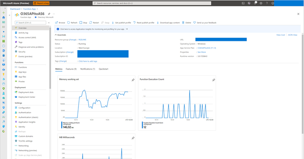
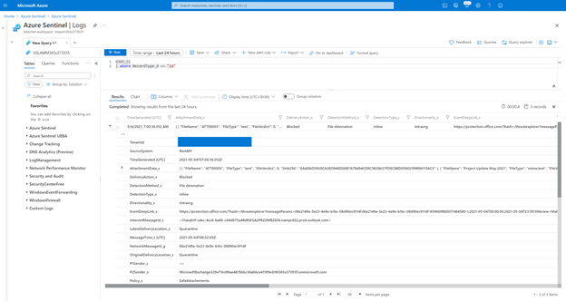

# Deploy Function App for getting Office 365 Management API data into Azure Sentinel
This function app will poll O365 Activity Management API every 5 mins for logs.  It is designed to get Audit.General and DLP.All events.

## How to Ingest Office 365 Audit.General and DLP.All Activity Logs into Azure Sentinel 
The Office 365 data connector in Azure Sentinel supports ongoing user and admin activity logs for Microsoft 365 workloads, Exchange Online, SharePoint Online and Microsoft Teams. The activity logs include details of action such as file downloads, access request send, change to group event, mailbox operations. Once the activity logs are ingested into Azure Sentinel, it can be used for custom analytics rules, hunting, visualization as well as for investigation process. 

 The Azure Sentinel data connector for Office 365 uses the [Office 365 Activity Management API](https://docs.microsoft.com/office/office-365-management-api/office-365-management-activity-api-reference). Below is a summary of which content types are part of the Office 365 Activity Management API and their mapping with Azure Sentinel. 

 

| Content Type | Description | Azure Sentinel Mapping |
| ------------ | ----------- | ---------------------- |
| Audit.AzureActiveDirectory | Azure Active Directory logs that’s relates to Office 365 only | Supported with the default connector for [Office 365](https://docs.microsoft.com/azure/sentinel/connect-office-365) in Azure Sentinel |
| Audit.Exchange | User and Admin Activities in Exchange Online | Supported with the default connector for [Office 365](https://docs.microsoft.com/azure/sentinel/connect-office-365) in Azure Sentinel |
| Audit.SharePoint | User and Admin Activities in SharePoint Online | Supported with the default connector for [Office 365](https://docs.microsoft.com/azure/sentinel/connect-office-365) in Azure Sentinel |
| Audit.General | Includes all other workloads not included in the previous content types | Not supported with the default connector for Office 365 in Azure Sentinel |
| DLP.All | DLP events only for all workloads | Not supported with the default connector for Office 365 in Azure Sentinel |

Specifically, Audit.General activity logs could be of interest in SIEM if there is a need for correlation with alerts from Defender for Office 365 and alerts from Security and Compliance Center. As follow most asked use cases are: 
- Usage of Security and Compliance Center alerts 
- Alerts generated by Defender for Office 365 
  - Safe Links time-of-block and block override 
  - Phishing and malware alerts for files in SharePoint Online, OneDrive for Business, and Microsoft Teams  
  - Usage of Phishing and malware events 

This document covers the required steps to ingest Audit.General and DLP.All activity logs from the Office 365 Management Activity API into Azure Sentinel and how to use the ingested alerts. For the ingestion of activity logs I will use an Azure Function App connector. The Azure Function App is published [here](https://github.com/Azure/Azure-Sentinel/tree/master/DataConnectors/O365%20Data). 


The Azure Function App uses a PowerShell script to collect Office 365 Audit.General and DLP.All Activity logs and ingests into a custom table in Azure Sentinel (custom tables end with _CL when created in Log Analytics). The secrets for the required connections are stored in Azure Key Vault. 

<br>

Let’s get started with the configuration! 

### Preparation 
The following tasks describe the necessary preparation and configurations steps. 
- Onboard Azure Sentinel 
- Register an application in Azure AD 
- Create an Office 365 Management Activity API Subscription 
- Deploy the Azure Function App 
- Post Configuration Steps for the Function App and Key Vault 
- How to Use the Activity Logs in Azure Sentinel 

## Onboarding Azure Sentinel 

Onboarding Azure Sentinel is not part of this document post. However, required guidance can be found [here](https://docs.microsoft.com/azure/sentinel/quickstart-onboard). 

### Register an application in Azure AD 
The Azure AD app is later required to use it as service principle for the [Azure Function App](https://github.com/Azure/Azure-Sentinel/tree/master/DataConnectors/O365%20Data) app. 

1. Go to **Azure Active Directory** / **App Registrations**
2. Create **New Registration**<br>
<br>
3. Call it "O365APItoAzureSentinel".  Click **Register**.
4. Click **API Permissions** Blade.
5. Click **Add a Permission**.  
6. Click **Office 365 Management APIs**.
7. Click **Application Permissions**
8. Check **ActivityFeed.Read** and **ActivityFeed.ReadDlp**.  Click **Add permissions**.<br>
<br>
9. Click **Grant admin consent for ...**.<br>
<br>
10. Click **Certificates and Secrets** blade.
11. Click **New Client Secret**.
12. Enter a description, select **never**.  Click **Add**.<br>
<br>
13. **IMPORTANT**.  Click **copy** next to the new secret and paste it somewhere temporarily.  You can not come back to get the secret once you leave the blade.
14. Copy the **client Id** from the application properties and paste it somewhere.
15. Also copy the **tenant Id** from the AAD directory properties blade.

For the deployment of [Azure Function App](https://github.com/Azure/Azure-Sentinel/tree/master/DataConnectors/O365%20Data), make a note of following settings: 
- The Azure AD Application ID 
- The Azure AD Application Secret 
- The Tenant ID 
- The Tenant Domain 

### Create an Office 365 Management Activity API Subscription 
After successfully creating the service principles, run the following PowerShell script to register the API subscription.
1. Open a PowerShell terminal.
2. Run the following, replacing variables with strings from the previous steps.
```powershell
$ClientID = "<GUID> from AAD App Registration"
$ClientSecret = "<clientSecret> from AAD App Registration"
$loginURL = "https://login.microsoftonline.com/"
$tenantdomain = "<domain>.onmicrosoft.com"
$TenantGUID = "<tenantguid> from AAD"
$resource = "https://manage.office.com"
$body = @{grant_type="client_credentials";resource=$resource;client_id=$ClientID;client_secret=$ClientSecret}
$oauth = Invoke-RestMethod -Method Post -Uri $loginURL/$tenantdomain/oauth2/token?api-version=1.0 -Body $body
$headerParams = @{'Authorization'="$($oauth.token_type) $($oauth.access_token)"} 
$publisher = "<randomGuid>" Get a guid from https://guidgenerator.com/
```
3. Run this command to enable **Audit.General** Subscription. 
```powershell
Invoke-WebRequest -Method Post -Headers $headerParams -Uri "https://manage.office.com/api/v1.0/$tenantGuid/activity/feed/subscriptions/start?contentType=Audit.General&PublisherIdentifier=$Publisher"
```
4. Run this command to enable **DLP.ALL** subscription
```powershell
Invoke-WebRequest -Method Post -Headers $headerParams -Uri "https://manage.office.com/api/v1.0/$tenantGuid/activity/feed/subscriptions/start?contentType=DLP.ALL&PublisherIdentifier=$Publisher"
```
5. A successful output looks like as below. <br>
<br>

### Deploy the Azure Function App 
Thanks to the published ARM template the deployment of the [Azure Function App](https://github.com/Azure/Azure-Sentinel/tree/master/DataConnectors/O365%20Data) is done with just a few clicks. 
1. Click to **Deploy the template / Deploy to Azure** below.

[](https://portal.azure.com/#create/Microsoft.Template/uri/https%3A%2F%2Fraw.githubusercontent.com%2FAzure%2FAzure-Sentinel%2Fmaster%2FDataConnectors%2FO365%20Data%2Fazuredeploy.json)
[](https://portal.azure.us/#create/Microsoft.Template/uri/https%3A%2F%2Fraw.githubusercontent.com%2FAzure%2FAzure-Sentinel%2Fmaster%2FDataConnectors%2FO365%20Data%2Fazuredeploy.json)

2. Now it is time to use the noted details from previous steps.  
- Select the right **Subscription**, **Resource Group** and **Region** where you what to deploy the Azure Function App.  
- Fill the Instance Details **Client ID**, **Client Secret**, **Tenant Domain**, **Publisher Guid**.  
- There is also a need of **Workspace ID** and **Workspace Key** from where Azure Sentinel is deployed. 
- The Content Types you can leave as default with **Audit.General**, or you can also add **DLP.All** as well. Or use only **DLP.All**. 

3. Click to **Review + create**, review the configuration and click **Create**. 
4. Now the deployment of ARM template is completed. 


### Post Configuration Steps for the Azure Function App 
1. For the final configuration of Azure Function App open the Azure Portal and navigate to **Azure Function App** > The name of the Function App > **Configuration**.<br>
<br>
2. In the **Configuration** edit the **clientSecret** and **workspaceKey** settings. Click to Edit and paste the noted Secret Identifiers as value and **Save** the configuration. The Secret Identifiers should have this format: 
- @Microsoft.KeyVault(SecretUri=https:///secrets/O365Tenant1_clientSecret/).  
3. Once the configuration is finished the **clientSecret** and **workspaceKey** settings should have a green checkmark.  

## How to use the Activity Logs in Azure Sentinel 
Once the Azure Function App is functional you can query the General.Audit and DLP.All activity logs. The activity will reside in a Custom Table as configured in the Azure Function App above. The following table includes sample Kusto Language Queries (KQL).  You can see these are using the Custom Logs (Custom log tables always end in “_CL”) and the values we mentioned earlier.<br>
<br>

***Note***: Custom Logs are a billable data source.  The record types that are important have been added below, as simple starting queries. 

| Member Name | Kusto Language Query (KQL) |
| ----------- | -------------------------- |
| ThreatIntelligence | O365_CL \| where RecordType_d == "28" |
| ThreatIntelligenceUrl | O365_CL \| where RecordType_d == "41" | 
| ThreatIntelligenceAtpContent | O365_CL \| where RecordType_d == "47" |
| SecurityComplianceAlerts | O365_CL \| where RecordType_d == "40" |

An example results for the Defender for Office Safe Attachment block detection alert. 
```KQL
O365_CL 
| where RecordType_d == "28" 
```




### Summary 
In this document I have shown how you can onboard Office 365 Management Activity API General.Audit and DLP.All activity logs, and some basics queries for you to start to build out your use cases with Defender for Office and Security and Compliance Center alerts. This solution helps you extend, correlate and enrich the data you have with the existing O365 connector, giving you more insights. 
  
