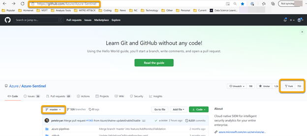
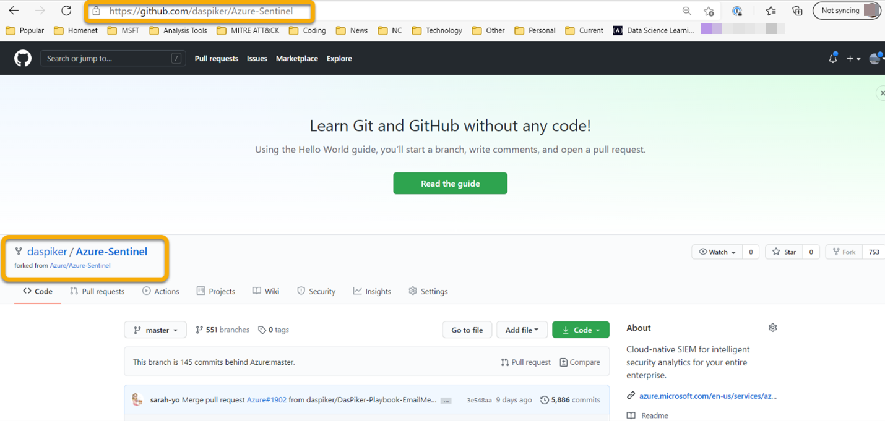
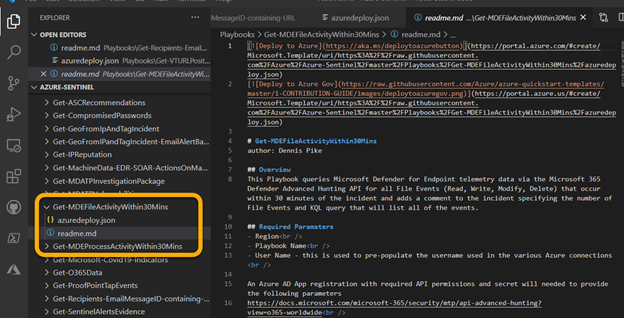
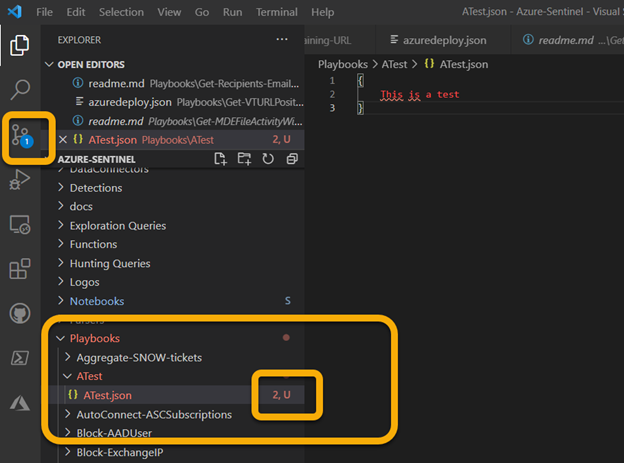
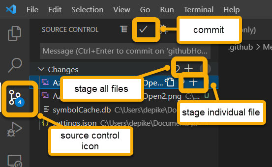
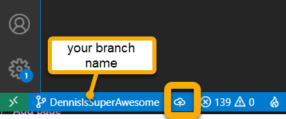
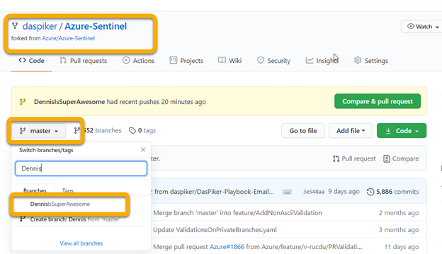
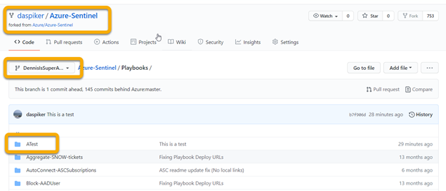
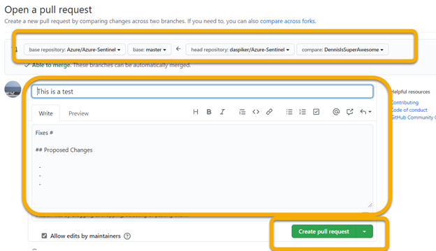
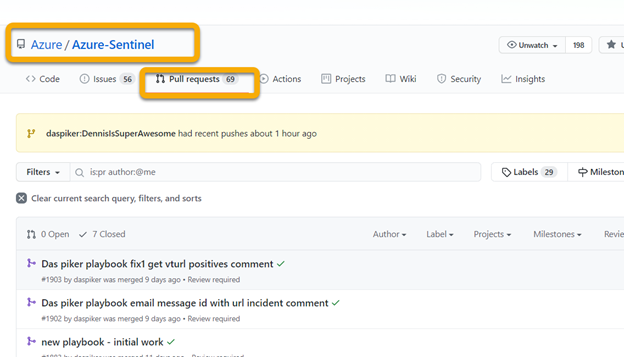

# Azure Sentinel Community

**How to get started contributing**

author: Dennis Pike

Disclaimer: There are lots of ways to do this.  This document describes how to use Visual Studio Code (VS Code) blended with some command line Git. You can do everything just within VS Code using built in GitHub extensions.  Many people code in whatever platform and use GitHub Desktop to handle all the Git parts of the process. 

**GitHub account**: 

Get a GitHub account – ([www.github.com](http://www.github.com) ) - Free account works fine.

Login

**Fork the Repository**:

Go to the community page: https://github.com/Azure/Azure-Sentinel

Make sure you are on the master branch

Click "Fork"

This will create a copy of the Azure-Sentinel repository in your own GitHub account:

**Clone the fork to your local machine**:

Create a directory on your local machine where you will pull down the repository to and where you will be working from. In my case it is C:\Users\\(username)\Documents\GitForks

Cd into that directory

Run : `Git init`

Run : `Git clone <url of your fork>` *example*: `Git clone “https://github.com/(username)/Azure-Sentinel”`

Cd into the new directory that is created ie cd Azure-Sentinel

You now need to set the upstream which is the original repo that you forked from ie the Sentinel community repo

Run : `Git remote add upstream https://github.com/Azure/Azure-Sentinel`

Run : `Git remote -v`

And you should see something like this:

PS C:\Users\\(username)\Documents\GitForks\Azure-Sentinel> git remote -v

origin https://github.com/(username)/Azure-Sentinel.git (fetch)

origin https://github.com/(username)/Azure-Sentinel.git (push)

upstream    https://github.com/Azure/Azure-Sentinel.git (fetch)

upstream    https://github.com/Azure/Azure-Sentinel.git (push)

**Create a branch:**

You can work with the local master but it is recommended to work with a branch so if you have separate projects you are working on you can keep them isolated.

First you want to sync your local repository to the upstream master (the Azure community itself – not your fork)

Run : `git pull upstream master`

You should see a list of updates that are processed or a message saying you are up to date

Now that you are in sync create your new branch

Run : `Git checkout -b <branch name>` *example* `Git checkout -b MyNewContribution`

**Install VS Code:**

[[Download Visual Studio Code - Mac, Linux, Windows](https://code.visualstudio.com/Download)]

**Open Branch in VS Code:**

Run VS Code and then File > Open Folder the local repository directory (for me it is C:\Users\\(username)\Documents\GitForks\Azure-Sentinel)

You should see all the directories and files in the repository and at the bottom you can see which branch you are working on.

This should show as the branch you created. If not, you want to switch to that branch by click on current branch (“master” in my case) in the bottom left and then select the branch you created up top:

And it should now show the correct branch in the bottom left.

**Stage, Commit and Publish your changes**

When you have created the content that you want in VS Code you will need to stage and commit your changes. This will commit them to the branch you have created locally on you machine. For example, I created a Playbook called “Get-MDEFileActivityWithin30Mins” so I created a new folder under the Playbooks directory and create two files (readme.md, azuredeploy.json) with the content needed to document and deploy this Playbook.

For demonstration purposes, I have right clicked on Playbooks > New Folder and added “ATest” and I right clicked on the Folder > New File and created ATest.json with some test data. You will see the Source Control on left get a numbered bubble showing you that there are changes that need to be committed and in the file tree you will see a U for Uncommitted.

When you are ready to commit your changes click on the Source Control icon on the left, enter a Message summarizing your changes and hit “+”. This stages the changes. Next click the checkmark to commit your changes. These are still local to your machine. 

You then publish this work off to your personal GitHub by clicking the icon next to the branch name (if it throws up a list up top of repositories pick yours <youraccount>/Azure-Sentinel *NOT* Azure/Azure-Sentinel).

You will then see your new branch in your GitHub:

And you should see the changes:

If you are done with all your work and ready to submit to the main repository, then you need to do a Pull Request. This request will kick off a set of automated checks and if those pass then it goes to a board of reviewers – one of whom has to check your work and accept the request and merge it to the master branch. 

You do this by going to your forked repository (ie <your account>/Azure-Sentinel) > making sure the branch you are working on is selected and then clicking Pull request (or compare & pull request) if that is showing:

The top portion of the "Open a pull request" page is critical. This shows from which repository and branch are you pulling from and to which repository are you pulling to. So on the left you want to see the Azure/Azure-Sentinel repository and the master branch. On the right you want to see your repository (<your account>/Azure-Sentinel) and your branch (not master unless that is what you are working off of). 

You do want to fill in the comments section with a meaningful name and a list of what you have done since the reviewer will be reading this. 

Then click “Create pull request”

You can then check the status of your Pull Request in Azure/Azure-Sentinel by clicking on Pull Request:

**Clean-up**

After your Pull Request has been merged, you will want to check to make sure it got into the main repository. I recommend checking both in the GitHub website as well as by doing a sync to my local repo and verifying it there.  You want to be certain that everything looks right before you delete anything. 

In the website you just go to the Azure/Azure-Sentinel repository under the master branch and make sure you see your new code there.

In your local repository, make sure you `cd` to your repository directory (for me it is `cd C:\Users\(username)\Documents\GitForks\Azure-Sentinel`) and then sync to the upstream master:

Run : `git pull upstream master`

You should see your content in an update and then in VS Code change to the *master* branch and you should see the updates there.  Again, you need to see your new content in the master branch, not the seperate branch you have been working on.

If you see those update (don’t delete the branch if you don’t!!!), then you can delete the branch you were working on.

Run : `git branch` to see all your branches

Run : `Git checkout master` to switch to your master branch

Run : `Git branch -d <name of branch>` to delete the branch you no longer need

**Good Luck and get contributing to the Community!!!**