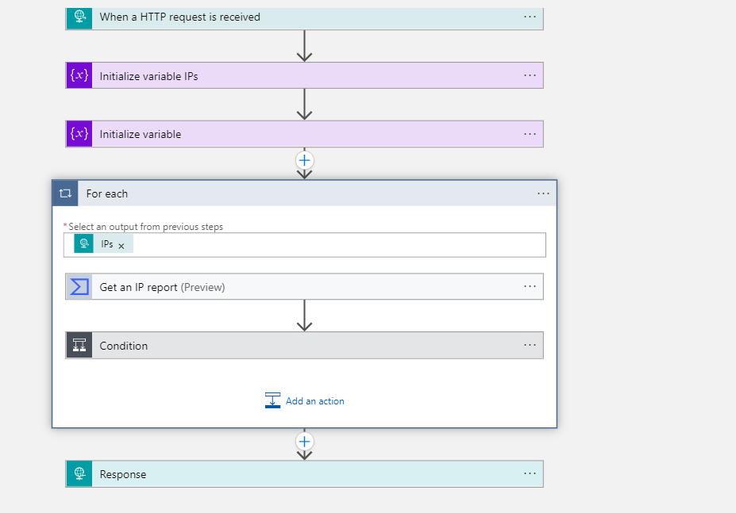

# Get-VirusTotalIPReport

# author: Nicholas DiCola

This playbook will take each IP entity and query VirusTotal for IP Address Report (https://developers.virustotal.com/v3.0/reference#ip-info). It will write the results to Log Analytics and add a comment to the incident.

## Quick Deployment
**Deploy with HTTP trigger** 

[Learn more about automation rules](https://docs.microsoft.com/azure/sentinel/automate-incident-handling-with-automation-rules#creating-and-managing-automation-rules)

## Prerequisites

- You will need to register to Virus Total community for an API key

## Screenshots
**HTTP Trigger** 
 
