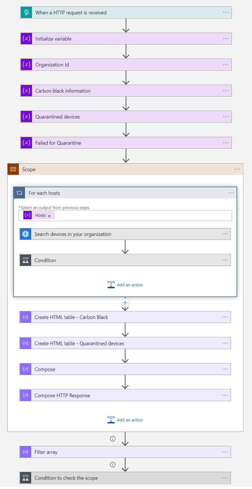
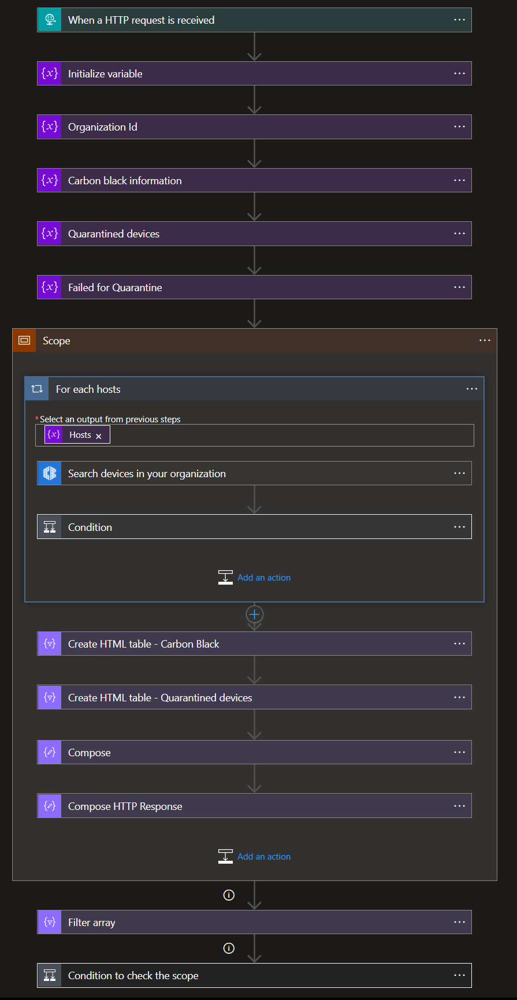

# CarbonBlack Quarantine Host Nested Remediation Playbook
 ## Summary
 When this playbook gets triggered and it performs below actions
 1. Gets the list malicious Host information.
 2. Quarantines the malicious Host.
 2. Enriches the incident with device information by fetching from CarbonBlack
 2. Incident information is sent as response to master playbook.

 
 

### Prerequisites 
1. CarbonBlack Custom Connector needs to be deployed prior to the deployment of this playbook under the same subscription and same resource group. Capture the name of connector during deployment.
2. Generate an API key ([learn how](https://developer.carbonblack.com/reference/carbon-black-cloud/authentication/#creating-an-api-key)), and grant it to the following access levels:

| **Product** | **API** | **Service Category** | **API Key Access Level(s) Permitted** |
| --------- | -------------- | ----------------- | ------------------------------------ |
| **Carbon Black Cloud Platform (PSC)** | Alerts API, Devices API | /appservices/ | Custom (must add an access level with appropriate permissions) |
| **Carbon Black Cloud Platform (PSC)** | Platform Search API for Processes | /investigate/ | Custom (must add an access level with appropriate permissions) |

3. Find Organziation key by refering this link [ Find Organization key by refering this link ](https://defense.conferdeploy.net/settings/connectors)

### Deploy Custom Connector

To deploy CarbonBlack Custom connector click on the below button.

 

### Deployment instructions 
1. Deploy the playbook by clicking on "Deploy to Azure" button. This will take you to deplyoing an ARM Template wizard.

2. Fill in the required paramteres:

|Parameter|Description|
|--------------|--------------|
|**Playbook Name**| Enter the playbook name here (Eg: CarbonBlack-QuarantineDevice-Nested-Remediation)|
|**Connector Name**|Enter the name of Carbon Black Connector.|
|**Organization Key**| Enter the Organization key|
    
### Post-Deployment instructions 
#### a. Authorize connections
Once deployment is complete, you will need to authorize CarbonBlack connection.
1.	Click the CarbonBlack connection
2.  Click **Edit API connection**
3.  Enter API Key
4.  Click Save

#### b. Configurations in Sentinel
1. In Azure sentinel analytical rules should be configured to trigger an incident with risky device.
2. Configure the automation rules to trigger this playbook

## Playbook steps explained

### When Azure Sentinel incident creation rule is triggered
Azure Sentinel incident is created. The playbook receives the incident as the input.

### Entities - Get Hosts
Get the list of risky devices as entities from the Incident

### Initialize variable to assign the Organization Id
Initialize an string variable to assign the Organization Id provided by Client while deploying the playbook and used as parameter while calling the search devices with organization API action.

### Initialize variable to assign the CarbonBlack devices information
Initialize an array variable to assign the CarbonBlack devices used as source to format the HTML with the devices information

### Initialize variable to assign the quarantined devices information
Initialize an array variable to assign the quarantined devices information used as source to format the HTML with the action taken on devices

### For each-Hosts
This action will perform the below actions
 a. Make a call to CarbonBlack API with the parameters such as Organization Key and Quary [ Contains device name ]
 b. Verify the CarbonBlack returned the results and Check the device is quarantined
 c. If the device is not quarantined then isolate it.

### Construct HTML table - CarbonBlack devices information
This action will construct the HTML table with devices information

### Construct HTML table - Quarantined devices through playbook
This action will construct the HTML table with Quarantined devices through playbook

### Send Response with device information
This action will send response to master playbook with devices information

