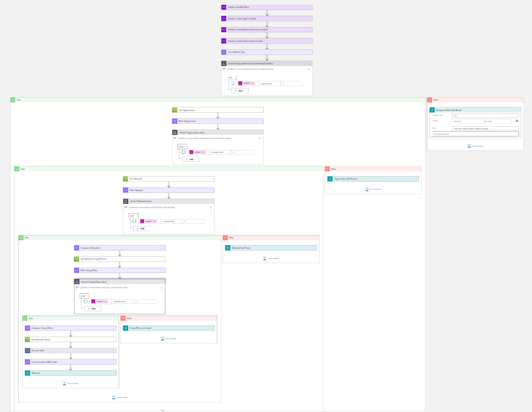
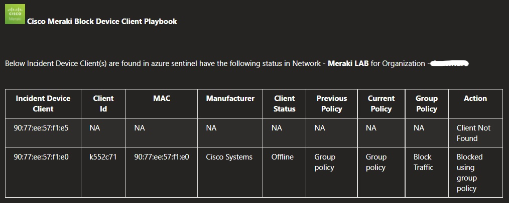

# Cisco Meraki Block Device Client Playbook

## Summary
 When this playbook gets triggered and performs the below actions:
 1. Fetches a list of device clients with suspicious activity.
 2. For each client in the list, checks if the client is blocked by any network of the organization.
  - If client does not exist in network, then  comment is created saying client not found.
  - If client exists in network, check policy rule associated with client.
     * If client policy does not exist in the network, then comment is created saying client policy not found.
     *  If client policy exists in the network as Blocked, then comment is created saying client blocked using client policy.
     *  If client policy exists in the network as Whitelisted, then comment is created saying client allowed using client policy.
     *  If client policy exists in the network as group policy, then check the group policy details and comment is created saying client blocked using client policy.
     *  If client policy exists in the network as Normal, then client is blocked by playbook.Comment is created saying Client blocked by playbook.
  - Add incident Comment from all the cases.
3. Responses with status 'Closed' and reason as
  - For allowed Client - 'BenignPositive - SuspiciousButExpected'
  - For blocked Client - 'TruePositive - SuspiciousActivity' 

 ## Pre-requisites for deployment
1. Deploy the Cisco Meraki Custom Connector before the deployment of this playbook under the same subscription and same resource group. Capture the name of the connector during deployment.
2. Cisco Meraki API Key should be known to establish a connection with Cisco Meraki Custom Connector. [Refer here](https://developer.cisco.com/meraki/api-v1/#!getting-started/authorization)
3. Organization name should be known. [Refer here](https://developer.cisco.com/meraki/api-v1/#!getting-started/find-your-organization-id) 
4. Network name should be known.[Refer here](https://developer.cisco.com/meraki/api-v1/#!getting-started/find-your-network-id)
5. Network Group Policy name should be known. [Refer here](./Images/Scheduling-FromOneDay.png)

 ## Deployment Instructions
 1. Deploy the playbook by clicking on the "Deploy to Azure" button. This will take you to deploy an ARM Template wizard.

 2. Fill in the required parameters for deploying the playbook.

 | Parameter  | Description |
| ------------- | ------------- |
| **Playbook Name** | Enter the playbook name without spaces |
| **Cisco Meraki Connector Name**|Enter the name of Cisco Meraki custom connector without spaces | 
| **Organization Name** | Enter organization name |
| **Network Name**| Enter network name | 
| **Group Policy**|Enter group policy name |

# Post-Deployment Instructions 
## a. Authorize API connection
* Once deployment is complete, go under deployment details and authorize Cisco Meraki connection. 
1.  Click the Cisco Meraki connection
2.  Click **Edit API connection**
3.  Enter API Key
4.  Click Save

## b. Configurations in Sentinel
- Device Client MAC needs to be mapped with hostname in Host entity.

# Playbook steps explained
## When Azure Sentinel incident creation rule is triggered
  Captures potentially malicious client incident information.

## Check if Organization exists
 *  If organization name exists in list of organizations associated with the account, then return organization. 
 *  If organization name does not exist, then terminate with the error that organization not found.

 ## Check if network exists
  *  If network name exists in list of networks associated with the organization, then return network associated with the organization. 
  *  If network name does not exist, then terminate with the error that network not found.

  ## Check if group policy exists
  *  If group policy name exists in list of group policies associated with the network, then return group policy associated with the network. 
  *  If group policy name does not exist, then terminate with the error that group policy not found.

## For each malicious device client received from the incident
- Checks if the client exists in network.
  - If client does not exist in network, then incident comment is created saying client not found.
  - If client exists in network, check policy rule associated with client.
     * If client policy does not exist in the network, then incident comment is created saying client policy not found.
     *  If client policy exists in the network as Blocked, then incident comment is created saying client blocked using client policy.
     *  If client policy exists in the network as Whitelisted, then incident comment is created saying client allowed using client policy.
     *  If client policy exists in the network as group polciy, then check the group policy details and  incident comment is created saying client blocked using client policy.
     *  If client policy exists in the network as Normal, then client is blocked by playbook. Incident Comment is created saying Client blocked by playbook.
  - Add incident Comment from all the cases.
  - Update the incident with status 'Closed' and reason as
    - For allowed Client - 'BenignPositive - SuspiciousButExpected'
    - For blocked Client - 'TruePositive - SuspiciousActivity'

## Incident comment 

