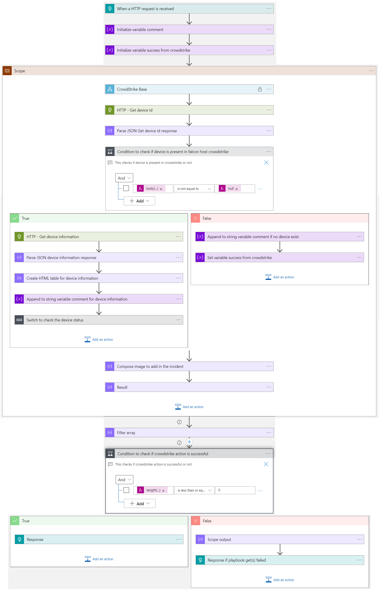
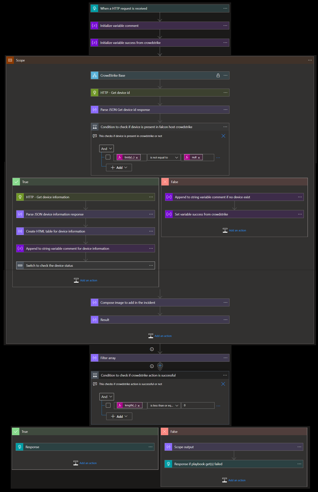

# Crowdstrike Block Host Nested
 ## Summary
 When this playbook gets triggered and it performs below actions:
 1. Gets the list malicious Host information.
 2. Contain host if it is not already contained.
 3. Enrich the incident with device information from Crowdstrike
 4. Incident information is sent as response to master playbook.

  
 

### Prerequisites 
1. Azure Key vault is required for storing the Crowdstrike ClientID and Secrets, create key vault if not exists. [learn how](https://portal.azure.com/#create/Microsoft.Template/uri/https%3A%2F%2Fraw.githubusercontent.com%2FAzure%2Fazure-quickstart-templates%2Fmaster%2F201-key-vault-secret-create%2Fazuredeploy.json)
2. Add Crowdstrike Client ID and Client Secret in Key vault secrets and capture the keys which are required during the template deployment.
3. CrowdStrike Base playbook needs to be deployed prior to the deployment of this playbook under the same subscription and under the same resource group. Capture the name of playbook during deployment.
4. CrowdStrike Base playbook needs to be added in the access policy of the Key Vault [learn how](https://docs.microsoft.com/azure/key-vault/general/assign-access-policy-portal)

### Deploy Base Playbook

To deploy Crowdstrike base playbook click on the below button.

  

### Deployment instructions 
1. Deploy the playbook by clicking on "Deploy to Azure" button. This will take you to deploying an ARM Template wizard.

 

2. Fill in the required parameters:

|Parameter|Description|
|--------------|---------------|
|**Playbook Name**| Enter the playbook name here (Eg:Crowdstrike_ContainHost)|
|**CrowdStrike Base Playbook Name**| Enter the base playbook name here (Eg:CrowdStrike_Base)|
    
### Post-Deployment instructions 
#### Configurations in Sentinel
1. In Azure sentinel analytical rules should be configured to trigger an incident with risky device 
2. Configure the automation rules to trigger this playbook

## Playbook steps explained

###When Azure Sentinel incident creation rule is triggered
Azure Sentinel incident is created. The playbook receives the incident as the input.

###Entities - Get Hosts
Get the list of risky devices as entities from the Incident

###Initialize variable comment
Initialize a string variable to hold comments to update in the incident

###Initialize variable success from crowdstrike
Initialize a string variable to hold the success or failure information from crowdstrike api actions

###CrowdStrike Base
Call the base logic App to get access token and Falcon Host URL

###HTTP - Get device id
This gets the device id from crowdstrike filtered by hostname

###Parse JSON Get device id response
This prepares Json message for the device id response

 ###Condition to check if device is present in crowdstrike
1. If device is present, get the device information from crowdstrike API and prepares HTML table with required information
2. Checks the device status, if not contained/normal the playbook will contain the device

 ###Compose image to add in the incident
This action will compose the Crowdstrike image to add to the incident comments

###Send Response with device information
This action will send response to master playbook with devices information

