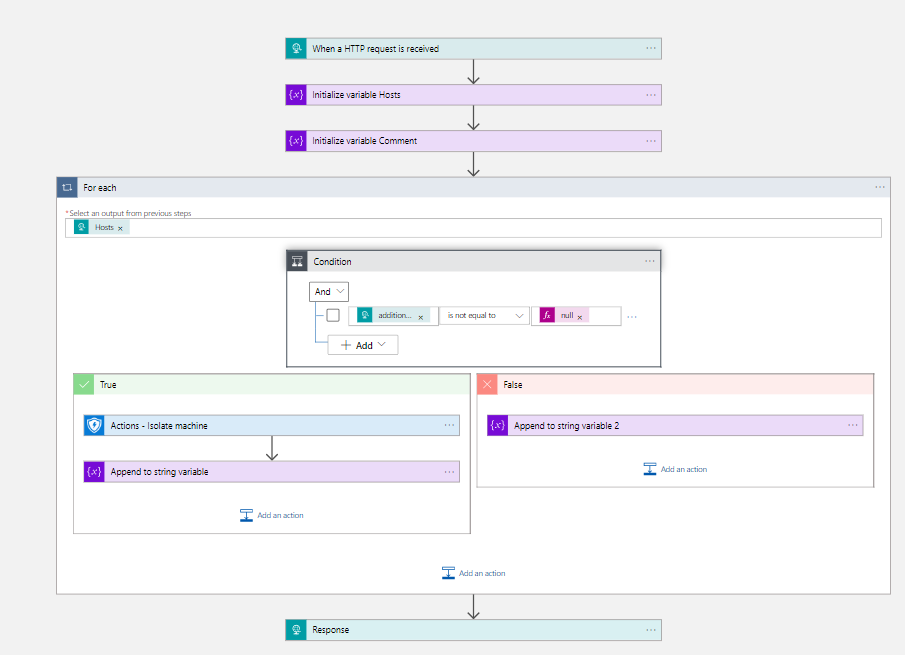

# MDE-IsolateMachine
author: Nicholas DiCola

This playbook will isolate (full) the machine in Microsoft Defender for Endpoint.

## Quick Deployment


[Learn more about automation rules](https://docs.microsoft.com/azure/sentinel/automate-incident-handling-with-automation-rules#creating-and-managing-automation-rules)

[](https://portal.azure.com/#create/Microsoft.Template/uri/https%3A%2F%2Fraw.githubusercontent.com%2FAzure%2FAzure-Sentinel%2Ftree%2Fmaster%2FMasterPlaybooks%2FRemediation-Host%2FMDEIsolate-Remediation-Host%2Fazurdeploy.json)
[](https://portal.azure.us/#create/Microsoft.Template/uri/https%3A%2F%2Fraw.githubusercontent.com%2FAzure%2FAzure-Sentinel%2Ftree%2Fmaster%2FMasterPlaybooks%2FRemediation-Host%2FMDEIsolate-Remediation-Host%2Fazurdeploy.json)

## Prerequisites

- You will need to grant Machine.Isolate permissions to the managed identity.  Run the following code replacing the managed identity object id.  You find the managed identity object id on the Identity blade under Settings for the Logic App.
```powershell
$MIGuid = "<Enter your managed identity guid here>"
$MI = Get-AzureADServicePrincipal -ObjectId $MIGuid

$MDEAppId = "fc780465-2017-40d4-a0c5-307022471b92"
$PermissionName = "Machine.Isolate" 

$MDEServicePrincipal = Get-AzureADServicePrincipal -Filter "appId eq '$MDEAppId'"
$AppRole = $MDEServicePrincipal.AppRoles | Where-Object {$_.Value -eq $PermissionName -and $_.AllowedMemberTypes -contains "Application"}
New-AzureAdServiceAppRoleAssignment -ObjectId $MI.ObjectId -PrincipalId $MI.ObjectId `
-ResourceId $MDEServicePrincipal.ObjectId -Id $AppRole.Id
```

## Screenshots
<br>
