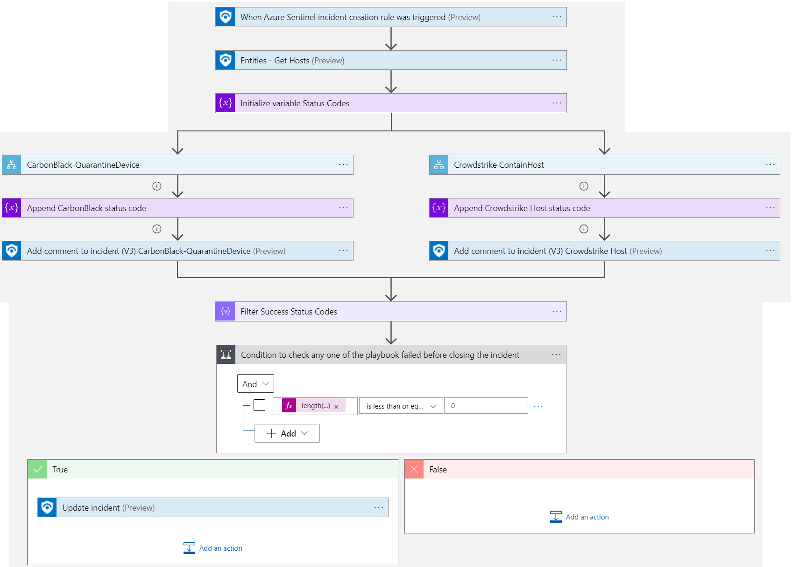
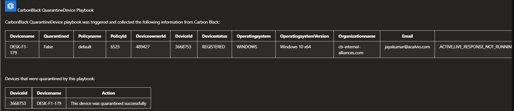
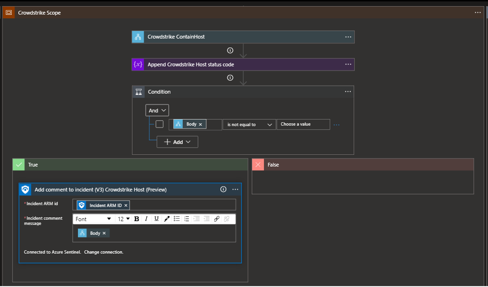
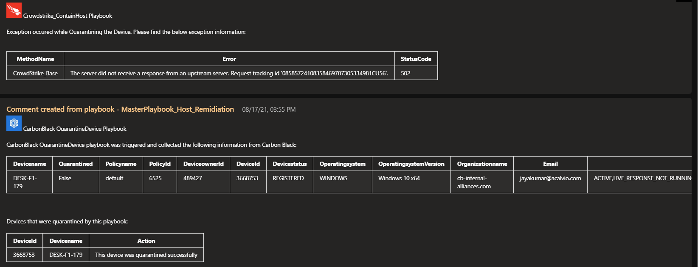
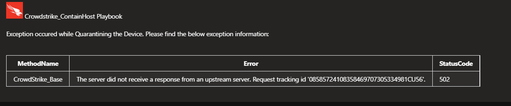

# Master Playbook Host Remediation 

Master playbook is integrated with multiple firewall Endpoint protection products.  
 - CarbonBlack 
 - Crowdstrike
 - CiscoMeraki
 - MDE

Endpoint protection products are deployed as child/nested playbooks.

If a malicious host is detected from the Azure sentinel, master playbook calls all the child/nested playbooks and each firewall product will take remidiation steps needed on that host and comments will be passed to the master playbook from the child/nested playbooks involving multiple products. 

## Summary
 When a new Azure Sentinel incident is created, this playbook gets triggered and performs the below actions:
 1. Fetches a list of potentially malicious hosts.
 2. Each nested playbook receives the list of host and performs respective defined automated actions on it.
 3. Response from individual playbooks are returned to master playbook for incident comment. 

 ## Pre-requisites for deployment
At least one of the below-mentioned nested playbooks must be deployed prior to deployment of this playbook under same subscription and same resource group and the same location/region. Capture the name of all the deployed playbooks during deployment.

- [CarbonBlack-Remediation-Host](/MasterPlaybook-Host-Remediation/CarbonBlack-Remediation-Host/azuredeploy.json) is a nested playbook that handles remidiation for CarbonBlack.  
- [Crowdstrike-Remediation-Host](/MasterPlaybook-Host-Remediation/Crowdstrike-Remediation-Host/azuredeploy.json) is a nested playbook that handles remidiation for Crowdstrike.
- [CiscoMeraki-Remediation-Host](/MasterPlaybook-Host-Remediation/CiscoMeraki-Remediation-Host/azuredeploy.json) is a nested playbook that handles remidiation for CiscoMeraki.
- [MDEIsolate-Remediation-Host](/MasterPlaybook-Host-Remediation/MDEIsolate-Remediation-Host/azuredeploy.json) is a nested playbook that handles remidiation for MDE.
If any one of the above-mentioned playbooks are not deployed then default playbook will deploy in its place.

## Nested Playbook Structure

### Input Schema

Each of the nested playbooks of Host Remediation accepts following inputs:
- Hosts: List of Hosts as entities from azure sentinel incident.
- Workflow: Worklfow is identifier for the nested playbook which points to which subscription and which resource group the nested playbook belongs to.
- Trigger: Tells how the playbook is invoked/triggered.

The image below shows example of input schema for Crowdstrike nested playbook.

### Output Schema

Each of the nested playbooks of Host Remediation gives following outputs:

- Status code: Status code tells the success or failure status of nested playbook run results. The status code value is displayed in incident comment.
- Body: Body provides with all the output values that nested playbook returns. It varies according to the nested playbook. Based on the length of body Incident Comment is created.
- Incident Comment: It contains output body from nested playbook in tabular format. 

For example, taking reference of CarbonBlack incident comment image below, CarbonBlack logo is composed for incident comment.
Also, table is populated with values such as Device name, Quarantined status, Policy name, Policy id, Device owner id, Device id, Device status, Operating system, Operating system version, Organization name and Email address.

Another table in image gives brief information of device quarantined.

## Add new playbook to master playbook

To add new nested playbook to master playbook:
- Hover below action "Initialize variable Status Codes".
- Click on symbol '+' for insert a new step and choose add a parallel branch.
- First action is to add scope. Within scope add new action and choose the nested playbook to add.
- Append the status code from nested playbook to Status Codes variable.
- Add condition to verify the body of nested playbook.
- Compose Incident Comment.

 ## Deployment Instructions
 1. Deploy the playbook by clicking on the "Deploy to Azure" button. This will take you to deploy an ARM Template wizard.

 

 2. Fill in the required parameters for deploying the playbook.

 | Parameter                     | Description                                                   |
|-------------------------------|---------------------------------------------------------------|
| **Playbook Name**             | Enter the master playbook name here without spaces.           |
| **CarbonBlack Playbook Name** | Enter the name of CarbonBlack Nested playbook without spaces. |
| **Crowdstrike Playbook Name** | Enter the name of Crowdstrike Nested playbook without spaces. |
| **CiscoMeraki Playbook Name** | Enter the name of CiscoMeraki Nested playbook without spaces. |
| **MDEIsolate Playbook Name**  | Enter the name of MDEIsolate Nested playbook without spaces.  |

# Post-Deployment Instructions

### Configurations in Sentinel
- In Azure sentinel analytical rules should be configured to trigger an incident with host. 
- Configure the automation rules to trigger the playbook which calls multiple nested playbooks.

# Playbook steps explained
## When Azure Sentinel incident creation rule is triggered
Captures potentially malicious host incident information.

##Entities - Get Hosts
Get the list of Hosts as entities from the Incident.

## For malicious host received from the incident
 1. The list of hosts is passed as Entity to each of the nested playbook.
 2. Each nested playbook accepts Host list as entity from master playbook and respectively performs defined automated actions(Contain/Quarantine Host) for each host.
 3. The response from each of the nested playbook is returned to master playbook.
 4. Response from each nested playbook is attached to incident comment and consolidated incident comment is created.
 5. If all the nested playbooks returns success response , the incident will be closed.

**Incident Comment**

 
  

**Incident Comment: Exception occurred**

### If any of the nested playbook throws exception then Incident Comment looks like below: (e.g. Crowdstrike)

 

**Incident Comment: Ran Successfully**

### If the nested playbook ran Successfully then Incident Comment looks like below: (e.g. CarbonBlack)

