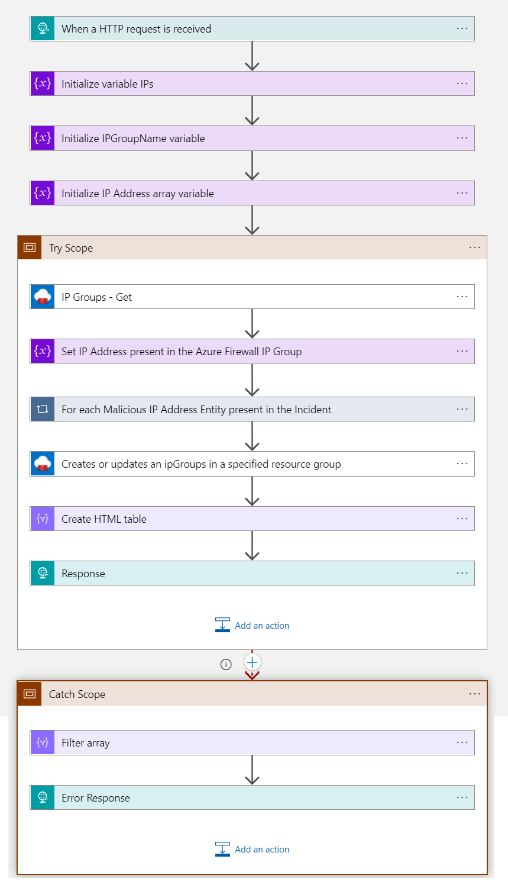
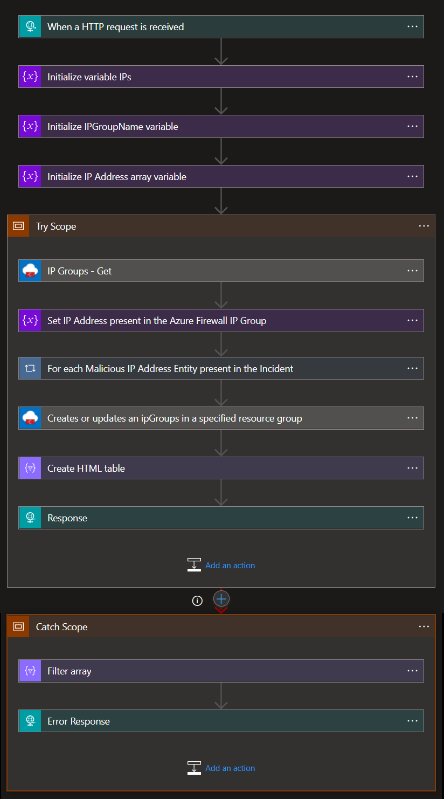

# AzureFirewall Block IP Nested Remediation Playbook

 ## Summary

This playbook allows blocking/allowing IPs in Azure Firewall, using **IP Groups**. This allows to make changes on IP groups, which are attached to rules, instead of making direct changes on Azure Firewall. It also allows using the same IP group for multiple firewalls.

When this playbook gets triggered and it performs below actions:

1. Gets a list of malicious IP address.
2. Fetches list of IP addresses present in IP Group.
3. Appends the malicious IP address list to list of IP addresses received from IP Group.
4. Updates IP Group with the new list of IP addresses.

 
 

### Prerequisites 
1. Azure Firewall connector needs to be deployed prior to the deployment of this playbook under the same subscription. 
1. Azure Firewall connector need to be authenticated with a Service Principal that has permissions over Azure Firewall. 
1. IP Group must be created in portal. [Refer here](https://docs.microsoft.com/azure/firewall/ip-groups) on how to create IP Group. User must have access tp IP Group.
1. Client ID, Tenant ID and Client Secret for your application registered in your AAD. 

### Deploy Custom Connector

To deploy AzureFirewall Custom connector click on the below button.

### Deployment instructions 
1. Deploy the playbook by clicking on "Deploy to Azure" button. This will take you to deploying an ARM Template wizard.

2. Fill in the required parameters:

|Parameter|Description|
|----------------|---------------|
|**Playbook Name** | Enter the playbook name here (e.g. AzureFirewall-BlockIP-Remediation)|
|**Connector name**| Enter name for Azure Firewall Connector.|
|**IP Group name** | Enter the IP Group name here.|
|**Client ID**| Enter your client ID here.|
|**Client Secret** | Enter your client secret here.|
    

### Post-Deployment instructions 
#### Authorize connections
Authorize the Azure Firewall custom connector by following the below mentioned steps.

1. Navigate to playbook 
2. Click Edit 
3. Find the action with the name "IP Groups - Get" and "Creates or updates an ipGroups in a specified resource group" in the workflow.         
4. Click Change connection [ Enter Connection name, ClientId, SecretKey and TenantId captured from AAD. ]

## Playbook steps explained

### When the playbook is triggered

The playbook receives list of malicious IP addresses as the input.

### Initialize variables 

   a. IPs - To store IP addresses from IP Group Name.
   
   b. IP Group Name - To store IP Group Name received as input.

### Gets all IP address list present in IP Group 
Fetches all IP addresses present in IP Group.

### Stores IP Address present in Azure Firewall IP Group
Stores the IP address list fetched from IP Group in the IP list.

### For each-malicious IP
Appends each malicious IP Address to the IP address list fetched from IP Group

#### Create or update IP Group in specified resource group
Creates or updates the IP address list in IP Group with all the appended values.

###Response from playbook is sent to master playbook to generate incident comments.

 
