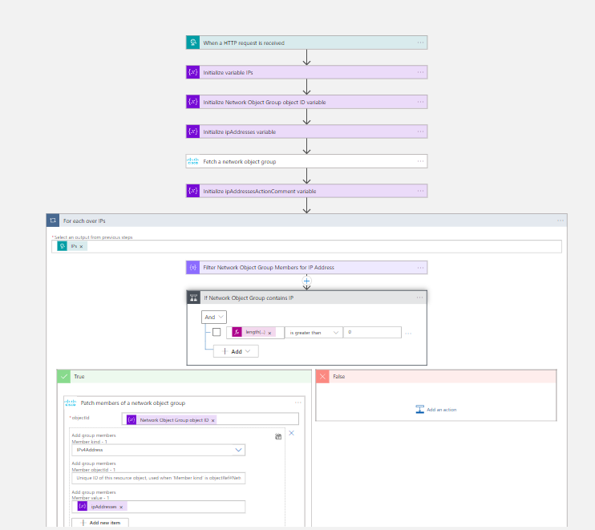
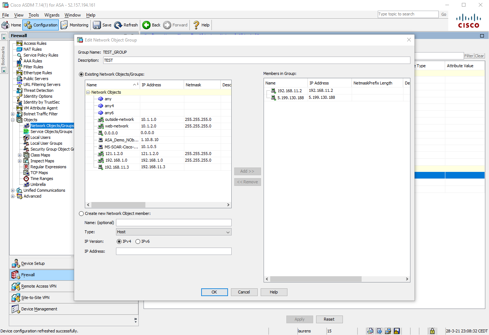

# Cisco ASA - Add or remove IP Addresses from a Network Object Group

## Summary

This playbook allows blocking/allowing of IPs in Cisco ASA, using a **Network Object Group**. This allows making changes to a Network Object Group members, instead of making Access Control Entries. The Network Object Group itself should be part of an Access Control Entry.

When this playbook gets triggered performs below actions.
1. For the IPs we check if they are already a member of the Network Object Group
2. Patch members of a network object group.
3. Creates a comment for response.

 **Playbook overview:**

**IP is added to Cisco ASA object group:**

### Prerequisites
1. **This playbook template is based on Azure Sentinel HTTP trigger**
2. Cisco ASA custom connector needs to be deployed prior to the deployment of this playbook, in the same resource group and region. Relevant instructions can be found in the connector [doc page](https://github.com/Azure/Azure-Sentinel/tree/master/Solutions/CiscoASA/Playbooks/CustomConnector).
3. In Cisco ASA there needs to be a Network Object Group. You can create a Network Object Group using Cisco ASDM, [Configure a Network Object Group](https://www.cisco.com/c/en/us/td/docs/security/asa/asa96/asdm76/firewall/asdm-76-firewall-config/access-objects.html#ariaid-title6), or using the CLI, [Configuring a Network Object Group](https://www.cisco.com/c/en/us/td/docs/security/asa/asa90/configuration/guide/asa_90_cli_config/acl_objects.html#86292). The Network Object Group can be blocked using an access rule, [Configure Access Rules](https://www.cisco.com/c/en/us/td/docs/security/asa/asa96/asdm76/firewall/asdm-76-firewall-config/access-rules.html#ID-2124-00000152)

### Deployment instructions 
1. Deploy the playbook by clicking on "Depoly to Azure" button. This will take you to deplyoing an ARM Template wizard.

2. Fill in the required paramteres:
    * Playbook Name: Enter the playbook name here (ex:CiscoASA-AddIPtoNetworkObjectGroup)
    * Cisco ASA Connector name : Enter the name of the Cisco ASA custom connector (default value:CiscoASAConnector)
    * Network Object Group object ID : The object ID of the Network Object Group. It is the sames as the name of the created Network Object Group.

### Post-Deployment instructions 
#### a. Authorize connections
Once deployment is complete, you will need to authorize each connection.
1.	Click the Azure Sentinel connection resource
2.	Click edit API connection
3.	Click Authorize
4.	Sign in
5.	Click Save
6.	Repeat steps for other connections such as  Cisco ASA (For authorizing the Cisco ASA API connection, the username and password needs to be provided)

