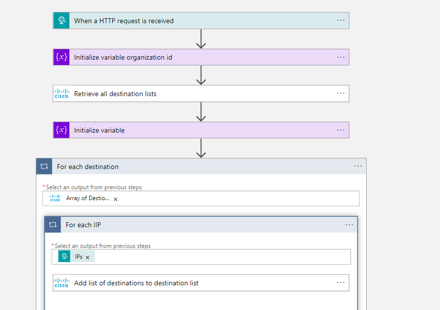

# CiscoUmbrella-AddIpToDestinationList

## Summary

When  this playbook gets triggered and performs the following actions:

1. Retrieves all destinations lists from Cisco Umbrella.
2. Adds all IP to all destination list received in previous step.
3. Creates comment about action taken.

 

### Prerequisites

1. Prior to the deployment of this playbook, Cisco Umbrella Management API Connector needs to be deployed under the same subscription.
2. Obtain Cisco Umbrella Management API credentials. Refer to Cisco Umbrella Management API Custom Connector documentation.
3. Obtain Cisco Umbrella Organiztion Id.

### Deployment instructions

1. To deploy the Playbook, click the Deploy to Azure button. This will launch the ARM Template deployment wizard.
2. Fill in the required paramteres:
    * Playbook Name: Enter the playbook name here
    * Cisco Umbrella Organization Id: Organization id in Cisco Umbrella

### Post-Deployment instructions

#### a. Authorize connections

Once deployment is complete, authorize each connection.

1. Click the Azure Sentinel connection resource
2. Click edit API connection
3. Click Authorize
4. Sign in
5. Click Save
6. Repeat steps for other connections
