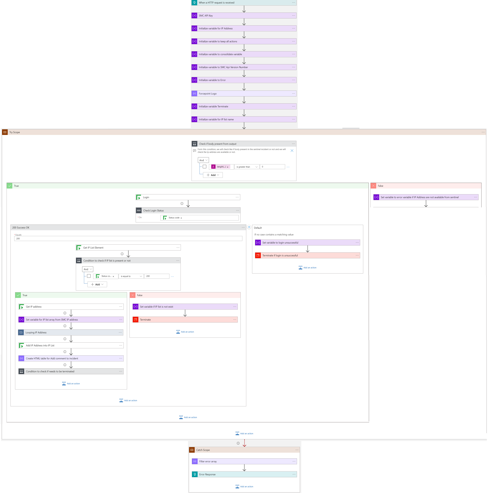
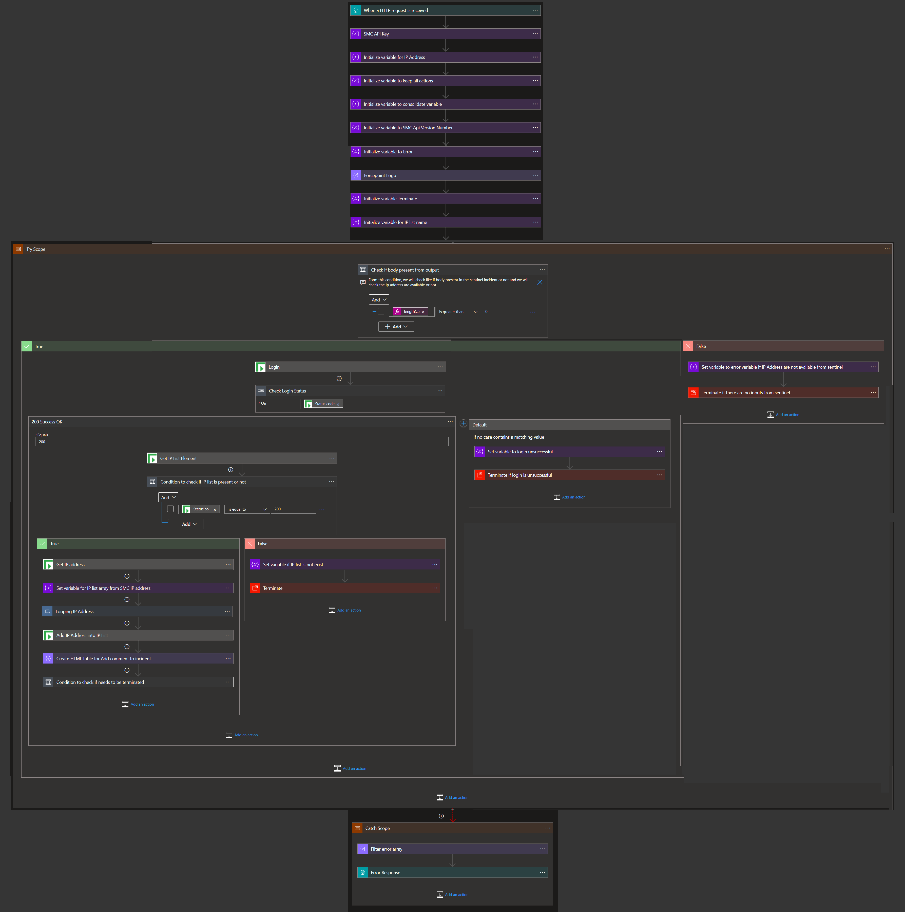

# Forcepoint NGFW Block IP Nested Remediation Playbook

## Summary
 When  this playbook is triggered and it performs the below actions:
 1. Gets list of potentially malicious IP addresses.
 2. For each IP address in the list, checks if the IP address is already present in IP List Name or not.
 3. List of all IP addresses not present in IP List Name is blocked in the firewall by the playbook.

  
 
 
 ## Pre-requisites for deployment
 1. Deploy the Forcepoint SMC Custom Connector before the deployment of this playbook under the same subscription and same resource group as will be used for this playbook. Capture the name of the connector during deployment.
 2. Forcepoint SMC API Key should be known to establish a connection with Forcepoint SMC. For API Key [Refer here](http://www.websense.com/content/support/library/ngfw/v610/rfrnce/ngfw_6100_ug_smc-api_a_en-us.pdf )
 3. Forcepoint SMC Version number should be known. [Refer here](https://help.stonesoft.com/onlinehelp/StoneGate/SMC/) to download and install Forcepoint SMC and capture the version number for the same.
 4. IP address list name for blocking IP address present in SMC should be known.

 ### Deploy Custom Connector

To deploy ForcepointNGFW Custom connector click on the below button.

 

 ## Deployment Instructions
 1. Deploy the playbook by clicking on the "Deploy to Azure" button. This will take you to deploy an ARM Template wizard.

 2. Fill in the required parameters for deploying the playbook.

 | Parameter  | Description |
| ------------- | ------------- |
| **Playbook Name** | Enter the Playbook Name here without spaces. (e.g. BlockIP-Forcepoint ) |
| **SMC Connector name**|Enter the name of your Forcepoint SMC Connector without spaces.|
| **SMC API Key**  | Enter the SMC API Key. | 
| **SMC Version Number** | Enter the version number of SMC. (e.g. 6.9) |
| **IP List Name**|Enter IP address list name.|

# Playbook steps explained
## When this playbook is triggered
  Captures potentially malicious or malware IP addresses incident information.

##Compose image to add in the incident
This action will compose the Forcepoint image to add to the incident comments.

##Check if security policy exists in SMC
*  If a security policy exists in the SMC firewall then check for the presence of IP addresses. 
*  If the security policy does not exist then terminate with the error that policy rule not found.

##For each malicious IP received from the incident

###Check if IP address is present in IP List Name
* If IP address is present in IP List Name then check if IP List is part of security policy rule.
* If IP address is not present in IP List Name then add the IP address to IP List Name. Response says IP address blocked by Playbook.

###Check if IP List is part of security policy in SMC
*  If a security policy exists in the SMC firewall for IP List Name then IP address is already blocked. Response says IP address already blocked.
*  If the security policy does not exist for IP List name then security policy is created for IP List Name.

##Response from playbook is sent to master playbook to generate incident comments.

