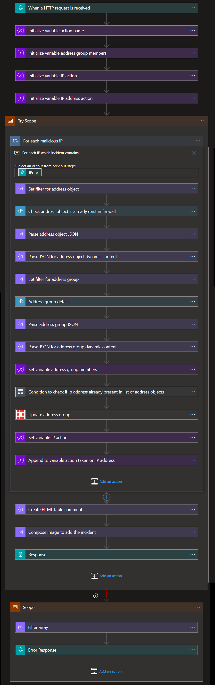

# Fortinet BlockIP Nested Remediation Playbook

 ## Summary
When this playbook gets triggered, it performs below actions:

1. Gets a list of malicious IP address.
2. For each IP address in the list, checks if IP address in blocked in security policy rule or not.
3. If IP address is blocked in security policy rule, then it unblocks that IP address.
4. If IP address is not blocked in security policy rule, then it blocks that IP address.

 
 

### Prerequisites 
1. Sentinel IP block group should be created in the VM.
2. FortinetConnector needs to be deployed prior to the deployment of this playbook under the same subscription. 
3. Function App needs to be deployed prior to the deployment of this playbook under the same subscription. 
4. FortinetConnector API key should be known. Refer this link [how to generate the API Key](https://www.insoftservices.uk/fortigate-rest-api-token-authentication) 
5. Managed Identity should be created. [Create user assigned manage identity](/azure/active-directory/managed-identities-azure-resources/how-to-manage-ua-identity-portal)

### Deploy Custom Connector

To deploy Fortinet Custom connector click on the below button.

  

### Deployment instructions 
1. Deploy the playbook by clicking on "Deploy to Azure" button. This will take you to deploying an ARM Template wizard.

 

2. Fill the required parameters:

|Parameter|Description|
|-------------|--------------|
|**Playbook Name**| Enter the playbook name here (eg:Fortinet-BlockIP-Remediation)|
|**Pre-defined Group Name**| Enter your Group name which is created in firewall|
|**Function app Name** |Enter your Function app name |
|**Managed Identity Name**| Enter the your managed identity name |

### Post-Deployment instructions
#### a. Authorize connections
Once deployment is complete, you will need to authorize Fortinet API connection.
1.	Click the Fortinet connection resource
2.	Click edit API connection
3.	Provide API key
4.	Click Save

#### b. Change Managed Identity Connection
* Go to logic app designer.
* Look for the function call actions. You can find them by the titles: 
  i) Fetch the details of the address object. 
  ii) Get address group details. 
* For each one of the above function call actions and perform the below mentioned steps: 
  i) Go to "Managed identity" dropdown and select user identity. 
  ii) Save playbook.

##Playbook steps explained

### When the playbook is triggered

The playbook receives list of malicious IP addresses as the input.

### Initialize variables 

-  Action Name (type-String) - To store action name as block IP or unblock IP
   
-  Address group Members(type-Array) - To store list of address group members

-  IP Action (type-Object) - To store action taken against each IP
   
-  IP Address Action(type-Array) - To store consolidated action taken against each IP

-  Predefined Group name(type-String)- To store pre-defined address group name

### For each-malicious IP
Iterates on the IPs found in this incident and performs the following:

### Condition to check if IP address already present in list of address objects

a)If IP is present in list of address objects

   * Condition to check if IP present in predefined address group

        i) If IP present in predefined address group then unreference that IP from the address group. Set action name as UnblockIP.

        ii) If IP not present in predefined address group then append that IP into address group members. Set action name as BlockIP.

b)If IP address is not present in list of address objects then append that IP address to address group member and set action name as BlockIP.  

## Update the address group 

a) If IP needs to be blocked then create new address object for that malicious IP and update the address object group.

b) If IP need not be blocked, then simply update the address object group.

##Update the IP address action variable.

##Response from playbook is sent to master playbook to generate incident comments.

