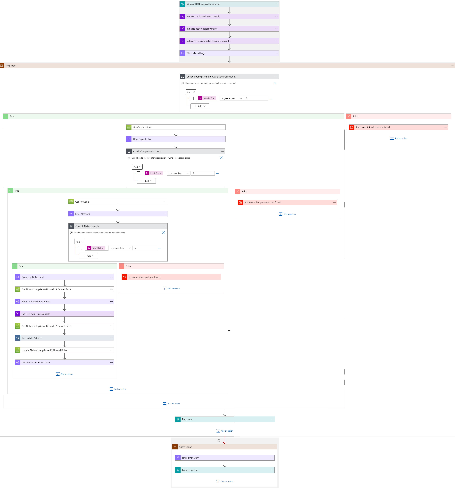
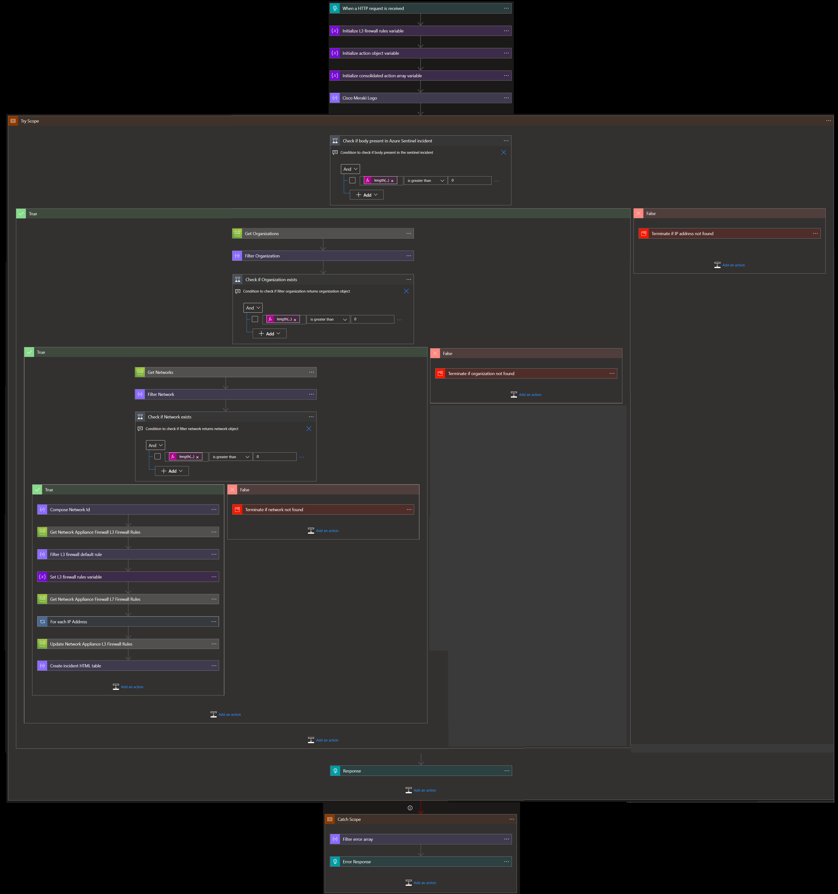

# Cisco Meraki Block IP Nested Remediation Playbook

## Summary
 When this playbook gets triggered and it performs the below actions:
 1. Gets a list of potentially malicious IP addresses.
 2. For each IP address in the list, checks if the IP address is blocked by L3 firewall rule or L7 firewall rule of MX network. 
  a) If IP address is blocked by either L3 firewall rule or L7 firewall rule, then response says IP address is blocked. 
  b) If IP address is not blocked by either L3 firewall rule or L7 firewall rule, then that IP address is blocked by playbook.

 ## Pre-requisites for deployment
1. Deploy the Cisco Meraki Custom Connector before the deployment of this playbook under the same subscription and same resource group. Capture the name of the connector during deployment.
2. Cisco Meraki API Key should be known to establish a connection with Cisco Meraki Custom Connector. [Refer here](https://developer.cisco.com/meraki/api-v1/#!getting-started/authorization)
3. Organization name should be known. [Refer here](https://developer.cisco.com/meraki/api-v1/#!getting-started/find-your-organization-id) 
4. Network name should be known.[Refer here](https://developer.cisco.com/meraki/api-v1/#!getting-started/find-your-network-id)

### Deploy Custom Connector

To deploy Cisco Meraki Custom connector click on the below button.

 

 ## Deployment Instructions
 1. Deploy the playbook by clicking on the "Deploy to Azure" button. This will take you to deploy an ARM Template wizard.

 2. Fill in the required parameters for deploying the playbook.

 | Parameter  | Description |
| ------------- | ------------- |
| **Playbook Name** | Enter the playbook name here without spaces (e.g. Block-IP-Address-Nested) |
| **Cisco Meraki Connector Name**|Enter the name of Cisco Meraki custom connector without spaces |
| **Organization Name** | Enter organization name |
| **Network Name**| Enter network name | 

# Post-Deployment Instructions 
##  Authorize API connection
Once deployment is complete, go under deployment details and authorize Cisco Meraki connection. 
1.  Click the Cisco Meraki connection
2.  Click **Edit API connection**
3.  Enter API Key
4.  Click Save

# Playbook steps explained
## When the playbook is triggered
  The playbook receives list of malicious IP addresses as the input.

## Compose image to add in the incident
This action will compose the Cisco Meraki image to add to the incident comments.

## Check if Organization exists
 *  If organization name exists in list of organizations associated with the account, then get list of networks associated with the organization. 
 *  If organization name does not exist, then terminate with the error that organization not found.

 ## Check if network exists
  *  If network name exists in list of networks associated with the account, then return network associated with the organization. 
 *  If network name does not exist, then terminate with the error that network not found.

## For each malicious IP received from the incident
 - Checks if the IP address is part of L3 firewall rule or L7 firewall rule of MX network.
  - If IP address is part of both L3 firewall rule and L7 firewall rule but not blocked by either of the rules, then response says IP address allowed by firewall.
  - If IP address is part of either L3 firewall rule or L7 firewall rule and blocked by the rule, then response says IP address is blocked.
  - If IP address is not part of either L3 firewall rule or L7 firewall rule, then that IP address is blocked by playbook. Response IP address blocked by playbook.
  - Responses from all the cases are combined.

## Response from playbook is sent to master playbook to generate incident comments.

