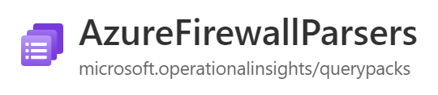
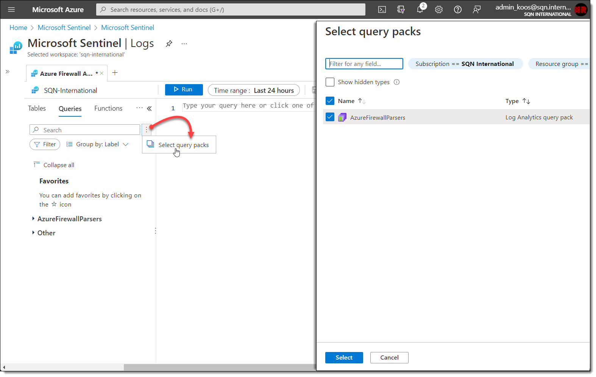
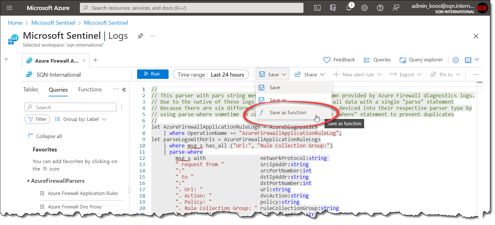
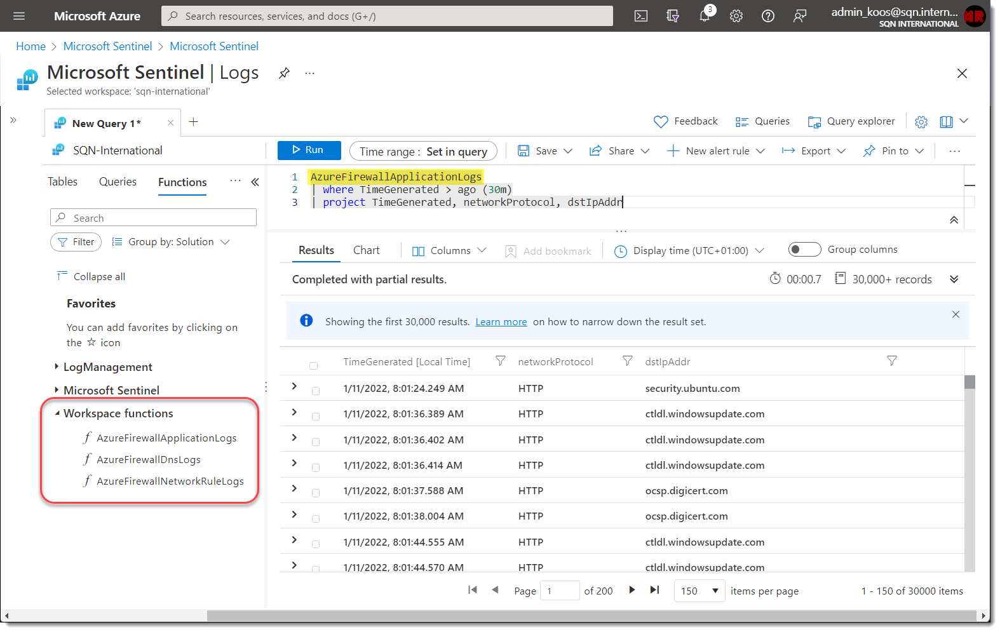

# Parsing Azure Firewall logs

## Capture logs

Logs are captured by enabling diagnostics settings and forwarding them to the Sentinel-enabled workspace. You can also use a dedicated Azure Firewall data connector to make these changes for you. And there's also an option to enforce these settings through Azure Policy as well.

### Categories

There are three categories of logs which can be enabled from Azure Firewall:

* Application rule logs
* DNS logs
* Network rule logs

## Reading the logs

Once logs are collected you'll find these in the `AzureDiagnostics` table:

```
AzureDiagnostics
| where ResourceType == "AZUREFIREWALLS"
```

And each of the three categories is divided by the `Category` column:

```
| where Category == "AzureFirewallApplicationRule"
| where Category == "AzureFirewallDnsProxy"
| where Category == "AzureFirewallNetworkRule"
```

Unfortunately the all of the details withing these logs are put into a single column "msg_s" as one string. To make these logs better readable you can use these three parsers to split everything up into separate columns.

I've also added sample datasets for `ApplicationRule` and `NetworkRule` events. These dataset contains all variations of "msg_s" which led to creating the different parse statements within each parser.

## Using these parsers

### Automatic deployment

Queries can be stored inside a Log Analytics Workspace (savedQueries) but this is considered _"legacy"_ since [Microsoft introduced Query Packs @ Build 2021](https://techcommunity.microsoft.com/t5/azure-monitor-blog/what-s-new-in-azure-monitor-build-2021/ba-p/2366286).

Query Packs are a new type of Azure resource which can contains KQL queries and can be shared across multiple workspaces. If you save a query from the portal it will now default by creating a new blank Query Pack called `DefaultQueryPack` in a resource group `loganalyticsdefaultresources` in your subscription.

<sup>**More information on Query Pack deployments:**</sup> <sup>https://docs.microsoft.com/en-us/azure/azure-monitor/logs/query-packs</sup>

If you already make use of Query Packs you can add these queries to your existing pack(s) or you can deploy a new additional pack with the button below:

<br>

[](https://aka.ms/AzSentinelWindowsEventARM)

<br>

The template deploys the following:



| Name | Type |
| --- | --- |
| AzureFirewallParsers | Log Analytics query pack |

Within Microsoft Sentinel you can select which Query Pack(s) you want to load into the interface:



### Manual deployment

1. Load up the query interface of Log Analytics / Azure Sentinel and paste the code of a parser in the UI.
2. Click on `Save` --> `Save as function` and give it a name.
3. Repeat the process for each of the three functions.



Once a function is saved it might take a minute or two before they can be used. Once active you should be able to run a function by entering the name you gave it in step 2.

For example:

```
AzureFirewallNetworkRules
| where protocol == "TCP" and
        action == "Allow" and
        port_destination == 3389
```

