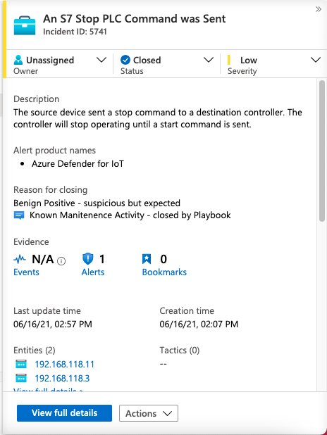
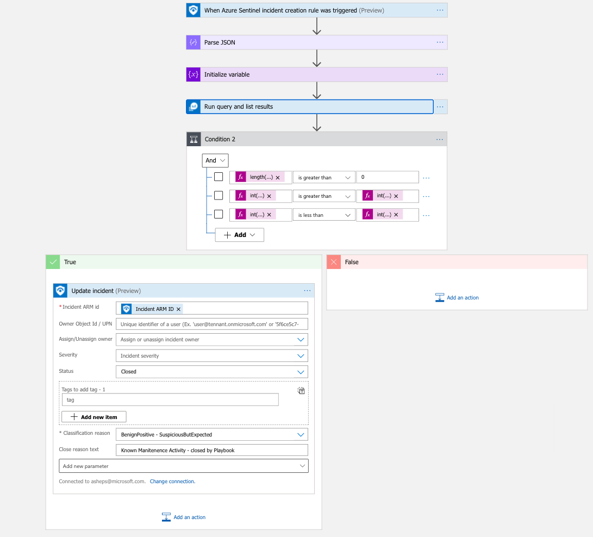

# AD4Iot - Auto close incidents (Incidents suppression during maintenace window)
Author: Amit Sheps

In some cases, maintenance activities generate alerts in Sentinel which distracts the SOC team from handling the real problems, the playbook allows to input the time period in which the maintenance is expected and the assets IP (Excel file can be found). The playbook requires a watchlist which includes all the IP addresses of the assets on which alerts will handled automatically. 
This playbook parses explicitly the IOT device entity fields. 

## Prerequisites
* The playbook is applicable for Azure Defender for IoT incidents. Configure an automation rule to run this playbook on the relevant AD4IoT incidents.
* You will be asked to provide a watchlist name to work with.  
A sample of such watchlist is provided in this folder as an example. Please use it to generate your watchlist. The playbook is configured to query it by this watchlist column names. 

## Screenshots
 
 

## Deploy to Azure

