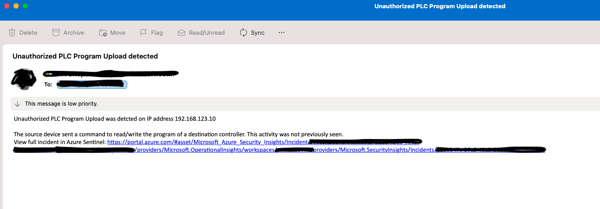
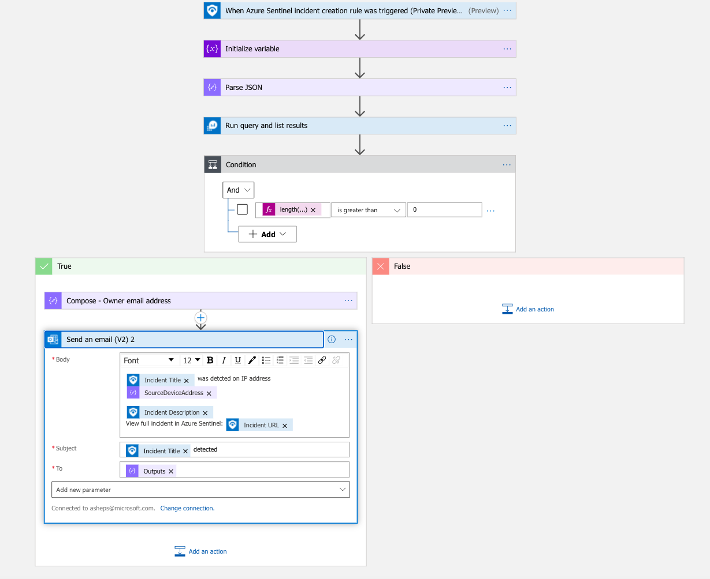

# AD4IoT - Sent an email by production line
Author: Amit Sheps

The following playbook will send mail to notify specific stake holders. 
One example can be in the case of specific security team per product line or per physical location. The playbook requires a watchlist which maps between the sensors name and the mail addresses of the alerts stockholders, a sample is provide with the playbook.  

## Prerequisites
* The playbook is applicable for Azure Defender for IoT incidents. Configure an Automation Rule to run a playbook on the relevant IoT incident creation rule.
* Create a Azure Sentinel Watchlist named **MailsBySensor** (sample included) which includes the list of the following:
    * Sensor names parameter name
    * Mail address to be used to send mails
    Example can be found in this folder.

## Screenshots
 
 

## Deploy to Azure

