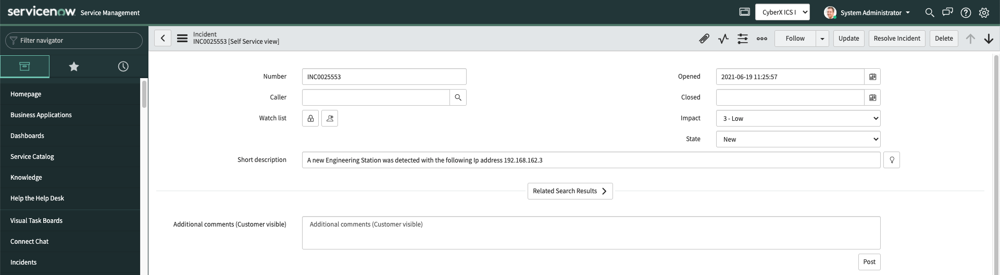
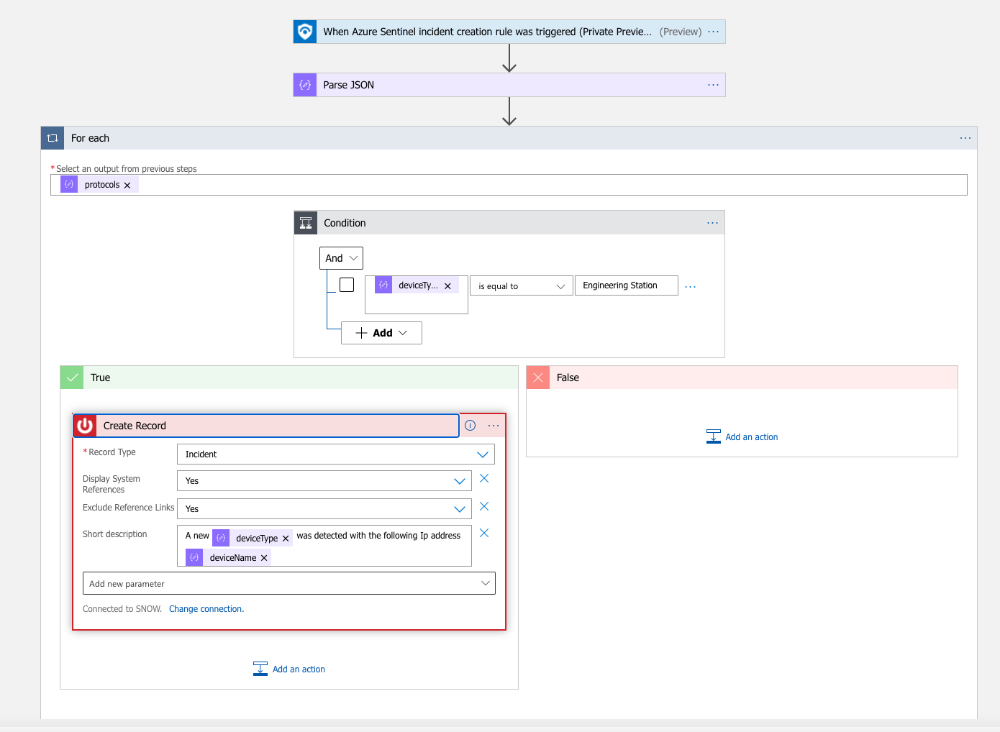

# AD4IoT - Create ServiceNow record for a new asset
Author: Amit Sheps

Normally, the authorized entity to program a PLC is the Engineering Workstation, to program a PLC attackers might create a new Engineering Workstation to create malicious programing. The following playbook will open a ticket in ServiceNow each time a new Engineering Workstation is detected.  
This playbook parses explicitly the IOT device entity fields. 

## prerequisites
• The playbook is applicable for Azure Defender for IoT incidents  
• Automation rule for the specific incidents which reference alerts with the text "new"

## screenshots
 
 

## Deploy to Azure

