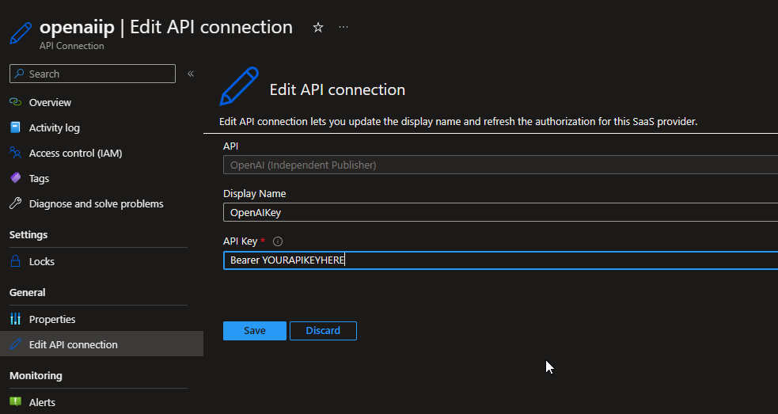
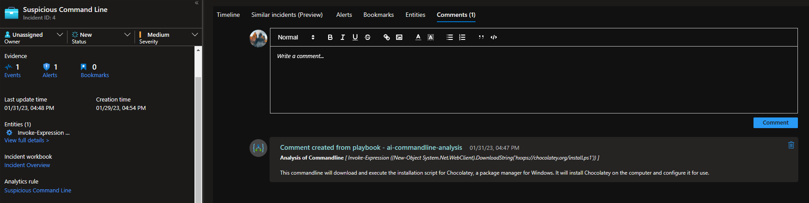

# AI Commandline Analysis with GPT-3
Author: Curtis Middlehurst

This playbook is intended to be run from a Microsoft Sentinel incident that has a Commandline entity. It will send a prompt to GPT-3 and return an explanation of the commandline to the comments of the incident.

The GPT-3 model is currently set as 'text-davinci-003', details of different models can be found at https://platform.openai.com/docs/models/overview.

#
### Requirements

1. An OpenAI API Key to authorise the GPT-3 connection.

# 
### Pre-Deployment

Before you begin, you will need to have an API key from https://openai.com/api/. 

**USAGE OF THE OPENAI API IS NOT FREE**, please ensure you are aware of this before usage and select the appropriate plan for your organisation according to https://openai.com/api/pricing/.

#
### Deployment

To configure and deploy this playbook:

1. Open your browser and ensure you are logged into your Microsoft Sentinel workspace.

2. Click the “**Deploy to Azure**” button below and it will bring you to the custom deployment template.

3. Select a name for the Playbook.

#
### Post-Deployment: Setting up the OpenAI Connector

1. Before you begin, you will need to have an API key from https://openai.com/api/. 

2. Go to *yourlogicappname* -> API Connections -> *openaiip-yourlogicappname* -> Edit API Connection.

3. Set the 'API Key' to 'Bearer *yourapikey*'.

4. The 'Display Name' can be changed if you wish, however this is not required.

#
### Post-Deployment: Assigning the Microsoft Sentinel Responder role

The playbook uses a managed identity for the Microsoft Sentinel API Connection, this identity needs the Microsoft Sentinel Responder role in any Microsoft Sentinel workspaces in order to add comments.

1. Select the Playbook resource.
2. In the left menu, click Identity.
3. Under Permissions, click Azure role assignments.
4. Click Add role assignment (Preview).
5. Use the drop-down lists to select the resource group that your *Microsoft Sentinel Workspace* is in. If multiple workspaces are used in different resource groups consider selecting a subscription instead.
6. In the Role drop-down list, select the role 'Microsoft Sentinel Responder'.
7. Click Save to assign the role.
#
### Usage

This playbook can be run manually or as part of an automation rule. This has been tested against incidents with a commandline entity, without a commandline entity and with multiple commandline entities and has handled each appropriately.

Once the playbook runs on an incident, the GPT-3 Analysis of any commandlines appear in the comments.

#
