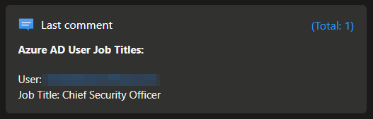
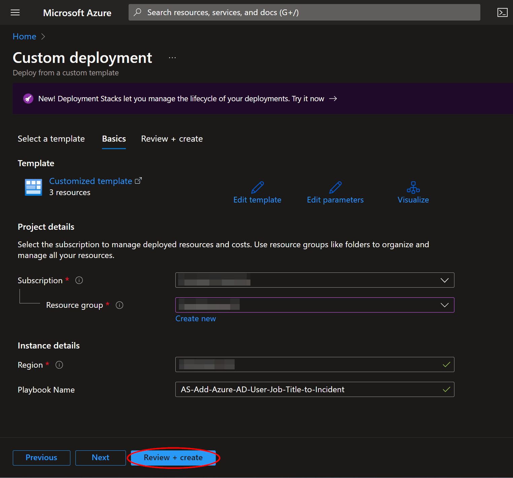
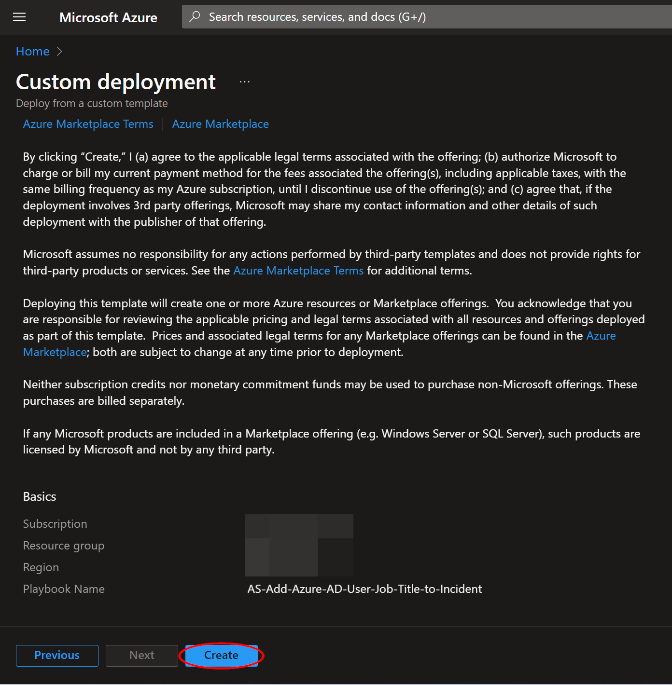
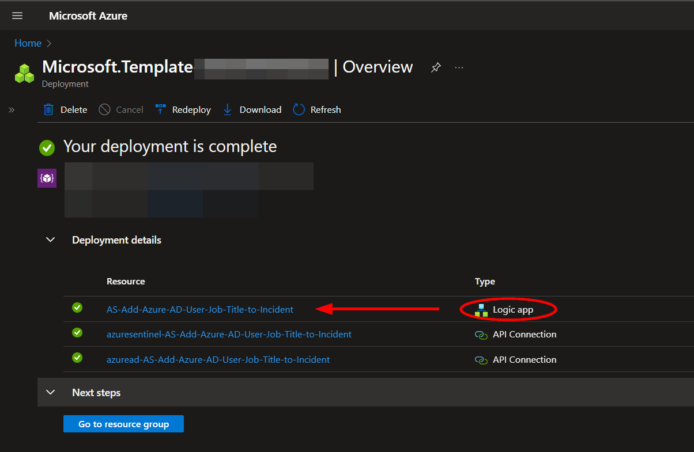
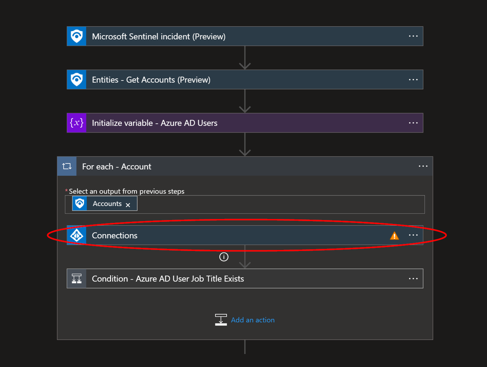
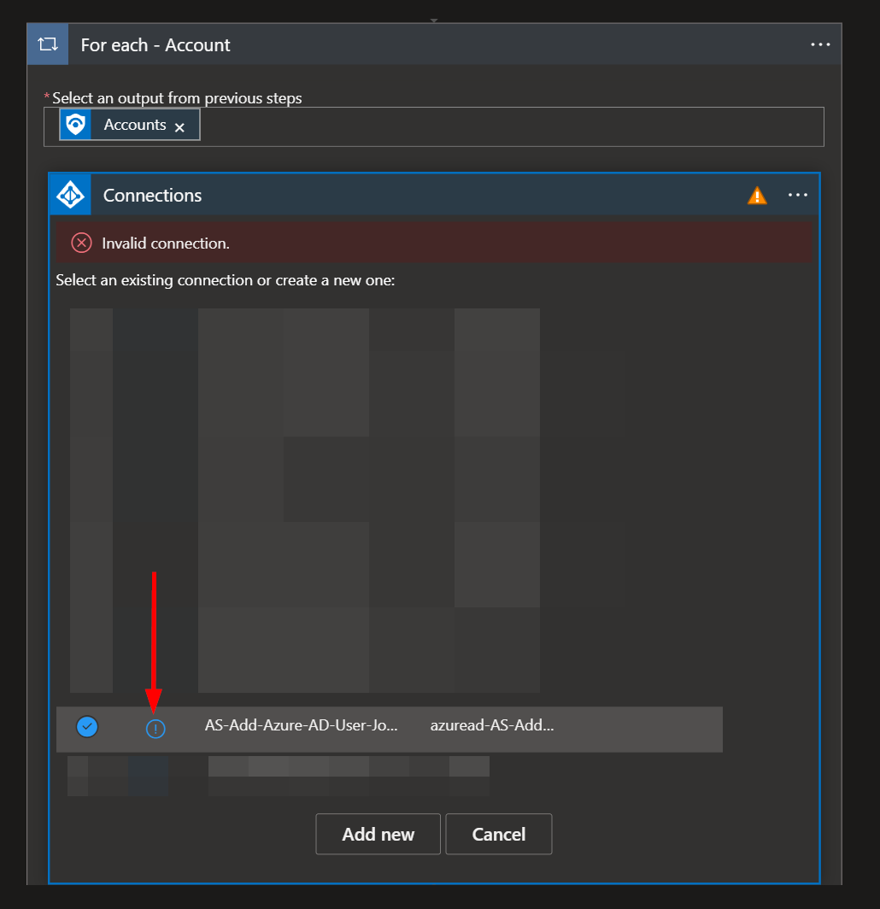
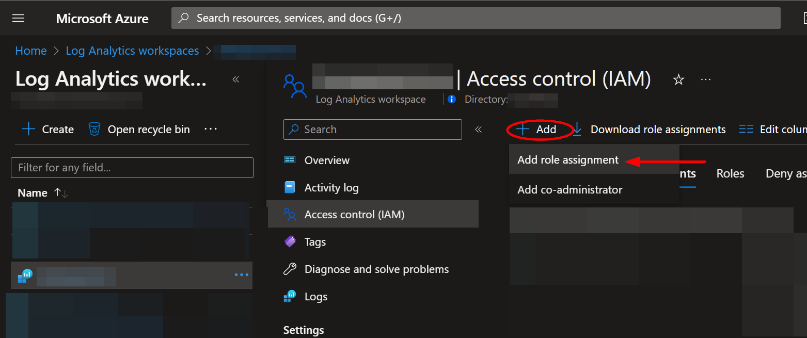
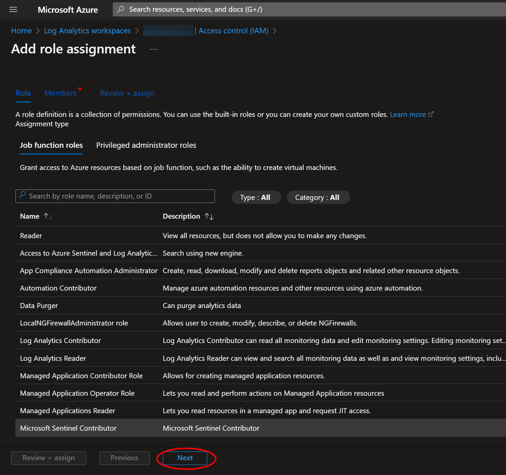
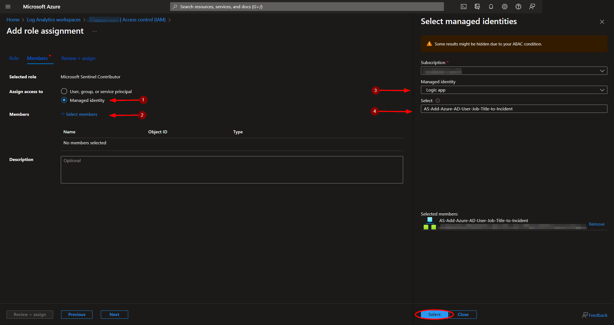
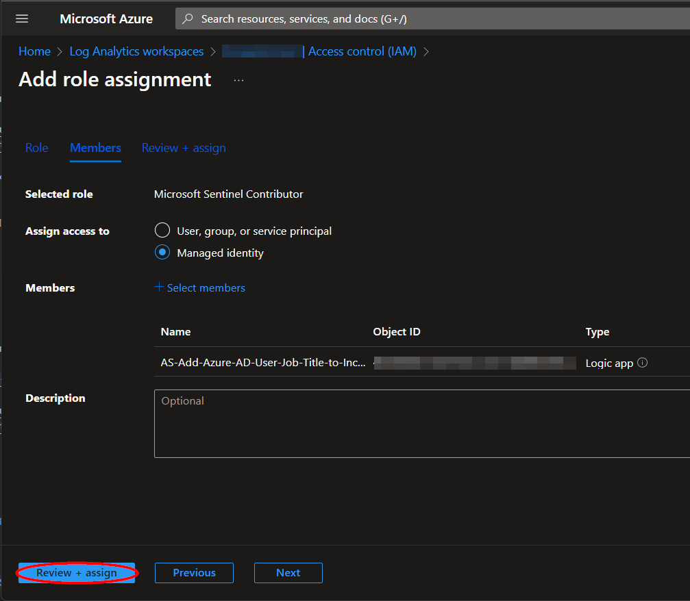

# AS-Add-Azure-AD-User-Job-Title-to-Incident
Author: Accelerynt

For any technical questions, please contact info@accelerynt.com

    

This playbook is intended to be run from a Microsoft Sentinel incident. It will pull the Azure AD user accounts associated with the entities from Microsoft Sentinel incidents and add the Azure AD job titles in an Incident comment.

#
### Deployment

To configure and deploy this playbook:

Open your browser and ensure you are logged into your Microsoft Sentinel workspace. In a separate tab, open the link to our playbook on the Accelerynt Security GitHub Repository:

https://github.com/Accelerynt-Security/AS-Add-Azure-AD-User-Job-Title-to-Incident

Click the “**Deploy to Azure**” button at the bottom and it will bring you to the custom deployment template.

In the **Project details** section:

* Select the **Subscription** and **Resource group** from the dropdown boxes you would like the playbook deployed to.  

In the **Instance details** section:  
                                                  
* **Playbook Name**: This can be left as "**AS-Add-Azure-AD-User-Job-Title-to-Incident**" or you may change it. 

Towards the bottom, click on "**Review + create**". 

Once the resources have validated, click on "**Create**".

The resources should take around a minute to deploy. Once the deployment is complete, you can expand the "**Deployment details**" section to view them.
Click the one corresponding to the Logic App.

Click on the "**Edit**" button. This will bring us into the Logic Apps Designer.

Before the playbook can be run, the Azure AD connection will either need to be authorized in the indicated step, or an existing authorized connection may be alternatively selected. This connection can be found under the third step labeled "**For each**".

Expand the "**Connections**" step and click the exclamation point icon next to the name matching the playbook.
                                                                                                

When prompted, sign in to validate the connection.                                                                                                

#
### Microsoft Sentinel Contributor Role

After deployment, you will need to give the system assigned managed identity the "**Microsoft Sentinel Contributor**" role. This will enable the Logic App to add comments to Incidents. Navigate to the Log Analytics Workspaces page and select the same workspace the playbook is located in:

https://portal.azure.com/#view/HubsExtension/BrowseResource/resourceType/Microsoft.OperationalInsights%2Fworkspaces

Select the "**Access control (IAM)**" option from the menu blade, then click "**Add role assignment**".

Select the "**Microsoft Sentinel Contributor**" role, then click "**Next**".

Select the "**Managed identity**" option, then click "**Select Members**". Under the subscription the Logic App is located, set the value of "**Managed identity**" to "**Logic app**". Next, enter "**AS-Add-Azure-AD-User-Job-Title-to-Incident**", or the alternative playbook name used during deployment, in the field labeled "**Select**". Select the playbook, then click "**Select**".

Continue on to the "**Review + assign**" tab and click "**Review + assign**".

