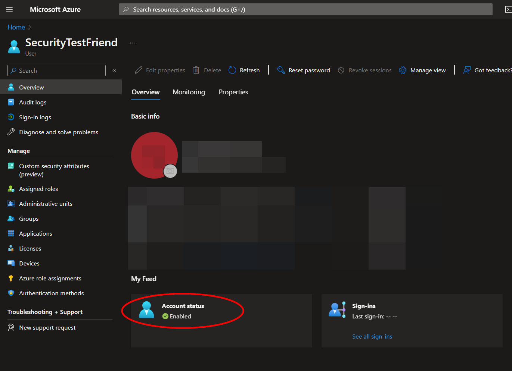
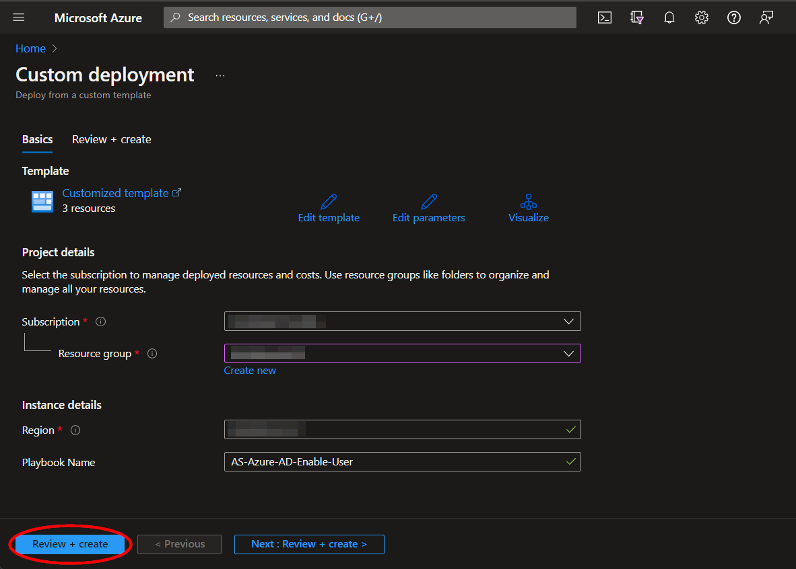
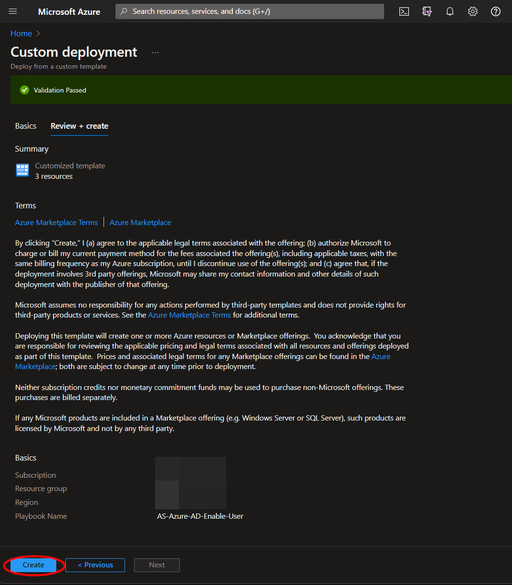
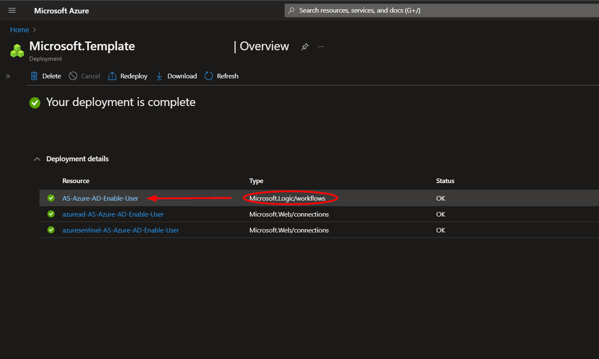
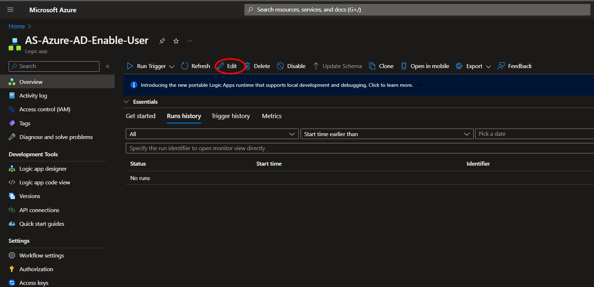
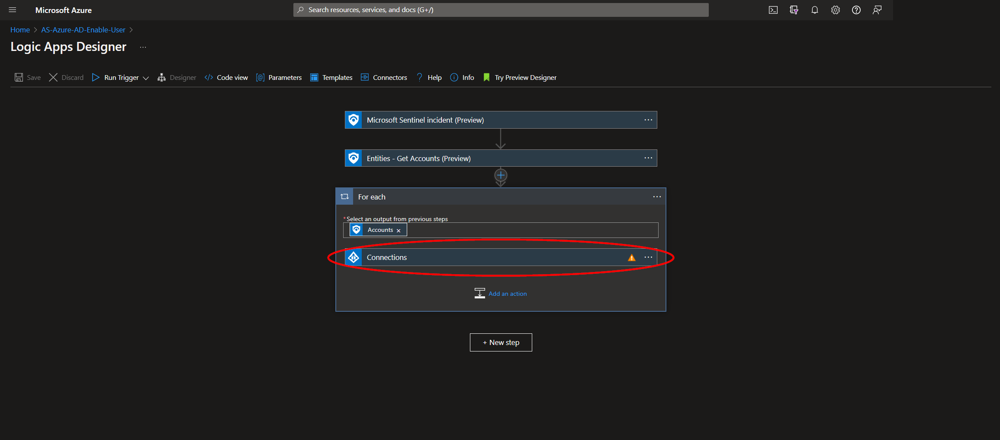
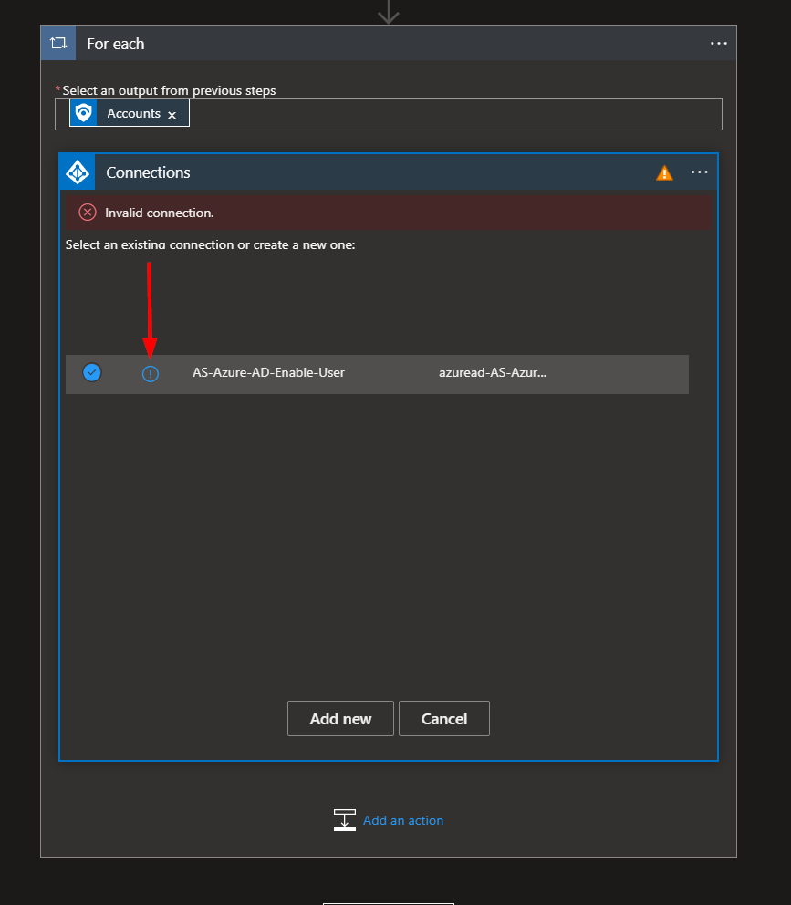
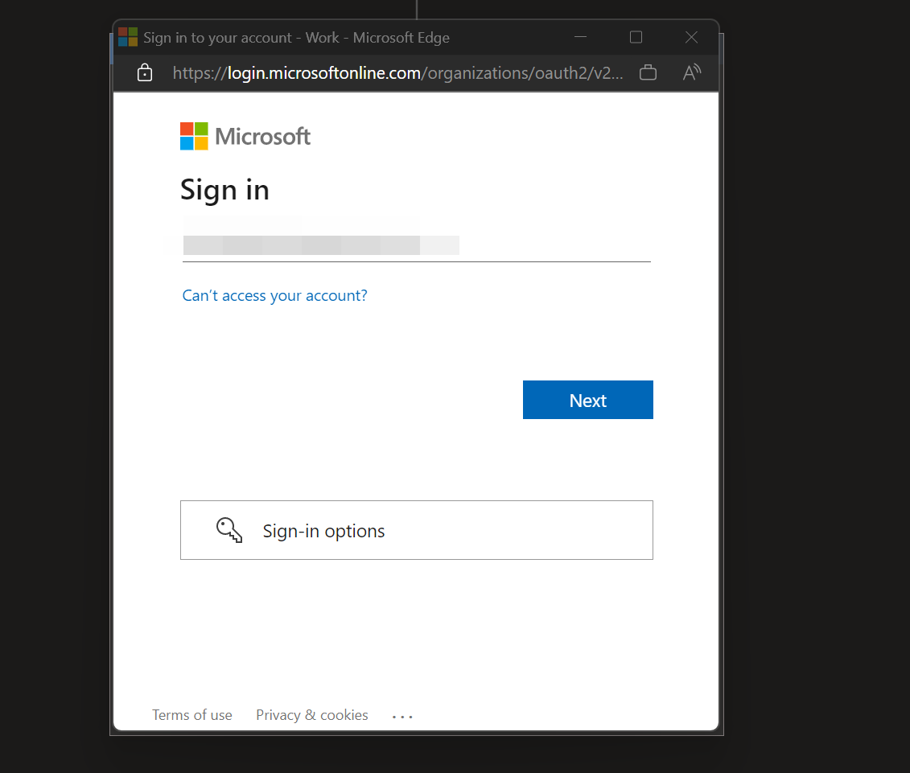

# AS-Azure-AD-Enable-User
Author: Accelerynt

For any technical questions, please contact info@accelerynt.com  

This playbook is intended to be run from a Microsoft Sentinel incident. It will enable the Azure AD user accounts associated with the entities from Microsoft Sentinel incidents. This playbook is meant to be used in tandem with our [AS-Azure-AD-Disable-User](https://github.com/Azure/Azure-Sentinel/tree/master/Playbooks/AS-Azure-AD-Disable-User) playbook.

#
### Deployment

To configure and deploy this playbook:

Open your browser and ensure you are logged into your Microsoft Sentinel workspace. In a separate tab, open the link to our playbook on the Accelerynt Security GitHub Repository:

https://github.com/Accelerynt-Security/AS-Azure-AD-Enable-User

Click the “**Deploy to Azure**” button at the bottom and it will bring you to the custom deployment template.

In the **Project details** section:

* Select the **Subscription** and **Resource group** from the dropdown boxes you would like the playbook deployed to.  

In the **Instance details** section:  
                                                  
* **Playbook Name**: This can be left as "**AS-Azure-AD-Enable-User**" or you may change it. 

Towards the bottom, click on "**Review + create**". 

Once the resources have validated, click on "**Create**".

The resources should take around a minute to deploy. Once the deployment is complete, you can expand the "**Deployment details**" section to view them.
Click the one corresponding to the Logic App.

Click on the "**Edit**" button. This will bring us into the Logic Apps Designer.

Before the playbook can be run, the Azure AD connection will either need to be authorized in the indicated step, or an existing authorized connection may be alternatively selected. This connection can be found under the third step labeled "**For each**".

Expand the "**Connections**" step and click the exclamation point icon next to the name matching the playbook.
                                                                                                

When prompted, sign in to validate the connection.                                                                                                

