# AS-Checkmarx-Audit-Ingestion

Author: Accelerynt

For any technical questions, please contact [info@accelerynt.com](mailto:info@accelerynt.com)

This playbook will create a unidirectional integration with Microsoft Sentinel. It will pull Checkmarx audit log events into a Microsoft Sentinel custom log table where they can be tracked, queried, and correlated with other security data. This uses Data Collection Rules (DCR), Data Collection Endpoints (DCE), and custom log tables.

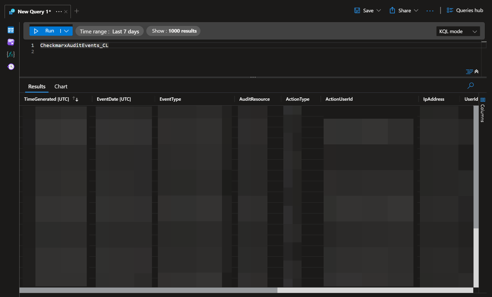

> [!NOTE]
> Estimated Time to Complete: 45 minutes

> [!TIP]
> Required deployment variables are noted throughout. Reviewing the deployment page and filling out fields as you proceed is recommended.

> [!NOTE]
> This playbook handles **audit events only**. For SAST findings ingestion, see the [AS-Checkmarx-SAST-Ingestion](https://github.com/Accelerynt-Security/AS-Checkmarx-SAST-Ingestion) playbook. Note that only a single DCE and a single Key Vault secret need to be created for both playbooks.

#

### Requirements

The following items are required under the template settings during deployment:

* **Checkmarx Client Secret or Refresh Token** - a client secret (recommended) or refresh token with permissions to query audit logs from your Checkmarx One instance. [Documentation link](#checkmarx-api-permissions)
* **Checkmarx IAM Base URL** - the base URL for Checkmarx IAM authentication based on your region (e.g., `https://us.iam.checkmarx.net`). [Documentation link](#checkmarx-api-permissions)
* **Checkmarx AST Base URL** - the base URL for Checkmarx AST API calls based on your region (e.g., `https://us.ast.checkmarx.net`). [Documentation link](#checkmarx-api-permissions)
* **Checkmarx Tenant** - your Checkmarx tenant/realm name used in the authentication URL. [Documentation link](#checkmarx-api-permissions)
* **Azure Key Vault Secret** - this will be used to store your Checkmarx client secret or refresh token. [Documentation link](#create-an-azure-key-vault-secret)
* **Log Analytics Workspace** - the name, location, subscription ID, resource group, and resource ID of the Log Analytics workspace that the Checkmarx data will be sent to. [Documentation link](#log-analytics-workspace)

#

### Checkmarx API Permissions

The Checkmarx API client requires the following permissions:

| Scope | Permission |
| --- | --- |
| ast-api | **Read** |

This playbook supports two OAuth grant types for authentication. Select the method that matches your Checkmarx One configuration:

#### Option A: Client Credentials (Recommended)

The `client_credentials` grant type is recommended for production deployments. It uses a client ID and client secret for authentication.

1. Navigate to your Checkmarx One tenant
2. Go to **IAM** > **OAuth Clients**
3. Create a new OAuth client or use an existing one with the required scopes
4. Copy the **Client ID** and **Client Secret** - the secret will be stored in Azure Key Vault
5. During deployment, set the **Grant Type** parameter to `client_credentials`

#### Option B: Refresh Token

The `refresh_token` grant type uses a refresh token obtained from an interactive login or API key flow.

1. Navigate to your Checkmarx One tenant
2. Go to **IAM** > **API Keys** or use the authentication endpoint
3. Create an API key or OAuth client with appropriate scopes
4. Generate a refresh token for the `ast-app` client
5. Copy the refresh token - this will be stored in Azure Key Vault
6. During deployment, set the **Grant Type** parameter to `refresh_token`

Select the base URLs for your region using the table below:

| Region | IAM Base URL | AST Base URL |
| --- | --- | --- |
| US | `https://us.iam.checkmarx.net` | `https://us.ast.checkmarx.net` |
| EU | `https://eu.iam.checkmarx.net` | `https://eu.ast.checkmarx.net` |
| DEU | `https://deu.iam.checkmarx.net` | `https://deu.ast.checkmarx.net` |
| ANZ | `https://anz.iam.checkmarx.net` | `https://anz.ast.checkmarx.net` |
| IND | `https://ind.iam.checkmarx.net` | `https://ind.ast.checkmarx.net` |

Note the URLs you selected, as they will be needed for the deployment step.

#

### Setup

#### Create an Azure Key Vault Secret

> [!NOTE]
> If you have already created the **checkmarx-integration-secret** secret, you may skip this step.

Navigate to the Azure Key Vaults page: https://portal.azure.com/#view/HubsExtension/BrowseResource/resourceType/Microsoft.KeyVault%2Fvaults

Navigate to an existing Key Vault or create a new one. From the Key Vault overview page, click the "**Secrets**" menu option, found under the "**Settings**" section. Click "**Generate/Import**".


Choose a name for the secret, such as "**checkmarx-integration-secret**", and enter your Checkmarx client secret or refresh token in the "**Value**" field. All other settings can be left as is. Click "**Create**".

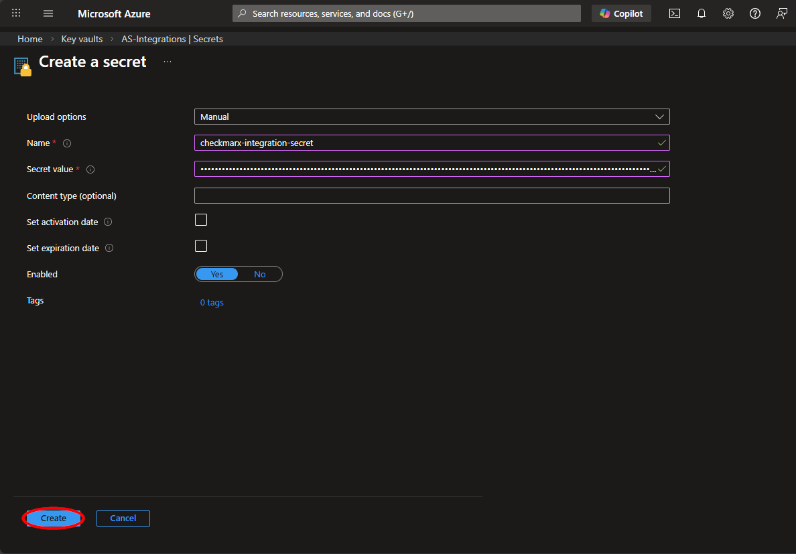

#### Log Analytics Workspace

Navigate to the Log Analytics Workspace page: https://portal.azure.com/#view/HubsExtension/BrowseResource/resourceType/Microsoft.OperationalInsights%2Fworkspaces

Select the workspace that the Checkmarx data will be sent to, and take note of the following values:

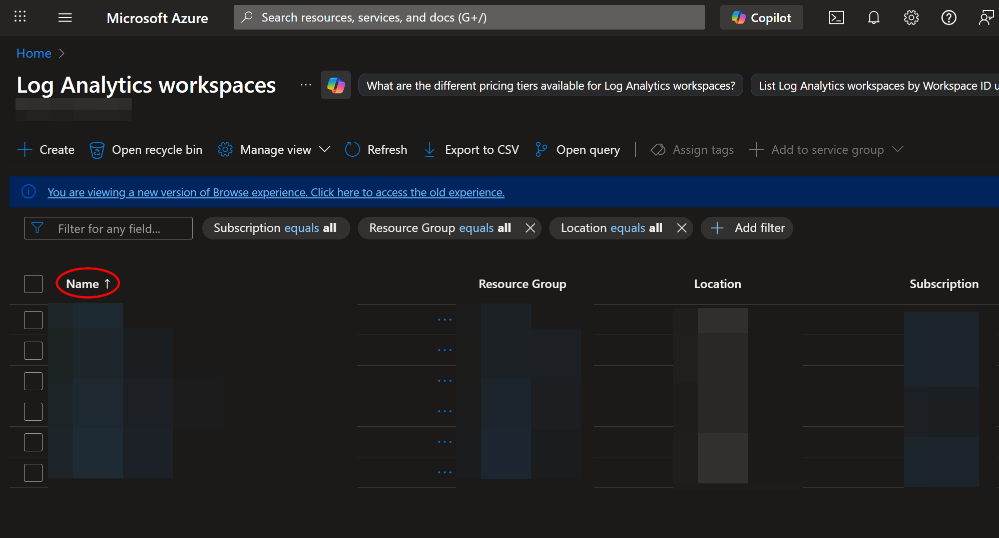

From the left menu blade, click **Overview** and take note of the **Name** and **Location** field values. These will be needed for the DCE deployment.

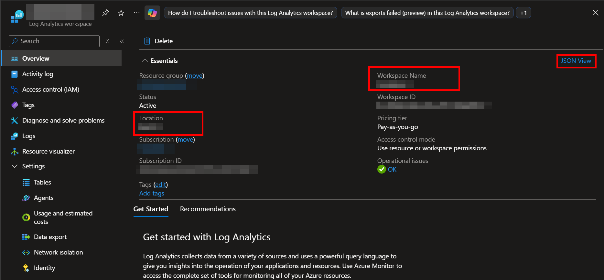

From the left menu blade, click **Overview** and take note of the **Subscription**, **Resource group**, and **Resource ID** shown in the JSON View. These will be needed for the DCR and Logic App deployments.

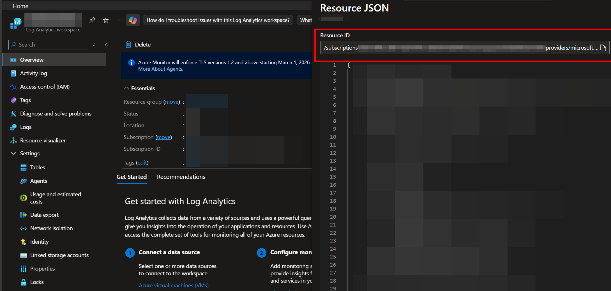

#

### Deployment

#### Deploy the Audit Logs Custom Table

The custom table **CheckmarxAuditEvents_CL** must be created before deploying the DCR.

[](https://portal.azure.com/#create/Microsoft.Template/uri/https%3A%2F%2Fraw.githubusercontent.com%2FAzure%2FAzure-Sentinel%2Fmaster%2FPlaybooks%2FAS-Checkmarx-Audit-Ingestion%2FAzureDeployAuditTable.json)
[](https://portal.azure.us/#create/Microsoft.Template/uri/https%3A%2F%2Fraw.githubusercontent.com%2FAzure%2FAzure-Sentinel%2Fmaster%2FPlaybooks%2FAS-Checkmarx-Audit-Ingestion%2FAzureDeployAuditTable.json)

Click the "**Deploy to Azure**" button and it will bring you to the custom deployment template.

In the **Project details** section:

* Select the **Subscription** and **Resource group** from the dropdown boxes you would like the playbook deployed to.

In the **Instance details** section:

* **Workspace Name**: Enter the **Name** of your Log Analytics workspace referenced in [Log Analytics Workspace](#log-analytics-workspace).

Towards the bottom, click on "**Review + create**".

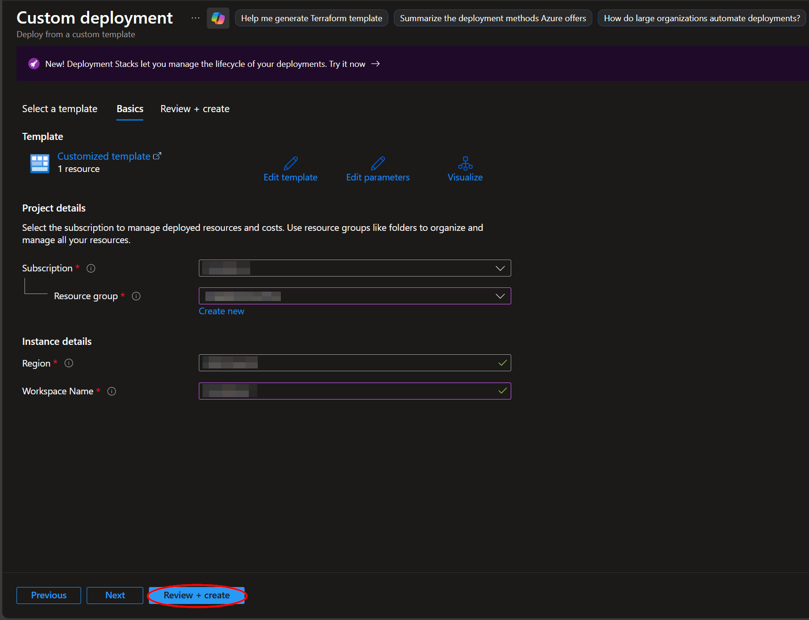

Once the resources have validated, click on "**Create**".

#### Deploy the Data Collection Endpoint (DCE)

The DCE provides the ingestion endpoint URL for the Logic App.

> [!NOTE]
> If you have already deployed the **AS-Checkmarx-SAST-Ingestion** playbook, a DCE already exists in your workspace. You may skip this step and use the existing DCE's Logs Ingestion Endpoint URL and Resource ID for the DCR deployment below. Navigate to your existing DCE resource to find these values.

[](https://portal.azure.com/#create/Microsoft.Template/uri/https%3A%2F%2Fraw.githubusercontent.com%2FAzure%2FAzure-Sentinel%2Fmaster%2FPlaybooks%2FAS-Checkmarx-Audit-Ingestion%2FAzureDeployDCE.json)
[](https://portal.azure.us/#create/Microsoft.Template/uri/https%3A%2F%2Fraw.githubusercontent.com%2FAzure%2FAzure-Sentinel%2Fmaster%2FPlaybooks%2FAS-Checkmarx-Audit-Ingestion%2FAzureDeployDCE.json)

Click the "**Deploy to Azure**" button and it will bring you to the custom deployment template.

In the **Project details** section:

* Select the **Subscription** and **Resource group** from the dropdown boxes you would like the playbook deployed to.

In the **Instance details** section:

* **Data Collection Endpoint Name**: This can be left as "**dce-checkmarx-log-ingestion**" or you may change it.
* **Location**: Enter the **Location** of your Log Analytics workspace referenced in [Log Analytics Workspace](#log-analytics-workspace). Note that this may differ from the Region field, which is automatically populated based on the selected Resource group.

Towards the bottom, click on "**Review + create**".

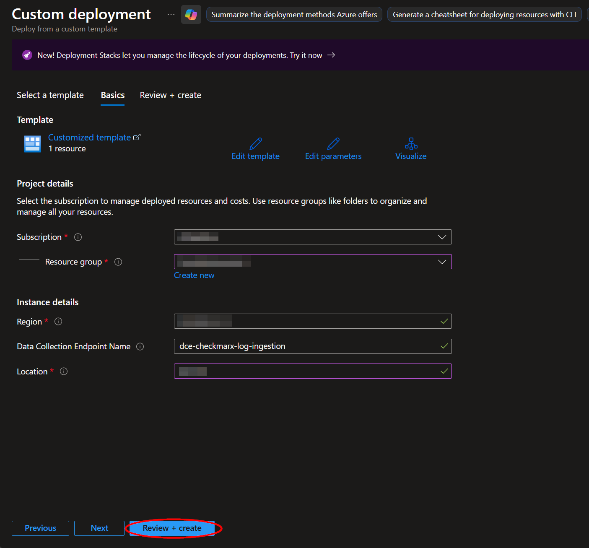

Once the resources have validated, click on "**Create**".

After deployment, navigate to the "**Outputs**" section and take note of the values listed, as these will be needed for subsequent deployment steps.

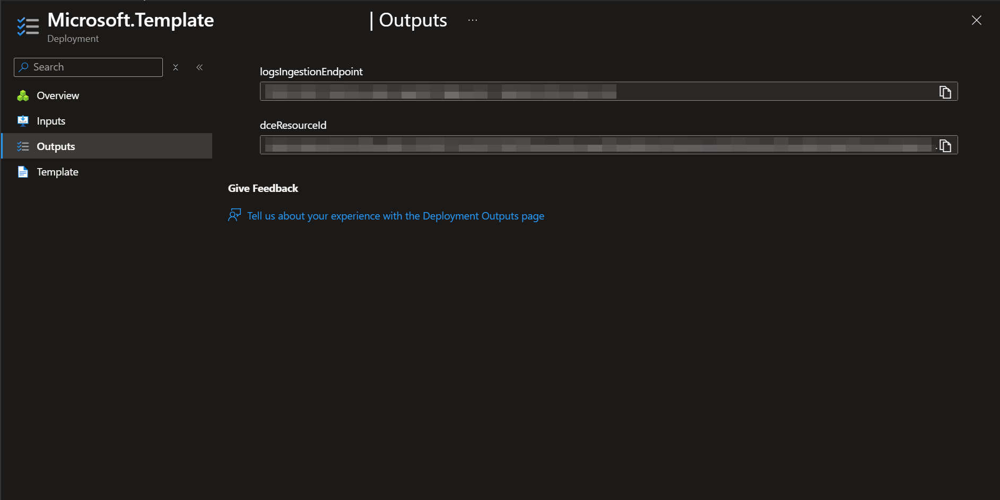

#### Deploy the Audit Logs Data Collection Rule (DCR)

The DCR defines the schema and destination for the ingested audit log data.

[](https://portal.azure.com/#create/Microsoft.Template/uri/https%3A%2F%2Fraw.githubusercontent.com%2FAzure%2FAzure-Sentinel%2Fmaster%2FPlaybooks%2FAS-Checkmarx-Audit-Ingestion%2FAzureDeployAuditDCR.json)
[](https://portal.azure.us/#create/Microsoft.Template/uri/https%3A%2F%2Fraw.githubusercontent.com%2FAzure%2FAzure-Sentinel%2Fmaster%2FPlaybooks%2FAS-Checkmarx-Audit-Ingestion%2FAzureDeployAuditDCR.json)

Click the "**Deploy to Azure**" button and it will bring you to the custom deployment template.

In the **Project details** section:

* Select the **Subscription** and **Resource group** from the dropdown boxes you would like the playbook deployed to.

In the **Instance details** section:

* **Data Collection Rule Name**: This can be left as "**dcr-checkmarx-audit-log-ingestion**" or you may change it.
* **Location**: Enter the location listed on your Log Analytics workspace.
* **Workspace Resource Id**: Enter the full resource ID of your Log Analytics workspace referenced in [Log Analytics Workspace](#log-analytics-workspace).
* **Data Collection Endpoint Resource Id**: Enter the full resource ID of the DCE created in the previous step.

Towards the bottom, click on "**Review + create**".

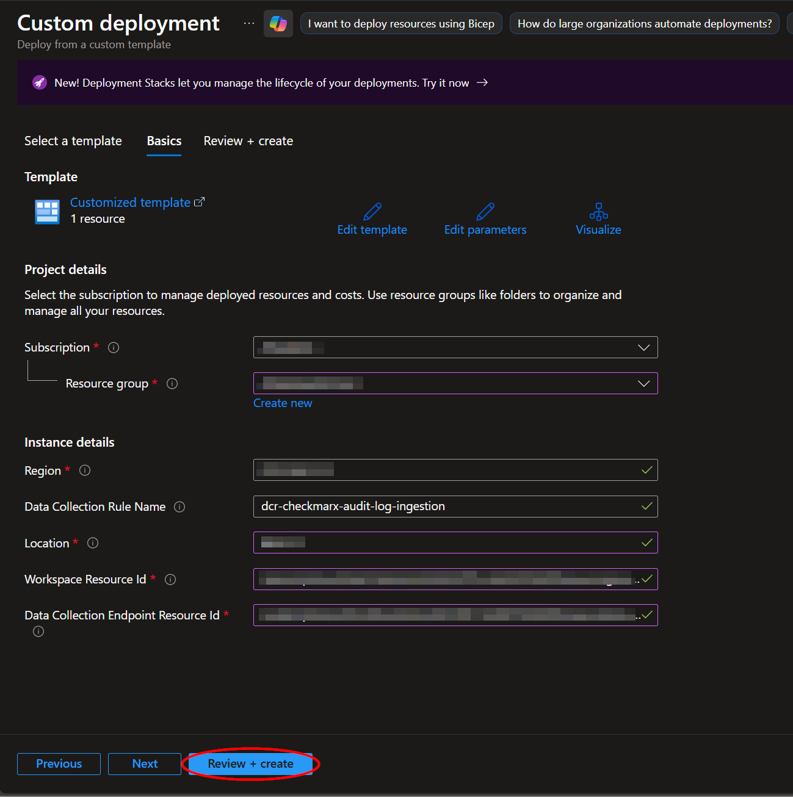

Once the resources have validated, click on "**Create**".

After deployment, navigate to the "**Outputs**" section and take note of the **dcrImmutableId** value, as this will be needed for the Logic App deployment.

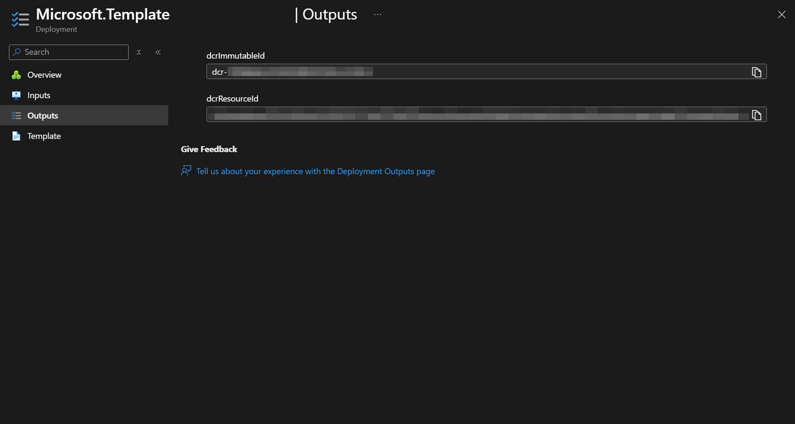

#### Deploy the Logic App Playbook

The Logic App performs the daily ingestion of Checkmarx audit log events.

[](https://portal.azure.com/#create/Microsoft.Template/uri/https%3A%2F%2Fraw.githubusercontent.com%2FAzure%2FAzure-Sentinel%2Fmaster%2FPlaybooks%2FAS-Checkmarx-Audit-Ingestion%2Fazuredeploy.json)
[](https://portal.azure.us/#create/Microsoft.Template/uri/https%3A%2F%2Fraw.githubusercontent.com%2FAzure%2FAzure-Sentinel%2Fmaster%2FPlaybooks%2FAS-Checkmarx-Audit-Ingestion%2Fazuredeploy.json)

Click the "**Deploy to Azure**" button and it will bring you to the custom deployment template.

In the **Project details** section:

* Select the **Subscription** and **Resource group** from the dropdown boxes you would like the playbook deployed to.

In the **Instance details** section:

* **Playbook Name**: This can be left as "**AS-Checkmarx-Audit-Ingestion**" or you may change it.
* **Key Vault Name**: Enter the name of the Key Vault referenced in [Create an Azure Key Vault Secret](#create-an-azure-key-vault-secret).
* **Key Vault Secret Name**: Enter the name of the Key Vault secret created in [Create an Azure Key Vault Secret](#create-an-azure-key-vault-secret).
* **Grant Type**: Enter the OAuth grant type for Checkmarx authentication. Use `client_credentials` (default) for client ID and secret, or `refresh_token` for refresh token authentication. See [Checkmarx API Permissions](#checkmarx-api-permissions) for details.
* **Checkmarx IAM Base Url**: Enter the IAM base URL for your Checkmarx region referenced in [Checkmarx API Permissions](#checkmarx-api-permissions).
* **Checkmarx AST Base Url**: Enter the AST base URL for your Checkmarx region referenced in [Checkmarx API Permissions](#checkmarx-api-permissions).
* **Checkmarx Tenant**: Enter your Checkmarx tenant/realm name (this appears in your Checkmarx URL and authentication settings).
* **Checkmarx Client Id**: Enter your Checkmarx OAuth Client ID (e.g., "**ast-app**").
* **DCE Logs Ingestion Endpoint**: Enter the Logs Ingestion Endpoint URL from the DCE created previously.
* **DCR Immutable Id**: Enter the Immutable ID from the Audit DCR created previously.

Towards the bottom, click on "**Review + create**".

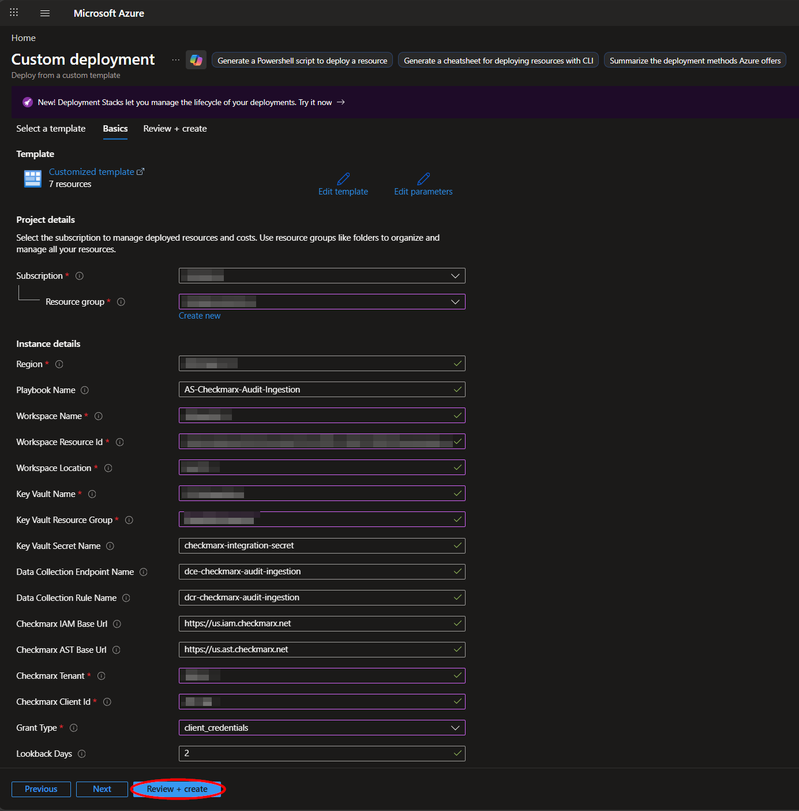

Once the resources have validated, click on "**Create**".

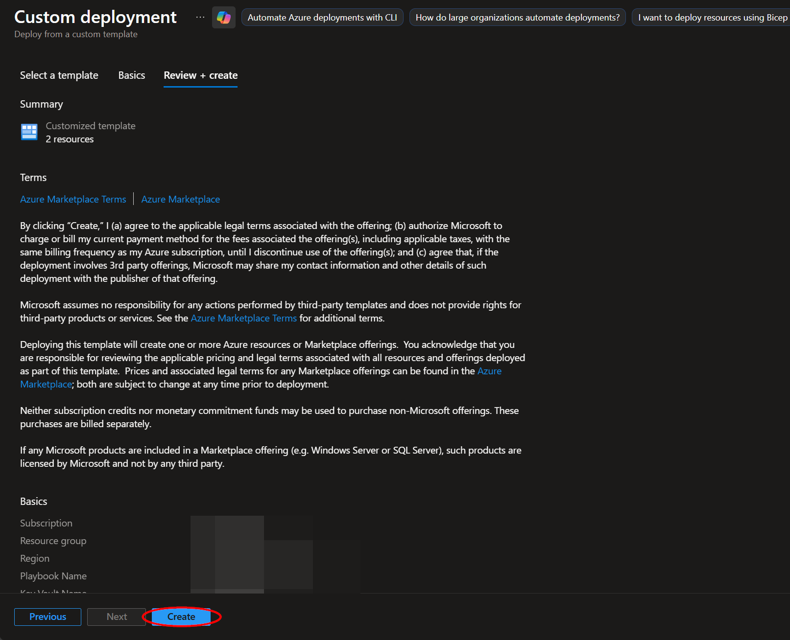

The resources should take around a minute to deploy. Once the deployment is complete, you can expand the "**Deployment details**" section to view them.
Click the one corresponding to the Logic App.

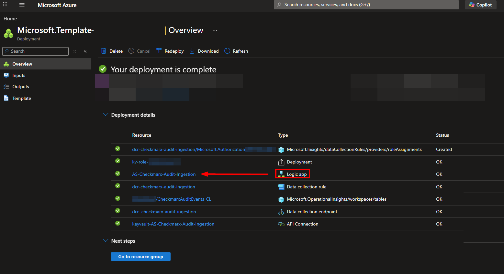

#

### Granting Access to Azure Key Vault

Before the Logic App can run successfully, the playbook must be granted access to the Key Vault storing your Checkmarx secret.

From the Key Vault page menu, click the "**Access configuration**" menu option under the "**Settings**" section.

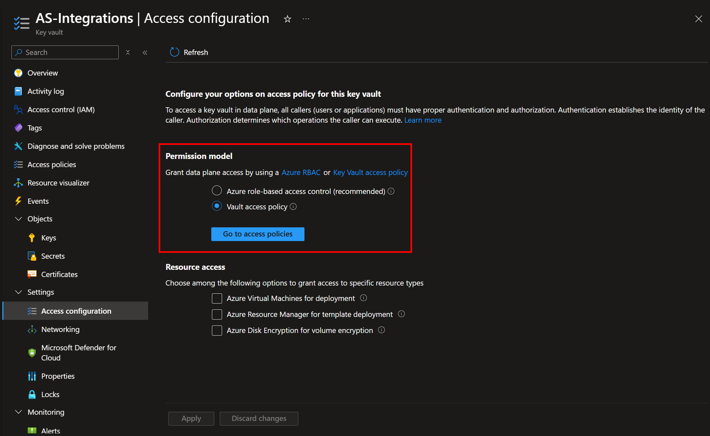

> [!NOTE]
> Azure Key Vault supports two permission models for granting data plane access: **Azure role-based access control (Azure RBAC)** and **Vault access policy**. Azure RBAC is the **recommended** authorization system, as indicated in the Azure portal. Vault access policy is considered **legacy** by Microsoft. Both methods are documented below; choose the option that matches your Key Vault's configuration.

#

#### Option 1: Azure Role-Based Access Control (Recommended)

From the Key Vault "**Access control (IAM)**" page, click "**Add role assignment**".

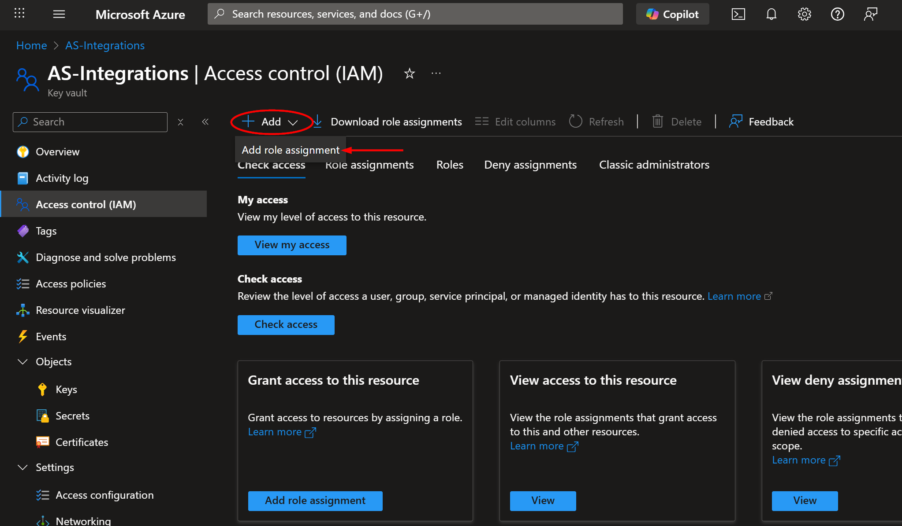

Select the "**Key Vault Secrets User**" role, then click "**Next**".

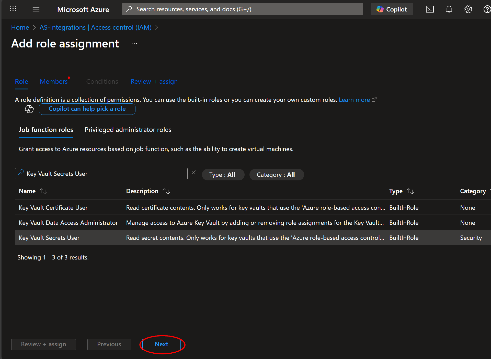

Select "**Managed identity**" and click "**Select members**". Search for "**AS-Checkmarx-Audit-Ingestion**" (or the playbook name you used) and click the option that appears. Click "**Select**", then "**Next**" towards the bottom of the page.

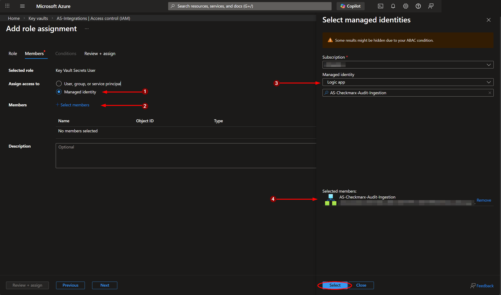

Navigate to the "**Review + assign**" section and click "**Review + assign**".

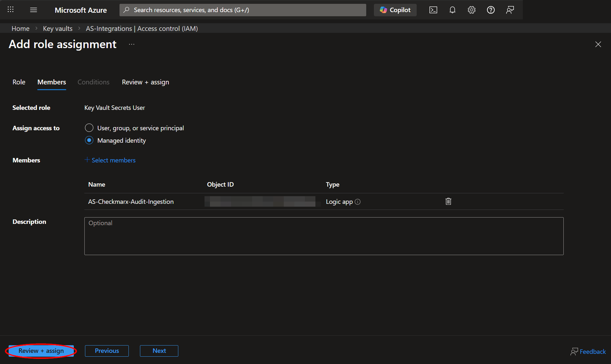

#

#### Option 2: Vault Access Policy (Legacy)

If your Key Vault is configured to use "**Vault access policy**", access must be granted through the "**Access policies**" page.

Navigate to the "**Access policies**" menu option, found under the "**Settings**" section on the Key Vault page menu.

Click "**Create**".

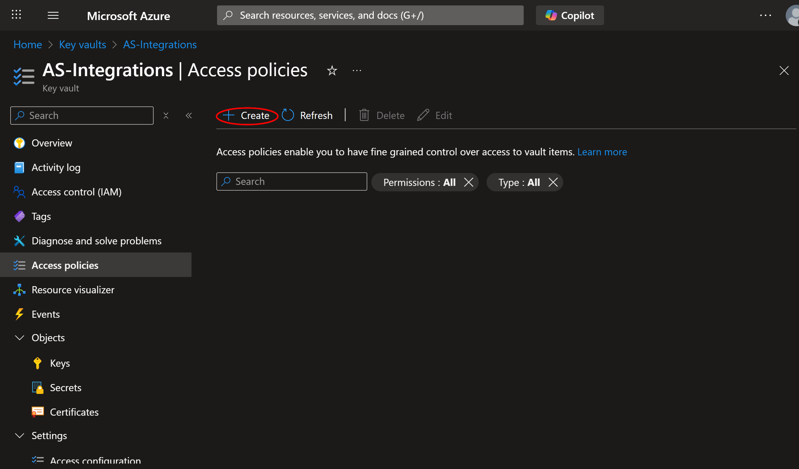

In the "**Permissions**" tab, select the "**Get**" checkbox under the "**Secret permissions**" section. Click "**Next**".

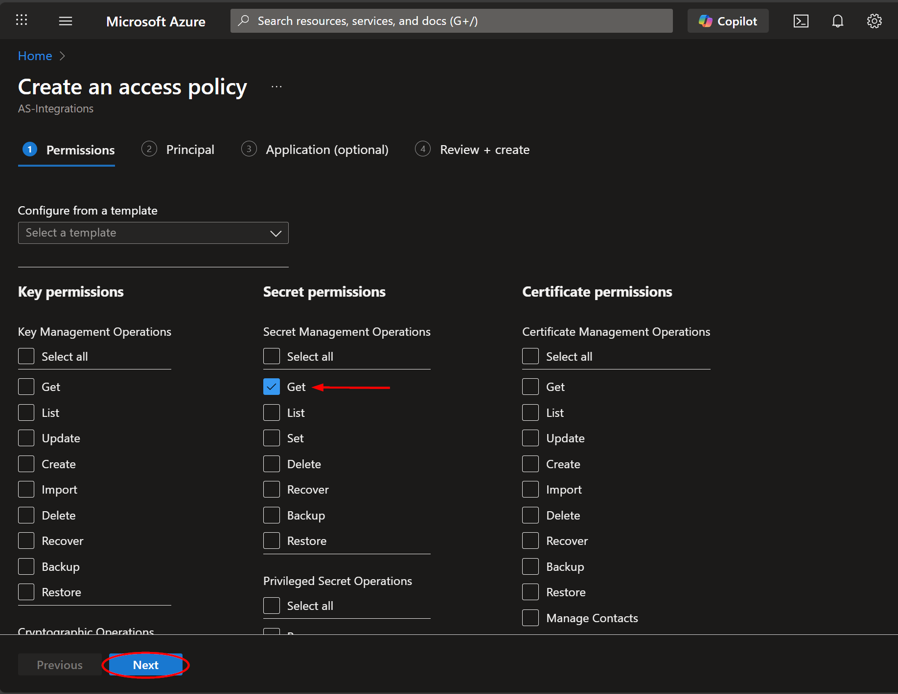

In the "**Principal**" tab, paste "**AS-Checkmarx-Audit-Ingestion**" (or the playbook name you used) into the search box and select the option that appears. Click "**Next**".

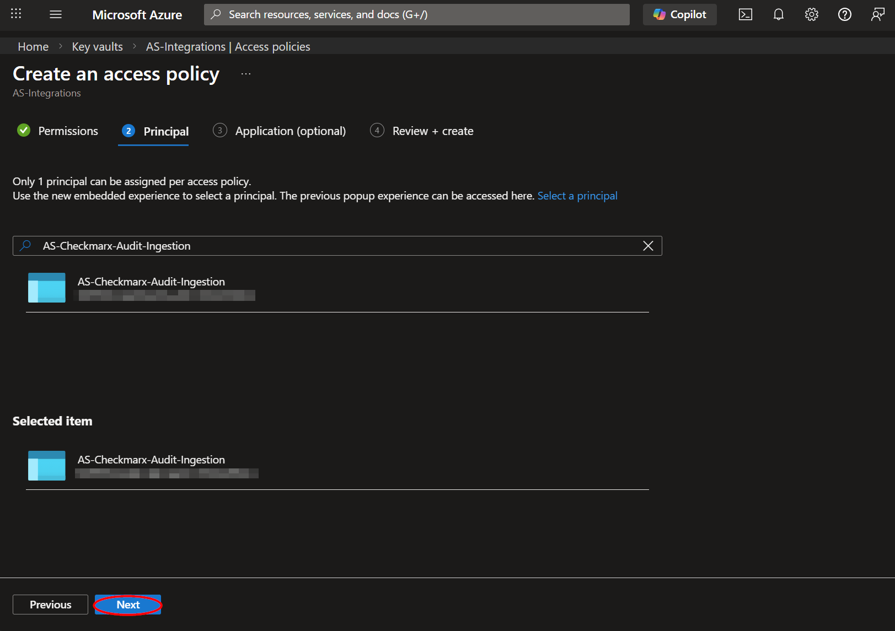

Navigate to the "**Review + create**" tab and click "**Create**".

#

### Granting Access to the Data Collection Rule

The playbook must be granted access to the Audit Data Collection Rule to publish metrics.

From the Audit DCR "**Access control (IAM)**" page, click "**Add role assignment**".

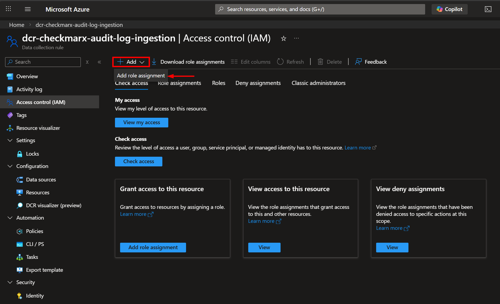

Select the "**Monitoring Metrics Publisher**" role, then click "**Next**".

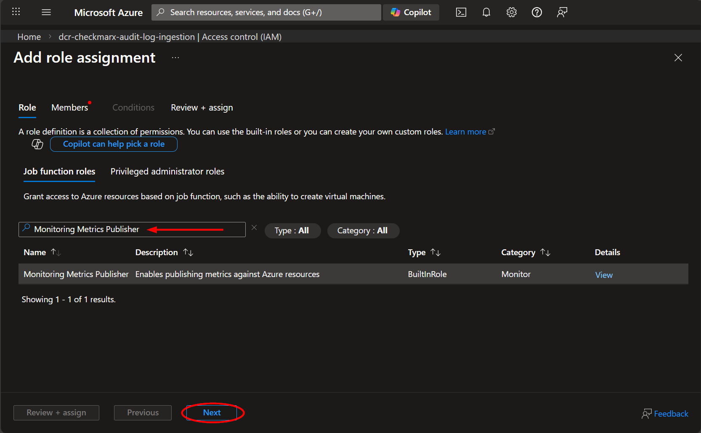

Select "**Managed identity**" and click "**Select members**". Search for "**AS-Checkmarx-Audit-Ingestion**" (or the playbook name you used) and click the option that appears. Click "**Select**", then "**Next**" towards the bottom of the page.

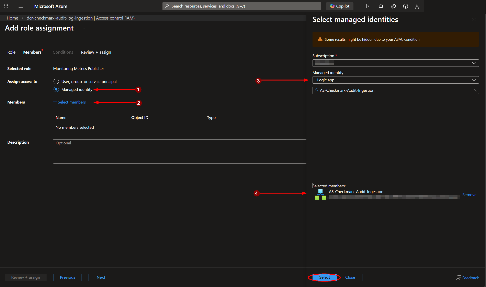

Navigate to the "**Review + assign**" section and click "**Review + assign**".

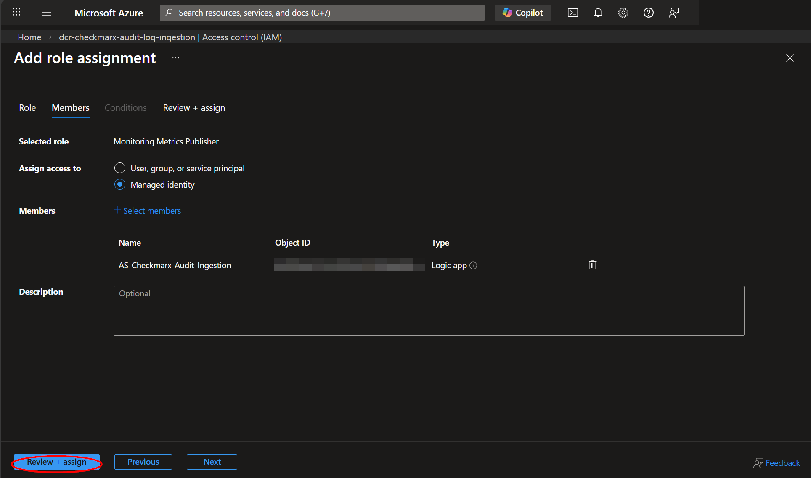

> [!IMPORTANT]
> The role assignment may take some time to propagate. If your Logic App is not running successfully immediately after the role assignment, please allow up to 10 minutes before retrying.

#

### Initial Run

This playbook runs once daily, collecting Checkmarx audit log events from the previous 24 hours and ingesting them into Microsoft Sentinel.

This playbook is deployed in a **Disabled** state. After completing all role assignments, navigate to the Logic App overview page and click "**Enable**" to activate the playbook. Then click "**Run**" > "**Run**" to execute the initial run.

Click on the run to view the execution details. Verify that all steps completed successfully, particularly the "**HTTP - Send Audit Events to DCR**" step.

#

### Viewing Custom Logs

After the initial run has been completed, navigate to the Log Analytics Workspace page: https://portal.azure.com/#view/HubsExtension/BrowseResource/resourceType/Microsoft.OperationalInsights%2Fworkspaces

From there, select the workspace your deployed logic app references and click "**Logs**" in the left-hand menu blade. Expand "**Custom Logs**". Here, you should see the **CheckmarxAuditEvents_CL** table.

> [!NOTE]
> It may take several minutes for the table to appear and data to be visible after the initial run. If the logs are not yet visible, try querying them periodically.


#### Sample KQL Queries

**View all audit logs:**
```kql
CheckmarxAuditEvents_CL
| project TimeGenerated, EventDate, EventType, ActionType, Username, IpAddress, Status
| order by TimeGenerated desc
```

**User login activity:**
```kql
CheckmarxAuditEvents_CL
| where ActionType == "login"
| project TimeGenerated, Username, IpAddress, Status
| order by TimeGenerated desc
```

**Failed login attempts:**
```kql
CheckmarxAuditEvents_CL
| where ActionType == "login" and Status != "OK"
| project TimeGenerated, Username, IpAddress, Status
| order by TimeGenerated desc
```

**Activity by user:**
```kql
CheckmarxAuditEvents_CL
| where TimeGenerated > ago(7d)
| summarize ActionCount = count() by Username, ActionType
| order by ActionCount desc
```

**Activity by IP address:**
```kql
CheckmarxAuditEvents_CL
| where TimeGenerated > ago(7d)
| summarize Count = count(), Users = make_set(Username) by IpAddress
| order by Count desc
```

**Audit events timeline:**
```kql
CheckmarxAuditEvents_CL
| where TimeGenerated > ago(7d)
| summarize Count = count() by bin(TimeGenerated, 1h), ActionType
| render timechart
```

**User activity summary:**
```kql
CheckmarxAuditEvents_CL
| where TimeGenerated > ago(7d)
| summarize
    EventCount = count(),
    UniqueActions = dcount(ActionType),
    UniqueIPs = dcount(IpAddress),
    LastSeen = max(EventDate)
    by Username
| order by EventCount desc
```

**Login activity by IP address:**
```kql
CheckmarxAuditEvents_CL
| where EventType has "login"
| summarize
    LoginCount = count(),
    UniqueUsers = dcount(Username),
    LastLogin = max(EventDate)
    by IpAddress
| order by LoginCount desc
```

#

### Data Schema

#### CheckmarxAuditEvents_CL Table

| Column | Type | Description |
| --- | --- | --- |
| TimeGenerated | datetime | Time the record was ingested |
| EventDate | datetime | Date and time of the audit event |
| EventType | string | Type of audit event (e.g., events.cxiam.user.account.login) |
| AuditResource | string | Resource being audited (e.g., user.account) |
| ActionType | string | Type of action performed (e.g., login) |
| ActionUserId | string | User ID who performed the action |
| IpAddress | string | IP address of the user |
| UserId | string | User ID from data payload |
| Status | string | Status of the action (e.g., OK) |
| Username | string | Username who performed the action |
| DataJson | string | Full JSON data payload |

#

### Role Assignments Summary

The following role assignments are required for the Logic App to function:

| Resource | Role | Purpose |
| --- | --- | --- |
| Azure Key Vault | **Key Vault Secrets User** | Allows the Logic App to retrieve the Checkmarx secret |
| Audit Data Collection Rule | **Monitoring Metrics Publisher** | Allows the Logic App to send audit data to the DCR ingestion endpoint |

#

### Troubleshooting

**Logic App fails at "Get_secret" step:**
* Verify the Key Vault name and secret name are correct.
* Ensure the Logic App managed identity has the "Key Vault Secrets User" role on the Key Vault (RBAC) or appropriate access policy (legacy).

**Logic App fails at "HTTP - Get Token" step:**
* Verify the Checkmarx IAM Base URL matches your Checkmarx region.
* Verify the Checkmarx Tenant name is correct.
* If using `client_credentials`, verify the client secret stored in Key Vault is valid.
* If using `refresh_token`, verify the refresh token stored in Key Vault is valid and not expired.
* Verify the Grant Type parameter matches the type of credential stored in Key Vault.
* Check that the Checkmarx IAM endpoint is accessible.

**Logic App fails at "HTTP - Get Audit Logs Page" step:**
* Verify the Checkmarx AST Base URL matches your Checkmarx region.
* Verify the access token was successfully obtained.
* Check that the Checkmarx API endpoint is accessible.
* Verify the API permissions for your Checkmarx client.

**Logic App fails at "HTTP - Send Audit Events to DCR" step with 403:**
* Ensure the Logic App managed identity has the "Monitoring Metrics Publisher" role on the Audit DCR.
* Wait up to 10 minutes for role assignment propagation.

**Logic App fails at DCR step with 404:**
* Verify the DCE Logs Ingestion Endpoint URL is correct.
* Verify the DCR Immutable ID is correct.

**No data appearing in Log Analytics:**
* Wait several minutes after the first successful run.
* Verify the custom table was created successfully.
* Verify there are audit events in your Checkmarx tenant.
* Check the Logic App run history for any errors.

**Condition step is skipped:**
* This is normal behavior if no audit events are available.
* Verify you have audit activity in Checkmarx.
