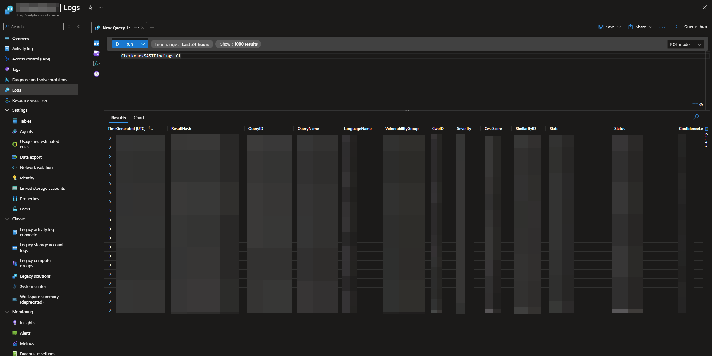
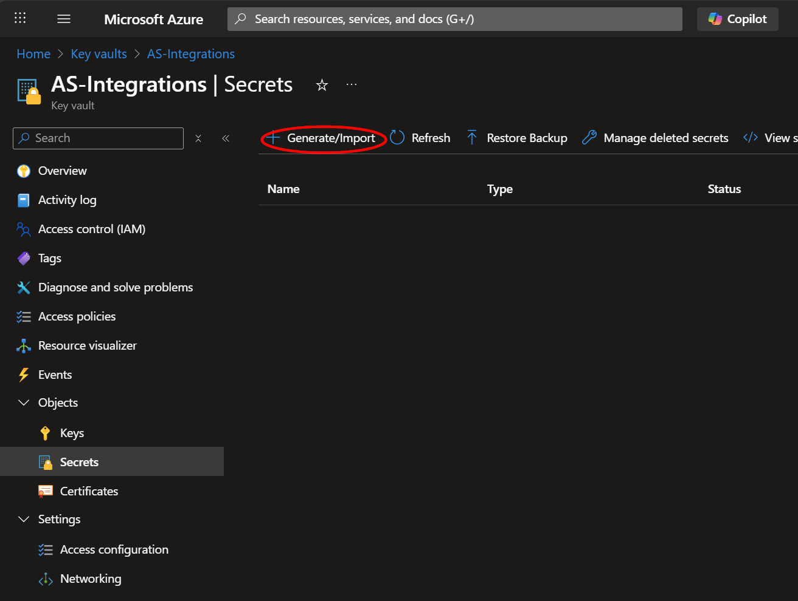
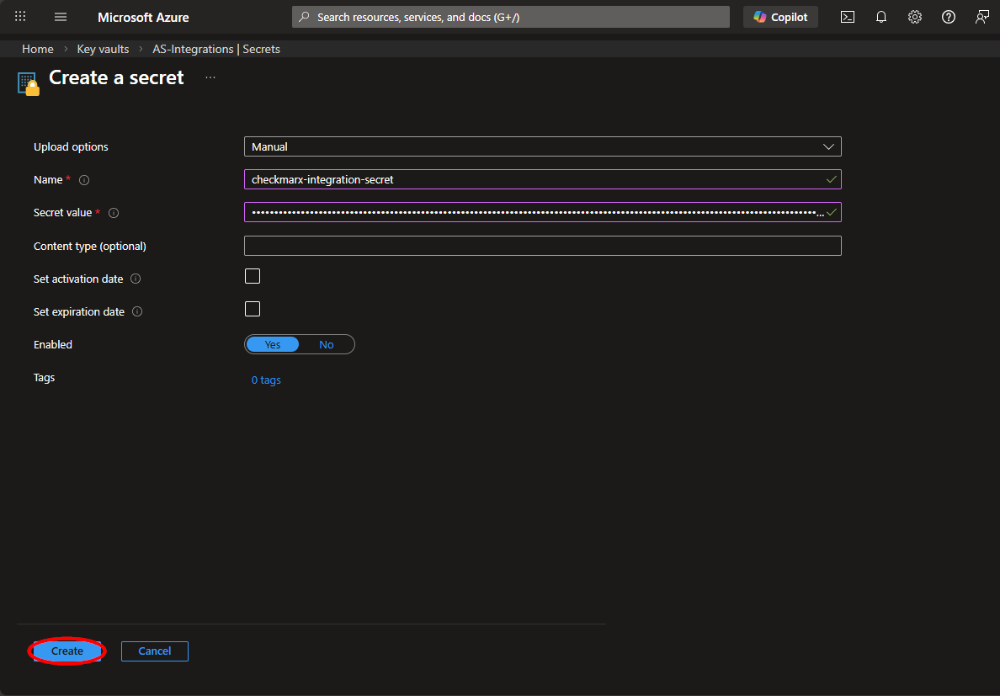
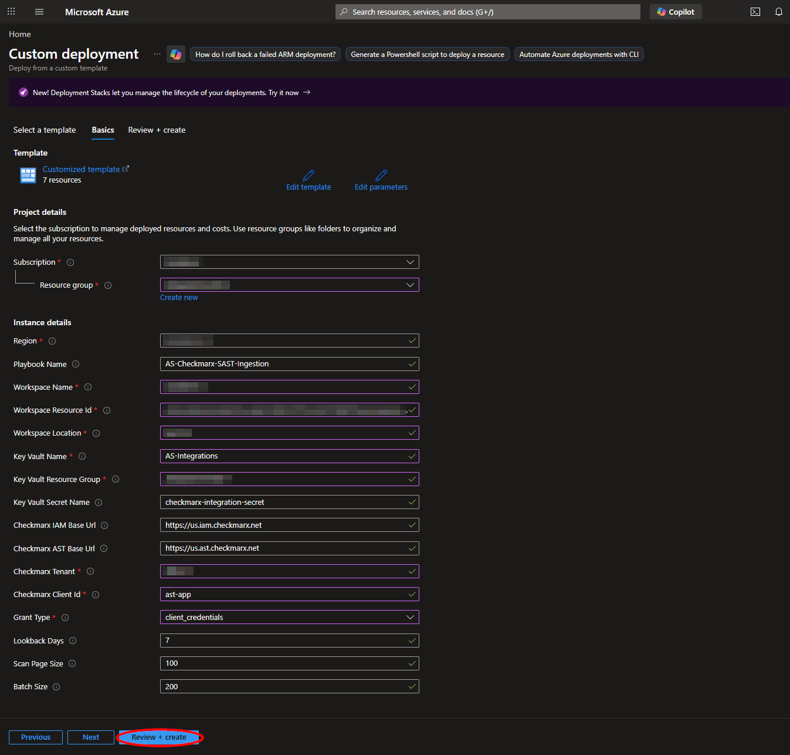
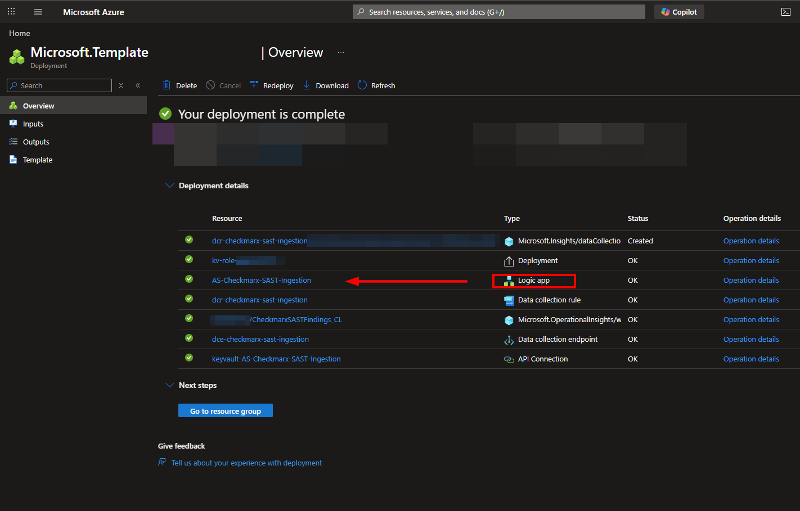
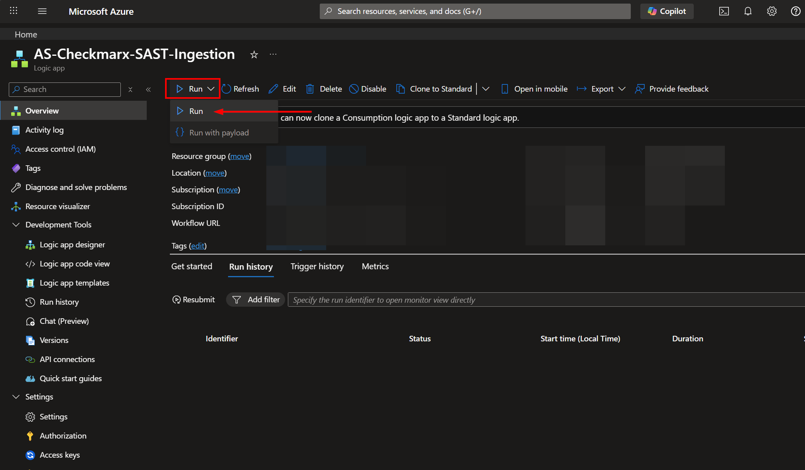
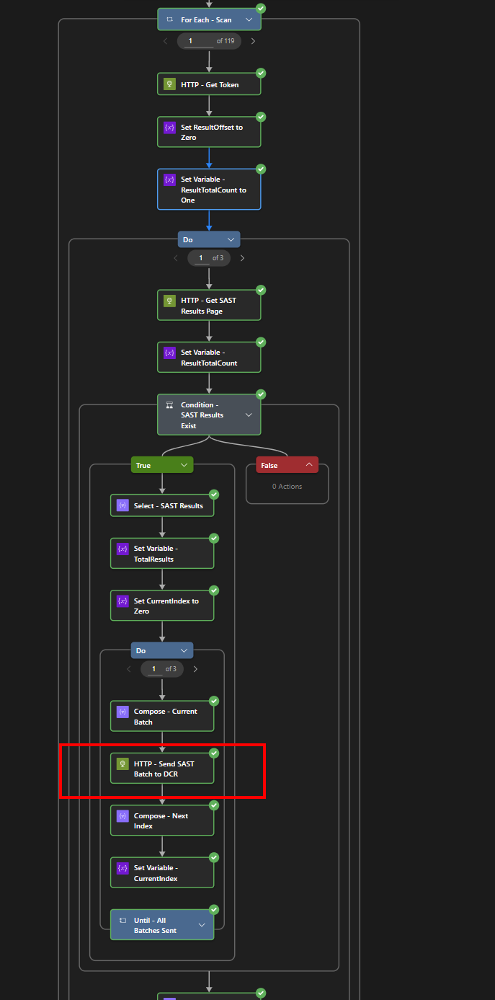

# AS-Checkmarx-SAST-Ingestion

Author: Accelerynt

For any technical questions, please contact [info@accelerynt.com](mailto:info@accelerynt.com)

This playbook will create a unidirectional integration with Microsoft Sentinel. It will pull Checkmarx SAST (Static Application Security Testing) scan findings into a Microsoft Sentinel custom log table where they can be tracked, queried, and correlated with other security data. This uses Data Collection Rules (DCR), Data Collection Endpoints (DCE), and custom log tables.



> [!NOTE]
> Estimated Time to Complete: 15 minutes

> [!TIP]
> Required deployment variables are noted throughout. Reviewing the deployment page and filling out fields as you proceed is recommended.

> [!NOTE]
> This playbook handles **SAST findings only**. For audit event ingestion, see the [AS-Checkmarx-Audit-Ingestion](https://github.com/Accelerynt-Security/AS-Checkmarx-Audit-Ingestion) playbook.

#

### Requirements

The following items are required under the template settings during deployment:

* **Checkmarx Client Secret or Refresh Token** - a client secret (recommended) or refresh token with permissions to query SAST results from your Checkmarx One instance. [Documentation link](#checkmarx-api-permissions)
* **Checkmarx IAM Base URL** - the base URL for Checkmarx IAM authentication based on your region (e.g., `https://us.iam.checkmarx.net`). [Documentation link](#checkmarx-api-permissions)
* **Checkmarx AST Base URL** - the base URL for Checkmarx AST API calls based on your region (e.g., `https://us.ast.checkmarx.net`). [Documentation link](#checkmarx-api-permissions)
* **Checkmarx Tenant** - your Checkmarx tenant/realm name used in the authentication URL. [Documentation link](#checkmarx-api-permissions)
* **Azure Key Vault Secret** - this will be used to store your Checkmarx client secret or refresh token. [Documentation link](#create-an-azure-key-vault-secret)
* **Log Analytics Workspace** - the name, location, and resource ID of the Log Analytics workspace that the Checkmarx data will be sent to. [Documentation link](#log-analytics-workspace)

#

### Checkmarx API Permissions

The Checkmarx API client requires the following permissions:

| Scope | Permission |
| --- | --- |
| ast-api | **Read** |

This playbook supports two OAuth grant types for authentication. Select the method that matches your Checkmarx One configuration:

#### Option A: Client Credentials (Recommended)

The `client_credentials` grant type is recommended for production deployments. It uses a client ID and client secret for authentication.

1. Navigate to your Checkmarx One tenant
2. Go to **IAM** > **OAuth Clients**
3. Create a new OAuth client or use an existing one with the required scopes
4. Copy the **Client ID** and **Client Secret** - the secret will be stored in Azure Key Vault
5. During deployment, set the **Grant Type** parameter to `client_credentials`

#### Option B: Refresh Token

The `refresh_token` grant type uses a refresh token obtained from an interactive login or API key flow.

1. Navigate to your Checkmarx One tenant
2. Go to **IAM** > **API Keys** or use the authentication endpoint
3. Create an API key or OAuth client with appropriate scopes
4. Generate a refresh token for the `ast-app` client
5. Copy the refresh token - this will be stored in Azure Key Vault
6. During deployment, set the **Grant Type** parameter to `refresh_token`

Select the base URLs for your region using the table below:

| Region | IAM Base URL | AST Base URL |
| --- | --- | --- |
| US | `https://us.iam.checkmarx.net` | `https://us.ast.checkmarx.net` |
| EU | `https://eu.iam.checkmarx.net` | `https://eu.ast.checkmarx.net` |
| DEU | `https://deu.iam.checkmarx.net` | `https://deu.ast.checkmarx.net` |
| ANZ | `https://anz.iam.checkmarx.net` | `https://anz.ast.checkmarx.net` |
| IND | `https://ind.iam.checkmarx.net` | `https://ind.ast.checkmarx.net` |

Note the URLs you selected, as they will be needed for the deployment step.

#

### Setup

#### Create an Azure Key Vault Secret

> [!NOTE]
> If you have already created the **checkmarx-integration-secret** secret, you may skip this step.

Navigate to the Azure Key Vaults page: https://portal.azure.com/#view/HubsExtension/BrowseResource/resourceType/Microsoft.KeyVault%2Fvaults

Navigate to an existing Key Vault or create a new one. From the Key Vault overview page, click the "**Secrets**" menu option, found under the "**Settings**" section. Click "**Generate/Import**".



Choose a name for the secret, such as "**checkmarx-integration-secret**", and enter your Checkmarx client secret or refresh token in the "**Value**" field. All other settings can be left as is. Click "**Create**".



> [!IMPORTANT]
> Your Key Vault must be configured with the **Azure role-based access control (RBAC)** permission model. The automated role assignment performed by this template requires the RBAC model; Vault Access Policies (legacy) are not supported by the automated deployment. To switch a Key Vault from Access Policies to RBAC, navigate to the "**Access configuration**" menu option under the "**Settings**" section and select "**Azure role-based access control**". Existing secrets, keys, and certificates are not affected by this change.

#### Log Analytics Workspace

Navigate to the Log Analytics Workspace page: https://portal.azure.com/#view/HubsExtension/BrowseResource/resourceType/Microsoft.OperationalInsights%2Fworkspaces

Select the workspace that the Checkmarx data will be sent to, and take note of the following values:


From the left menu blade, click **Overview** and take note of the **Name** and **Location** field values. These will be needed during deployment.


From the left menu blade, click **Overview** and take note of the **Resource ID** shown in the JSON View. This will also be needed during deployment.


#

### Deployment

This single deployment creates the custom log table, Data Collection Endpoint (DCE), Data Collection Rule (DCR), Key Vault API connection, Logic App, and all required role assignments.

[](https://portal.azure.com/#create/Microsoft.Template/uri/https%3A%2F%2Fraw.githubusercontent.com%2FAccelerynt-Security%2FAS-Checkmarx-SAST-Ingestion%2Fmain%2Fazuredeploy.json)
[](https://portal.azure.us/#create/Microsoft.Template/uri/https%3A%2F%2Fraw.githubusercontent.com%2FAccelerynt-Security%2FAS-Checkmarx-SAST-Ingestion%2Fmain%2Fazuredeploy.json)

Click the "**Deploy to Azure**" button and it will bring you to the custom deployment template.

In the **Project details** section:

* Select the **Subscription** and **Resource group** from the dropdown boxes you would like the playbook deployed to.

In the **Instance details** section:

* **Playbook Name**: This can be left as "**AS-Checkmarx-SAST-Ingestion**" or you may change it.
* **Workspace Name**: Enter the **Name** of your Log Analytics workspace referenced in [Log Analytics Workspace](#log-analytics-workspace).
* **Workspace Resource Id**: Enter the full **Resource ID** of your Log Analytics workspace.
* **Workspace Location**: Enter the **Location** of your Log Analytics workspace. Note that this may differ from the selected Resource group's region; the DCE and DCR will be deployed to the workspace's region.
* **Key Vault Name**: Enter the name of the Key Vault referenced in [Create an Azure Key Vault Secret](#create-an-azure-key-vault-secret).
* **Key Vault Resource Group**: Enter the resource group containing the Key Vault.
* **Key Vault Secret Name**: This can be left as "**checkmarx-integration-secret**" or changed to match the secret name you used.
* **Checkmarx IAM Base Url**: Enter the IAM base URL for your Checkmarx region referenced in [Checkmarx API Permissions](#checkmarx-api-permissions).
* **Checkmarx AST Base Url**: Enter the AST base URL for your Checkmarx region referenced in [Checkmarx API Permissions](#checkmarx-api-permissions).
* **Checkmarx Tenant**: Enter your Checkmarx tenant/realm name (this appears in your Checkmarx URL and authentication settings).
* **Checkmarx Client Id**: Enter your Checkmarx OAuth Client ID (e.g., "**ast-app**").
* **Grant Type**: Select the OAuth grant type for Checkmarx authentication. Use `client_credentials` for client ID and secret, or `refresh_token` for refresh token authentication. See [Checkmarx API Permissions](#checkmarx-api-permissions) for details.
* **Lookback Days**: Number of days prior to each run to pull completed Checkmarx scans from. Default is **7**. For the initial backfill, set this higher (e.g., **180**) to ingest historical scans, then reduce to **7** for steady-state daily operation. This can be changed later from the Logic App designer without redeploying.
* **Scan Page Size**: Page size for the Checkmarx `/api/scans` pagination loop. Default is **100**.
* **Batch Size**: Number of SAST results to send per request to the DCR ingestion endpoint. The DCR API enforces a 1 MB maximum payload size; this parameter controls how results are chunked to stay under that limit. A value of **200** is recommended for most environments.

Towards the bottom, click on "**Review + create**".



Once the resources have validated, click on "**Create**".


The resources should take around two minutes to deploy. Once the deployment is complete, you can expand the "**Deployment details**" section to view them.



#

### Role Assignments

The following role assignments are created automatically by this deployment:

| Resource | Role | Purpose |
| --- | --- | --- |
| Azure Key Vault | **Key Vault Secrets User** | Allows the Logic App to retrieve the Checkmarx secret |
| SAST Data Collection Rule | **Monitoring Metrics Publisher** | Allows the Logic App to send SAST data to the DCR ingestion endpoint |

> [!IMPORTANT]
> The role assignments may take some time to propagate. If your Logic App is not running successfully immediately after deployment, please allow up to 10 minutes before retrying.

> [!NOTE]
> The user performing the deployment must hold the **Owner** or **User Access Administrator** role on the resource group, Key Vault, and workspace being targeted. Most customers deploying Sentinel playbooks already have this level of access.

#

### Initial Run

This playbook runs once daily, collecting completed Checkmarx SAST scan findings from the configured lookback window and ingesting them into Microsoft Sentinel.

This playbook is deployed in a **Disabled** state. After waiting for role assignments to propagate, navigate to the Logic App overview page and click "**Enable**" to activate the playbook. Then click "**Run**" > "**Run**" to execute the initial run.



Click on the run to view the execution details. Verify that all steps completed successfully, particularly the "**HTTP - Send SAST Batch to DCR**" step inside the `For_Each_Scan` loop.



> [!TIP]
> For the initial backfill, set **Lookback Days** higher during deployment to ingest historical scans, run the playbook once, then reduce it back to a smaller window via the Logic App designer's Parameters pane. This avoids redeploying the template.

#

### Viewing Custom Logs

After the initial run has been completed, navigate to the Log Analytics Workspace page: https://portal.azure.com/#view/HubsExtension/BrowseResource/resourceType/Microsoft.OperationalInsights%2Fworkspaces

From there, select the workspace your deployed logic app references and click "**Logs**" in the left-hand menu blade. Expand "**Custom Logs**". Here, you should see the **CheckmarxSASTFindings_CL** table.

> [!NOTE]
> It may take several minutes for the table to appear and data to be visible after the initial run. If the logs are not yet visible, try querying them periodically.


#### Sample KQL Queries

**View all SAST findings:**
```kql
CheckmarxSASTFindings_CL
| project TimeGenerated, ProjectName, QueryName, Severity, LanguageName, SourceFileName, SourceLine, State, Status
| order by TimeGenerated desc
```

**High severity findings by project:**
```kql
CheckmarxSASTFindings_CL
| where Severity == "HIGH"
| project TimeGenerated, ProjectName, QueryName, LanguageName, SourceFileName, SourceLine, CvssScore, State
| order by CvssScore desc
```

**Findings grouped by project and severity:**
```kql
CheckmarxSASTFindings_CL
| where TimeGenerated > ago(7d)
| summarize Count = count() by ProjectName, Severity
| order by ProjectName asc, Count desc
```

**Findings grouped by scan initiator:**
```kql
CheckmarxSASTFindings_CL
| where TimeGenerated > ago(7d)
| summarize
    FindingCount = count(),
    ProjectsScanned = dcount(ProjectName),
    HighSeverity = countif(Severity == "HIGH")
    by Initiator
| order by FindingCount desc
```

**Findings by severity:**
```kql
CheckmarxSASTFindings_CL
| where TimeGenerated > ago(7d)
| summarize Count = count() by Severity
| order by Count desc
```

**Findings by language:**
```kql
CheckmarxSASTFindings_CL
| where TimeGenerated > ago(7d)
| summarize Count = count() by LanguageName
| order by Count desc
```

**Top vulnerability types:**
```kql
CheckmarxSASTFindings_CL
| where TimeGenerated > ago(7d)
| summarize Count = count() by QueryName, Severity
| order by Count desc
```

**New vs. recurrent findings:**
```kql
CheckmarxSASTFindings_CL
| where TimeGenerated > ago(7d)
| summarize Count = count() by Status
| order by Count desc
```

**Findings by source file:**
```kql
CheckmarxSASTFindings_CL
| where TimeGenerated > ago(7d)
| summarize
    FindingCount = count(),
    HighSeverity = countif(Severity == "HIGH"),
    MediumSeverity = countif(Severity == "MEDIUM")
    by SourceFileName
| order by FindingCount desc
```

**CVSS score distribution:**
```kql
CheckmarxSASTFindings_CL
| where TimeGenerated > ago(7d) and isnotnull(CvssScore)
| summarize Count = count() by bin(CvssScore, 1.0)
| order by CvssScore desc
```

#

### Data Schema

#### CheckmarxSASTFindings_CL Table

| Column | Type | Description |
| --- | --- | --- |
| TimeGenerated | datetime | Time the record was ingested |
| ResultHash | string | Unique hash for the result |
| QueryID | string | ID of the query that found the vulnerability |
| QueryName | string | Name of the vulnerability query |
| LanguageName | string | Programming language |
| VulnerabilityGroup | string | Category/group of the vulnerability |
| CweID | int | Common Weakness Enumeration ID |
| Severity | string | Severity level (HIGH, MEDIUM, LOW, INFO) |
| CvssScore | real | CVSS vulnerability score |
| SimilarityID | int | ID for similar vulnerabilities |
| State | string | Current state (TO_VERIFY, CONFIRMED, etc.) |
| Status | string | Status (NEW, RECURRENT, FIXED) |
| ConfidenceLevel | int | Confidence level of the finding |
| FirstFoundAt | datetime | When the vulnerability was first found |
| FoundAt | datetime | When the vulnerability was found in this scan |
| FirstScanID | string | ID of the first scan that found this vulnerability |
| Compliances | string | Comma-separated list of compliance frameworks |
| SourceFileName | string | Source file containing the vulnerability |
| SourceLine | int | Line number in the source file |
| SourceColumn | int | Column number in the source file |
| NodeCount | int | Number of nodes in the vulnerability path |
| NodesJson | string | JSON representation of the data flow nodes |
| ScanID | string | ID of the scan |
| ProjectName | string | Name of the Checkmarx project, sourced from the top-level scan payload |
| Initiator | string | User or system that initiated the scan, sourced from the top-level scan payload |

#

### Troubleshooting

**Deployment fails at the Key Vault role assignment:**
* Verify **Key Vault Resource Group** is correct.
* Verify the Key Vault is configured for **Azure RBAC** (not Vault Access Policies). If it's on the legacy access policy model, switch to RBAC from the Key Vault's "Access configuration" blade and redeploy.
* The deploying principal needs `Microsoft.Authorization/roleAssignments/write` on the Key Vault (e.g., Owner or User Access Administrator).

**Logic App fails at "Get_secret" step:**
* Verify the Key Vault name and secret name are correct.
* Role assignment may still be propagating — wait up to 10 minutes after deployment before retrying.

**Logic App fails at "HTTP - Get Token" step:**
* Verify the Checkmarx IAM Base URL matches your Checkmarx region.
* Verify the Checkmarx Tenant name is correct.
* If using `client_credentials`, verify the client secret stored in Key Vault is valid.
* If using `refresh_token`, verify the refresh token stored in Key Vault is valid and not expired.
* Verify the Grant Type parameter matches the type of credential stored in Key Vault.
* Check that the Checkmarx IAM endpoint is accessible.

**Logic App fails at "HTTP - Get Scans Page" step:**
* Verify the Checkmarx AST Base URL matches your Checkmarx region.
* Verify the access token was successfully obtained.
* Check that the Checkmarx API endpoint is accessible.
* Verify the API permissions for your Checkmarx client.
* Ensure there are completed scans within the configured lookback window.

**Logic App fails at "HTTP - Get SAST Results Page" step:**
* Verify the scan ID was successfully retrieved from the previous step.
* Check that the SAST results endpoint is accessible.

**Logic App fails at "HTTP - Send SAST Batch to DCR" step with "ContentLengthLimitExceeded":**
* The DCR ingestion API enforces a 1 MB maximum payload size per request. This error indicates the batch size is too large for the SAST results being sent. Reduce the **Batch Size** parameter (default: 200) via the Logic App designer's Parameters pane, or redeploy the template with a smaller value.

**Logic App fails at "HTTP - Send SAST Batch to DCR" step with 403:**
* Wait up to 10 minutes for the Monitoring Metrics Publisher role assignment to propagate.

**Logic App fails at DCR step with 404:**
* The DCE endpoint URL and DCR immutable ID are resolved at deploy time from the resources created by this template, so 404s should not occur unless the DCE or DCR was deleted out-of-band. Redeploy the template to restore them.

**No data appearing in Log Analytics:**
* Wait several minutes after the first successful run — ingestion is asynchronous.
* Verify the **CheckmarxSASTFindings_CL** table exists under **Custom Logs** in the workspace.
* Verify there are completed SAST scans in your Checkmarx tenant within the configured lookback window.
* Check the Logic App run history for any errors.

**Condition step is skipped for a scan:**
* This is normal behavior if the scan had no SAST findings. The condition guards against ingesting empty result sets.

**All `ProjectName` or `Initiator` values are empty in the logs:**
* These fields come from the top-level `/api/scans` response. If the response is missing them, confirm your Checkmarx tenant/API version includes these fields by running the `HTTP - Get Scans Page` step in the designer and inspecting the raw response body.