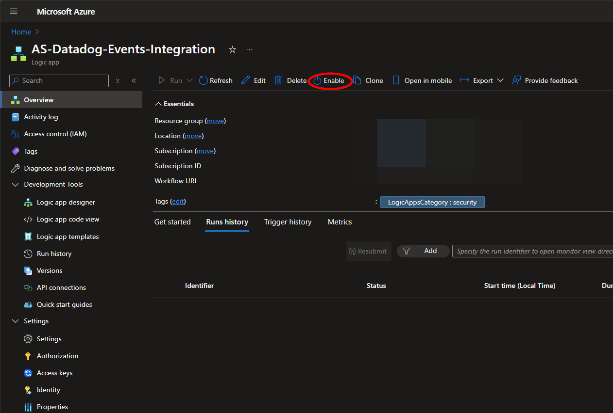
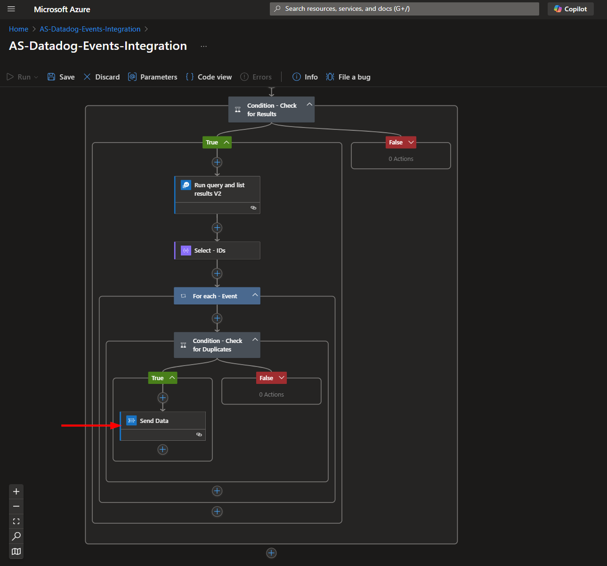

# AS-Datadog-Events-Integration

Author: Accelerynt

For any technical questions, please contact info@accelerynt.com    

This playbook will create a unidirectional integration with Microsoft Sentinel. It will pull Datadog events into Microsoft Sentinel custom logs where they can be tracked and queried.

> [!NOTE]  
> Estimated Time to Complete: 1 hour

> [!TIP]
> Required deployment variables are noted throughout. Reviewing the deployment page and filling out fields as you proceed is recommended.

#
### Requirements
                                                                                                                                     
The following items are required under the template settings during deployment: 

* **Datadog App and OAuth Client** - A Datadog app and OAuth client will be required to access your Datadog data from Microsoft, please reference the Datadog documentation for set up. [Documentation link](https://docs.datadoghq.com/developers/integrations/oauth_for_integration)
* **Datadog Application Key** - [Documentation link](https://docs.datadoghq.com/developers/integrations/oauth_for_integration)
* **Datadog API Key** - [Documentation link](https://docs.datadoghq.com/developers/integrations/oauth_for_integrations/#create-an-api-key)
* **Datadog Domain** - [Documentation link](https://docs.datadoghq.com/developers/integrations/oauth_for_integrations/#cross-regional-support)
* **Azure Key Vault Secret** - This will be used to store both your Datadog API Key and App Key. [Documentation link](https://github.com/Azure/Azure-Sentinel/tree/master/Playbooks/AS-Datadog-Events-Integration#create-azure-key-vault-secrets).
* **Sentinel Resource Name** - the name of the Log Analytics Workspace that the Datadog logs will be sent to. [Documentation link](https://github.com/Azure/Azure-Sentinel/tree/master/Playbooks/AS-Datadog-Events-Integration#Log-Analytics-Workspace).
* **Sentinel Logs Workspace ID & Key** - the workspace ID and primary key of the Log Analytics Workspace that the Datadog logs will be sent to. [Documentation link](https://github.com/Azure/Azure-Sentinel/tree/master/Playbooks/AS-Datadog-Events-Integration#Log-Analytics-Workspace).

> [!IMPORTANT]  
> Preexisting and recent events will need to be present in Datadog in order to properly initialize the integration to Microsoft Sentinel

# 
### Setup

#### Create Azure Key Vault Secrets

After setting up your Datadog App and OAuth Client, navigate to the Azure Key Vaults page: https://portal.azure.com/#view/HubsExtension/BrowseResource/resourceType/Microsoft.KeyVault%2Fvaults.

Navigate to an existing Key Vault or create a new one. From the Key Vault overview page, click the "**Secrets**" menu option, found under the "**Settings**" section. Click "**Generate/Import**".

Choose a name for the secret that will store the API Key, such as "**AS-Datadog-Events-Integration-API-Key**", and enter the Datadog API Key copied previously in the [previous section](https://github.com/Azure/Azure-Sentinel/tree/master/Playbooks/AS-Datadog-Events-Integration#Create-a-Datadog-Application). All other settings can be left as is. Click "**Create**". 

Repeat this process for the Application Key, using a name such as "**AS-Datadog-Events-Integration-Application-Key**", and enter the Datadog Application Key copied previously in the [previous section](https://github.com/Azure/Azure-Sentinel/tree/master/Playbooks/AS-Datadog-Events-Integration#Create-a-Datadog-Application). All other settings can be left as is. Click "**Create**". 

Once the secrets have been added to the vault, navigate to the "**Access policies**" menu option, also found under the "**Settings**" section on the Key Vault page menu. Leave this page open, as you will need to return to it once the playbook has been deployed. See [Granting Access to Azure Key Vault](https://github.com/Azure/Azure-Sentinel/tree/master/Playbooks/AS-Datadog-Events-Integration#granting-access-to-azure-key-vault).

#### Log Analytics Workspace

Navigate to the Log Analytics Workspace page: https://portal.azure.com/#view/HubsExtension/BrowseResource/resourceType/Microsoft.OperationalInsights%2Fworkspaces.

Select the workspace that the Datadog logs will be sent to, and take note of the name, as this will be needed for the deployment step.

From the left menu blade, click **Agents** and expand the **Log Analytics agent instructions** section. Take note of both the workspace ID and primary key for a post deployment step.

#
### Deployment

To configure and deploy this playbook:

Open your browser and ensure you are logged into your Microsoft Sentinel workspace. In a separate tab, open the link to our playbook on the Accelerynt Security GitHub Repository:

https://github.com/Accelerynt-Security/AS-Datadog-Events-Integration

Click the “**Deploy to Azure**” button at the bottom and it will bring you to the custom deployment template.

In the **Project details** section:

* Select the **Subscription** and **Resource group** from the dropdown boxes you would like the playbook deployed to.  
In the **Instance details** section:  
                                                  
* **Playbook Name**: This can be left as "**AS-Datadog-Events-Integration**" or you may change it.

* **Datadog Domain**: Enter the domain of the Datadog base URL, following the format of 'api.datadog.com' referenced in the [Datadog documentation](https://docs.datadoghq.com/developers/integrations/oauth_for_integrations/#cross-regional-support).

* **Key Vault Name**: Enter the name of the key vault referenced in [Create Azure Key Vault Secrets](https://github.com/Azure/Azure-Sentinel/tree/master/Playbooks/AS-Datadog-Events-Integration#create-azure-key-vault-secrets).

* **API Key Secret Name**: Enter the name of the API key vault Secret created in [Create Azure Key Vault Secrets](https://github.com/Azure/Azure-Sentinel/tree/master/Playbooks/AS-Datadog-Events-Integration#create-azure-key-vault-secrets).

* **Application Key Secret Name**: Enter the name of the Application key vault Secret created in [Create Azure Key Vault Secrets](https://github.com/Azure/Azure-Sentinel/tree/master/Playbooks/AS-Datadog-Events-Integration#create-azure-key-vault-secrets).

* **Sentinel Resource Name**: Enter the name of the Microsoft Sentinel Resource you will be sending the logs to referenced in [Log Analytics Workspace](https://github.com/Azure/Azure-Sentinel/tree/master/Playbooks/AS-Datadog-Events-Integration#Log-Analytics-Workspace).

Towards the bottom, click on "**Review + create**". 

Once the resources have validated, click on "**Create**".

The resources should take around a minute to deploy. Once the deployment is complete, you can expand the "**Deployment details**" section to view them.
Click the one corresponding to the Logic App.

This Logic app is intentionally deployed as disabled. Complete the following steps before enabling.

#
### Granting Access to Azure Key Vault

Before the logic app should be enabled, the playbook must be granted access to the Key Vault storing your Datadog API token.

From the Key Vault "**Access policies**" page, click "**Create**".

Select the "**Get**" checkbox under "**Secret permissions**", then click "**Next**".

Paste "**AS-Datadog-Events-Integration**" into the principal search box and click the option that appears. Click "**Next**" towards the bottom of the page.

Navigate to the "**Review + create**" section and click "**Create**".

#
### Authorizing Playbook Connections

Before the logic app should be enabled, the **azureloganalyticsdatacollector** and **azuremonitorlogs** API connections will need to be edited and authorized.

From the playbook overview page, navigate to **API connections** from the left menu blade.

Click the **azureloganalyticsdatacollector** connection and click **Edit API connection**. Enter in your Workspace ID and key, then click **Save**.

Next, navigate back to the **API connections** page and click the **azuremonitorlogs** connection. Click **Edit API connection**, click **Authorize**, and then click **Save**.

#
### Initial Run and Playbook configuration

This playbook runs every 5 minutes, collecting Datadog events from the past 10 minutes to prevent data loss between executions. 
To avoid duplicate entries, the playbook checks incoming data against existing Sentinel logs. 
However, this check depends on a table that does not exist until the initial run creates it. 
To ensure successful table creation, the first run bypasses duplicate checking logic. 
After this run, the playbook must be **disabled**, necessary **"Run After" conditions updated**, and table population **verified**. 
Once confirmed, the playbook can be re-enabled to run normally.

To execute the initial run, **enable** the logic app. The trigger will run automatically.

Click on the run and check for a successful **Send data** operation in the **For each - Event** step. The run does not need to succeed for this step to be completed. Once you see this, **disable the logic app**. 

> [!NOTE]  
> If no data was returned for the 10 minute lookback window, allow the playbook to run until this condition is met. To expedite this, you can increase the lookback window by navigating to the **Logic app designer** adjusting the **addMinutes** function in the **Initialize variable - Unix Start Time** step. The larger the negative number, the further the lookback. Be sure click **Update** if you change the formula, followed by **Save**.

Once the Logic App has been disabled, navigate to the **Logic app designer** page and expand the last step labeled **Condition - Check for Results**.

There are two steps that have a **Run after: has failed** checkbox that needs to be unchecked. 

Expand the step **Select - IDs** and under settings, uncheck the **has failed** checkbox.

Repeat this step for the **For each - Event** step.

Lastly, the **Send Data** step needs to be dragged into the **True** fork of the **Condition - Check for Duplicates** step.

Click **Save**.

The [last section](https://github.com/Azure/Azure-Sentinel/tree/master/Playbooks/AS-Datadog-Events-Integration#viewing-custom-logs) outlines how to view the custom logs to ensure they have been properly populated. After confirming the table has been created, go ahead and enable the Logic App.

#
### Viewing Custom Logs

After the initial run has been completed, navigate to the Log Analytics Workspace page: https://portal.azure.com/#view/HubsExtension/BrowseResource/resourceType/Microsoft.OperationalInsights%2Fworkspaces
From there, select the workspace your deployed logic apps reference and click "**Logs**" in the left-hand menu blade. Expand "**Custom Logs**". Here, you should see a table called **Datadog_Events_CL**.
Note that it may take a while for this table to appear after it is created by the playbook, so if the logs are not yet visible, try querying them periodically.

