# AS-Delete-App-Registration

Author: Accelerynt

For any technical questions, please contact info@accelerynt.com  

       

This playbook is intended to be run from a Microsoft Sentinel incident. If any app registration entities are found (i.e. any entities where kind == CloudApplication), they will be deleted. This playbook matches by name, since a unique app registration ID cannot currently be pulled into the entity list, so if there are multiple app registrations exactly matching the name(s) of the CloudApplication entities, all will be deleted. The deleted app registration(s) will be noted in incident comment(s).

> **Warning**
> If there are multiple app registrations exactly matching the name(s) of the CloudApplication entities in the Microsoft incident used to run this playbook, all of those app registrations will be deleted

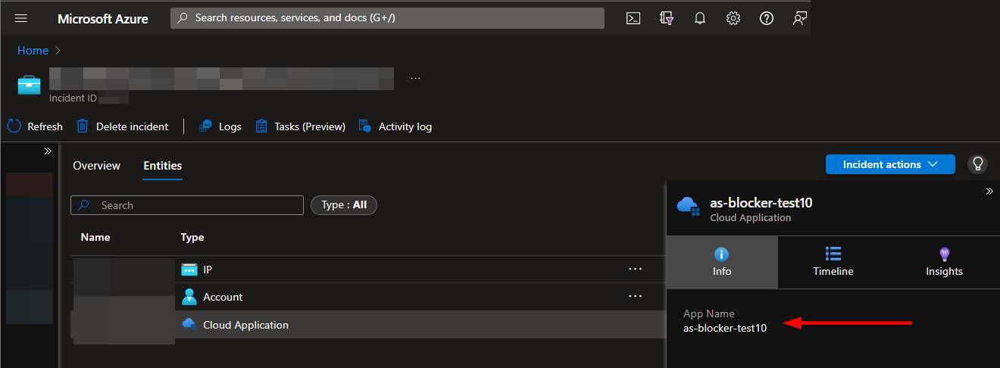

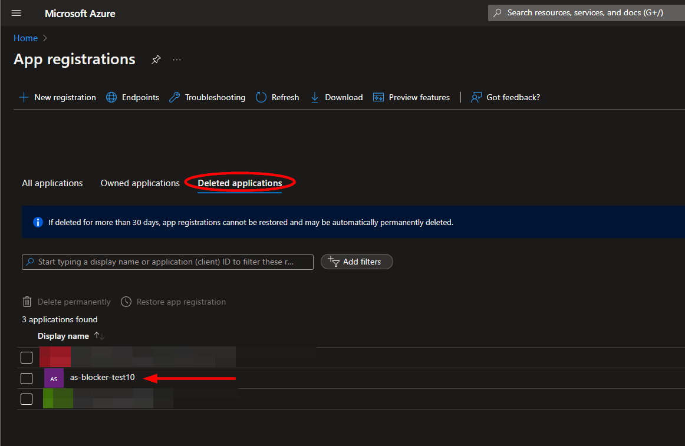
 
                                                                                                                                
#
### Requirements
                                                                                                                                     
The following items are required under the template settings during deployment: 

* An [App Registration](https://github.com/Azure/Azure-Sentinel/tree/master/Playbooks/AS-Delete-App-Registration#create-an-app-registration) for using the Microsoft Graph API
* An [Azure Key Vault Secret](https://github.com/Azure/Azure-Sentinel/tree/master/Playbooks/AS-Delete-App-Registration#create-an-azure-key-vault-secret) containing your App Registration Secret 

# 
### Setup
                                                                                                                                     
#### Create an App Registration:
 
Navigate to the Navigate to the Microsoft Azure Active Directory App Registrations page:

https://portal.azure.com/#view/Microsoft_AAD_RegisteredApps/ApplicationsListBlade

From there, click "**New registration**".

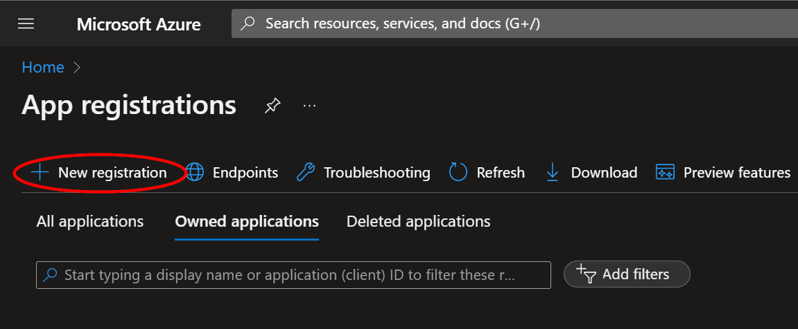

Select a name for your App Registration, such as "**AS-Delete-App-Registration-Playbook**", then click "**Register**".

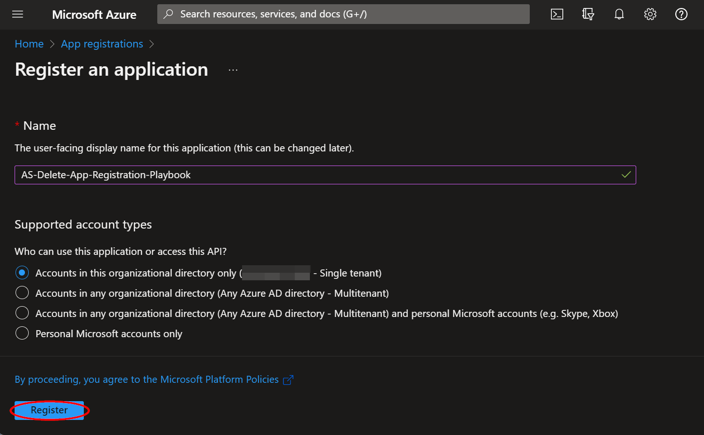

From the application menu blade, select "**API permissions**" and then click "**Add a permission**". Click the "**Microsoft Graph**" category.

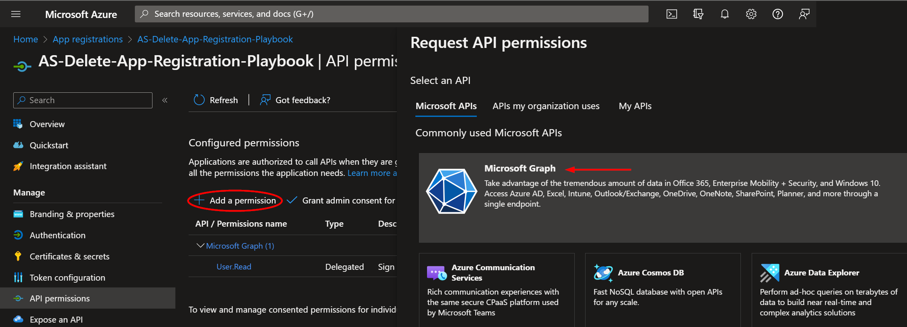

Under "**Application permissions**", search for "**Application.ReadWrite.All**", then select the corresponding checkbox. Click "**Add permissions**".

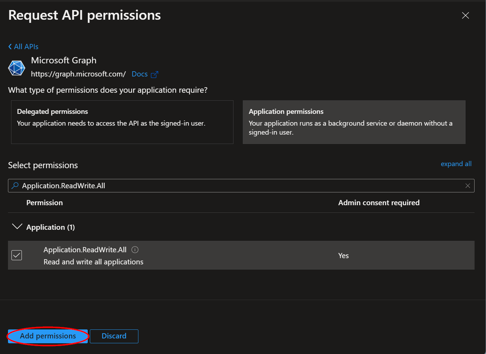

In order for these permissions to be applied, admin consent must also be granted. Click the indicated "**Grant admin consent**" button on the "**API permissions**" page.
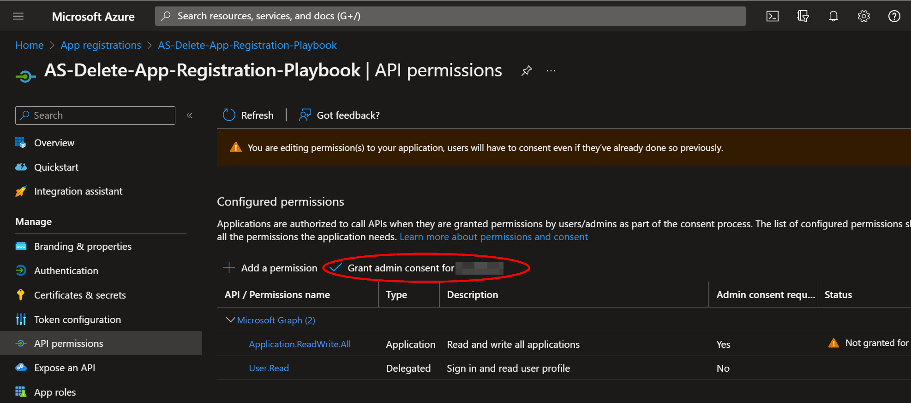

Navigate back to the "**Overview**" section on the menu and take note of the "**Application (client) ID**" and "**Directory (tenant) ID**, as each will be needed for the deployment of this playbook. Click "**Add a certificate or secret**".

Click "**New client secret"**". After adding a description and selecting an expiration date, click "**Add**".

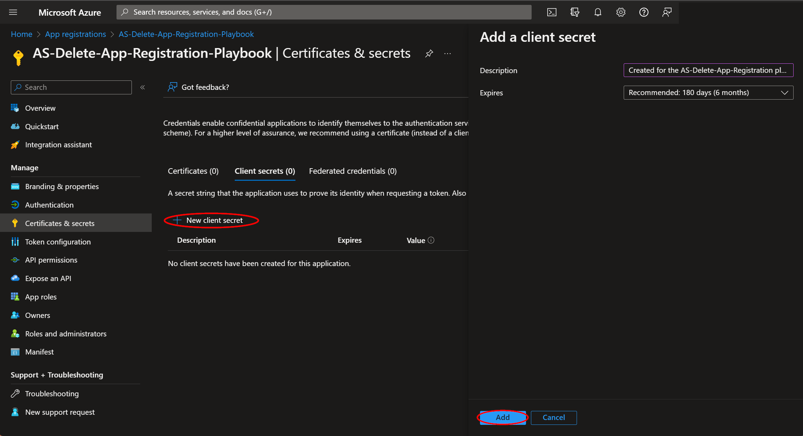

Copy the generated "**Value**" and save it for the next step, [Create an Azure Key Vault Secret](https://github.com/Azure/Azure-Sentinel/tree/master/Playbooks/AS-Delete-App-Registration#create-an-azure-key-vault-secret).

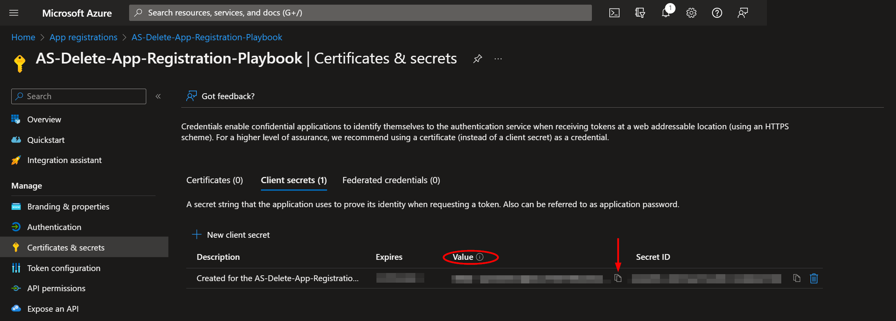

#### Create an Azure Key Vault Secret:

Navigate to the Azure Key Vaults page: https://portal.azure.com/#view/HubsExtension/BrowseResource/resourceType/Microsoft.KeyVault%2Fvaults

Navigate to an existing Key Vault or create a new one. From the Key Vault overview page, click the "**Secrets**" menu option, found under the "**Settings**" section. Click "**Generate/Import**".

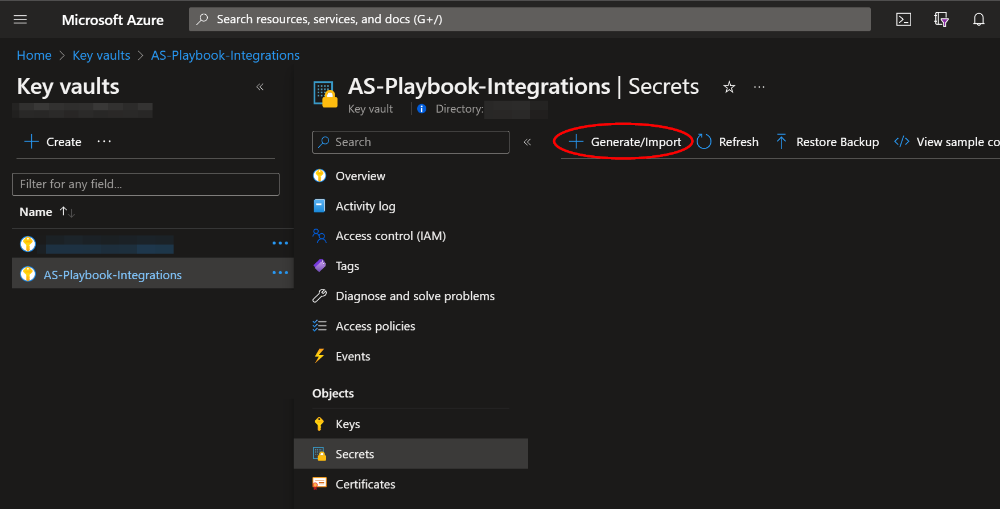

Choose a name for the secret, such as "**AS-Delete-App-Registration-Playbook-App-Registration-Secret**", and enter the App Registration Secret copied previously in the "**Value**" field. All other settings can be left as is. Click "**Create**". 

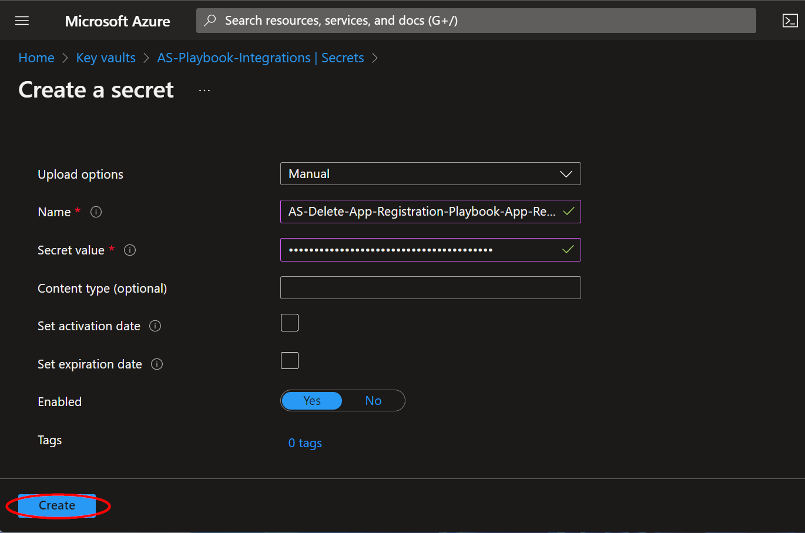

Once your secret has been added to the vault, navigate to the "**Access policies**" menu option on the Key Vault page menu. Leave this page open, as you will need to return to it once the playbook has been deployed. See [Granting Access to Azure Key Vault](https://github.com/Azure/Azure-Sentinel/tree/master/Playbooks/AS-Delete-App-Registration#granting-access-to-azure-key-vault).

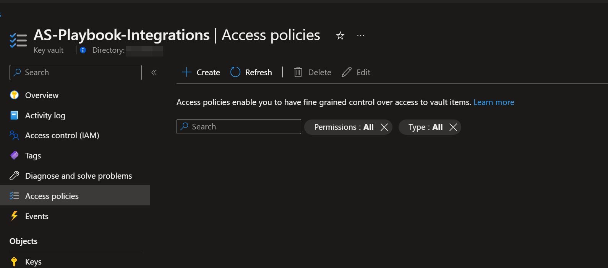

#
### Deployment                                                                                                         
                                                                                                        
To configure and deploy this playbook:
 
Open your browser and ensure you are logged into your Microsoft Sentinel workspace. In a separate tab, open the link to our playbook on the Accelerynt Security GitHub Repository:

https://github.com/Accelerynt-Security/AS-Delete-App-Registration

                                             

Click the "**Deploy to Azure**" button at the bottom and it will bring you to the custom deployment template.

In the **Project Details** section:

* Select the "**Subscription**" and "**Resource Group**" from the dropdown boxes you would like the playbook deployed to.  

In the **Instance Details** section:   

* **Playbook Name**: This can be left as "**AS-Delete-App-Registration**" or you may change it.  

* **App Registration ID**: Enter the value of the Application (client) ID referenced in [Create an App Registration](https://github.com/Azure/Azure-Sentinel/tree/master/Playbooks/AS-Delete-App-Registration#create-an-app-registration).

* **App Registration Tenant**: Enter the value of the Directory (tenant) ID referenced in [Create an App Registration](https://github.com/Azure/Azure-Sentinel/tree/master/Playbooks/AS-Delete-App-Registration#create-an-app-registration).

* **Key Vault Name**: Enter the name of the Key Vault referenced in [Create an Azure Key Vault Secret](https://github.com/Azure/Azure-Sentinel/tree/master/Playbooks/AS-Delete-App-Registration#create-an-azure-key-vault-secret).

* **Secret Name**: Enter the name of the Key Vault Secret created in [Create an Azure Key Vault Secret](https://github.com/Azure/Azure-Sentinel/tree/master/Playbooks/AS-Delete-App-Registration#create-an-azure-key-vault-secret).

Towards the bottom, click on "**Review + create**". 

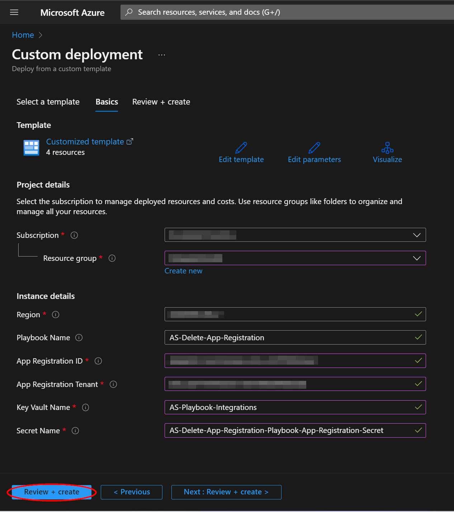

Once the resources have validated, click on "**Create**".

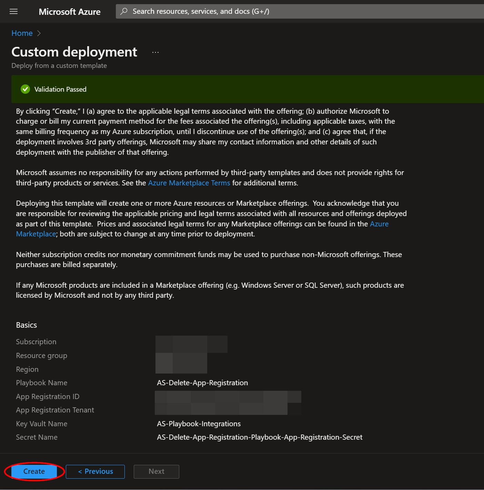

The resources should take around a minute to deploy. Once the deployment is complete, you can expand the "**Deployment details**" section to view them.
Click the one corresponding to the Logic App.

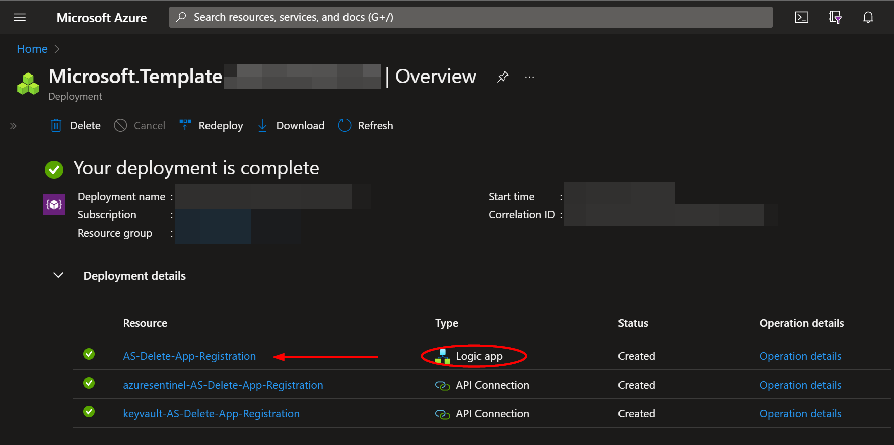

#
### Granting Access to Azure Key Vault

Before the Logic App can run successfully, the Key Vault connection created during deployment must be granted access to the Key Vault storing your App Registration Secret.

From the Key Vault "**Access policies**" page, click "**Create**".

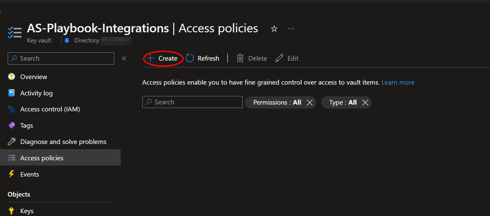

Select the "**Get**" checkbox in the "**Secret permissions**" section. Then click "**Next**".

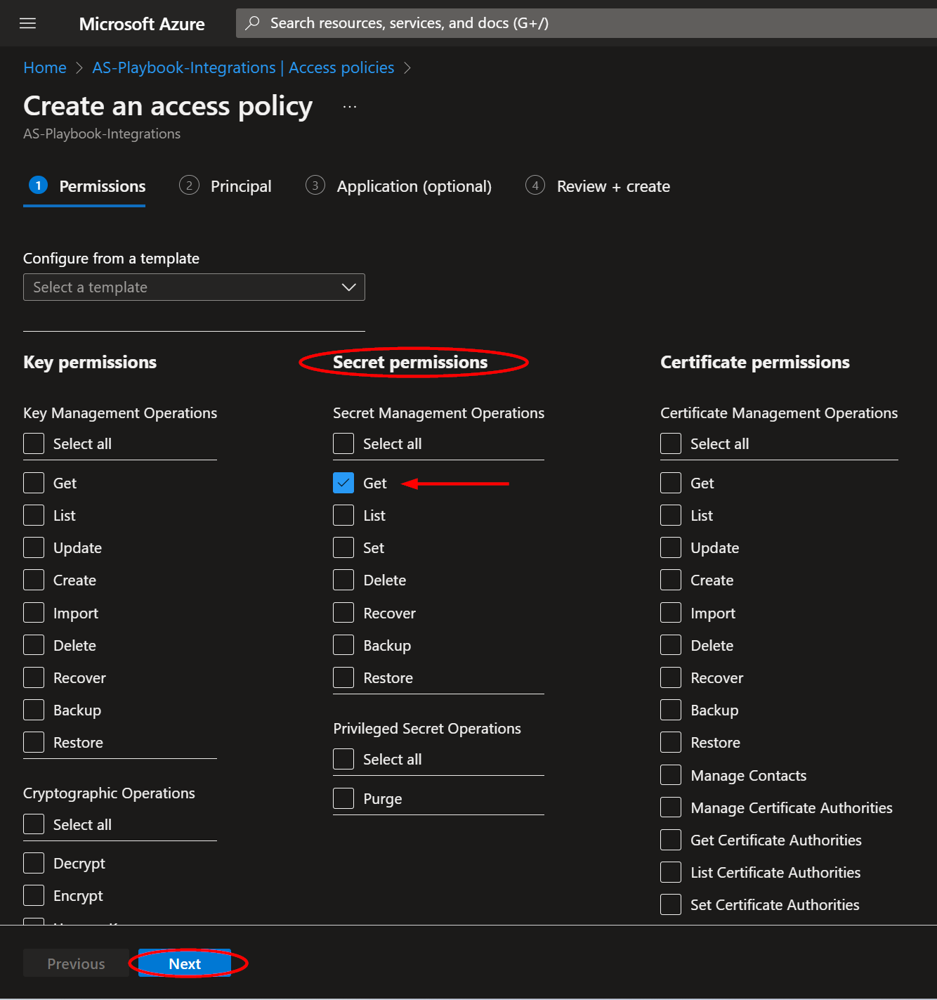

From the "**Principal**" page, paste "**AS-Delete-App-Registration**", or the alternative playbook name you used, into the search box and click the option that appears. Click "**Next**". 

* Note that if the same name is used for the app registration and playbook, you will see two options here, which can be hard to differentiate. In this case, you would want to select the option whose ID does **not** match the app registration (client) ID.

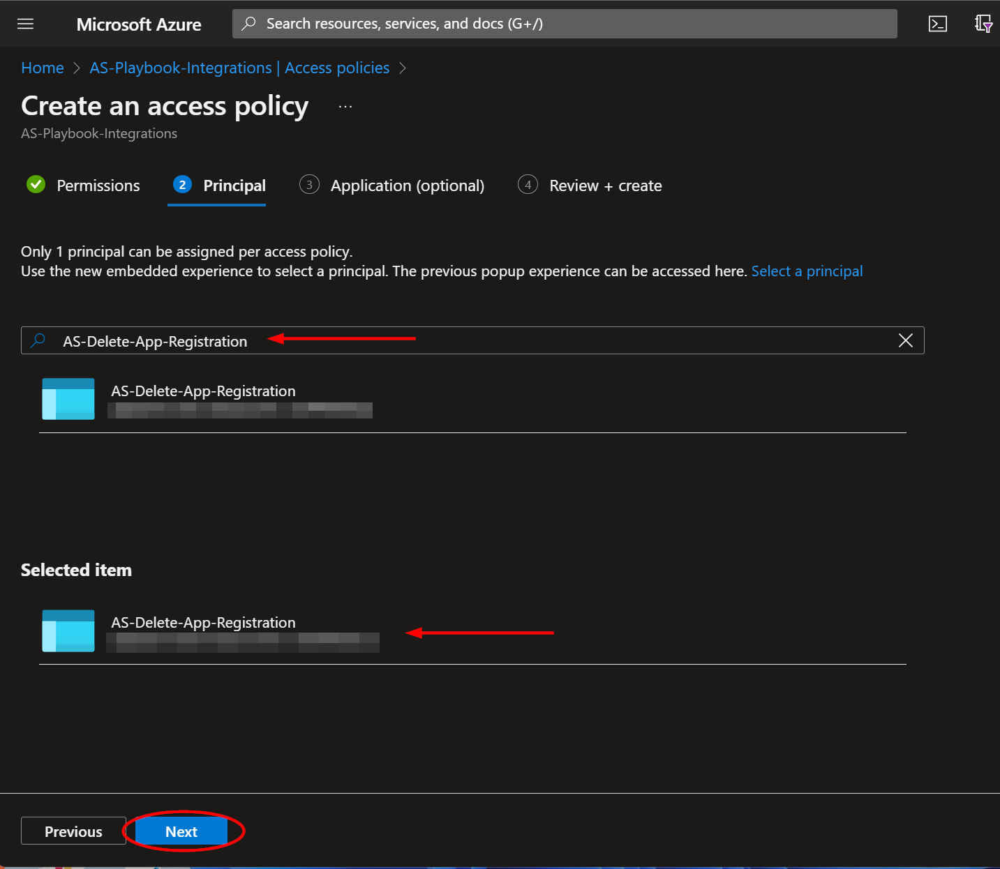

Click "**Next**" in the application section. Then from the "**Review + create**" page, click "**Create**".

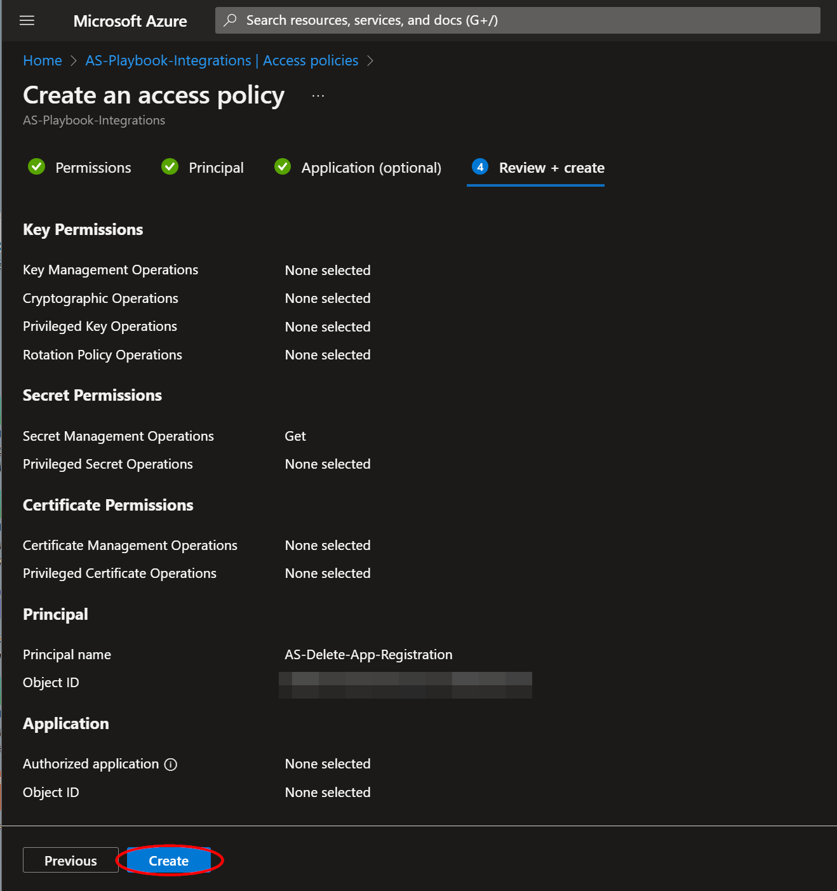

#
### Microsoft Sentinel Contributor Role

After deployment, you will need to give the system assigned managed identity the "**Microsoft Sentinel Contributor**" role. This will enable it to add comments to incidents. Navigate to the Log Analytics Workspaces page and select the same workspace the playbook is located in:

https://portal.azure.com/#view/HubsExtension/BrowseResource/resourceType/Microsoft.OperationalInsights%2Fworkspaces

Select the "**Access control (IAM)**" option from the menu blade, then click "**Add role assignment**".

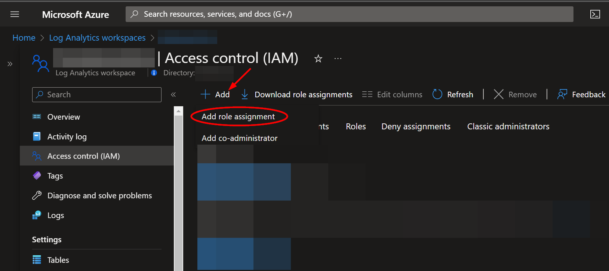

Select the "**Microsoft Sentinel Contributor**" role, then click "**Next**".

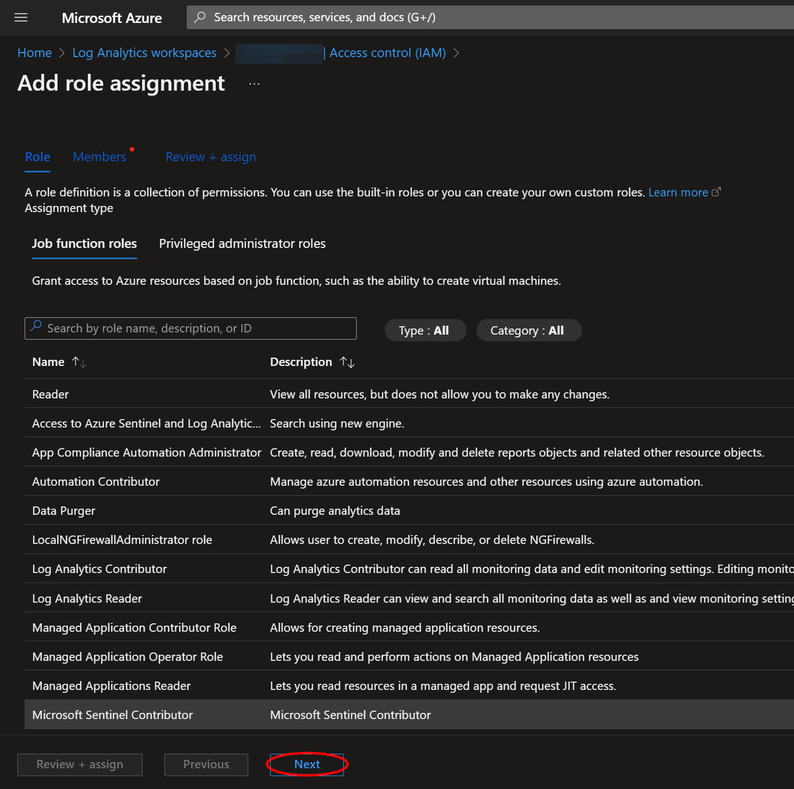

Select the "**Managed identity**" option, then click "**Select Members**". Under the subscription the logic app is located, set the value of "**Managed identity**" to "**Logic app**". Next, enter "**AS-Delete-App-Registration**", or the alternative playbook name used during deployment, in the field labeled "**Select**". Select the playbook, then click "**Select**".

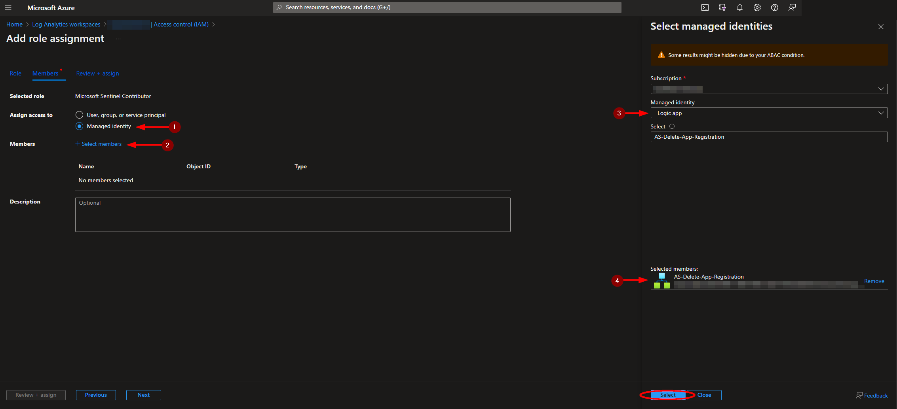

Continue on to the "**Review + assign**" tab and click "**Review + assign**".

