# AS-Edgescan-Integration

Author: Accelerynt

For any technical questions, please contact info@accelerynt.com  

This playbook will create a unidirectional integration with Microsoft Sentinel. It will pull Edgescan assets, hosts, and vulnerabilities into Microsoft Sentinel custom logs where they can be tracked and queried.

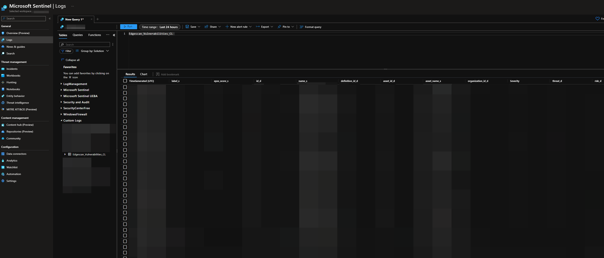

#
### Functionality

For each Edgescan object, there is a corresponding logic app:
* **AS-Edgescan-Integration-Assets**
* **AS-Edgescan-Integration-Hosts**
* **AS-Edgescan-Integration-Vulnerabilities**

The logic app templates you will deploy are set up for their initial runs, which are designed to pull in all Edgescan data. After pulling in all initial data, the logic apps will need to be updated to use a rolling lookback window and a duplicate ID check before any subsequent runs. This documentation will cover not only the deployment and initial runs of the logic apps, but also the steps needed to update each playbook after each initial run.

Entries will be stored in Microsoft Sentinel [custom logs](https://github.com/Azure/Azure-Sentinel/tree/master/Playbooks/AS-Edgescan-Integration#viewing-custom-logs) with the following table names:

* **Edgescan_Assets_CL**
* **Edgescan_Hosts_CL**
* **Edgescan_Vulnerabilities_CL**

#
### Requirements
                                                                                                                                     
The following items are required under the template settings during deployment: 

* Your Edgescan [URL](https://github.com/Azure/Azure-Sentinel/tree/master/Playbooks/AS-Edgescan-Integration#edgescan-url)
* An Edgescan [API token](https://github.com/Azure/Azure-Sentinel/tree/master/Playbooks/AS-Edgescan-Integration#create-an-edgescan-api-token)
* Pre-existing asset, host, and vulnerability data in your Edgescan org

# 
### Setup

#### Edgescan URL

Log into your Edgescan account and take note of the URL. It should follow this format "**example.edgescan.com**".

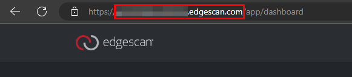
                                                                                                                        
#### Create an Edgescan API Token

From the home page of your Edgescan account, navigate to the user icon in the top right corner and click "**Account settings**".

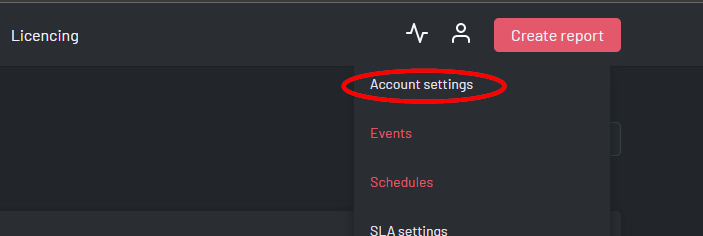

Under the "**API tokens**" section, type a label for your token and click "**Create**".

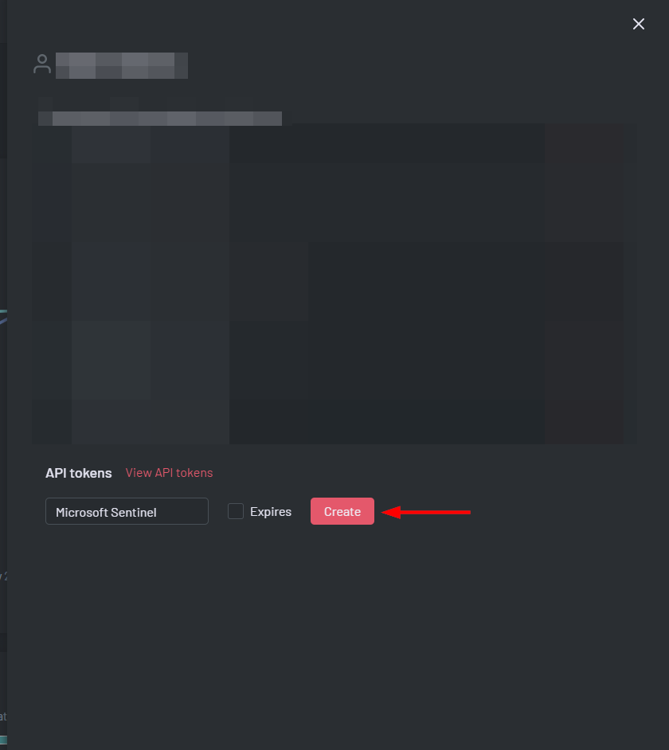

The one-time value of your API token will then be displayed. Click the copy icon, and save this for the deployment of the playbooks below.

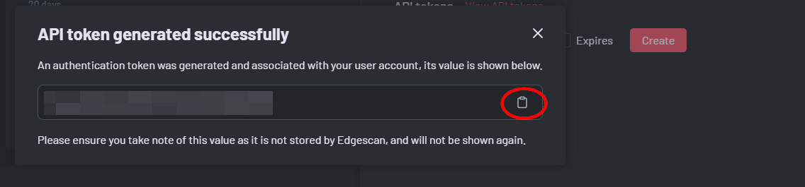

#### Create an Azure Key Vault Secret

Navigate to the Azure Key Vaults page: https://portal.azure.com/#view/HubsExtension/BrowseResource/resourceType/Microsoft.KeyVault%2Fvaults

Navigate to an existing Key Vault or create a new one. From the Key Vault overview page, click the "**Secrets**" menu option, found under the "**Settings**" section. Click "**Generate/Import**".

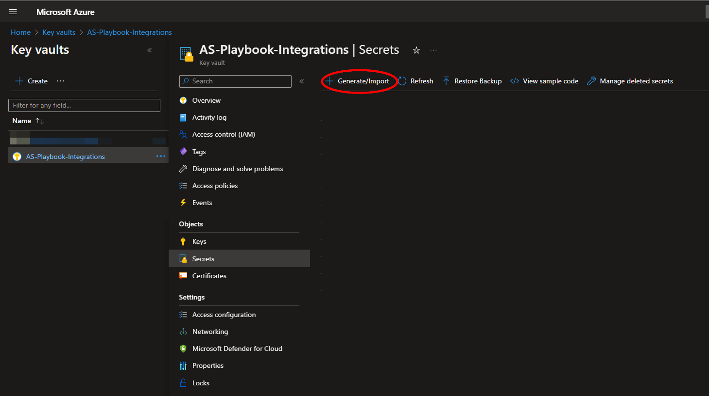

Choose a name for the secret, such as "**AS-Edgescan-Integration-API-Token**", and enter the Edgescan API token copied previously in the [previous section](https://github.com/Azure/Azure-Sentinel/tree/master/Playbooks/AS-Edgescan-Integration#create-an-edgescan-api-token). All other settings can be left as is. Click "**Create**". 

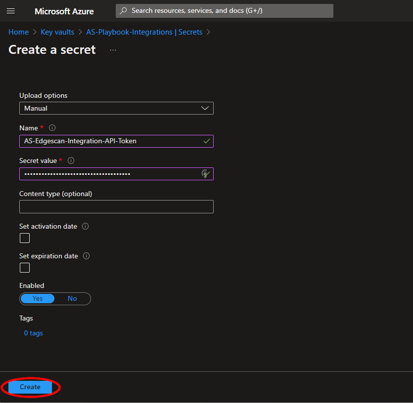

Once your secret has been added to the vault, navigate to the "**Access policies**" menu option, also found under the "**Settings**" section on the Key Vault page menu. Leave this page open, as you will need to return to it once the playbook has been deployed. See [Granting Access to Azure Key Vault](https://github.com/Azure/Azure-Sentinel/tree/master/Playbooks/AS-Edgescan-Integration#granting-access-to-azure-key-vault).

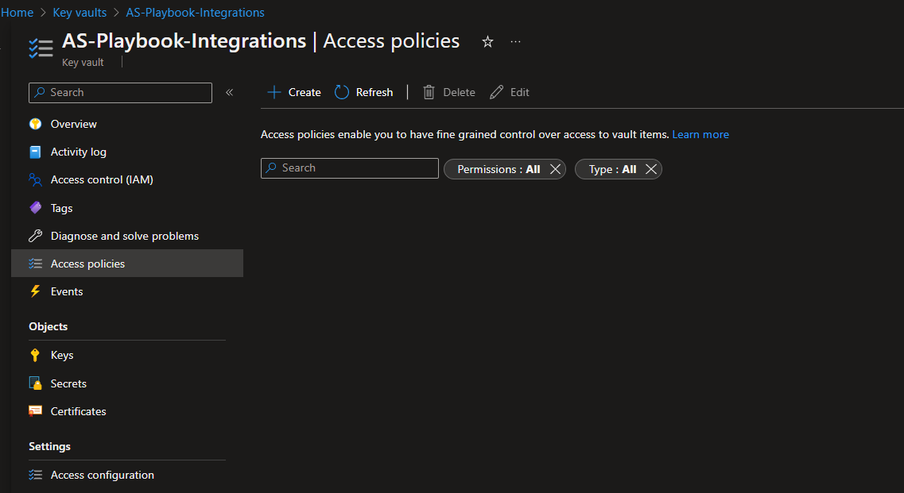

#
### Deployment

To configure and deploy this playbook:

Open your browser and ensure you are logged into your Microsoft Sentinel workspace. In a separate tab, open the link to our playbook on the Accelerynt Security GitHub Repository:

https://github.com/Accelerynt-Security/AS-Edgescan-Integration

For each of these templates, the password parameter will be the value of your Edgescan [API token](https://github.com/Azure/Azure-Sentinel/tree/master/Playbooks/AS-Edgescan-Integration#create-an-edgescan-api-token).

#### AS-Edgescan-Integration-Assets

    

#### AS-Edgescan-Integration-Hosts

    
                                                

#### AS-Edgescan-Integration-Vulnerabilities

    

Each of these logic apps are disabled upon deployment, meaning they will not run until you enable them.

#### For each deployment, repeat the following steps:
> In the first section:  
>
> * Select the "**Subscription**" and "**Resource Group**" from the dropdown boxes you would like the playbook deployed to.  
>
>In the **Parameters** section:   
>
>* **Playbook Name**: This can be left as "**AS-Edgescan-Integration**" or you may change it.  
>
>* **Edgescan URL**: Enter the name of your Edgescan URL referenced in [Edgescan URL](https://github.com/Azure/Azure-Sentinel/tree/master/Playbooks/AS-Edgescan-Integration#edgescan-url). You do not need to include "https://".
>
>* **Edgescan Username**: Enter the username of the Edgescan account used to create the API token.
>
>* **Key Vault Name**: Enter the name of the Key Vault used to store your API token, referenced in [Create an Azure Key Vault Secret](https://github.com/Azure/Azure-Sentinel/tree/master/Playbooks/AS-Edgescan-Integration#create-an-azure-key-vault-secret).
>
>* **Secret Name**: Enter the name of the Key Vault Secret created in [Create an Azure Key Vault Secret](https://github.com/Azure/Azure-Sentinel/tree/master/Playbooks/AS-Edgescan-Integration#create-an-azure-key-vault-secret).
>
>Towards the bottom, click on "**Review + create**". 
>
>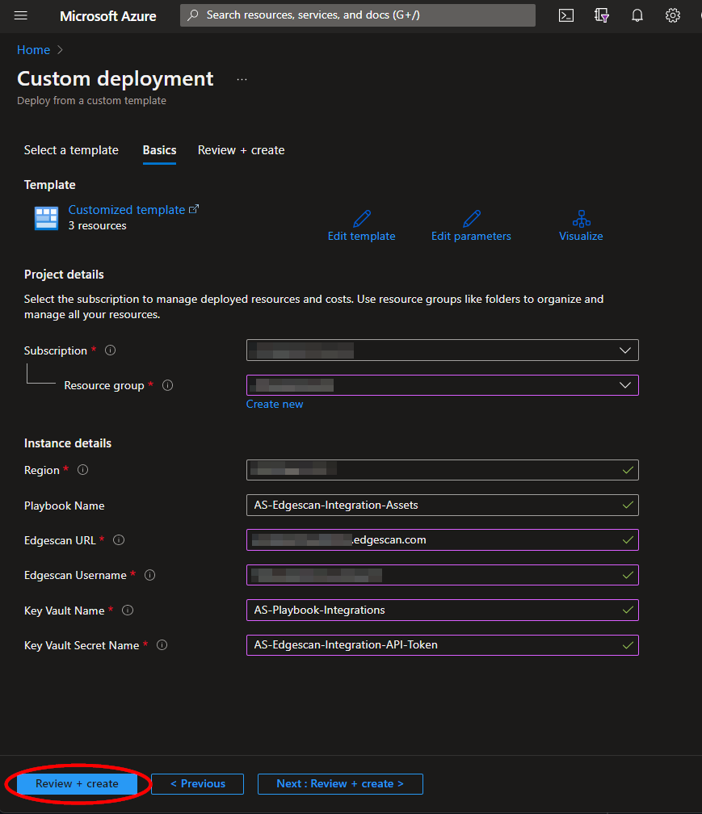
>
>Once the resources have validated, click on "**Create**".
>
>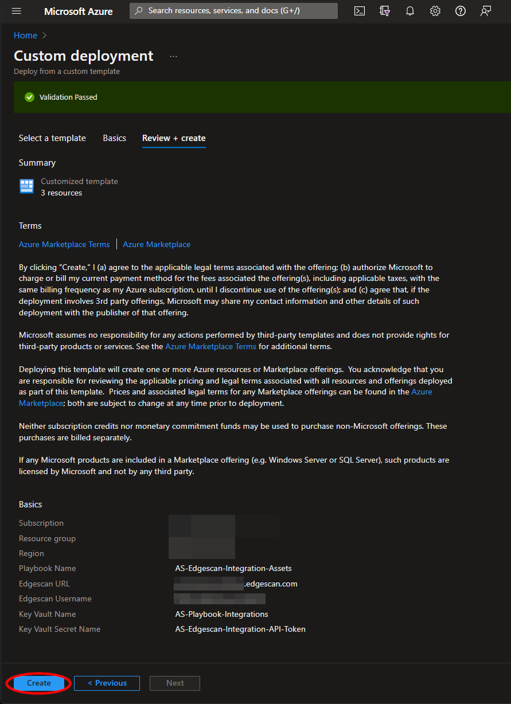
>
>The resources should take around a minute to deploy. Once the deployment is complete, you can expand the "**Deployment details**" section to view them.
>
>After deployment, you will need to validate the connections each logic app uses to send Edgescan data to Microsoft Sentinel custom logs. To do this, you can either click on the logic apps service from the home page, and find your recently deployed logic apps there, or, after deployment, click on the logic app resource as shown below.
>
>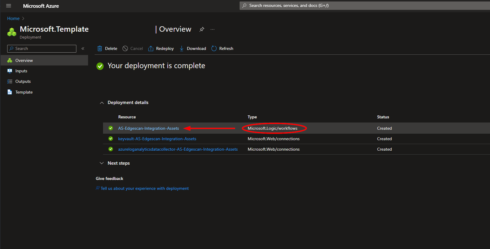
>
>From there, click the edit button.
>
>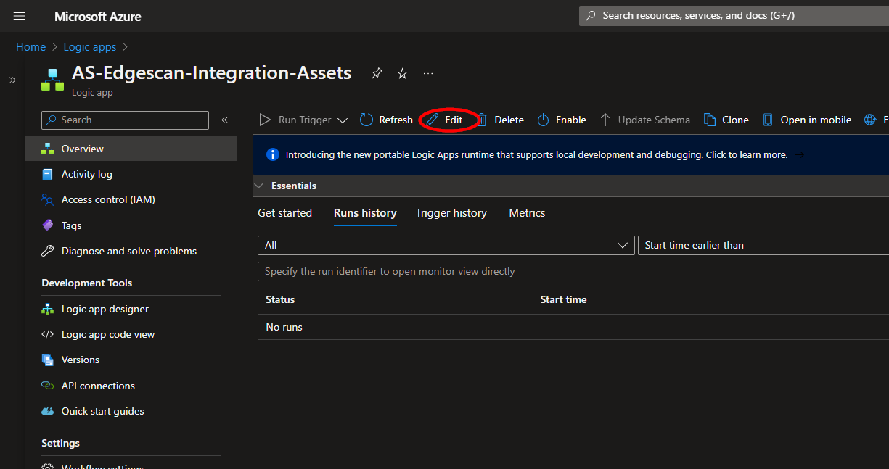
>
>Next, expand the for each and the connection actions.
>
>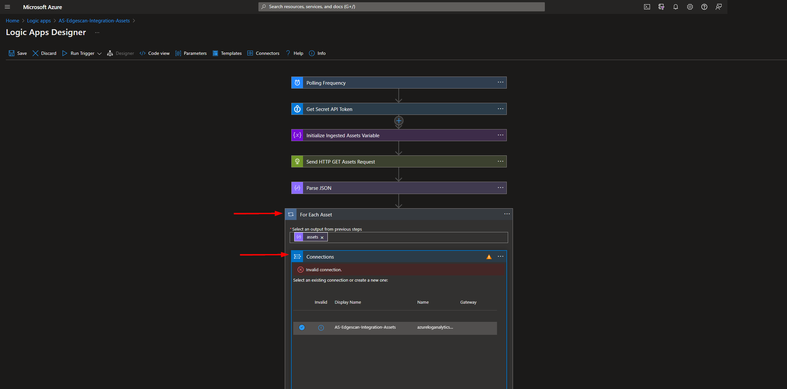
>
>Click on the exclamation point icon for the connection matching the logic app name.
>
>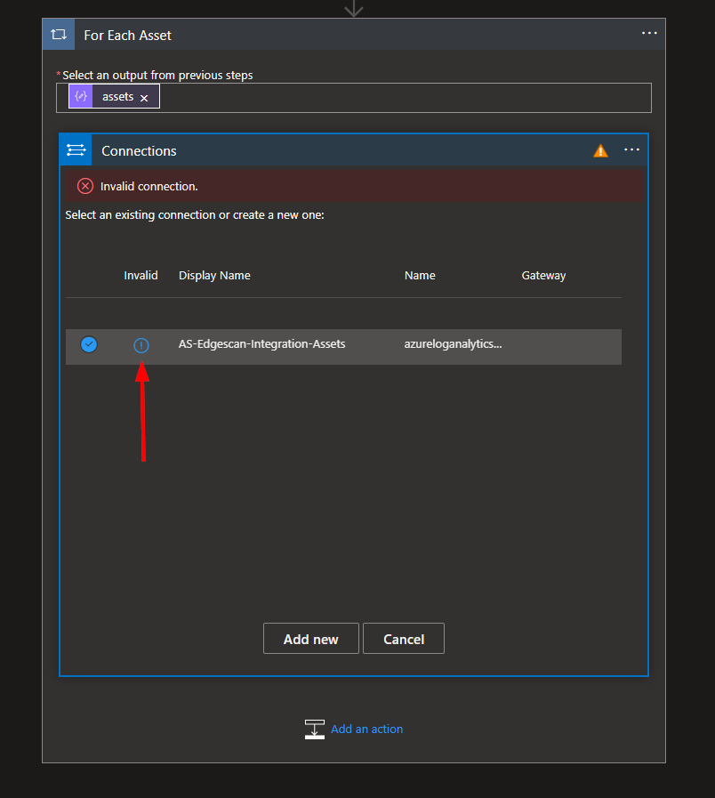
>
>Enter the name of the logic app for the connection name, followed by the workspace key and workspace ID your logic apps were deployed in, then click "**Update**". 
>
>
>
>For the "**Custom Log Name**" field, make sure either "**Edgescan_Assets**", "**Edgescan_Hosts**", or "**Edgescan_Vulnerabilities**" is used, then save the logic app.
>
>>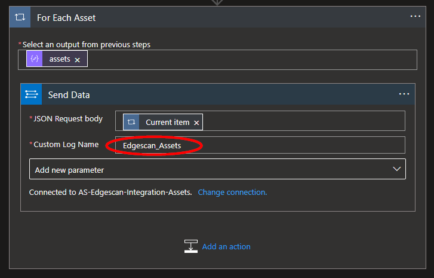
>
>#### To obtain your workspace key and workspace ID
>
> In a separate tab, navigate to https://portal.azure.com/#view/HubsExtension/BrowseResource/resourceType/Microsoft.OperationalInsights%2Fworkspaces and select the workspace your logic apps were deployed in.
>
>From the left menu blade, click the "**Agents**" option, then expand the "**Log Analytics agent instructions**" section. Here you will find your workspace ID and primary key, which can be used as your workspace key.
>
>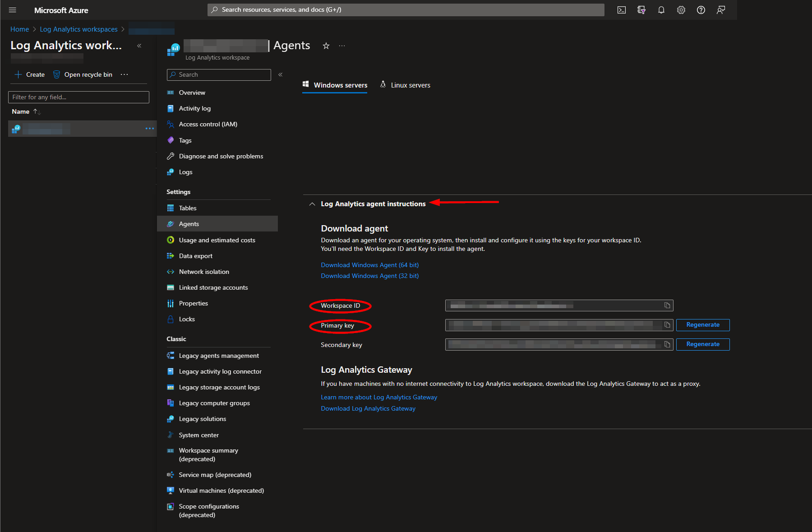
> 

#
### Limit Initial Data Ingestion

The initial run of each logic app is set up so that all existing Edgescan data is pulled into Microsoft Sentinel custom logs. If you wish to limit the data initially ingested from Edgescan, follow the steps in this section. If not, skip ahead to the next section: [Granting Access to Azure Key Vault](https://github.com/Azure/Azure-Sentinel/tree/master/Playbooks/AS-Edgescan-Integration#granting-access-to-azure-key-vault).

To limit the ingestion of data before your initial run, for each logic app, click edit and expand the HTTP Request section.

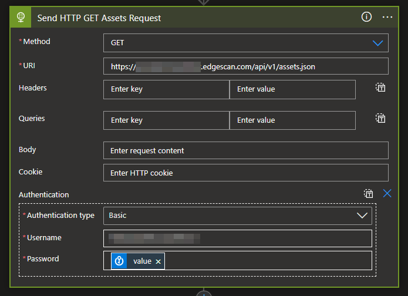

To only ingest records created in the last year, for example, you would add the following string to the end of the existing URI to the necessary logic apps:

#### AS-Edgescan-Integration-Assets
    ?c[created_at]=@{formatDateTime(addDays(utcNow(),-365),'yy-MM-dd')}

#### AS-Edgescan-Integration-Hosts
    ?c[updated_at]=@{formatDateTime(addDays(utcNow(),-365),'yy-MM-dd')}

#### AS-Edgescan-Integration-Vulnerabilities
    ?c[date_opened_after]=@{formatDateTime(addDays(utcNow(),-365),'yy-MM-dd')}

**Note:** In the case of hosts, since no created date field appears to exist, the field indicating the last update is used instead.

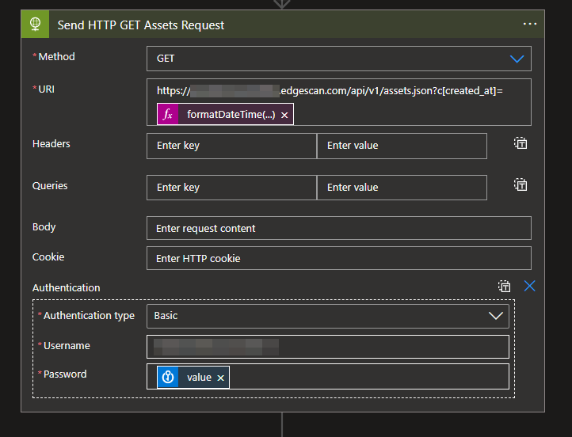 

Once this is done, be sure to save each logic app.

#
### Granting Access to Azure Key Vault

Before each logic app can run successfully, the Key Vault connections created during deployment must be granted access to the Key Vault storing your Edgescan API token.

From the Key Vault "**Access policies**" page, click "**Create**".

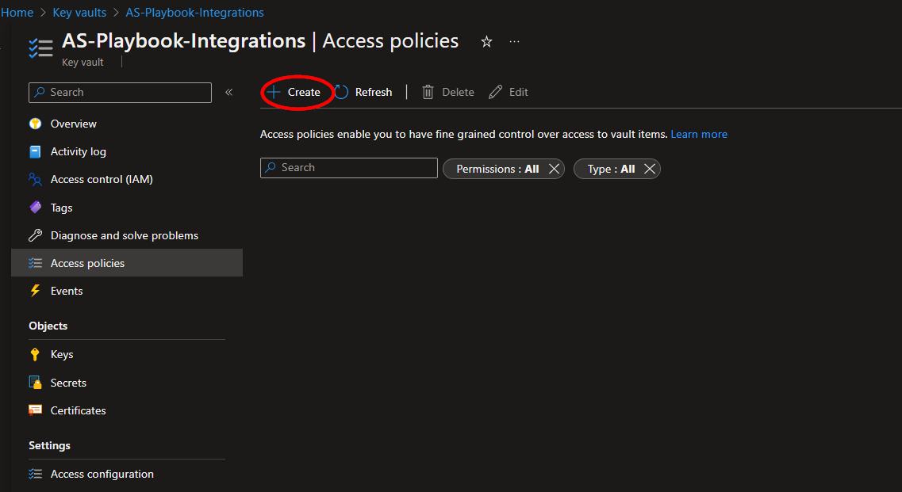

Select the "**Get**" checkbox under "**Secret permissions**", then click "**Next**".

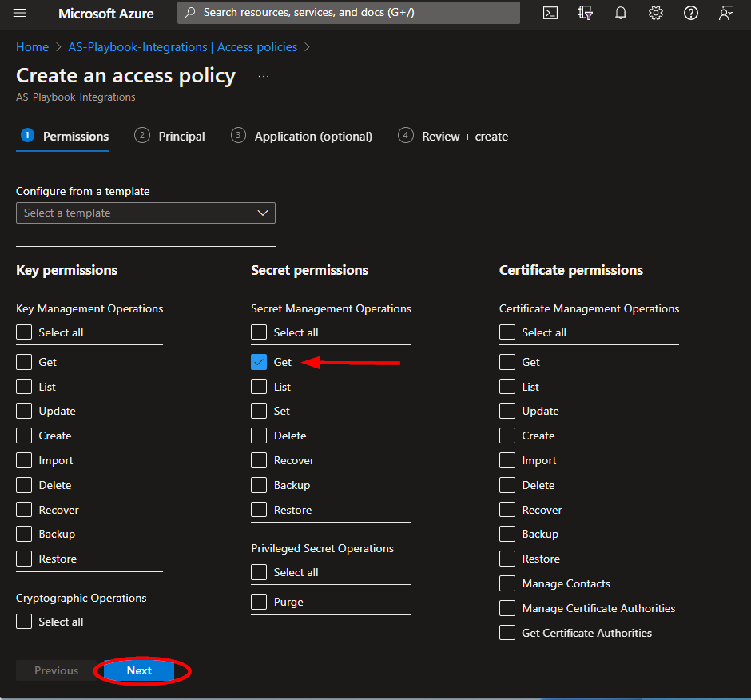

Paste "**AS-Edgescan-Integration-Assets**" into the principal search box and click the option that appears. Click "**Next**" towards the bottom of the page.

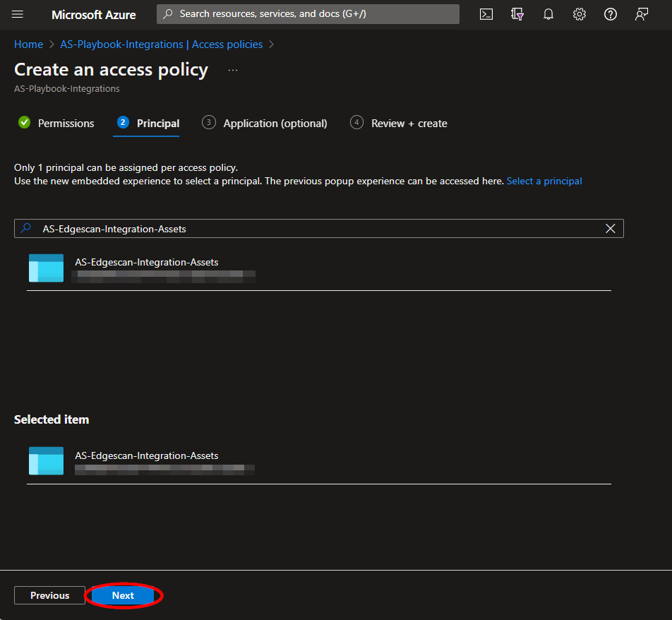

Navigate to the "**Review + create**" section and click "**Create**".

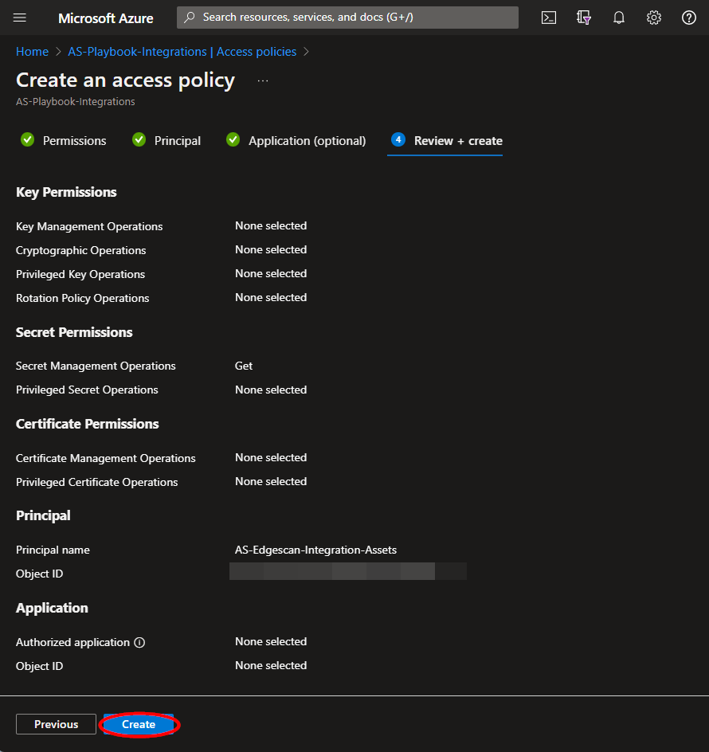

Repeat this process for "**AS-Edgescan-Integration-Hosts**" and "**AS-Edgescan-Integration-Vulnerabilities**" 

#
### Initial Run
To execute our initial run, enable each logic app. Their triggers will run automatically.

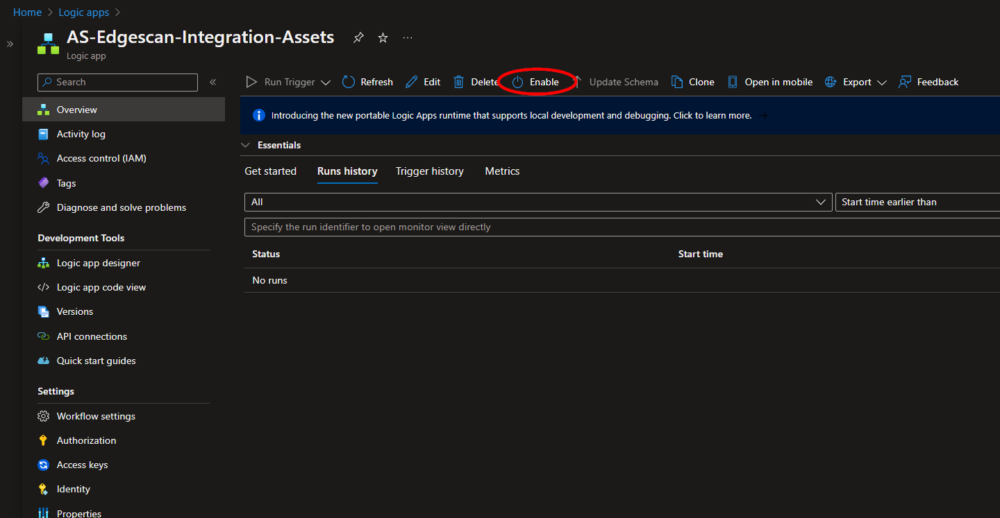

Once these complete successfully, **disable the logic apps**. We do not want them to run again until we have made additions to check for duplicates and allow a smaller lookback window.

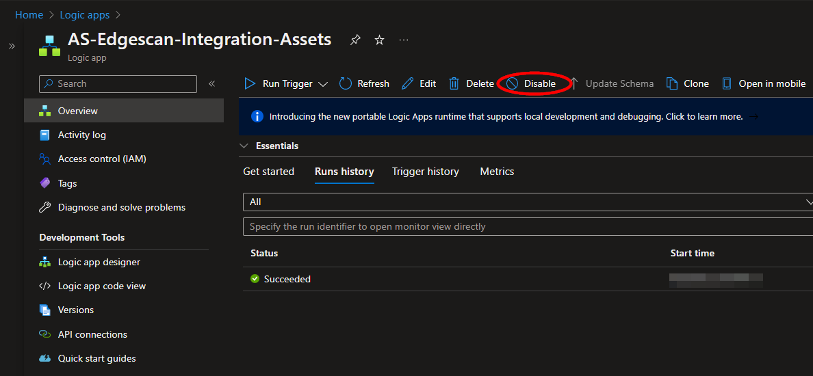

If you do not wish to have constant polling of assets and hosts, these logic apps may be left disabled.

#
### Viewing Custom Logs
Once each initial run has been completed, navigate to 
https://portal.azure.com/#view/HubsExtension/BrowseResource/resourceType/microsoft.securityinsightsarg%2Fsentinel

From there, select the workspace your deployed logic apps reference and click "**Logs**" in the left-hand menu blade. Expand "**Custom Logs**". Here, you should see customs logs for each of your three logic apps. It may take a while for them to populate, so if they are not yet visible, you may want to try and query them periodically.

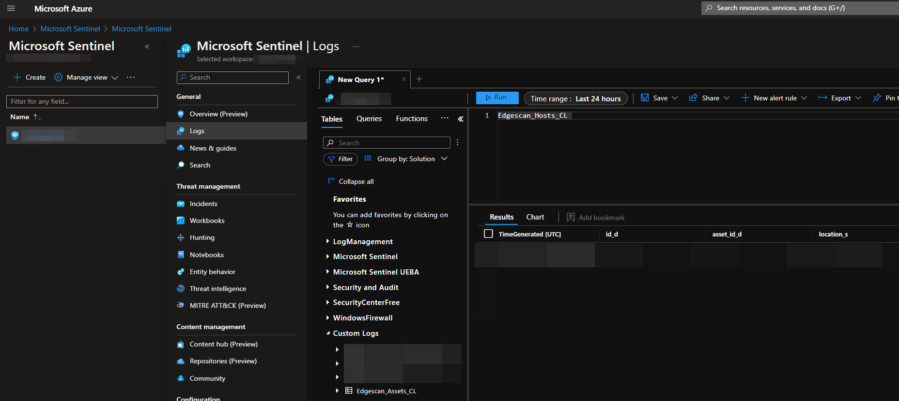

#
### Final Set Up

If you wish to have constant polling for new data, perform the following steps on each logic app:

To add the duplicate checking actions to each logic app:

Edit the logic app and add a new action below the "**Initialize Variable**" action.

Search for "**Run query and list results**".

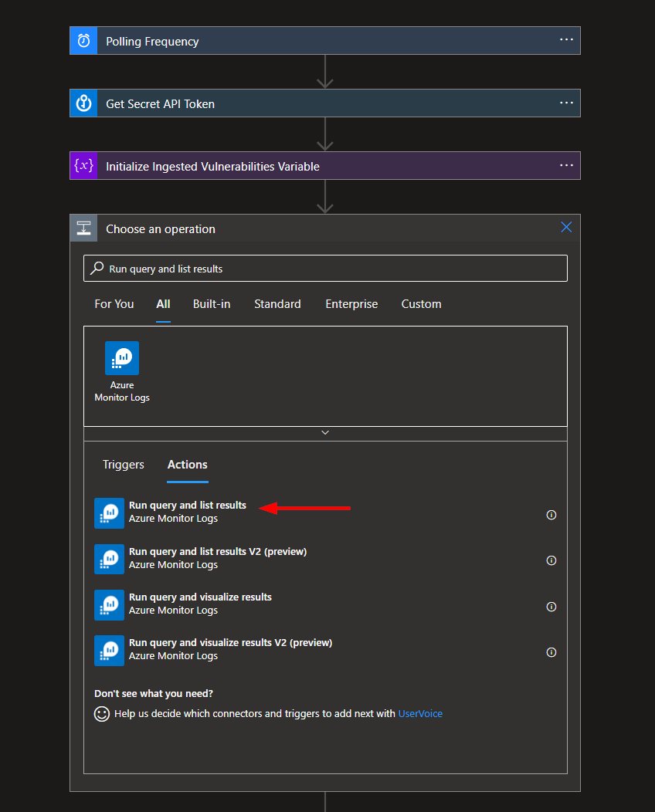

You may need to first set up a connection for this action if it has never been used before. Then, select the subscription and resource information from the drop-down lists matching what was used during the logic app deployment. Be sure to select "**Log Analytics Workspace**" for the Resource Type.

Add the query matching the logic app you are editing:

#### AS-Edgescan-Integration-Assets
    Edgescan_Assets_CL

#### AS-Edgescan-Integration-Hosts
    Edgescan_Hosts_CL

#### AS-Edgescan-Integration-Vulnerabilities
    Edgescan_Vulnerabilities_CL 
    | where date_opened_t >= now(-3d)

Set the lookback range to **7 days**, although you may want to do something closer to 3 days if the data is high in volume.

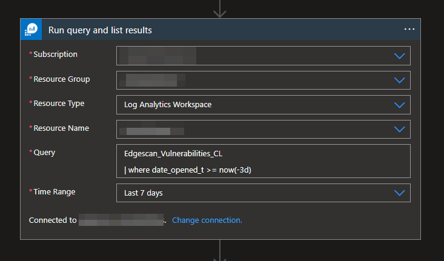

**Note:** Since the volume of assets and hosts is expected to be much lower, no additional filters other than a date range are used in those queries.

Below the query action, add another action, searching for "**Control**" and then selecting "**For each**".

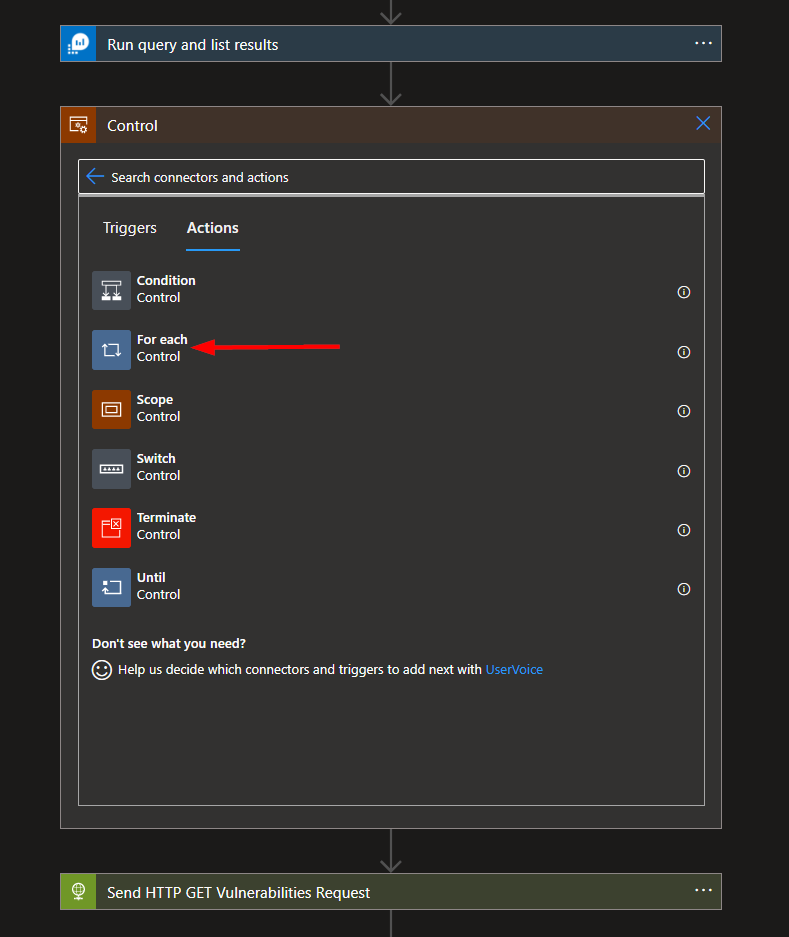

Select the value from the query result to loop through.

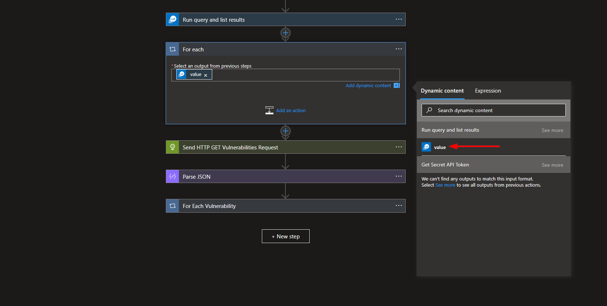

Add an action inside the for loop, searching for "**Append to string variable**".
 
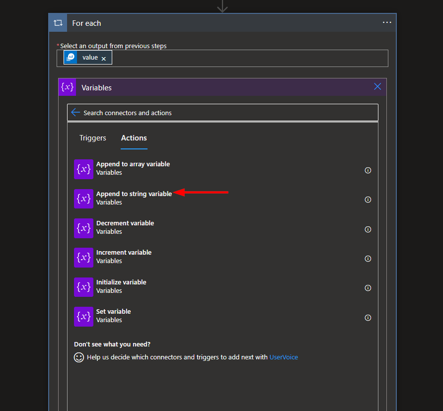

Select the string variable referenced in the logic app and paste the following in the "**Expression**" tab of the dynamic content value box:

    concat(items('For_each')?['id_d'], ' ')

Be sure to click "**Ok**" in this dialogue box before proceeding.

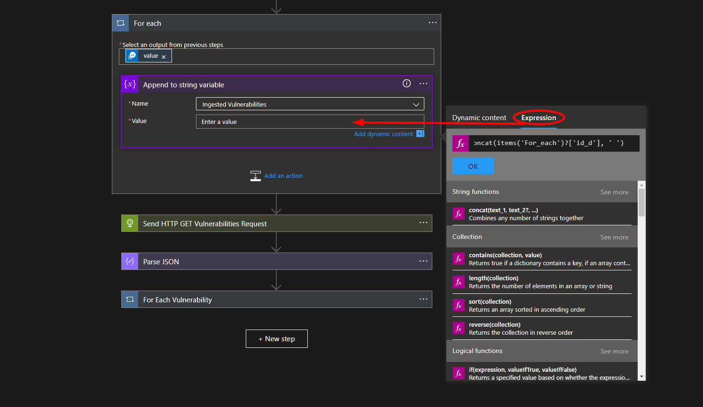

Now navigate down to the bottom for loop of your logic app.

Click "**Add an action**" inside the loop.

As you did before, select the "**Control**" action.

This time, click on "**Condition**".

In the Condition box, select the string variable in your logic app, select "**does not contain**" from the middle drop down, then paste one of the following strings in the "**Expression**" tab of the dynamic content value box:

#### AS-Edgescan-Integration-Assets
    string(items('For_Each_Asset')['id'])

#### AS-Edgescan-Integration-Hosts
    string(items('For_Each_Host')['id'])

#### AS-Edgescan-Integration-Vulnerabilities
    string(items('For_Each_Vulnerability')['id'])
    
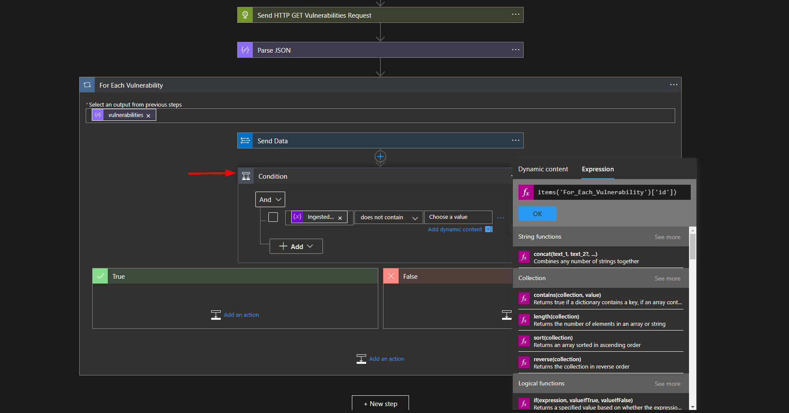

Finally, click and drag the "**Send data**" action into the "**True**" condition outcome box.

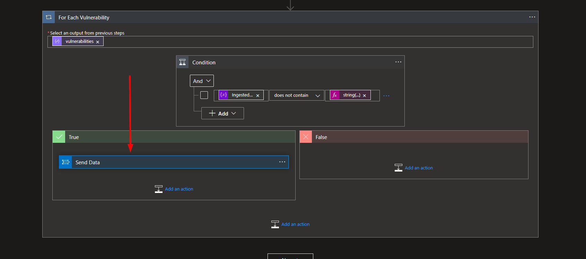

With the duplicate checking logic implemented, now we'll adjust our data ingestion window.

Expand the HTTP Request action in your logic app and add one of the following to the end of the URI, or, if you opted to add an additional filter earlier, replace that one with one of the following:

#### AS-Edgescan-Integration-Assets
    ?c[created_at]=@{formatDateTime(addDays(utcNow(),-2),'yy-MM-dd')}

#### AS-Edgescan-Integration-Hosts
    ?c[updated_at]=@{formatDateTime(addDays(utcNow(),-2),'yy-MM-dd')}

#### AS-Edgescan-Integration-Vulnerabilities
    ?c[date_opened_after]=@{formatDateTime(addDays(utcNow(),-2),'yy-MM-dd')}

The end result should look like this:
  
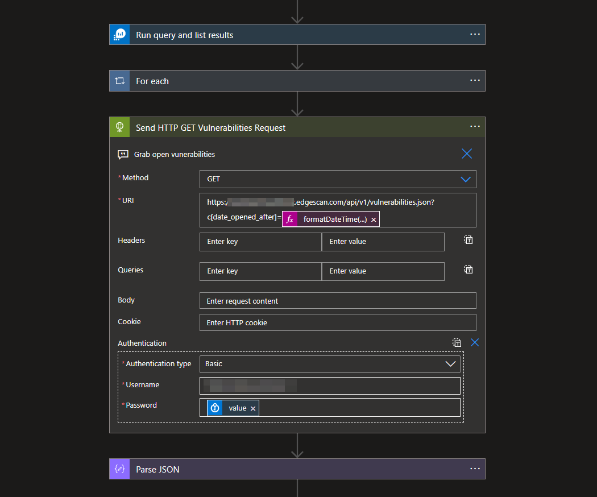

  
Save the logic app and enable it.
