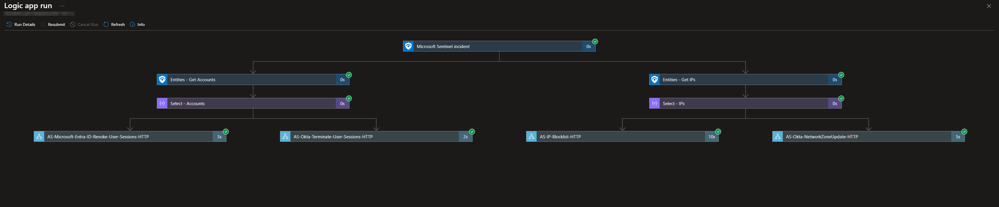
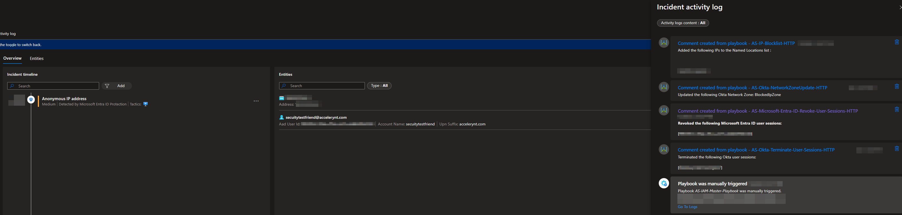
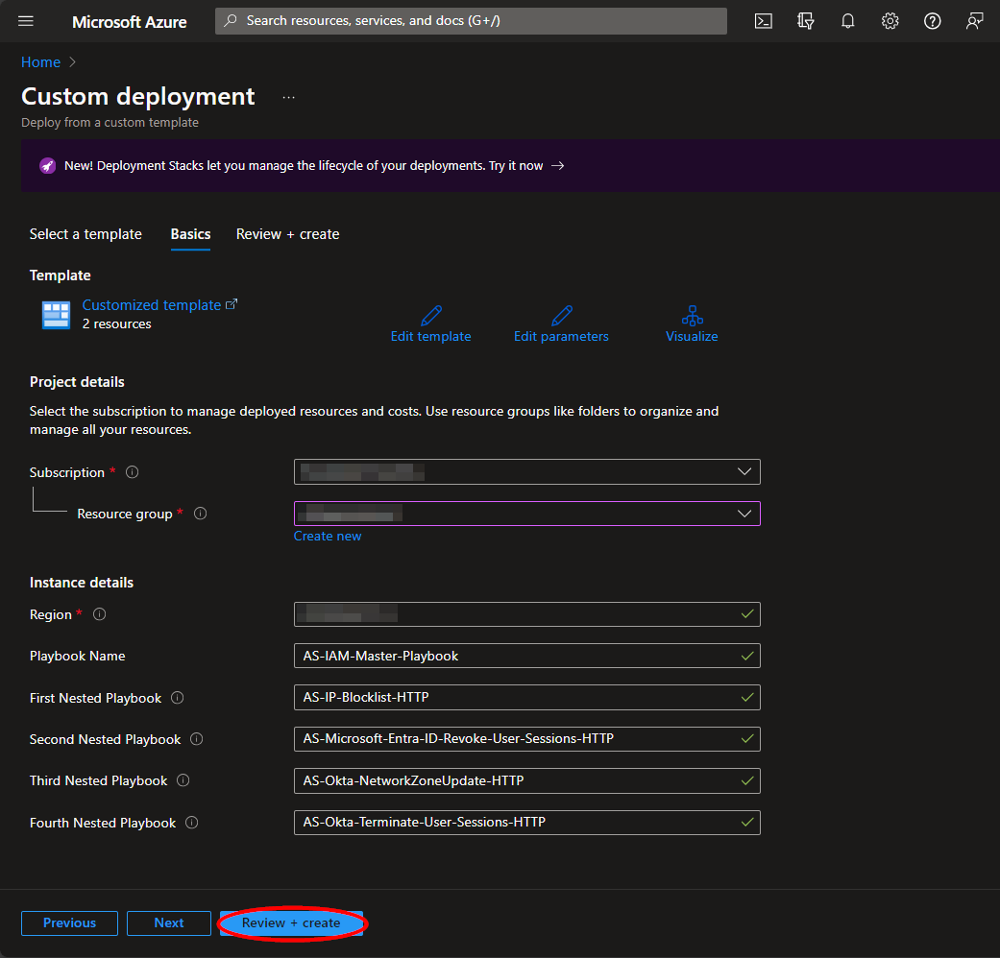
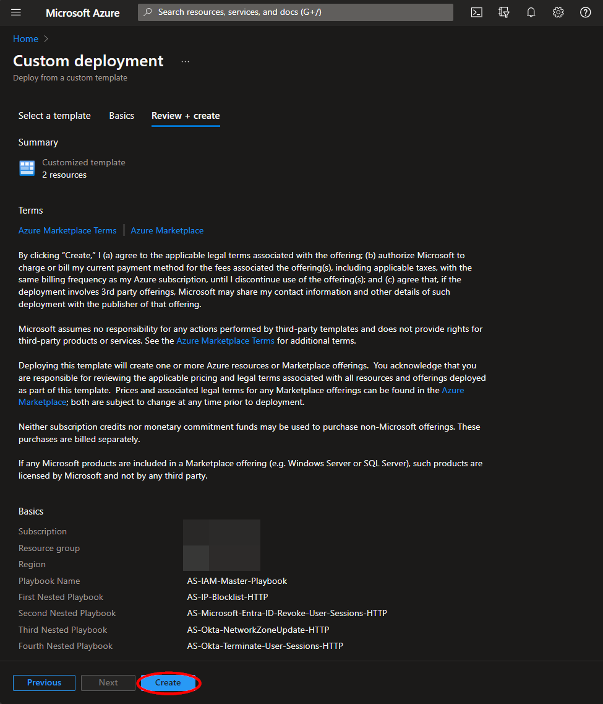
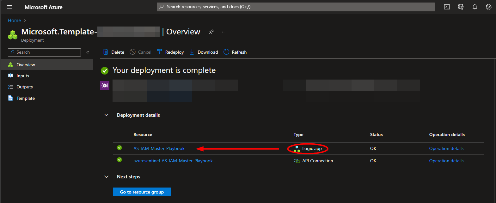

# AS-IAM-Master-Playbook

Author: Accelerynt

For any technical questions, please contact info@accelerynt.com  

       

This playbook is intended to be run from a Microsoft Sentinel Incident. It will take the IP and account entities and run four separate playbooks to indicate compromise and revoke access to Okta and Microsoft Entra ID. The playbooks that will be run are as follows:

* **AS-IP-Blocklist-HTTP**: This will add the IP address from the Microsoft Sentinel incident to a Microsoft Azure Conditional Access Named Locations list, indicating a compromised IP

* **AS-Microsoft-Entra-ID-Revoke-User-Sessions-HTTP**: This will revoke the Microsoft Entra ID user sessions from the Microsoft Sentinel incident account entities

* **AS-Okta-NetworkZoneUpdate-HTTP**: This will add the IP address from the Microsoft Sentinel incident to an Okta Network Zone

* **AS-Okta-Terminate-User-Sessions-HTTP**: This will terminate the Okta user sessions from the Microsoft Sentinel incident account entities
                                                                                                                               

 
                                                                                                                                     
#
### Requirements
                                                                                                                                     
The following items are required under the template settings during deployment: 

* All four playbooks included in this repository must first be deployed

#
### Deployment                                                                                                         
                                                                                                        
To configure and deploy this playbook:
 
Open your browser and ensure you are logged into your Microsoft Sentinel workspace. In a separate tab, open the link to our playbook on the Accelerynt Security GitHub Repository:

https://github.com/Accelerynt-Security/AS-IAM-Master-Playbook/tree/main/AS-IAM-Master-Playbook

                                             

Click the “**Deploy to Azure**” button at the bottom and it will bring you to the custom deployment template.

In the **Project Details** section:

* Select the “**Subscription**” and “**Resource Group**” from the dropdown boxes you would like the playbook deployed to.  

In the **Instance Details** section:   

* **Playbook Name**: This can be left as "**AS-IAM-Master-Playbook**" or you may change it

* **FirstNestedPlaybook**: Enter the name of the first playbook deployed, or leave it as the default value, "**AS-IP-Blocklist-HTTP**", if this was not changed

* **SecondNestedPlaybook**: Enter the name of the second playbook deployed, or leave it as the default value, "**AS-Microsoft-Entra-ID-Revoke-User-Sessions-HTTP**", if this was not changed

* **ThirdNestedPlaybook**: Enter the name of the third playbook deployed, or leave it as the default value, "**AS-Okta-NetworkZoneUpdate-HTTP**", if this was not changed

* **FourthNestedPlaybook**: Enter the name of the fourth playbook deployed, or leave it as the default value, "**AS-Okta-Terminate-User-Sessions-HTTP**", if this was not changed

Towards the bottom, click on “**Review + create**”. 

Once the resources have validated, click on "**Create**".

The resources should take around a minute to deploy. Once the deployment is complete, you can expand the "Deployment details" section to view them. To view the deployed Logic App, click the resource that corresponds to it.

