# AS-Import-Azure-AD-Group-Users-to-MS-Watchlist

Author: Accelerynt

For any technical questions, please contact info@accelerynt.com  

       

This playbook is intended to be run on a schedule. It will add the users from a specified Azure Active Directory group to a Microsoft Sentinel watchlist.

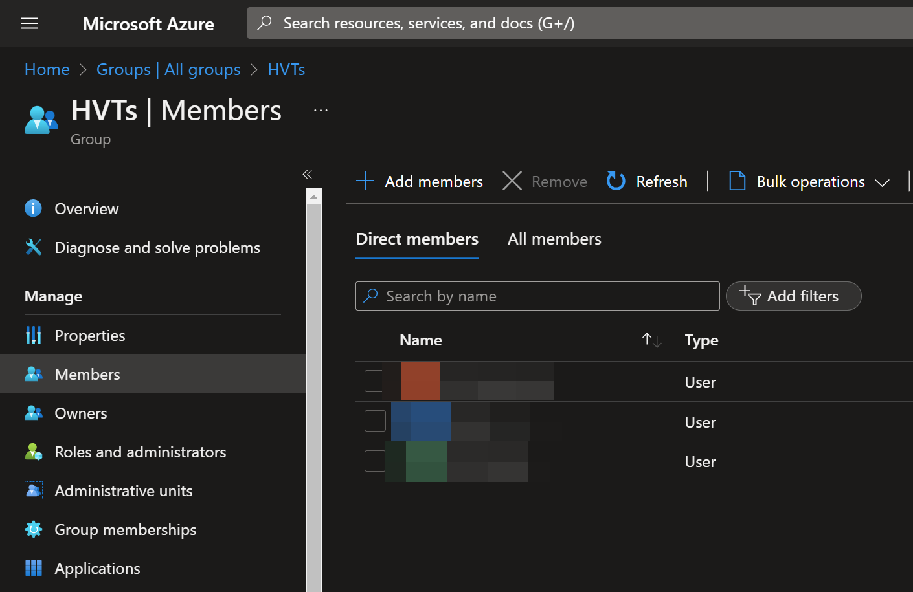

#
### Requirements

The following items are required under the template settings during deployment: 

* An [Azure Active Directory group Id](https://github.com/Azure/Azure-Sentinel/tree/master/Playbooks/AS-Import-AD-Group-Users-to-MS-Watchlist#azure-active-directory-group-id)

* A [Microsoft Sentinel watchlist](https://github.com/Azure/Azure-Sentinel/tree/master/Playbooks/AS-Import-AD-Group-Users-to-MS-Watchlist#create-a-microsoft-sentinel-watchlist)

* A [Microsoft Sentinel workspace Id](https://github.com/Azure/Azure-Sentinel/tree/master/Playbooks/AS-Import-AD-Group-Users-to-MS-Watchlist#microsoft-sentinel-workspace-id)

# 
### Setup

#### Azure Active Directory Group Id:

Navigate to the Azure Active Directory Groups page: 
https://portal.azure.com/#view/Microsoft_AAD_IAM/GroupsManagementMenuBlade/~/AllGroups

Create a new group or locate the existing group you would like to use with this playbook and click the name.

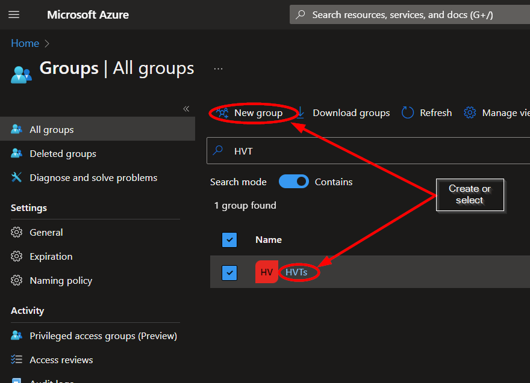

From the group "**Overview**" page, copy the value of the "**Object Id**" and save it for deployment.

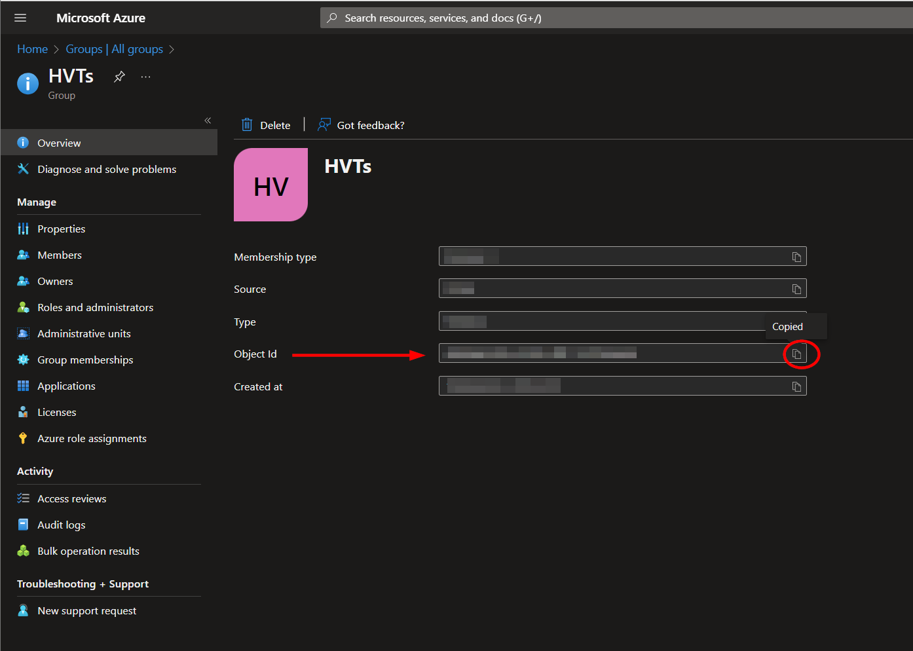

#### Create a Microsoft Sentinel Watchlist:

Navigate to the Microsoft Sentinel page and select a workspace:

https://portal.azure.com/#view/HubsExtension/BrowseResource/resourceType/microsoft.securityinsightsarg%2Fsentinel

Under the "**Configuration**" section of the menu, click "**Watchlist**", then click "**Add new**".

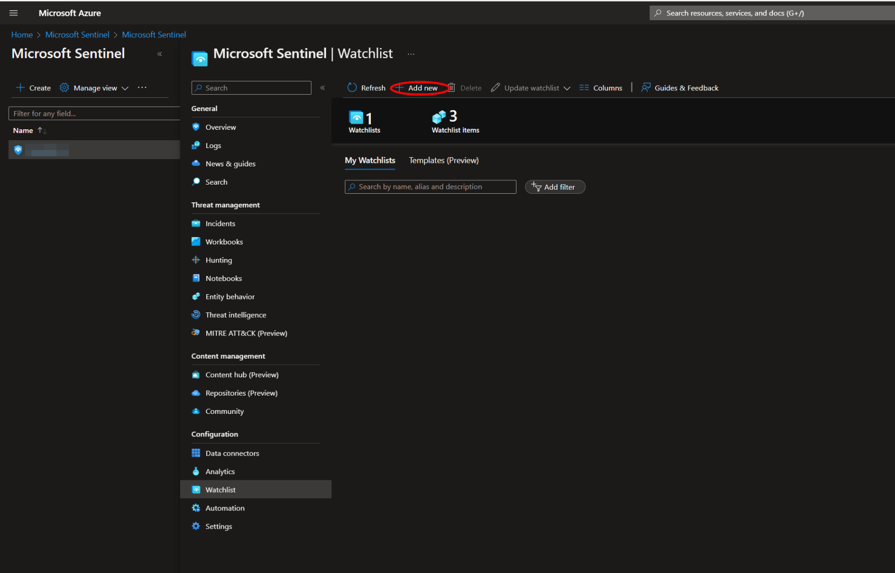

Fill out the required fields and take note of the value you use for "**Alias**" as this will be needed for deployment. Then click "**Next: Source**".

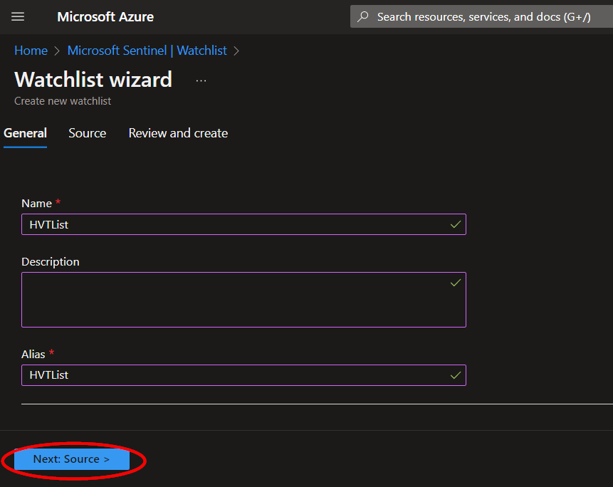

The watchlist cannot be created without initial data. We have created a file with the necessary headers and an entry that can later be deleted from the watchlist once it has been updated with additional entries.

Upload the "**watchlist_initialize.csv**" included in this repository and select "**id**" as the search key. Then click "**Next: Review and create**".

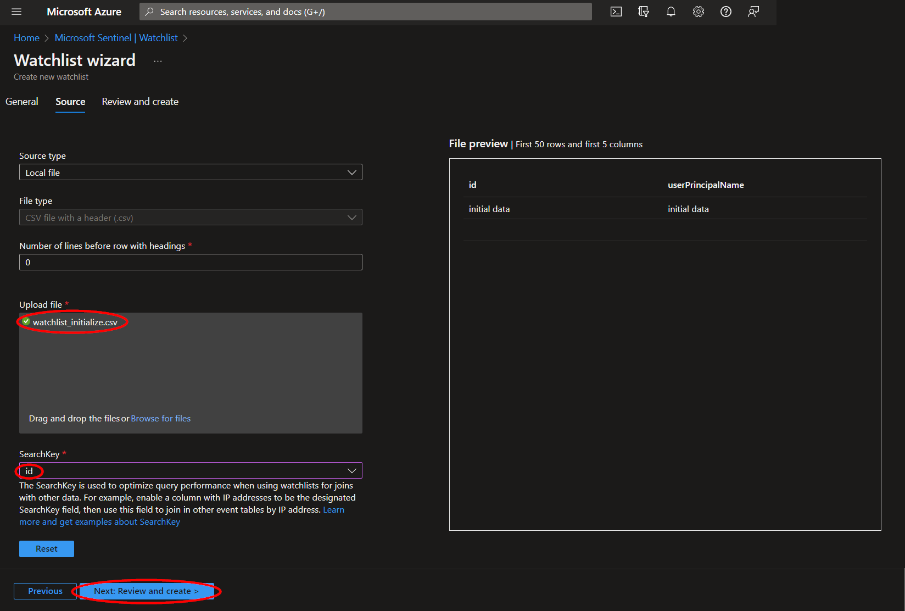

Review the information, then click "**Create**".
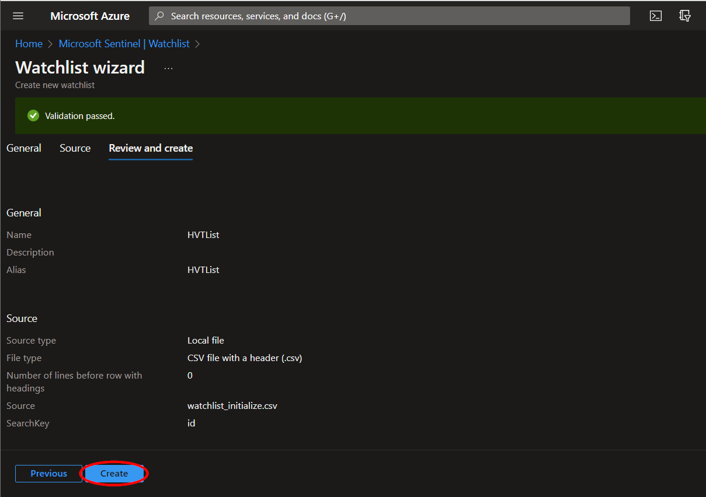

Once your watchlist has been created, you can view the entries by clicking the watchlist name from the "**Overview**" page, and then clicking "**View in logs**".

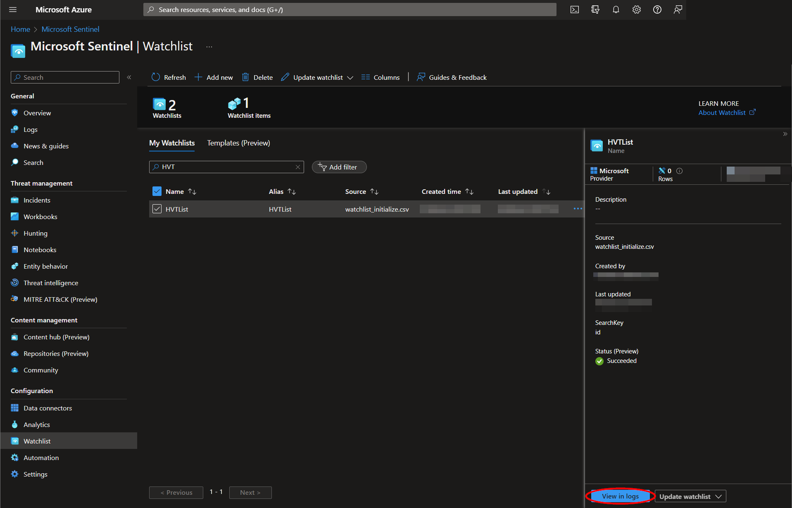

This will run a Kusto query for your watchlist and you should be able to see the initializing data that was just uploaded. Please note it may take a minute after the creation of your watchlist for the query to show results.

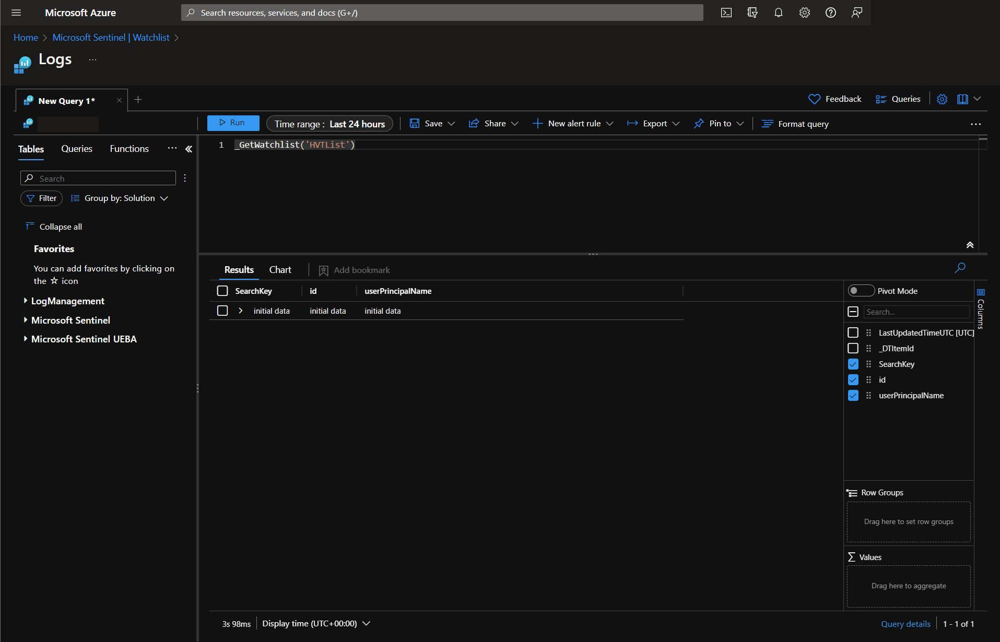

#### Microsoft Sentinel Workspace Id:

Navigate to the Microsoft Sentinel page and select the same workspace as before:

https://portal.azure.com/#view/HubsExtension/BrowseResource/resourceType/microsoft.securityinsightsarg%2Fsentinel

Under the "**Configuration**" section of the menu, click "**Settings**", then click the "**Workspace settings**" tab.

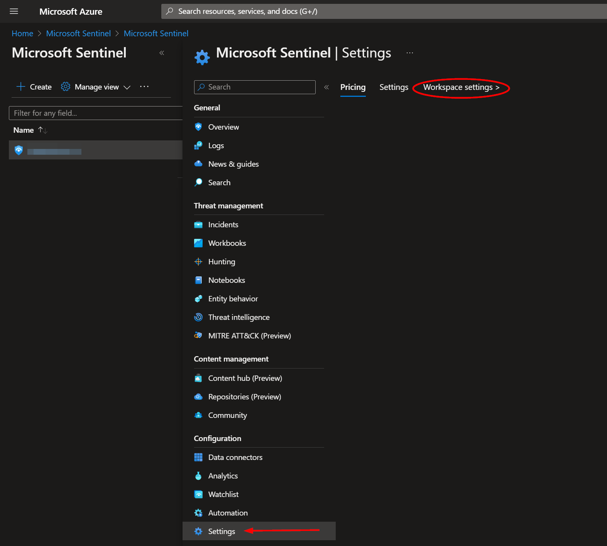

Copy the value of the "**Workspace ID**" field and save it for deployment.

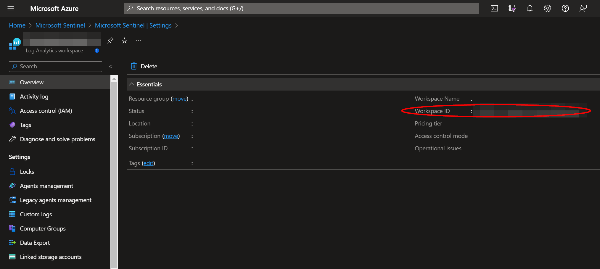

#
### Deployment                                                                                                         
                                                                                                        
To configure and deploy this playbook:
 
Open your browser and ensure you are logged into the same Microsoft Sentinel workspace selected above. In a separate tab, open the link to our playbook on the Accelerynt Security GitHub Repository:

https://github.com/Accelerynt-Security/AS-Import-AD-Group-Users-to-MS-Watchlist

                                             

Click the “**Deploy to Azure**” button at the bottom and it will bring you to the custom deployment template.

In the **Project Details** section:

* Select the “**Subscription**” and “**Resource Group**” from the dropdown boxes you would like the playbook deployed to.  

In the **Instance Details** section:   

* **Playbook Name**: This can be left as "**AS-Import-AD-Group-Users-to-MS-Watchlist**" or you may change it.  

* **Group Id**: Enter the Id of the Azure Active Directory group referenced in [Azure Active Directory group Id](https://github.com/Azure/Azure-Sentinel/tree/master/Playbooks/AS-Import-AD-Group-Users-to-MS-Watchlist#azure-active-directory-group-id).

* **Watchlist Name**: The name of the watchlist referenced in [Create a Microsoft Sentinel Watchlist](https://github.com/Azure/Azure-Sentinel/tree/master/Playbooks/AS-Import-AD-Group-Users-to-MS-Watchlist#create-a-microsoft-sentinel-watchlist)

* **Workspace Id**: The Id of the Microsoft Sentinel workspace the watchlist was created in, referenced in [Microsoft Sentinel workspace Id](https://github.com/Azure/Azure-Sentinel/tree/master/Playbooks/AS-Import-AD-Group-Users-to-MS-Watchlist#microsoft-sentinel-workspace-id)

Towards the bottom, click on “**Review + create**”. 

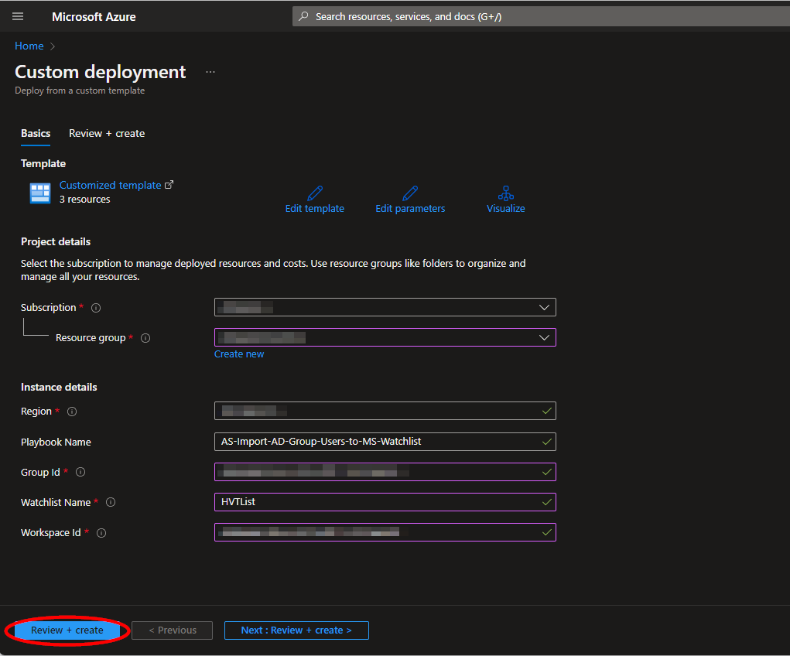

Once the resources have validated, click on "**Create**".

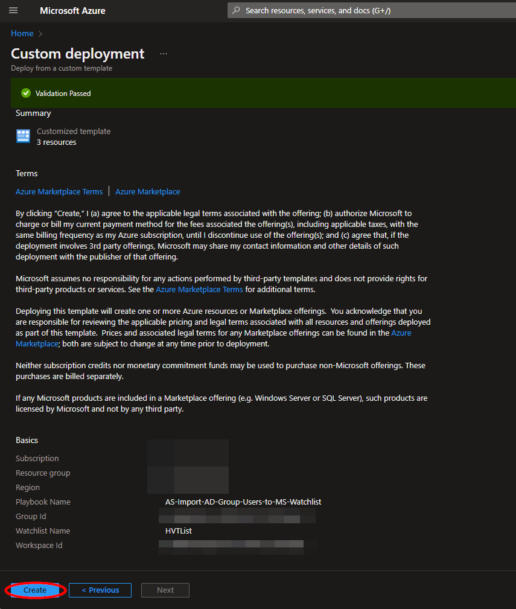

The resources should take around a minute to deploy. Once the deployment is complete, you can expand the "**Deployment details**" section to view them.
Click the one corresponding to the Logic App.

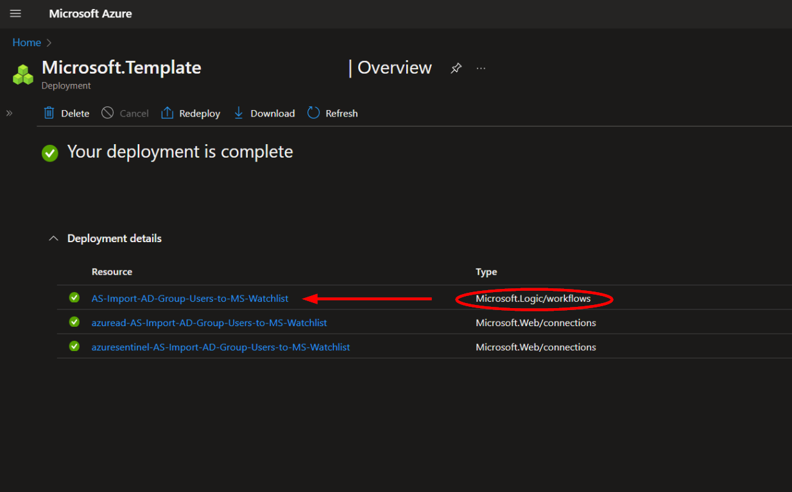

Click on the “**Edit**” button. This will bring us into the Logic Apps Designer.

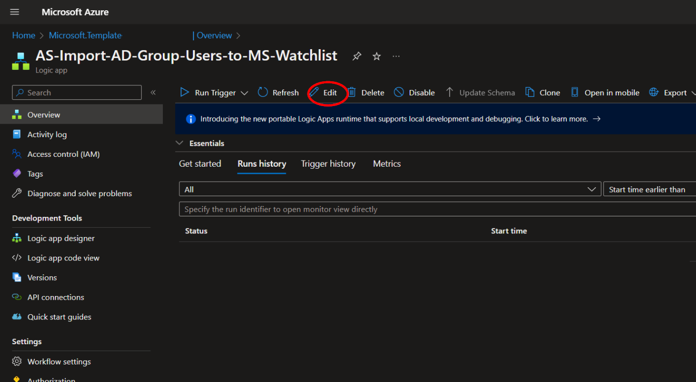

Before the playbook can be run successfully, the Azure AD connection used in the second step and the Microsoft Sentinel connection used in the fourth and ninth steps will either need to be authorized, or existing authorized connections may be alternatively selected.  

To validate the Azure AD connection, expand the second step labeled "**Connections**" and click the exclamation point icon next to the name matching the playbook.
                                                                                                
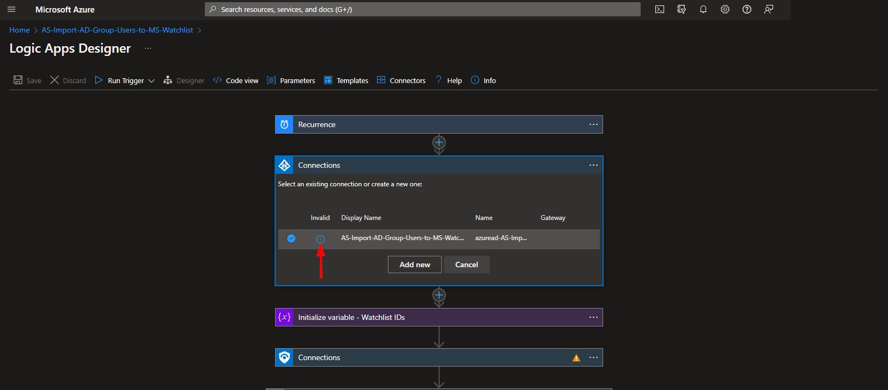

When prompted, sign in to validate the connection.  

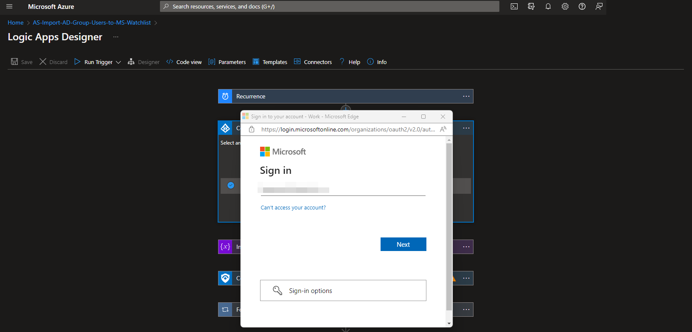

Repeat the process for the Microsoft Sentinel connection.

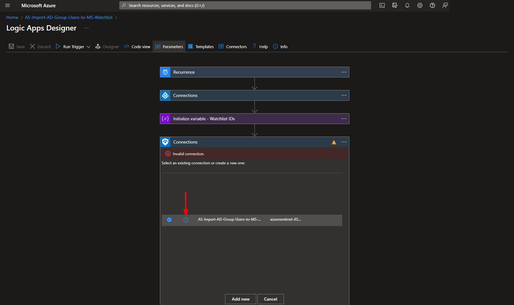

Returning to the "**Overview**" page of the logic app, it can now be run successfully.

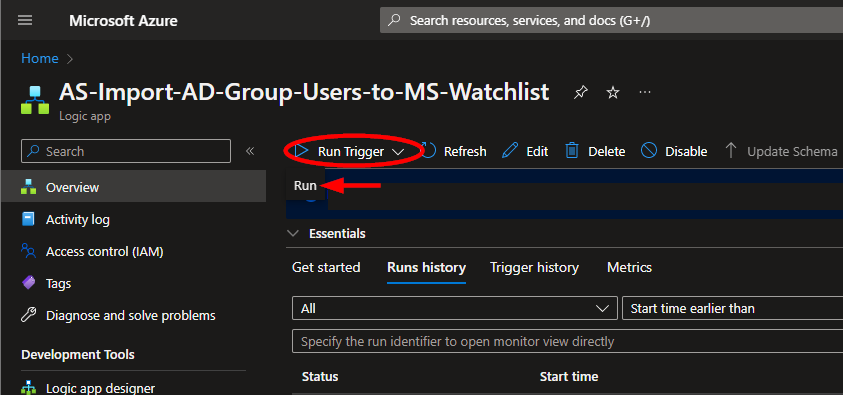

# 
### Add Microsoft Sentinel Contributor Role

To run successfully, this playbook requires Microsoft Sentinel Contributor role on the Log Analytics workspace.

Navigate to the Log Analytics Workspaces page and select the same workspace the watchlist is located in:

https://portal.azure.com/#view/HubsExtension/BrowseResource/resourceType/Microsoft.OperationalInsights%2Fworkspaces

Select the "**Access control (IAM)**" option from the menu blade, then click "**Add role assignment**".

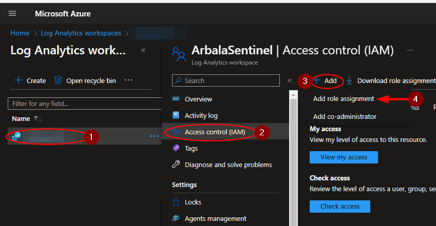

Select the "**Microsoft Sentinel Contributor**" role, then click "**Next**".

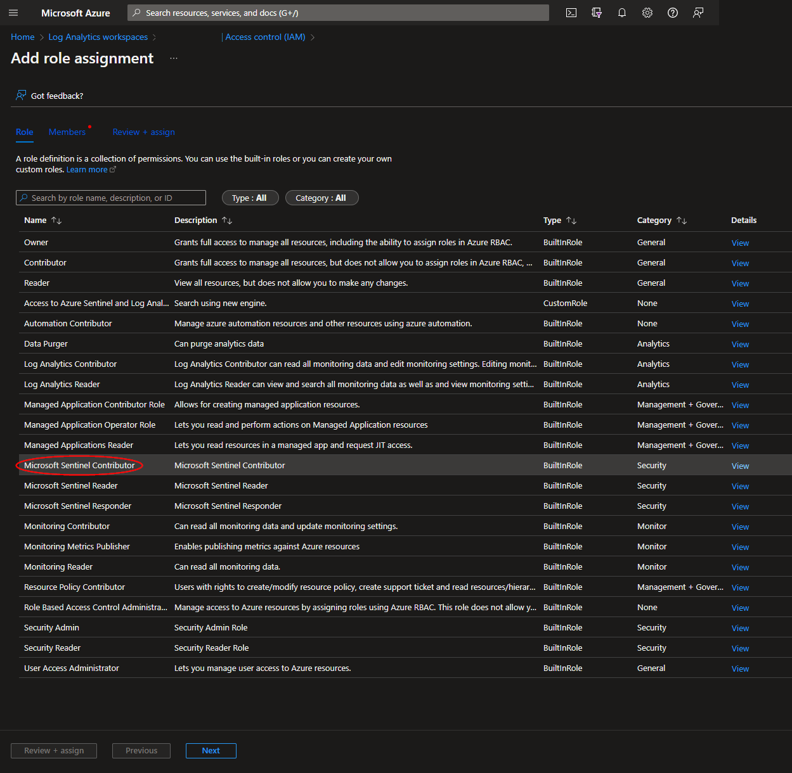

Select the "**Managed identity**" option, then under the subscription the logic app is located, set the value of "**Managed identity**" to "**Logic app**". Next, enter "**AS-Import-Azure-AD-Group-Users-to-MS-Watchlist**", or the alternative playbook name used during deployment, in the field labeled "**Select**". Select the playbook, then click "**Select**".

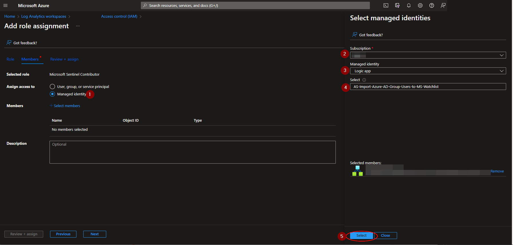

Continue on to the "**Review + assign**" tab and click "**Review + assign**".

# 
### Editing the Microsoft Sentinel Watchlist

A watchlist needs initial data in order to be created. Because of this, the watchlist will have a row with the values "**initial data**". Once the logic app has run successfully and other entries have been added, you can remove this row.

To do this, navigate back to the Microsoft Sentinel page:

https://portal.azure.com/#view/HubsExtension/BrowseResource/resourceType/microsoft.securityinsightsarg%2Fsentinel

Click the workspace name used during deployment and then click "**Watchlist**" under the "**Configuration**" section of the menu.

Click the name of the watchlist used during deployment. This will pull up a menu on the right side of the page. Click "**Update watchlist**".

Check the box of the row with the values "**initial data**" and click "**Delete**".

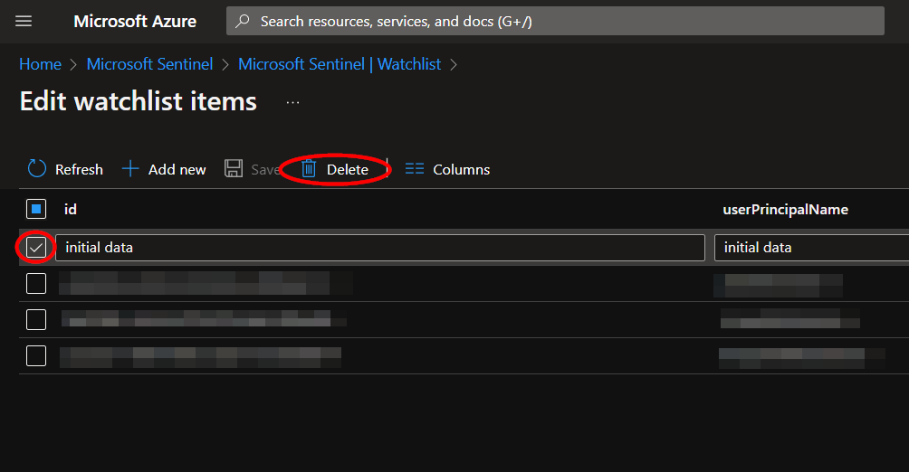
