# AS-Get-HostExposureLevel-From-MDE

Author: Accelerynt

For any technical questions, please contact info@accelerynt.com  

[](https://portal.azure.com/#create/Microsoft.Template/uri/https%3A%2F%2Fraw.githubusercontent.com%2FAzure%2FAzure-Sentinel%2Fmaster%2FPlaybooks%2FAS-Incident-Host-Exposure-Level%2Fazuredeploy.json)
[](https://portal.azure.us/#create/Microsoft.Template/uri/https%3A%2F%2Fraw.githubusercontent.com%2FAzure%2FAzure-Sentinel%2Fmaster%2FPlaybooks%2FAS-Incident-Host-Exposure-Level%2Fazuredeploy.json)       

This playbook is intended to be run from a Microsoft Sentinel Incident. It will match the Hosts from a Microsoft Sentinel Incident with Microsoft Defender Machines and add each Machine's exposure level as a comment on the Microsoft Sentinel Incident.
                                                                                                                                     
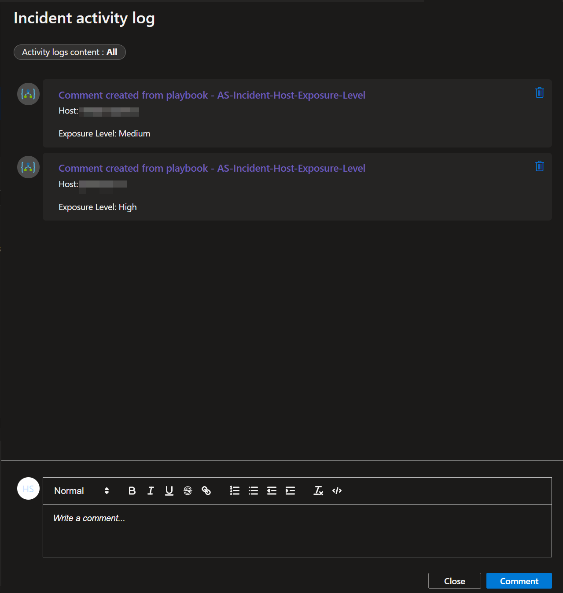

#
### Prerequisites

After deployment, you will need to give the system assigned managed identity the "**Microsoft Sentinel Contributor**" role. This will enable it to add comments to incidents. Run the following commands in PowerShell, replacing the managed identity object id and resource group name. You can find the managed identity object id on the Identity blade under Settings for the Logic App.

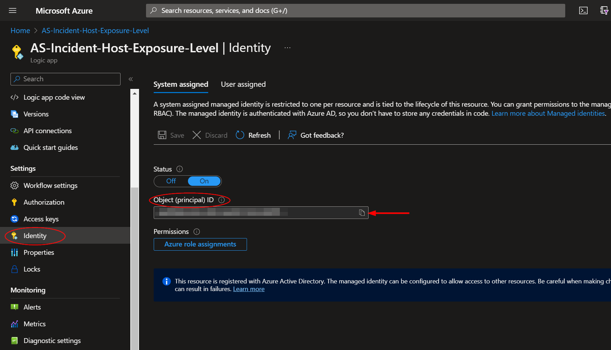

You will not need to run the Install-Module if this has been done before. More documentation on this module can be found here:

https://learn.microsoft.com/en-us/powershell/azure/install-az-ps?view=azps-9.3.0

```powershell
Install-Module -Name Az
Connect-AzAccount
New-AzRoleAssignment -ObjectId <logic app managed identity object id> -RoleDefinitionName "Microsoft Sentinel Contributor" -ResourceGroupName "<logic app resource group name>"
```


**Alternatively**, if you wish to do this through the GUI/portal:

Navigate to the Log Analytics Workspaces page and select the same workspace the playbook is located in:

https://portal.azure.com/#view/HubsExtension/BrowseResource/resourceType/Microsoft.OperationalInsights%2Fworkspaces

Select the "**Access control (IAM)**" option from the menu blade, then click "**Add role assignment**".


Select the "**Microsoft Sentinel Contributor**" role, then click "**Next**".


Select the "**Managed identity**" option, then under the subscription the logic app is located, set the value of "**Managed identity**" to "**Logic app**". Next, enter "**AS-Get-HostExposureLevel-From-MDE**", or the alternative playbook name used during deployment, in the field labeled "**Select**". Select the playbook, then click "**Select**".

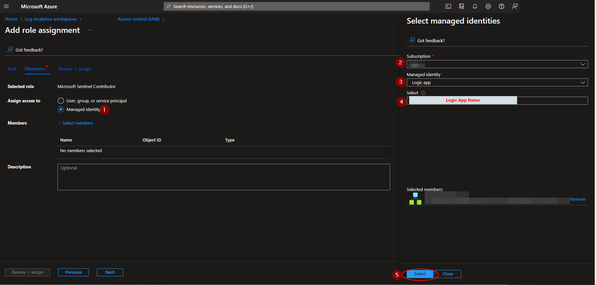

Continue on to the "**Review + assign**" tab and click "**Review + assign**".

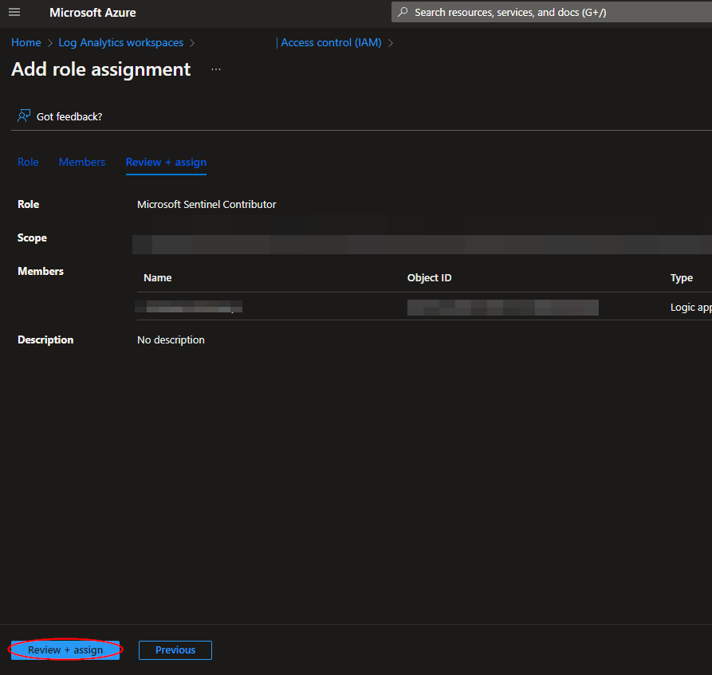


#
### Deployment

To configure and deploy this playbook:
 
Open your browser and ensure you are logged into your Microsoft Sentinel workspace. In a separate tab, open the link to our playbook on the Accelerynt Security GitHub Repository:

https://github.com/Accelerynt-Security/AS-Incident-Host-Exposure-Level

[](https://portal.azure.com/#create/Microsoft.Template/uri/https%3A%2F%2Fraw.githubusercontent.com%2FAzure%2FAzure-Sentinel%2Fmaster%2FPlaybooks%2FAS-Incident-Host-Exposure-Level%2Fazuredeploy.json)
[](https://portal.azure.us/#create/Microsoft.Template/uri/https%3A%2F%2Fraw.githubusercontent.com%2FAzure%2FAzure-Sentinel%2Fmaster%2FPlaybooks%2FAS-Incident-Host-Exposure-Level%2Fazuredeploy.json)                                             

Click the “**Deploy to Azure**” button at the bottom and it will bring you to the custom deployment template.

In the **Project Details** section:

* Select the “**Subscription**” and “**Resource Group**” from the dropdown boxes you would like the playbook deployed to.  

In the **Instance Details** section:   

* **Playbook Name**: This can be left as "**AS-Get-HostExposureLevel-From-MDE**" or you may change it.

Towards the bottom, click on “**Review + create**”. 

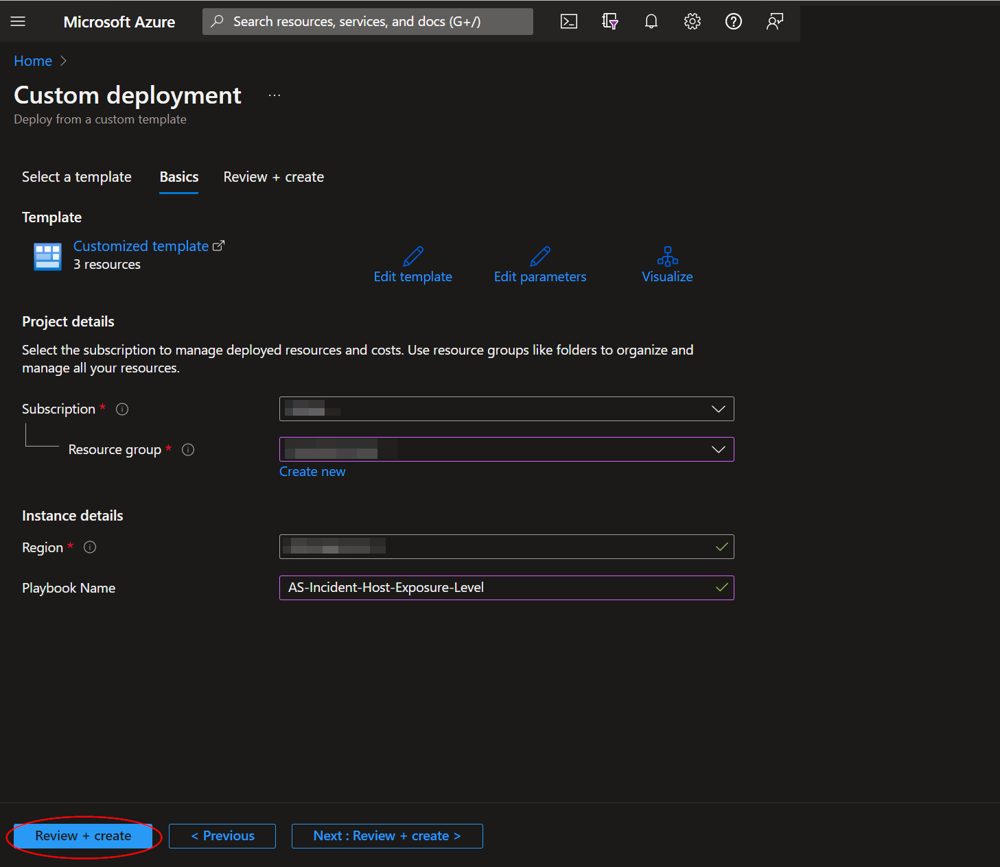

Once the resources have validated, click on "**Create**".

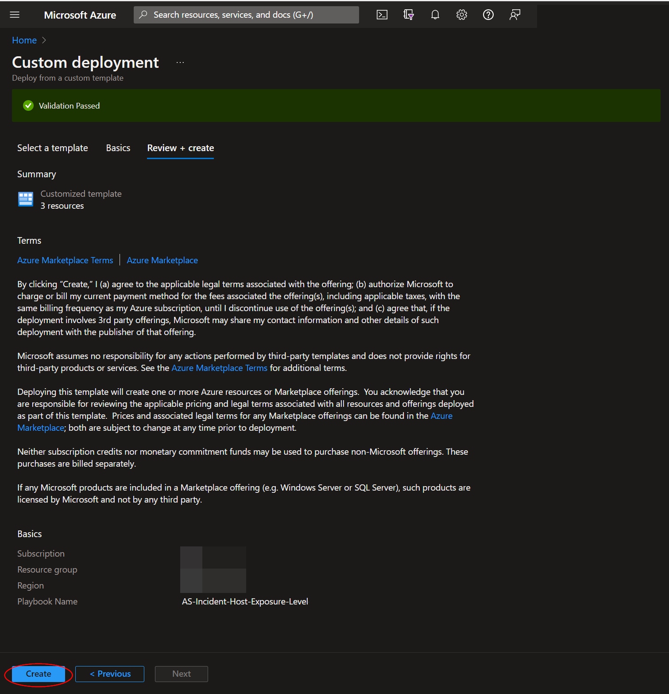

The resources should take around a minute to deploy. Once the deployment is complete, you can expand the "**Deployment details**" section to view them.
Click the one corresponding to the Logic App.

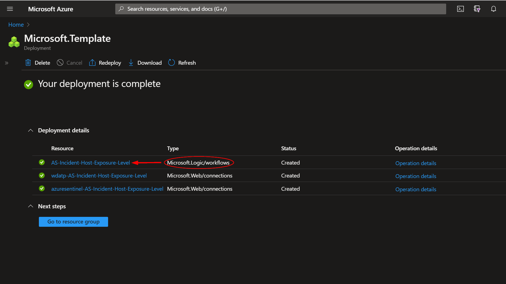

Click on the “**Edit**” button. This will bring us into the Logic Apps Designer.

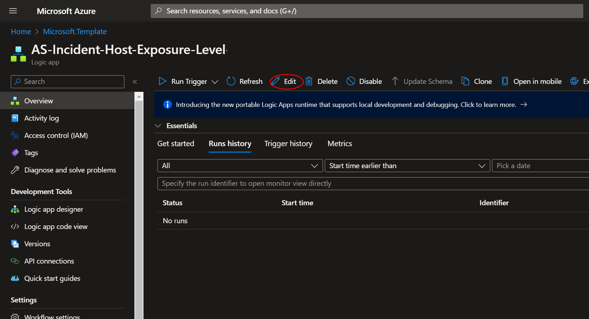

Expand the step labeled "**Condition - Check for Hosts**". The sixth step labeled "**Connections**" uses a wdatp connection, which is responsible for communicating with Microsoft Defender. Before the playbook can be run, this connection will either need to be authorized, or an existing authorized connection may be alternatively selected for each.  


To validate the wdatp connection created for this playbook, expand the "**Connections**" step and click the exclamation point icon next to the name matching the playbook.
                                                                                                
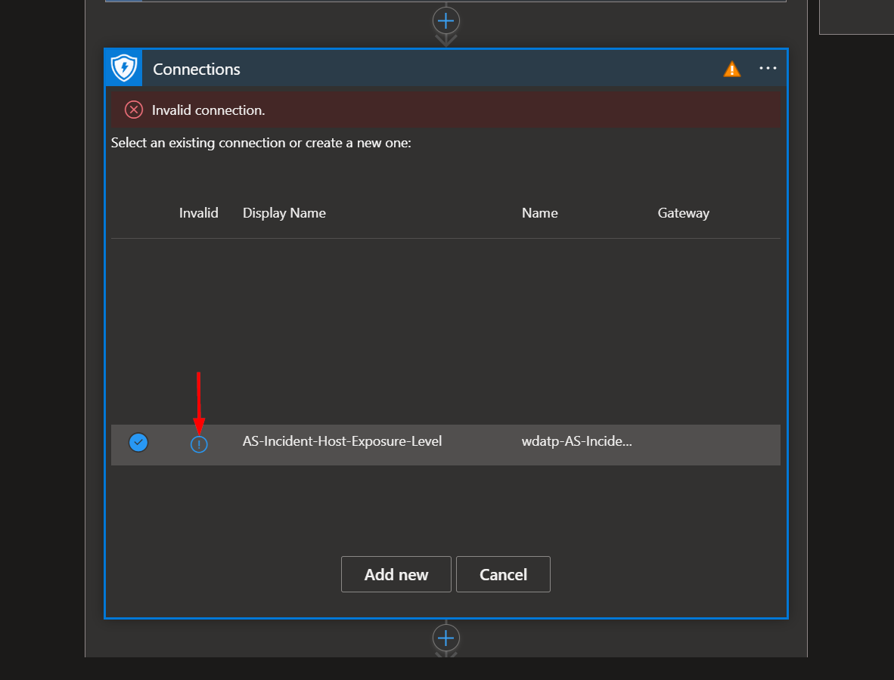

When prompted, sign in to validate the connection.                                                                                                
                                                                                                
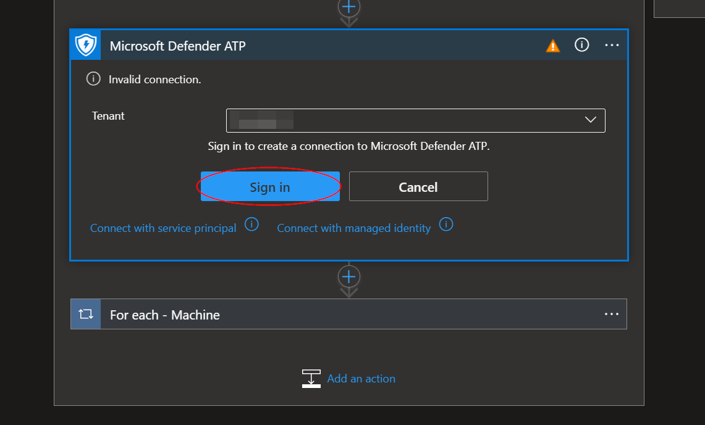


#
### Running the Playbook 

To run this playbook from a Microsoft Sentinel incident, navigate to Microsoft Sentinel:

https://portal.azure.com/#view/HubsExtension/BrowseResource/resourceType/microsoft.securityinsightsarg%2Fsentinel

Select a workspace and then click the "**Incidents**" menu option located under "**Threat management**". Select an incident with compromised host entities.

Click on the "**Action**" list button on the bottom right of the screen and select "**Run playbook**".


From the "**Run playbook on incident**" view, type "**AS-Incident-Host-Exposure-Level**" into the search bar, then click run.

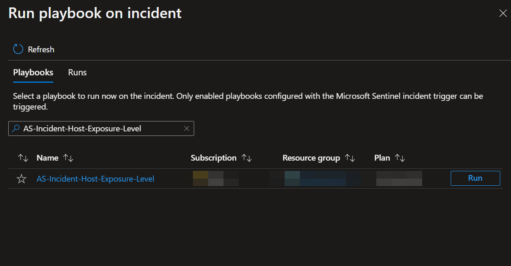
