# AS-Incident-IP-Matched-on-Watchlist

Author: Accelerynt

For any technical questions, please contact info@accelerynt.com  

       

This playbook is intended to be run from a Microsoft Sentinel incident. If any IP entities are found to match those in a specified watchlist containing a list of subnets, a comment noting the match(es) will be added to the incident and the incident will be tagged with a label of your choosing.

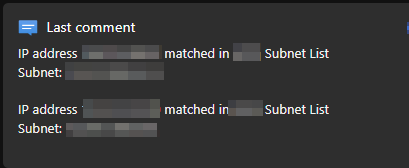
 
 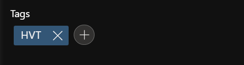

                                                                                                            
#
### Requirements
                                                                                                                                     
The following items are required under the template settings during deployment: 

* A [Microsoft Sentinel Watchlist](https://github.com/Azure/Azure-Sentinel/tree/master/Playbooks/AS-Incident-IP-Matched-on-Watchlist#create-a-microsoft-sentinel-watchlist) containing subnets is needed

# 
### Setup
                                                                                                                                     
#### Create a Microsoft Sentinel Watchlist:

If you already have a Microsoft Sentinel watchlist with subnet values, take note of the name and skip this step. 

Otherwise, navigate to the Microsoft Sentinel page and select a workspace:

https://portal.azure.com/#view/HubsExtension/BrowseResource/resourceType/microsoft.securityinsightsarg%2Fsentinel

Under the "**Configuration**" section of the menu, click "**Watchlist**", then click "**Add new**".

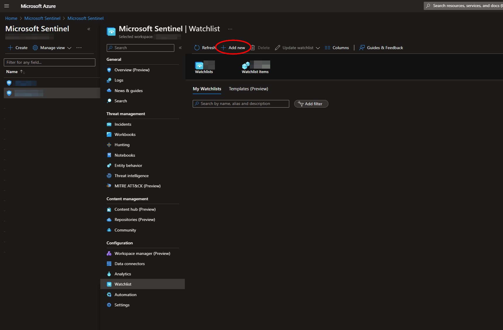

Fill out the required fields and take note of the value you use for "**Alias**" as this will be needed for deployment. Then click "**Next: Source**".

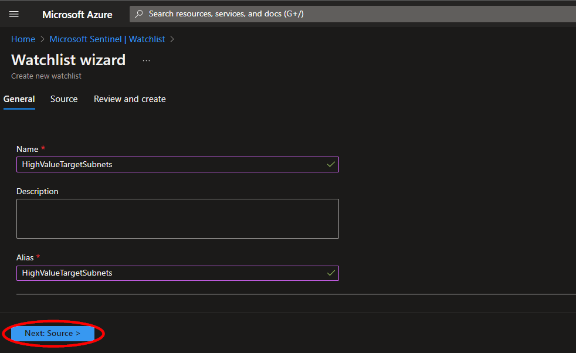

The watchlist cannot be created without initial data. A template for a watchlist containing subnets can be found here: https://learn.microsoft.com/en-us/azure/sentinel/watchlist-schemas#network-mapping

Upload your .csv file and be sure to select the field containing the subnet values as the search key. Then click "**Next: Review and create**".

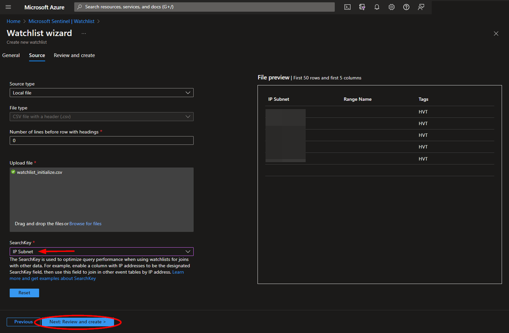

Review the information, then click "**Create**".

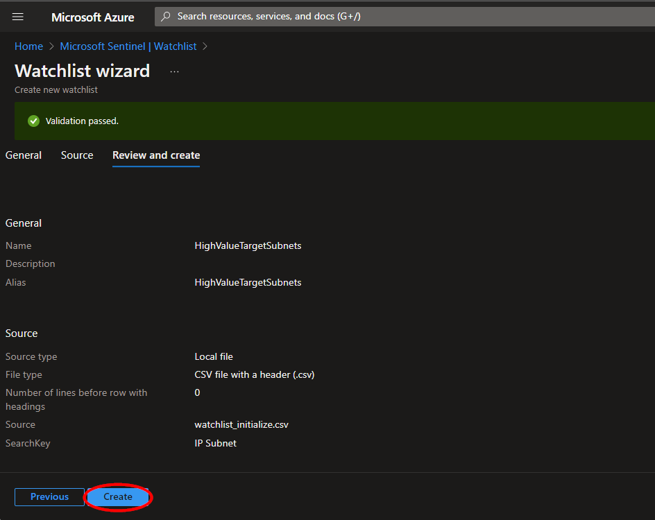

Once your watchlist has been created, you can view the entries by clicking the watchlist name from the "**Overview**" page, and then clicking "**View in logs**". This will run a Kusto query for your watchlist and you should be able to see the initializing data that was just uploaded. Please note it may take a minute after the creation of your watchlist for the query to show results. Alternatively, the watchlist items can be edited by clicking "**Update watchlist**".

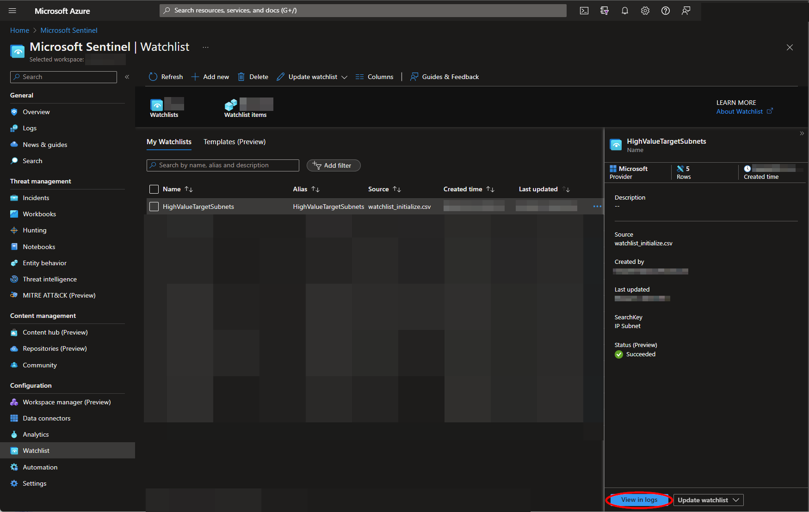

#### Microsoft Sentinel Resource Group Name:

Navigate to the Microsoft Sentinel page and select the same workspace as before:

https://portal.azure.com/#view/HubsExtension/BrowseResource/resourceType/microsoft.securityinsightsarg%2Fsentinel

Under the "**Configuration**" section of the menu, click "**Settings**", then click the "**Workspace settings**" tab.

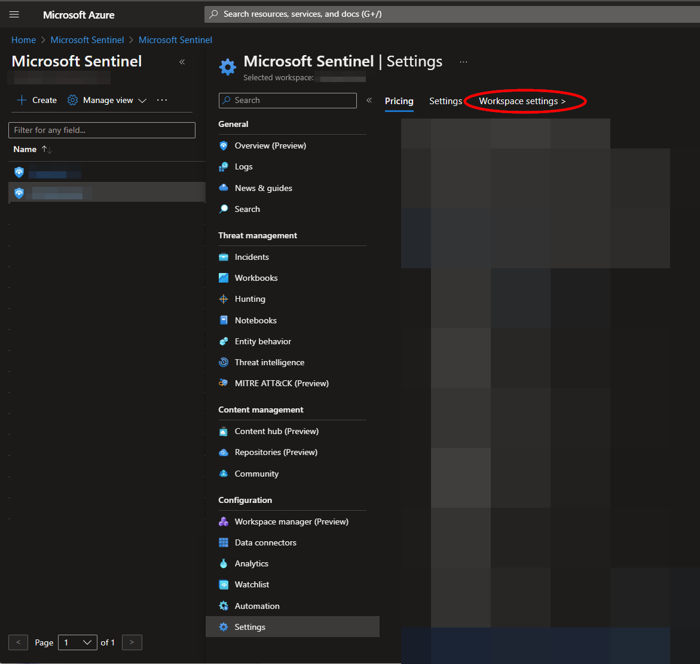

Copy the value of the "**Resource Group Name**" field and save it for deployment. You will also need to take note of the workspace name.

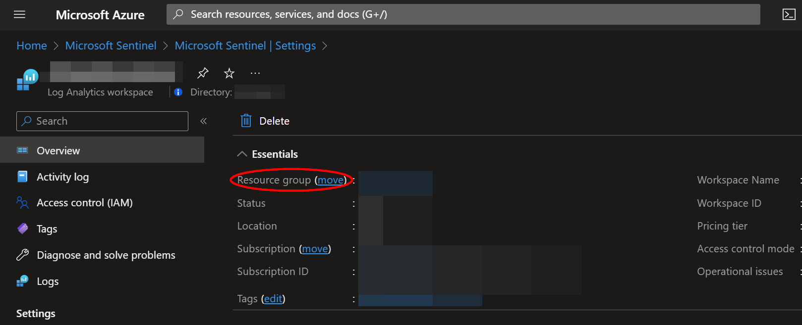

#
### Deployment                                                                                                         
                                                                                                        
To configure and deploy this playbook:
 
Open your browser and ensure you are logged into your Microsoft Sentinel workspace. In a separate tab, open the link to our playbook on the Accelerynt Security GitHub Repository:

https://github.com/Accelerynt-Security/AS-Incident-IP-Matched-on-Watchlist

                                             

Click the "**Deploy to Azure**" button at the bottom and it will bring you to the custom deployment template.

In the **Project Details** section:

* Select the "**Subscription**" and "**Resource Group**" from the dropdown boxes you would like the playbook deployed to.  

In the **Instance Details** section:   

* **Playbook Name**: This can be left as "**AS-Incident-IP-Matched-on-Watchlist**" or you may change it.  

* **Watchlist Name**: The name of the watchlist referenced in [Create a Microsoft Sentinel Watchlist](https://github.com/Accelerynt-Security/AS-Import-AD-Group-Users-to-MS-Watchlist#create-a-microsoft-sentinel-watchlist)

* **Workspace Name**: The name of the Microsoft Sentinel workspace the watchlist was created in, referenced in [Microsoft Sentinel Resource Group Name](https://github.com/Accelerynt-Security/AS-Import-AD-Group-Users-to-MS-Watchlist#microsoft-sentinel-resource-group-name)

* **Resource Group Name**: The name of the Microsoft Sentinel resource group the workspace is housed in, referenced in [Microsoft Sentinel Resource Group Name](https://github.com/Accelerynt-Security/AS-Import-AD-Group-Users-to-MS-Watchlist#microsoft-sentinel-resource-group-name)

* **Incident Tag**: The name of the tag to add to the Microsoft Sentinel incident

Towards the bottom, click on "**Review + create**". 

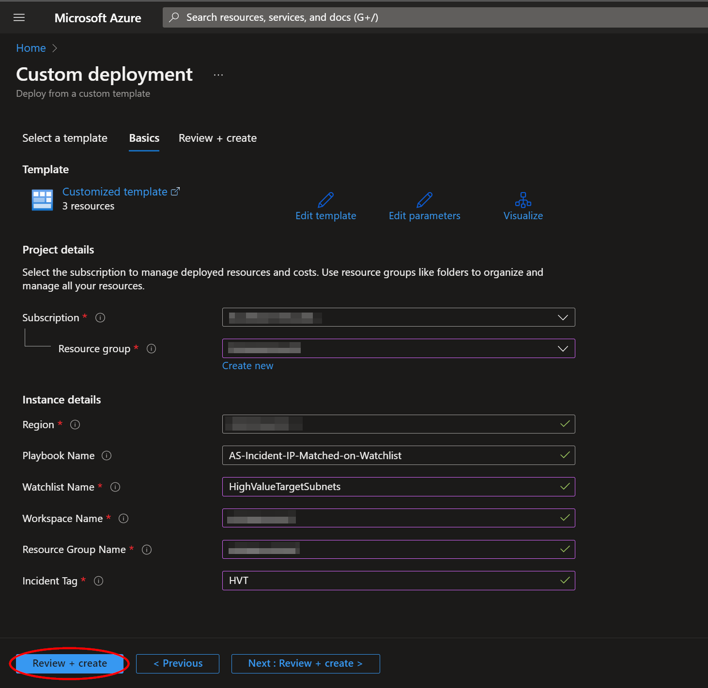

Once the resources have validated, click on "**Create**".

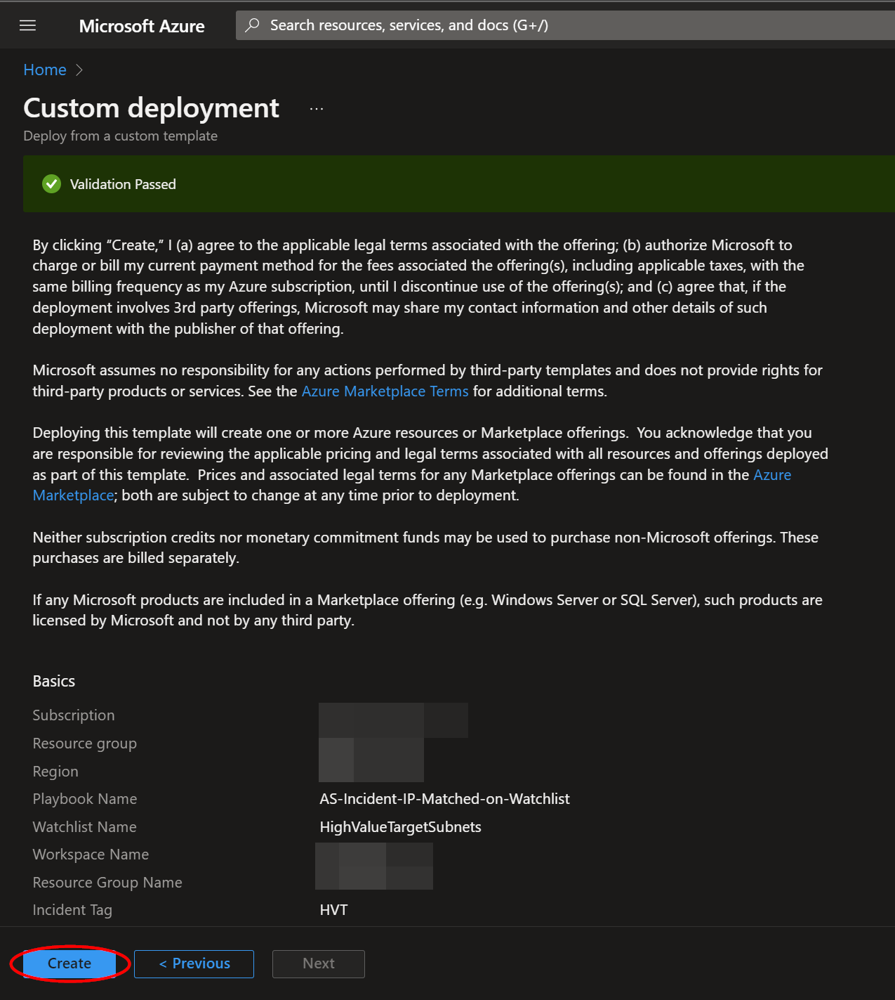

The resources should take around a minute to deploy. Once the deployment is complete, you can expand the "**Deployment details**" section to view them.
Click the one corresponding to the Logic App.

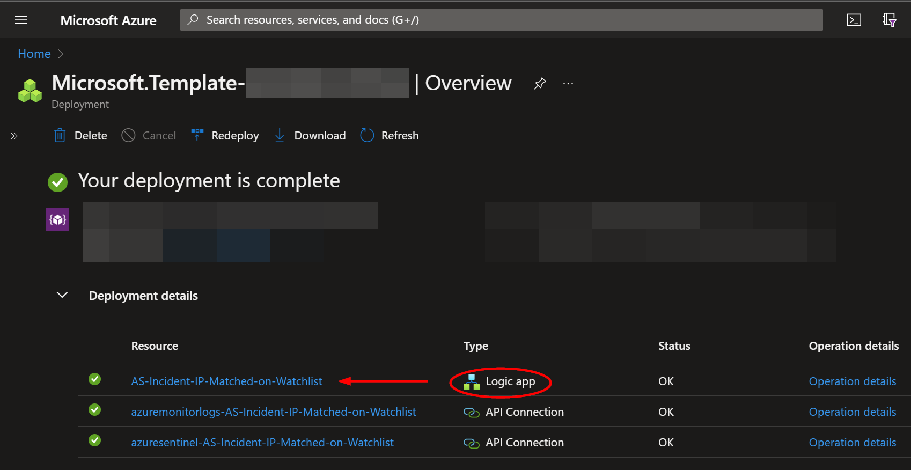

#
### Microsoft Sentinel Contributor Role

After deployment, you will need to give the system assigned managed identity the "**Microsoft Sentinel Contributor**" role. This will enable it to add comments to incidents. Navigate to the Log Analytics Workspaces page and select the same workspace the playbook is located in:

https://portal.azure.com/#view/HubsExtension/BrowseResource/resourceType/Microsoft.OperationalInsights%2Fworkspaces

Select the "**Access control (IAM)**" option from the menu blade, then click "**Add role assignment**".

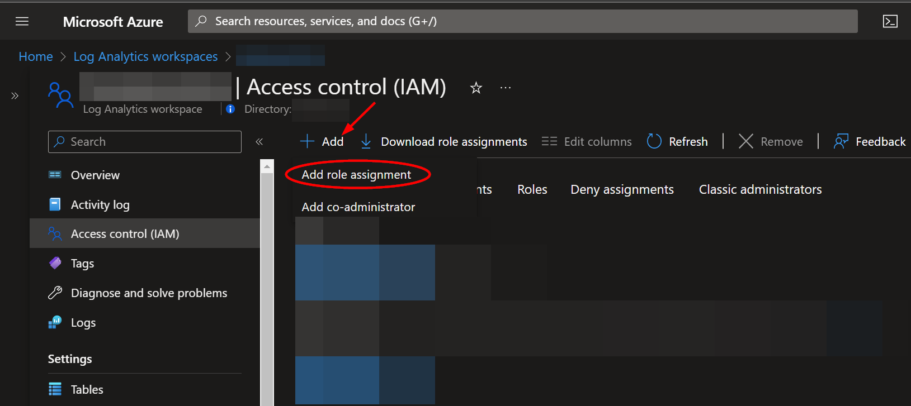

Select the "**Microsoft Sentinel Contributor**" role, then click "**Next**".

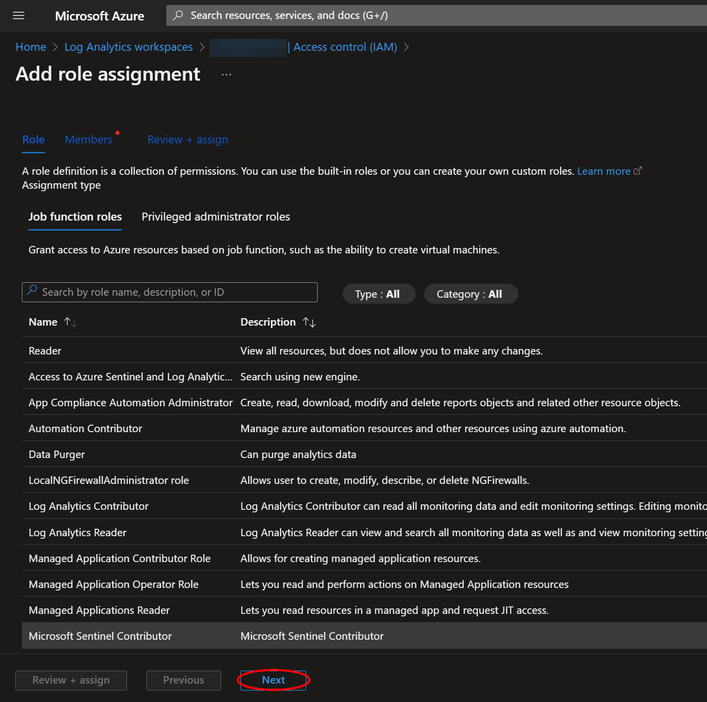

Select the "**Managed identity**" option, then click "**Select Members**". Under the subscription the logic app is located, set the value of "**Managed identity**" to "**Logic app**". Next, enter "**AS-Incident-IP-Matched-on-Watchlist**", or the alternative playbook name used during deployment, in the field labeled "**Select**". Select the playbook, then click "**Select**".

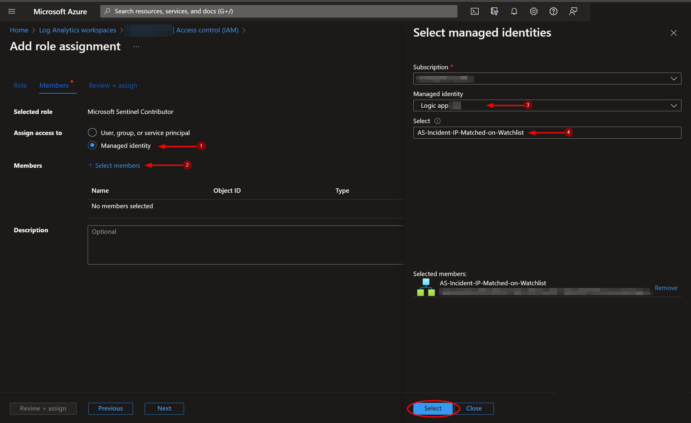

Continue on to the "**Review + assign**" tab and click "**Review + assign**".

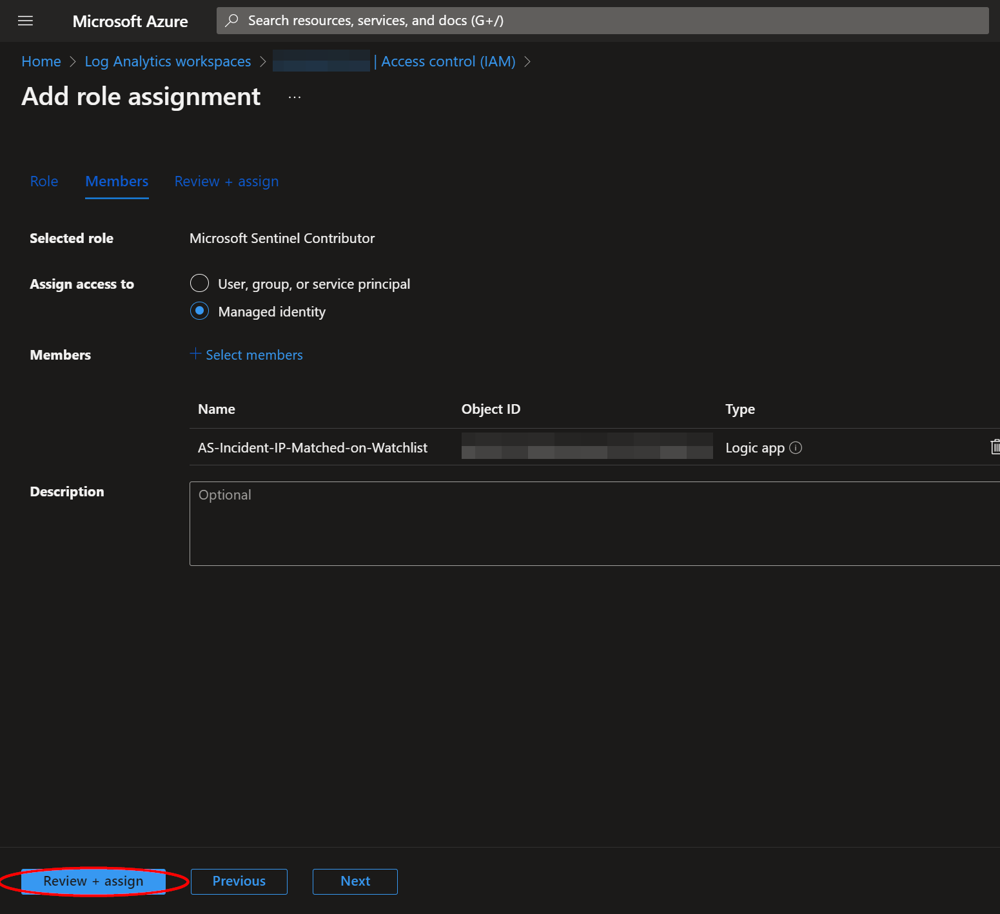
