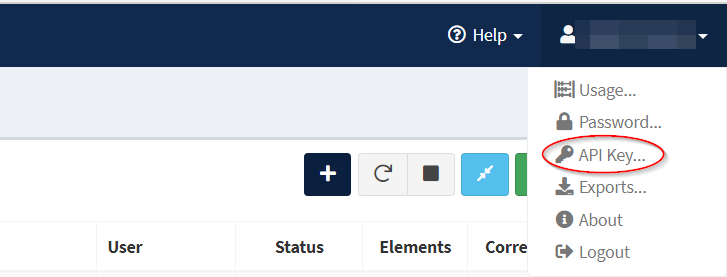
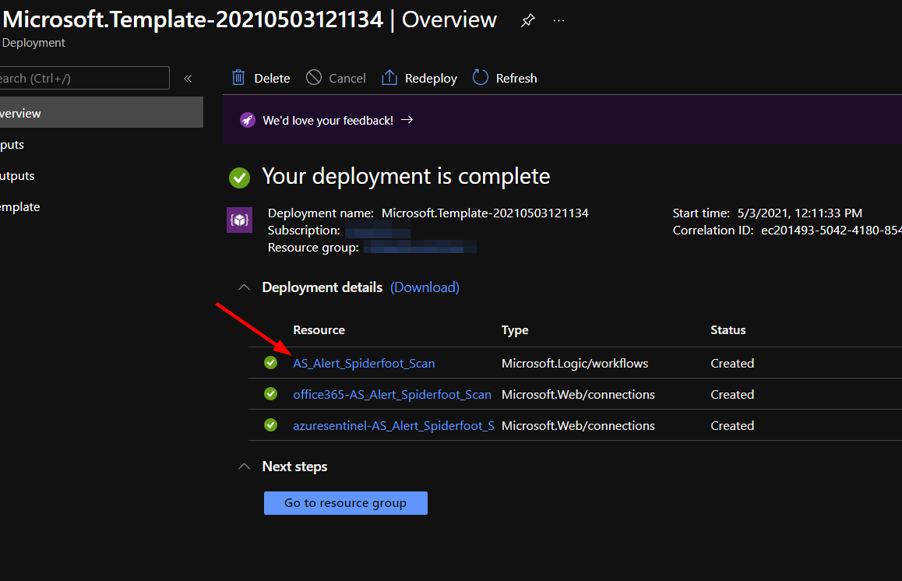
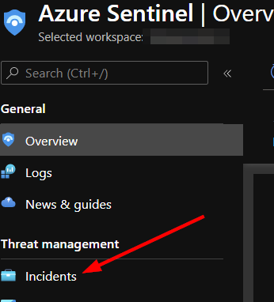
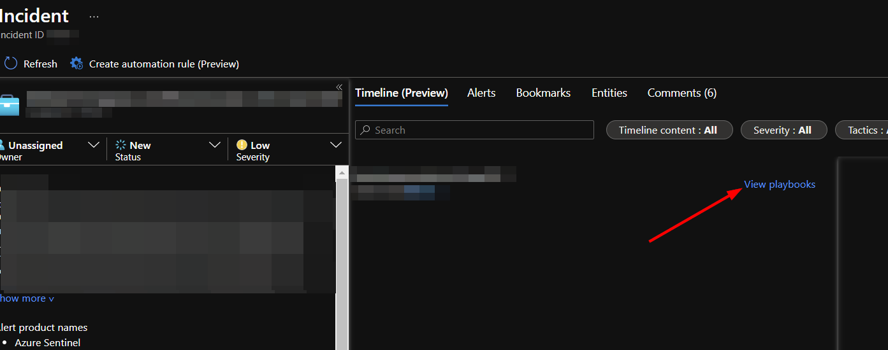

# AS-Incident-Spiderfoot-Scan

Author: Accelerynt

For any technical questions, please contact info@accelerynt.com  

This playbook is intended to be run from a Microsoft Sentinel incident. It will pull email addresses from the account entities in an incident and use them as targets in a Spiderfoot scan. By default, the scan is created using the HaveIBeenPwned module. The resulting report of that scan will be emailed to a recipient specified upon deployment.

#
### Requirements

The following items are required under the template settings during deployment: 

* The unique subdomain of your Spiderfoot account
* Your Spiderfoot API key
* The email address you would like to have the completed Spiderfoot report link sent to

# 
### Setup

#### Spiderfoot Subdomain
 
Once you have logged into your Spiderfoot account, take note of your unique subdomain, as it is needed to make API calls. This would be "**example**" in "**example.hx.spiderfoot.net**".

#### Spiderfoot API Key
 
 Log into your Spiderfoot account and in the top right-hand corner under your name, click the "**API Key**" option.
 

#
### Deployment                                                                                                         
                                                                                                        
To configure and deploy this playbook:
 
Open your browser and ensure you are logged into your Microsoft Sentinel workspace. In a separate tab, open the link to our playbook on the Accelerynt Security GitHub Repository:

https://github.com/Accelerynt-Security/AS-Incident-Spiderfoot-Scan

                                             

From there, click the "**Deploy to Azure**" button at the bottom and it will bring you to the Custom Deployment Template.

In the first section:  

* Select the "**Subscription**" and "**Resource Group**" from the dropdown boxes you would like the playbook deployed to.  

In the **Parameters** section:   

* **Playbook Name**: This can be left as "**AS-Incident-Spiderfoot-Scan**" or you may change it.  

* **Spiderfoot Subdomain**: Enter the name of the unique subdomain referenced in [Spiderfoot Subdomain](https://github.com/Accelerynt-Security/AS-Incident-Spiderfoot-Scan#spiderfoot-subdomain). You do not need to include "https://".

* **Spiderfoot API Key**: Enter your Spiderfoot API key referenced in [Spiderfoot API Key](https://github.com/Accelerynt-Security/AS-Incident-Spiderfoot-Scan#spiderfoot-api-key).

* **Email Addresses**:  Enter the desired email addresses here. If entering more than one, separate with a semicolon. 

Towards the bottom, click on "**Review + create**". 

Once the resources have validated, click on "**Create**".

The resources should take around a minute to deploy. Once the deployment is complete, you can expand the "**Deployment details**" section to view them.
To view the deployed Logic App, click the resource that corresponds to it.

#
To run this playbook on an incident in Azure Sentinel, navigate to "**Incidents**" under "**Threat Management**" in the left-hand menu.

From there you can select an incident that has one or more account entities.

Click the "**View full details**" button in the bottom right-hand corner.

In the middle window, scroll to the right and click "**View playbooks**".

Find the "**AS-Incident-Spiderfoot-Scan**" playbook and click "**Run**".

The playbook will run until the Spiderfoot scan it initiates is completed. Once the scan is finished, an email will be sent to the addresses specified in the deployment parameters. The email will contain the account entities pulled from the incident, the modules used in the Spiderfoot scan, and a link to the completed Spiderfoot report.
