 # AS-Microsoft-DCR-Log-Ingestion

Author: Accelerynt

For any technical questions, please contact info@accelerynt.com  

       

This playbook is intended for multitenant organizations and is designed to run on a timed trigger and pull Microsoft Graph and Microsoft Office logs to Microsoft Sentinel using Data Collection Endpoints and Data Collection Rules. While Microsoft does have built in connectors for this, they do not support multitenant functionality. This playbook is configured to grab the following logs for a tenant of your choosing and send them to another tenant:
* [Microsoft Graph Sign-In Logs](https://learn.microsoft.com/en-us/graph/api/signin-get?view=graph-rest-1.0&tabs=http)
* [Microsoft Graph Audit Logs](https://learn.microsoft.com/en-us/graph/api/directoryaudit-get?view=graph-rest-1.0&tabs=http)
* [Microsoft Office Activity Logs](https://learn.microsoft.com/en-us/office/office-365-management-api/office-365-management-activity-api-reference). 
                                                                                                                                     

> [!NOTE]  
> Estimated Time to Complete: 3 hours

> [!TIP]
> Required deployment variables will be noted throughout the setup. It is recommended that you look at the deployment page and fill out the required fields as you go.

#
### Requirements
                                                                                                                                     
The following items are required under the template settings during deployment: 

* Note your [subscription ID](https://portal.azure.com/#view/Microsoft_Azure_Billing/SubscriptionsBladeV2) for the tenant that will be sending the data
* A Microsoft Entra [app registration](https://github.com/Azure/Azure-Sentinel/tree/master/Playbooks/AS-Microsoft-DCR-Log-Ingestion#create-an-app-registration) to send data to the DCR with admin consent granted for "**AuditLog.Read.All**" and "**Activity.Feed.Read**"
* A Microsoft Entra [app registration](https://github.com/Azure/Azure-Sentinel/tree/master/Playbooks/AS-Microsoft-DCR-Log-Ingestion#create-an-app-registration) in the receiving tenant where the DCR is located. This app registration must have the "**Monitoring Metrics Publisher**" role assigned from each DCR you create.
* [App Registration Azure key vault secrets](https://github.com/Azure/Azure-Sentinel/tree/master/Playbooks/AS-Microsoft-DCR-Log-Ingestion#create-an-app-registration-azure-key-vault-secret) containing your app registration client secrets
* Note your [workspace location](https://portal.azure.com/#browse/Microsoft.OperationalInsights%2Fworkspaces) for the tenant that will be receiving data, as this will need to be the same for Data Collection Rules and Endpoints created in the steps below
* A [Microsoft Data Collection Endpoint](https://github.com/Azure/Azure-Sentinel/tree/master/Playbooks/AS-Microsoft-DCR-Log-Ingestion#create-the-data-collection-endpoints) for each of the log sources
* A [Microsoft Data Collection Rule](https://github.com/Azure/Azure-Sentinel/tree/master/Playbooks/AS-Microsoft-DCR-Log-Ingestion#create-the-data-collection-rules) for each of the log sources
* An [Azure key vault secret](https://github.com/Azure/Azure-Sentinel/tree/master/Playbooks/AS-Microsoft-DCR-Log-Ingestion#create-an-azure-key-vault-secret) containing your client secret for each of your Data Collection Endpoints

#
### Role Requirements

If the user that will be performing the setup and deployment steps does not have "**Owner**" or "**Global Administrator**" assigned in both tenants, the following roles may be required:

The following roles are required in the **sending tenant**: 

* The **Privileged Role Administrator** role will need to be assigned to the user from Entra ID.
* By default, any user can create an app registration, however, if this has been locked down, the "**Application Administrator**" role will need to be assigned from Entra ID.

The following roles are required in the **receiving tenant**: 

* In order to create and manage secrets within the desired Key Vault, the **Key Vault Secrets Officer** role will need to be assigned to the user from the Key Vault Access control (IAM) page.
* In order to add role assignments to DCRs, the **User Access Admin** and "**Contributor**" roles will need to be assigned to the user from the resource group.

# 
### Setup

#### Create an App Registration

From the tenant you wish to **send the Microsoft Graph and Office data from**, navigate to the Microsoft Azure Active Directory app registration page: https://portal.azure.com/#view/Microsoft_AAD_RegisteredApps/ApplicationsListBlade

Click "**New registration**".

Enter "**AS-Send-Logs-to-DCR**" for the name and select "**Accounts in any organizational directory**" for "**Supported account types**. All else can be left as is. Click "**Register**"

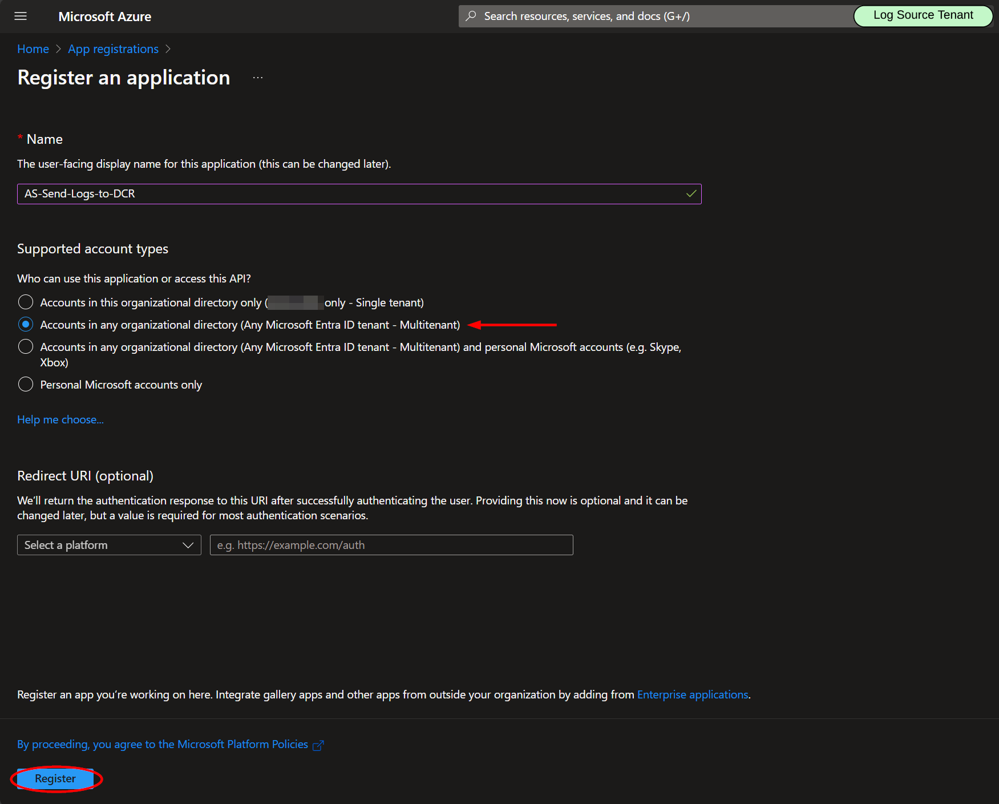

Once the app registration is created, you will be redirected to the "**Overview**" page. Under the "**Essentials**" section, take note of the "**Application (client) ID**" and the "**Directory (tenant) ID**", as both will be needed for deployment.

Next, you will need to add permissions for the app registration to call the Microsoft Graph and Office 365 API endpoints. From the left menu blade, click "**API permissions**" under the "**Manage**" section. Then, click "**Add a permission**".

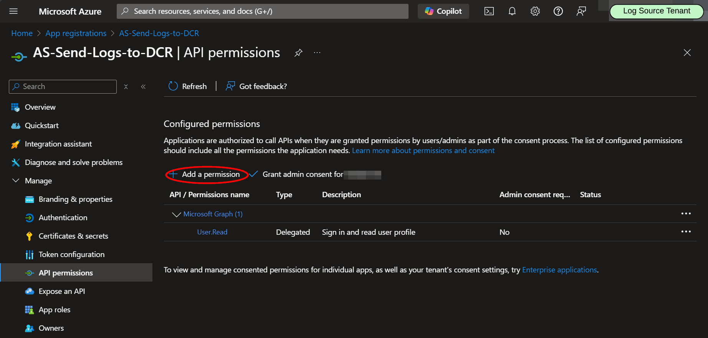

From the "**Select an API**" pane, click the "**Microsoft APIs**" tab and select "**Microsoft Graph**".

Click "**Application permissions**", then paste "**AuditLog.Read.All**" in the search bar. Click the option matching the search, then click "**Add permission**".

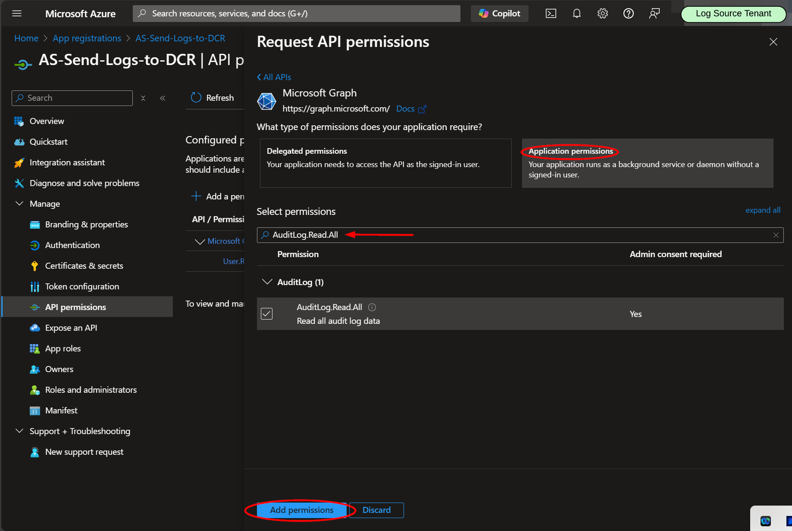

This process will need to be repeated for the Office 365 API. Click "**Add a permission**" once again and from the "**Select an API**" pane, click the "**Microsoft APIs**" tab and select "**Office 365 Management APIs**".

Click "**Application permissions**", then paste "**ActivityFeed.Read**" in the search bar. Click the option matching the search, then click "**Add permission**".

Admin consent will be needed before your app registration can use the assigned permission. Click "**Grant admin consent for (name)**".

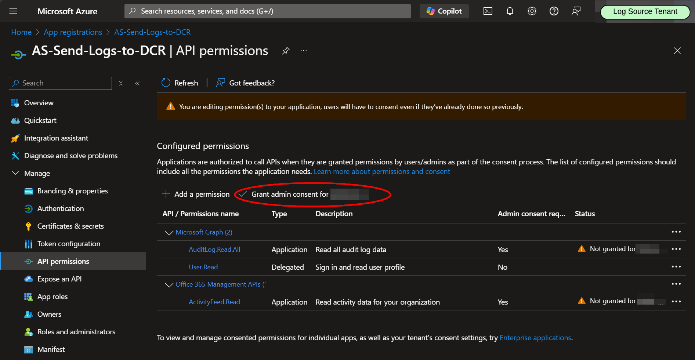

Lastly, a client secret will need to be generated for the app registration. From the left menu blade, click "**Certificates & secrets**" under the "**Manage**" section. Then, click "**New client secret**".

Enter a description and select the desired expiration date, then click "**Add**".

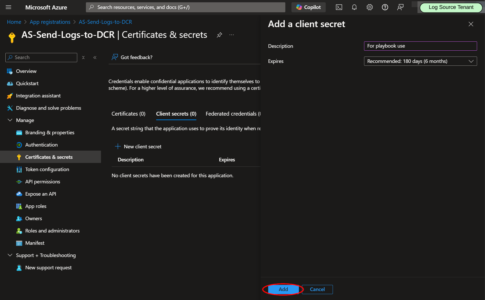

Copy the value of the secret that is generated, as this will be needed for [Create an Azure Key Vault Secret](https://github.com/Azure/Azure-Sentinel/tree/master/Playbooks/AS-Microsoft-DCR-Log-Ingestion#create-an-azure-key-vault-secret).

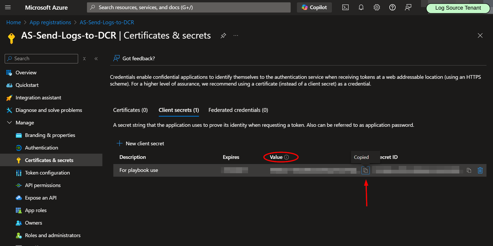

#### Create an App Registration Azure Key Vault Secret

The secret from the previous step will need to be stored in the **tenant that is to receive the data**, as this is where the logic app will be deployed. Navigate to the Azure key vaults page: https://portal.azure.com/#view/HubsExtension/BrowseResource/resourceType/Microsoft.KeyVault%2Fvaults

Navigate to an existing key vault or create a new one. From the key vault overview page, click the "**Secrets**" menu option, found under the "**Settings**" section. Click "**Generate/Import**".

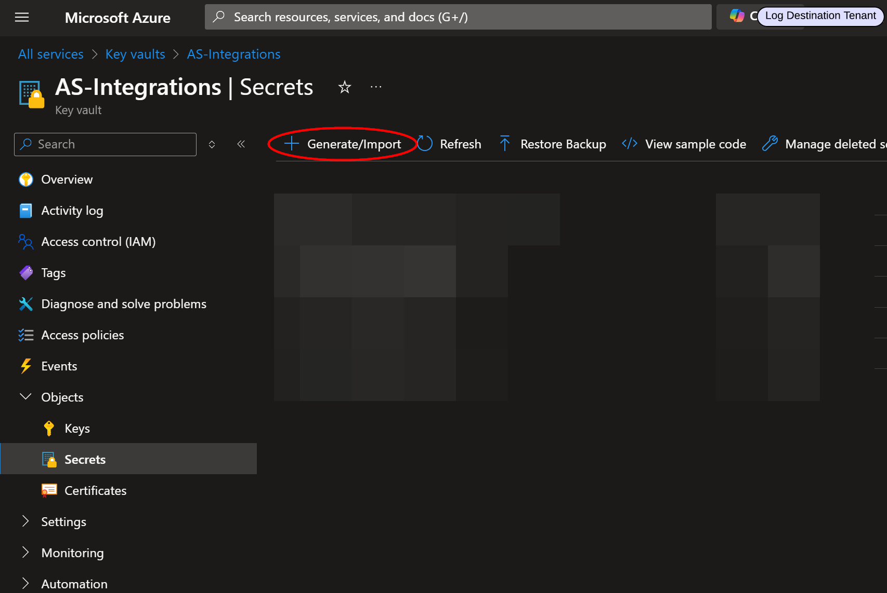

Choose a name for the secret, such as "**DCRLogIngestion-SendingAppRegClientSecret**", taking note of the value used, as it will be needed for deployment. Next enter the client secret copied in the [previous section](https://github.com/Azure/Azure-Sentinel/tree/master/Playbooks/AS-Microsoft-DCR-Log-Ingestion#create-an-app-registration). All other settings can be left as is. Click "**Create**". 

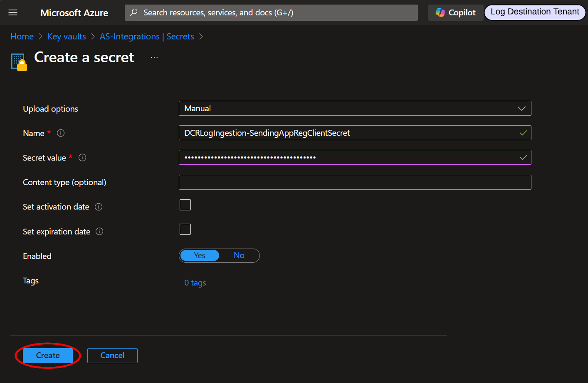

#### Create the Data Collection Endpoints

From the **tenant that is to receive the data**, navigate to the Microsoft Data Collection Endpoints page: https://portal.azure.com/#browse/microsoft.insights%2Fdatacollectionendpoints

Click "**Create**".

Enter "**EntraSignInLogsDCE**" as the Endpoint Name and select the Subscription and Resource Group. These should match the Subscription and Resource Group of the playbook you will deploy later. Ensure the Region location matches that of your workspace.  Click "**Review + create**".

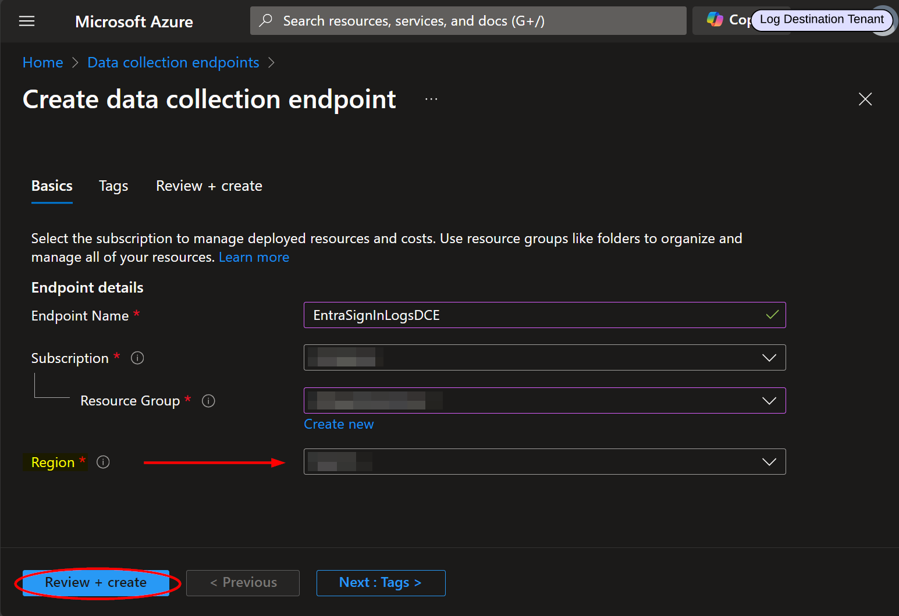

Click "**Create**".

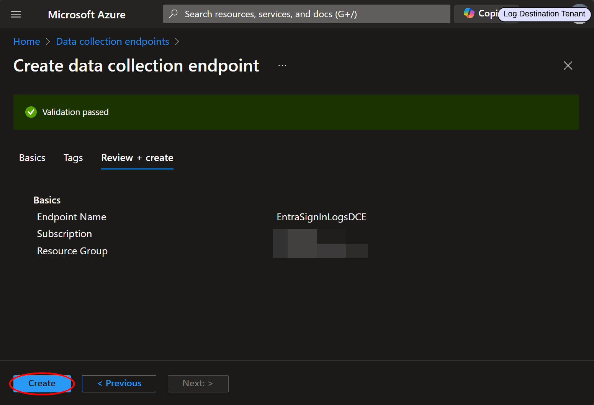

Repeat this process for "**EntraAuditLogsDCE**".

Repeat this process for "**OfficeActivityLogsDCE**".

From each of the created Data Collection Endpoint overview pages, take note of the "**Logs Ingestion**" URLs, as they will be needed for deployment.

#### Create the Data Collection Rules

From the **tenant that is to receive the data**, navigate to the Microsoft Log Analytics Workspace page: https://portal.azure.com/#browse/Microsoft.OperationalInsights%2Fworkspaces

Select the desired workspace.

From the selected workspace, navigate to "**Tables**" located under settings, click "**Create**" and select "**New custom log (DCR based)**".

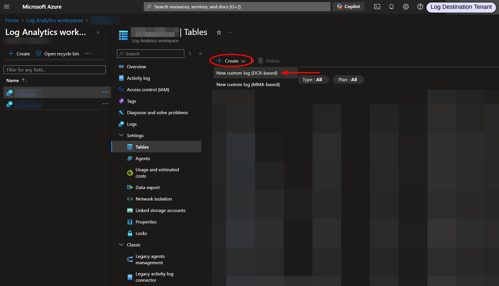

First, click "**Create a new Data Collection Rule**" below the Data Collection Rule field. Then enter "**EntraSignInLogsDCR**" for the name in the window that appears on the right. Ensure the Subscription, Resource Group, and Region all look correct, then click "**Done**".

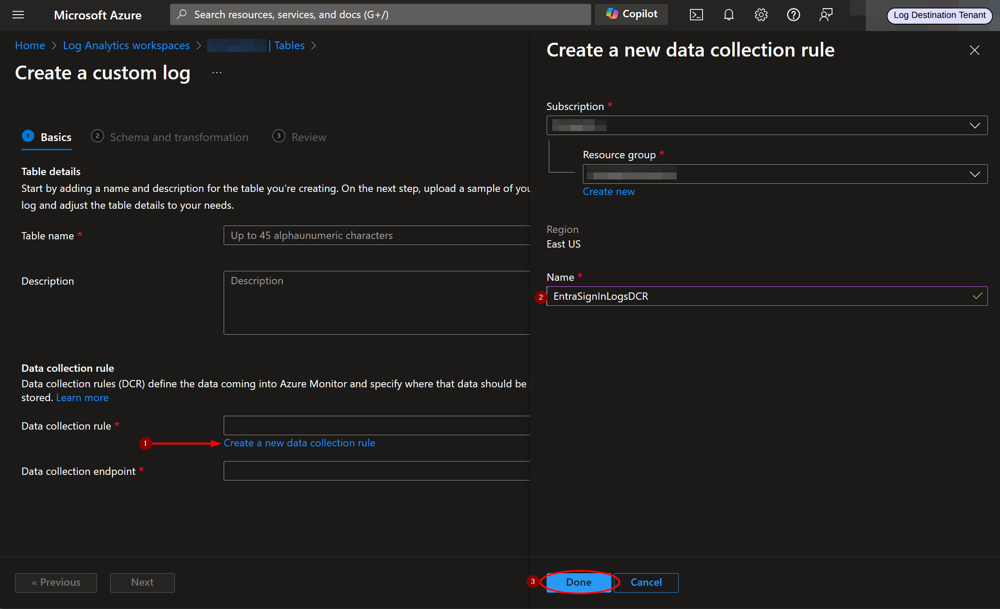

Next enter "**EntraSignInLogs**" as the table name and select "**EntraSignInLogsDCE**" from the drop-down list. If this option is not populating, double check the region used for the Data Collection Endpoint created in the previous step. Click "**Next**".

The next step will prompt you for a data sample.

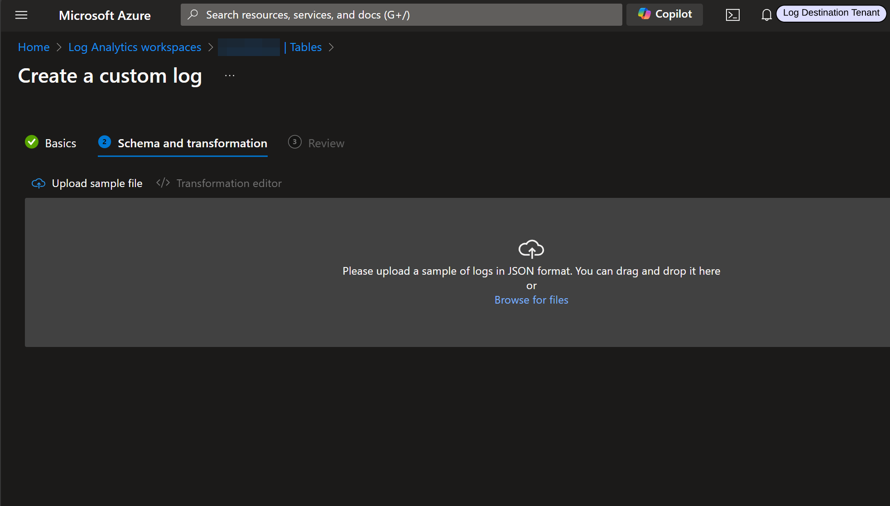

Upload the file content located at [Samples/SignInLogsSample.json](https://github.com/Azure/Azure-Sentinel/tree/master/Playbooks/AS-Microsoft-DCR-Log-Ingestion/blob/main/Samples/SignInLogsSample.json), then click "**Next**".

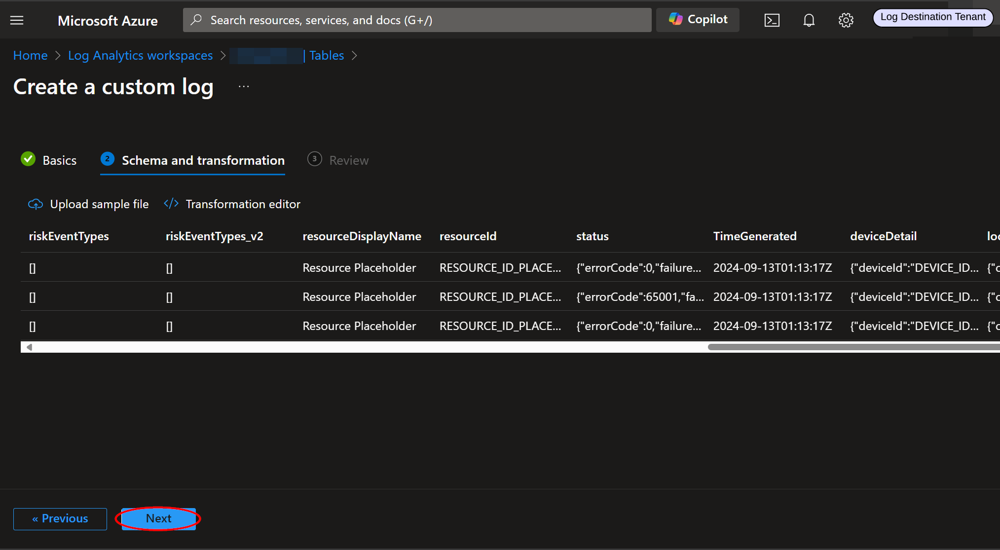

Click "**Create**".

This process will need to be repeated for "**EntraAuditLogsDCR**". After creating the "**EntraAuditLogsDCR**" Data Collection Rule in the way that was shown for "**EntraSignInLogsDCR**", enter "**EntraAuditLogs**" as the table name and select "**EntraAuditLogsDCE**" from the drop-down list.

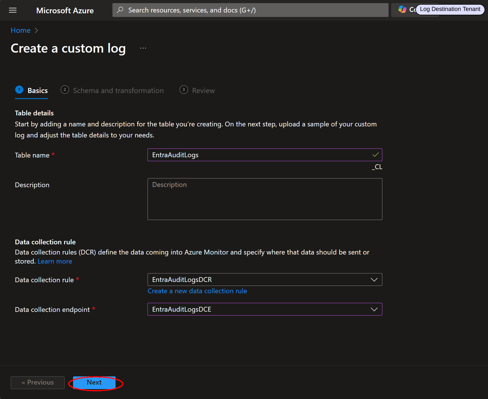

Upload the file content located at [Samples/AuditLogsSample.json](https://github.com/Azure/Azure-Sentinel/tree/master/Playbooks/AS-Microsoft-DCR-Log-Ingestion/blob/main/Samples/AuditLogsSample.json), then click "**Next**".

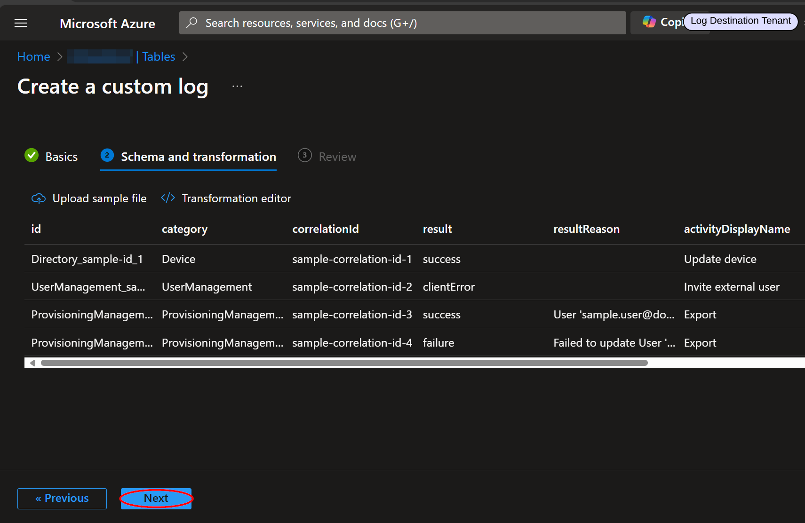

Click "**Create**".

This process will need to be repeated for "**OfficeActivityLogsDCR**". After creating the "**OfficeActivityLogsDCR**" Data Collection Rule in the way that was shown for “**EntraSignInLogsDCR**", enter "**OfficeActivityLogs**" as the table name and select "**OfficeActivityLogsDCE**" from the drop down list.

Upload the file content located at [Samples/OfficeActivityLogsSample.json](https://github.com/Azure/Azure-Sentinel/tree/master/Playbooks/AS-Microsoft-DCR-Log-Ingestion/blob/main/Samples/O365GeneralAuditLogsSample.json), then click "**Next**".

Click "**Create**".

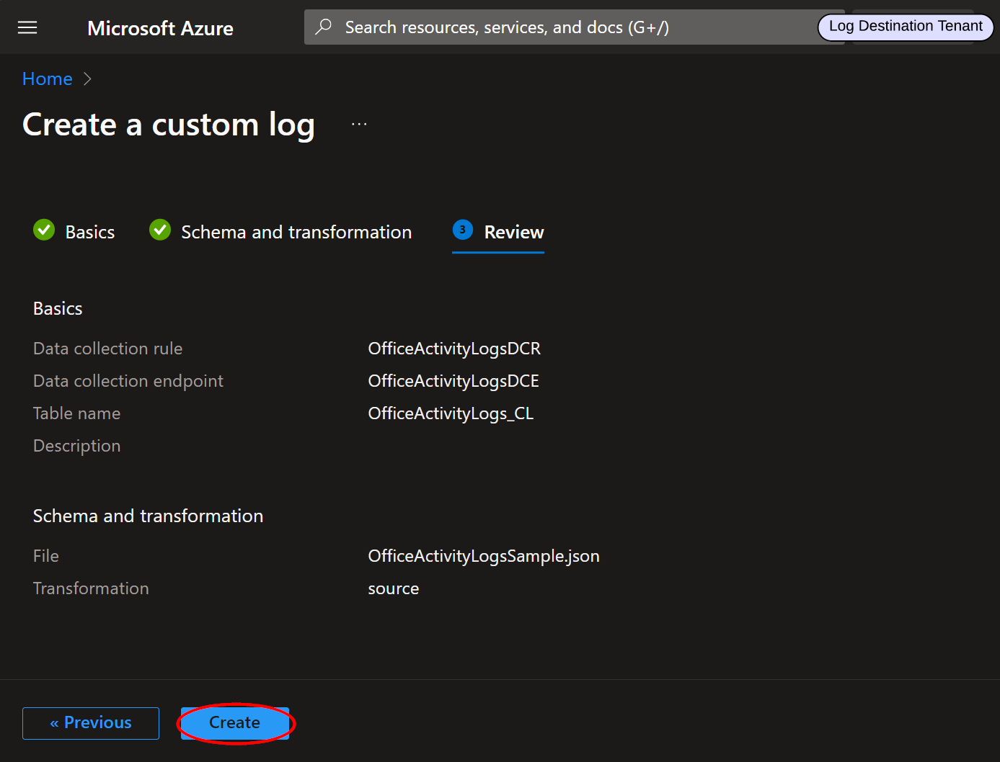

From each of the created [Data Collection Rule overview pages](https://portal.azure.com/#browse/microsoft.insights%2Fdatacollectionrules), take note of the "**Immutable Id**" values, as they will be needed for deployment.

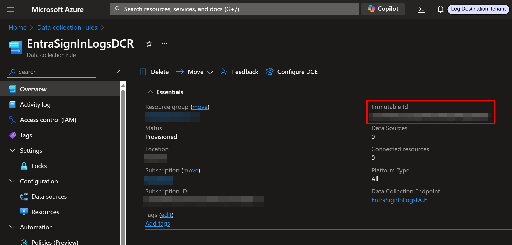

Lastly, from each of the created Data Collection Rule data sources pages, take note of the "**Data source**" values, as they will be needed for deployment.

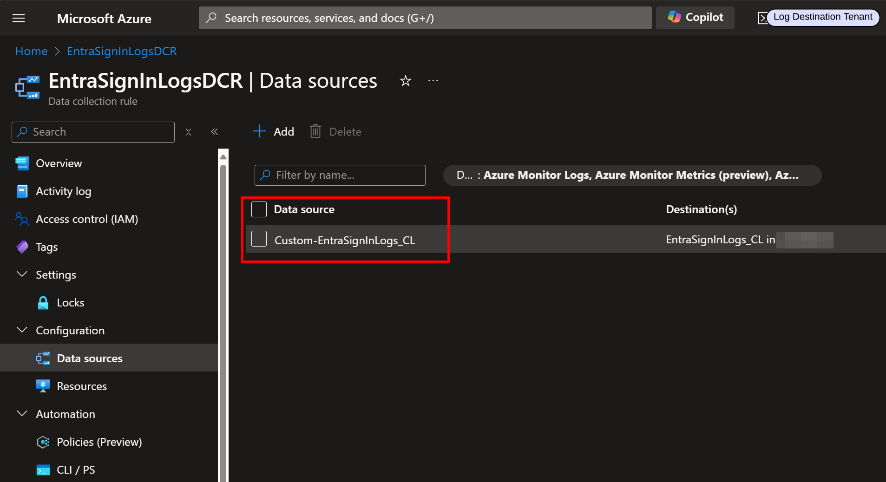

#### Create an App Registration for the DCRs

From the **tenant that is to receive the data**, navigate to the Microsoft Azure Active Directory app registration page: https://portal.azure.com/#view/Microsoft_AAD_RegisteredApps/ApplicationsListBlade

Click "**New registration**".

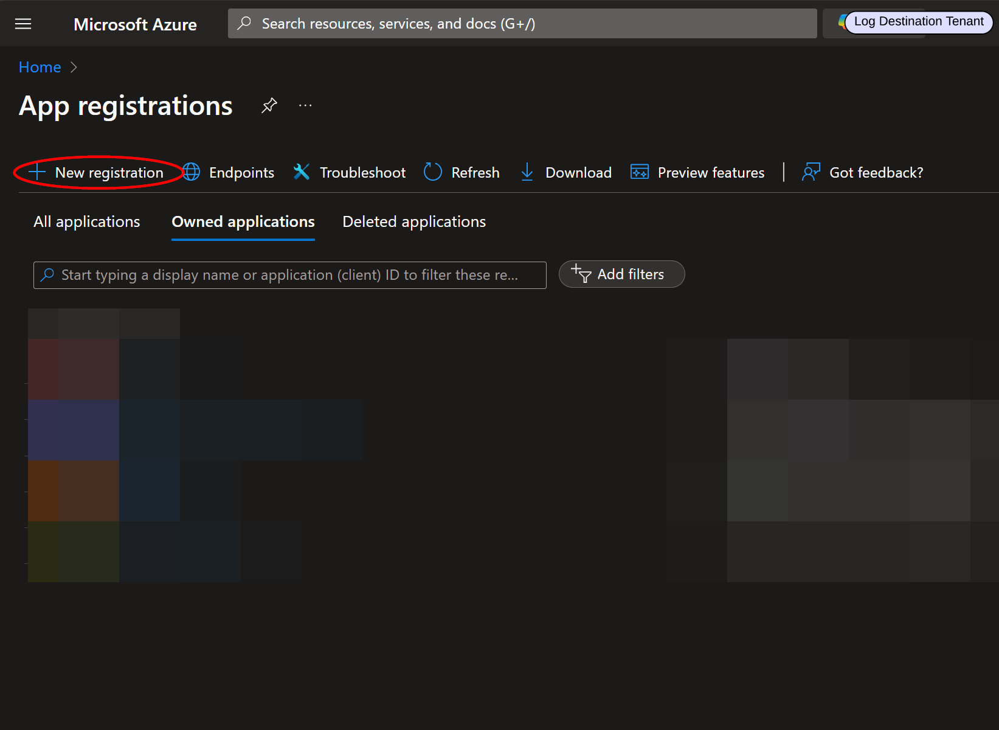

Enter "**DCRLogIngestionAppReg**" for the name and select "**Accounts in this organizational directory only**" for "**Supported account types**. All else can be left as is. Click "**Register**"

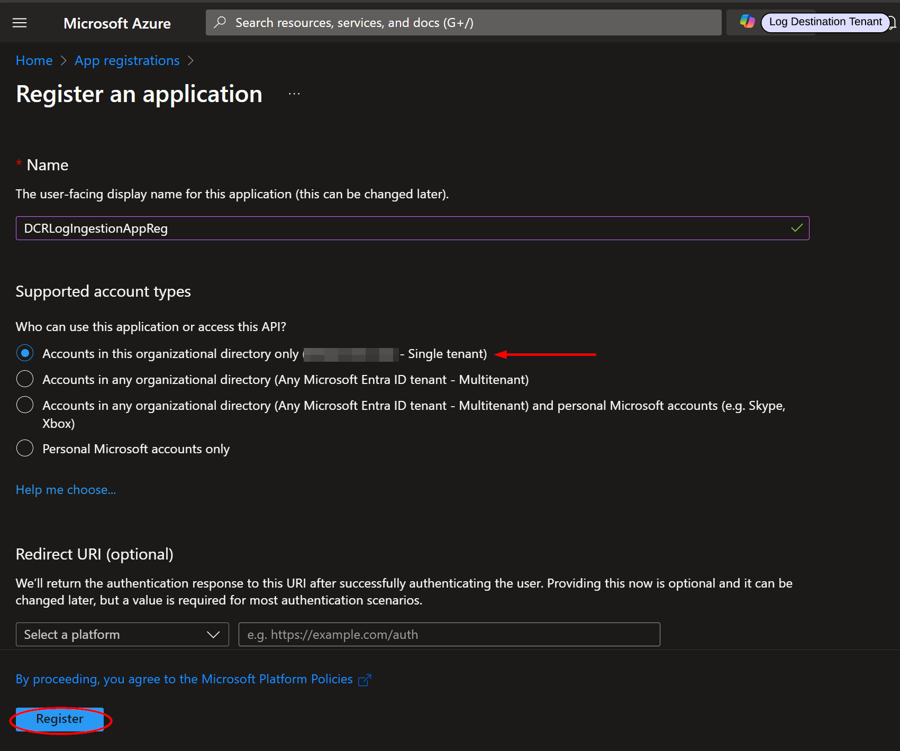

Once the app registration is created, you will be redirected to the "**Overview**" page. Under the "**Essentials**" section, take note of the "**Application (client) ID**", as this will be needed for deployment.

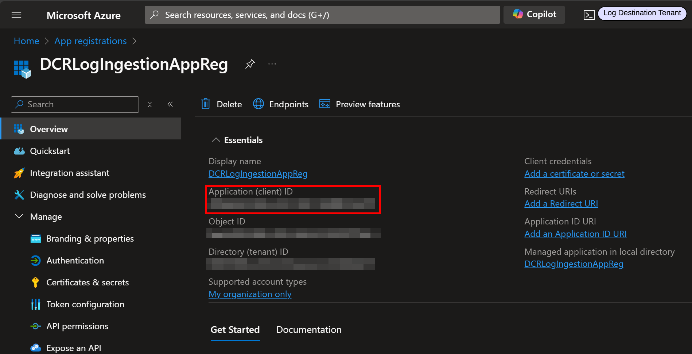

A client secret will need to be generated for the app registration. From the left menu blade, click "**Certificates & secrets**" under the "**Manage**" section. Then, click "**New client secret**”. Enter a description and select the desired expiration date, then click "**Add**".

Copy the value of the secret that is generated, as this will be needed for [Create an Azure Key Vault Secret](https://github.com/Azure/Azure-Sentinel/tree/master/Playbooks/AS-Microsoft-DCR-Log-Ingestion#create-an-azure-key-vault-secret).

Next, IAM access for this App Registration will need to be added from each of the DCRs created in the previous step. Navigate to the Data Collection Rules page: https://portal.azure.com/#browse/microsoft.insights%2Fdatacollectionrules

Select the "**EntraSignInLogsDCR**" and select "**Access control (IAM)**". Click "**Add**" and select "**Add role assignment**".

Select "**Monitoring Metrics Publisher**" and click "**Next**".

Select "**User, group, or service principal**" as the access option, then click "**Select members**". Paste "**DCRLogIngestionAppReg**" into the search bar at the top of the right pane and select the app registration that appears, then click "**Select**".

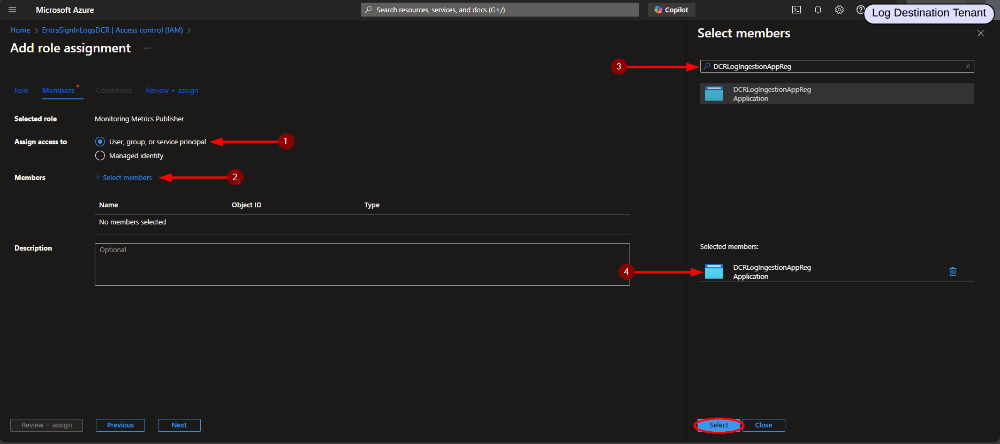

Click "**Review + assign**".

Repeat this process for the "**EntraAuditLogsDCR**".

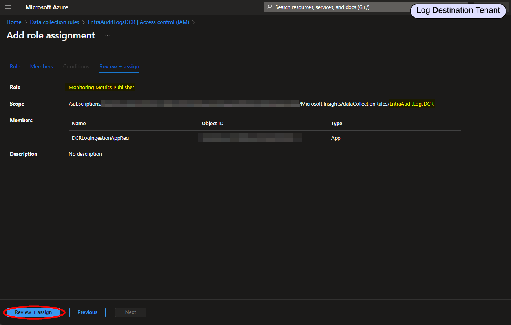

Lastly, repeat this process for "**OfficeActivityLogsDCR**".

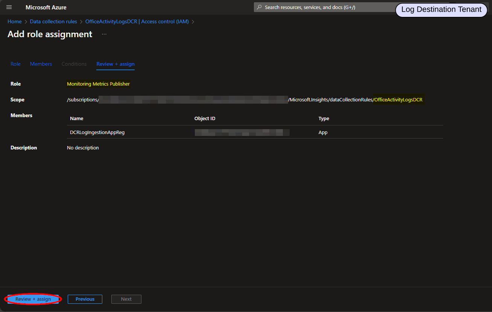

#### Create a Receiving App Registration Azure Key Vault Secret

As before, secret from the previous step will need to be stored in the **tenant that is to receive the data**. Navigate to the Azure key vaults page: https://portal.azure.com/#view/HubsExtension/BrowseResource/resourceType/Microsoft.KeyVault%2Fvaults

Navigate to an existing key vault or create a new one. From the key vault overview page, click the "**Secrets**" menu option, found under the "**Settings**" section. Click "**Generate/Import**".

Choose a name for the secret, such as "**DCRLogIngestion-ReceivingAppRegClientSecret**", taking note of the value used, as it will be needed for deployment. Next enter the client secret copied in the [previous section](https://github.com/Azure/Azure-Sentinel/tree/master/Playbooks/AS-Microsoft-DCR-Log-Ingestion#create-an-app-registration). All other settings can be left as is. Click "**Create**". 

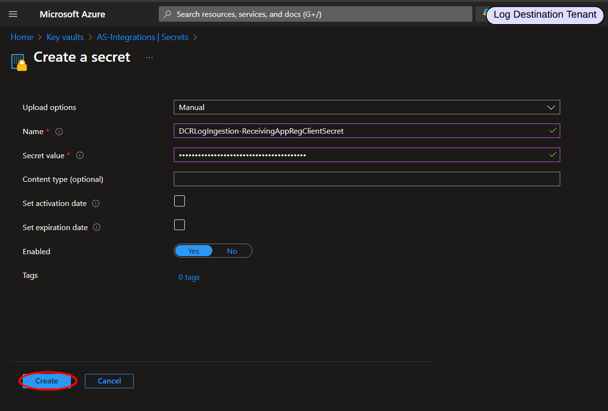

#
### Deployment

To configure and deploy this playbook:
 
Open your browser and ensure you are logged into your Microsoft Sentinel workspace from the **tenant that is to receive the data**. In a separate tab, open the link to our playbook on the Accelerynt Security GitHub repository:

https://github.com/Accelerynt-Security/AS-Microsoft-DCR-Log-Ingestion

                                             

Click the "**Deploy to Azure**" button at the bottom and it will bring you to the custom deployment template.

In the **Project Details** section:

* Select the "**Subscription**" and "**Resource Group**" from the dropdown boxes you would like the playbook deployed to.  

In the **Instance Details** section:

* **Playbook Name**: This can be left as "**AS-Microsoft-DCR-Log-Ingestion**" or you may change it.

* **Sending App Registration Tenant Id**: Enter the Directory (tenant) Id of the App Registration that will be used to send data, referenced in [Create an App Registration](https://github.com/Azure/Azure-Sentinel/tree/master/Playbooks/AS-Microsoft-DCR-Log-Ingestion#create-an-app-registration).

* **Sending App Registration Client Id**: Enter the Application (client) ID of the App Registration that will be used to send data, referenced in [Create an App Registration](https://github.com/Azure/Azure-Sentinel/tree/master/Playbooks/AS-Microsoft-DCR-Log-Ingestion#create-an-app-registration).

* **Sending Tenant Subscription ID**: Enter the [subscription ID](https://portal.azure.com/#view/Microsoft_Azure_Billing/SubscriptionsBladeV2) of the tenant that will be sending the data.

* **Receiving App Registration Client Id**: Enter the Application (client) ID of the App Registration that will be used to receive data, referenced in [Create an App Registration for the DCRs](https://github.com/Azure/Azure-Sentinel/tree/master/Playbooks/AS-Microsoft-DCR-Log-Ingestion#create-an-app-registration-for-the-dcrs).

* **Key Vault Name**: Enter the name of the key vault referenced in [Create an Azure Key Vault Secret](https://github.com/Azure/Azure-Sentinel/tree/master/Playbooks/AS-Microsoft-DCR-Log-Ingestion#create-an-azure-key-vault-secret).

* **Sending App Registration Key Vault Secret Name**: Name of Key Vault Secret that contains the sending App Registration client secret, created in [Create an App Registration Azure Key Vault Secret](https://github.com/Azure/Azure-Sentinel/tree/master/Playbooks/AS-Microsoft-DCR-Log-Ingestion#create-an-app-registration-azure-key-vault-secret).

* **Receiving App Registration Key Vault Secret Name**: Name of Key Vault Secret that contains the receiving App Registration client secret, created in [Create a Receiving App Registration Azure Key Vault Secret](https://github.com/Azure/Azure-Sentinel/tree/master/Playbooks/AS-Microsoft-DCR-Log-Ingestion#create-a-receiving-app-registration-azure-key-vault-secret).

* **Entra Sign In Logs Ingestion URL**: Enter the Logs Ingestion URL from the EntraSignInLogs DCE, referenced in [Create the Data Collection Endpoints](https://github.com/Azure/Azure-Sentinel/tree/master/Playbooks/AS-Microsoft-DCR-Log-Ingestion#create-the-data-collection-endpoints).

* **Entra Sign In Logs Immutable Id**: Enter the Logs Ingestion Immutable Id from the EntraSignInLogs DCR, referenced in [Create the Data Collection Rules](https://github.com/Azure/Azure-Sentinel/tree/master/Playbooks/AS-Microsoft-DCR-Log-Ingestion#create-the-data-collection-rules).

* **Entra Sign In Logs Data Source**: Enter the Logs Ingestion Data Source from the EntraSignInLogs DCR, referenced in [Create the Data Collection Rules](https://github.com/Azure/Azure-Sentinel/tree/master/Playbooks/AS-Microsoft-DCR-Log-Ingestion#create-the-data-collection-rules).

* **Entra Audit Logs Ingestion URL**: Enter the Logs Ingestion URL from the EntraAuditLogs DCE, referenced in [Create the Data Collection Endpoints](https://github.com/Azure/Azure-Sentinel/tree/master/Playbooks/AS-Microsoft-DCR-Log-Ingestion#create-the-data-collection-endpoints).

* **Entra Audit Logs Immutable Id**: Enter the Logs Ingestion Immutable Id from the EntraAuditLogs DCR, referenced in [Create the Data Collection Rules](https://github.com/Azure/Azure-Sentinel/tree/master/Playbooks/AS-Microsoft-DCR-Log-Ingestion#create-the-data-collection-rules).

* **Entra Audit Logs Data Source**: Enter the Logs Ingestion Data Source from the EntraAuditLogs DCR, referenced in [Create the Data Collection Rules](https://github.com/Azure/Azure-Sentinel/tree/master/Playbooks/AS-Microsoft-DCR-Log-Ingestion#create-the-data-collection-rules).

* **Office Activity Ingestion URL**: Enter the Logs Ingestion URL from the OfficeActivityLogs DCE, referenced in [Create the Data Collection Endpoints](https://github.com/Azure/Azure-Sentinel/tree/master/Playbooks/AS-Microsoft-DCR-Log-Ingestion#create-the-data-collection-endpoints).

* **Office Activity Immutable Id**: Enter the Logs Ingestion Immutable Id from the OfficeActivityLogs DCR, referenced in [Create the Data Collection Rules](https://github.com/Azure/Azure-Sentinel/tree/master/Playbooks/AS-Microsoft-DCR-Log-Ingestion#create-the-data-collection-rules).

* **Office Activity Data Source**: Enter the Logs Ingestion Data Source from the OfficeActivityLogs DCR, referenced in [Create the Data Collection Rules](https://github.com/Azure/Azure-Sentinel/tree/master/Playbooks/AS-Microsoft-DCR-Log-Ingestion#create-the-data-collection-rules).

Towards the bottom, click on "**Review + create**". 

Once the resources have validated, click on "**Create**".

The resources should take around a minute to deploy. Once the deployment is complete, you can expand the "**Deployment details**" section to view them.
Click the one corresponding to the Logic App.

#
### Granting Access to Azure Key Vault

Before the Logic App can run successfully, the key vault connection created during deployment must be granted access to the key vault storing your app registration client secrets, located in the **tenant that is to receive the data**.

From the Logic App menu blade, select the "**Identity**" tab, located under the "**Settings**" section. Click "**Azure role assignments**".

Click "**Add role assignment**" then select "**Key Vault**" as the scope, select your Key Vault Name, then select "**Key Vault Secrets User**" for the role. Click "**Save**".

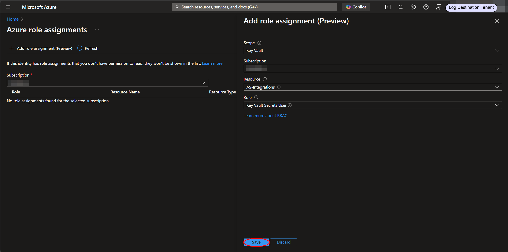

#
### Ensuring your Subscription is Enabled

To ensure the subscription is enabled for the app registration used to access the"**O365 Audit General Logs**", the [OfficeAuditSubscribtionEnable](https://github.com/Azure/Azure-Sentinel/tree/master/Playbooks/AS-Microsoft-DCR-Log-Ingestion/blob/main/Scripts/OfficeAuditSubscribtionEnable.ps1) should be run from an [Azure Cloud Shell Window](https://learn.microsoft.com/en-us/azure/cloud-shell/new-ui-shell-window) from the tenant you wish to **send the Microsoft Graph and Office data from**.

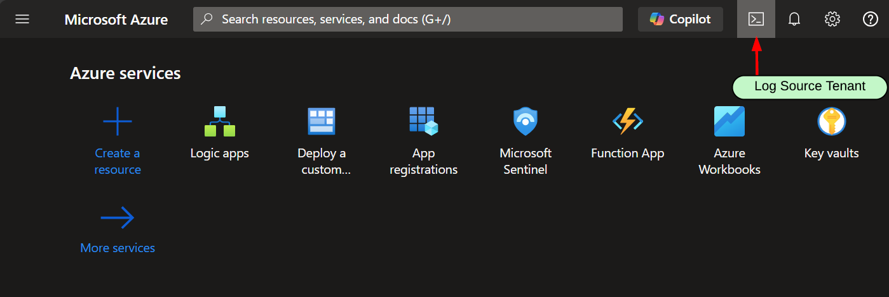
Click the "**PowerShell**" option, then select the appropriate subscription for the sending tenant.

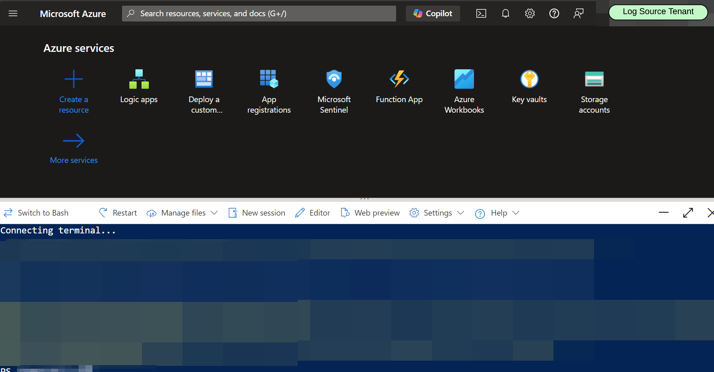

Copy and paste the script into the Azure Cloud Shell PowerShell window and hit enter. You will be prompted to enter your **sending** tenant, as well as the **sending** app registration client ID and client secret.

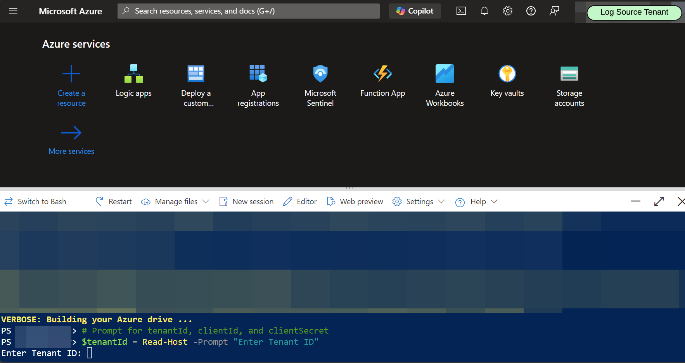

#
### Enable the Logic App

After all of the above steps are completed, from the Logic App Overview page, click "**Enable**".

