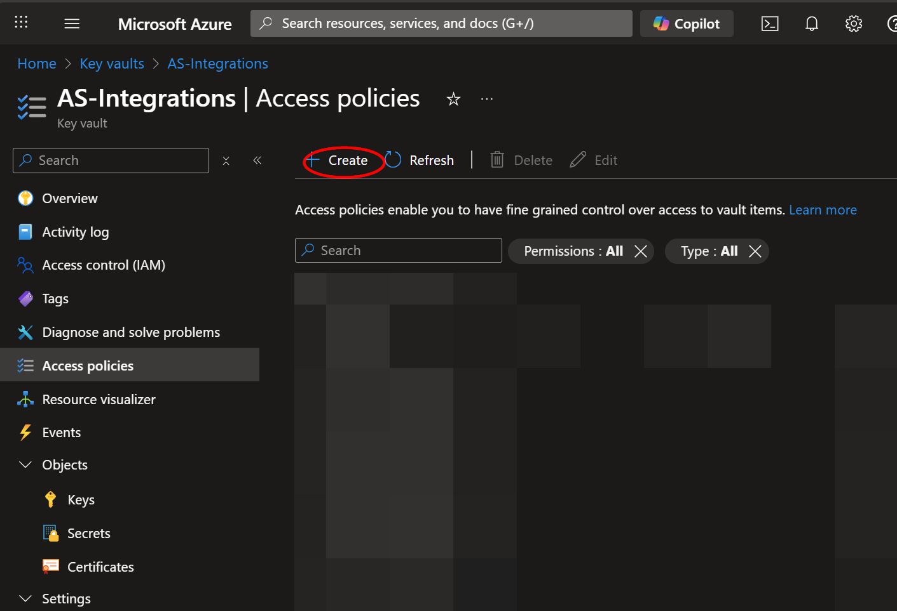

# AS-MuleSoft-Integration

Author: Accelerynt

For any technical questions, please contact info@accelerynt.com  

This playbook is intended to run on a schedule and pull MuleSoft Audit Logs into Microsoft Sentinel custom logs where they can be tracked and queried.

> [!NOTE]
> Estimated Time to Complete: 1 hour

> [!TIP]
> Required deployment variables are noted throughout. Reviewing the deployment page and filling out fields as you proceed is recommended.

#
### Requirements
                                                                                                                                     
The following items are required under the template settings during deployment: 

* **MuleSoft Org Id** - the organization Id of your MuleSoft environment.
* **MuleSoft Client Id** - A MuleSoft OAuth client will need to be created in your MuleSoft Org before deploying this playbook. There will be a Client Id associated with this MuleSoft OAuth client.
* **MuleSoft Client Secret** - the value of the Client Secret generated for your MuleSoft OAuth client.
* **Azure Key Vault Secret** - this will store your MuleSoft Client Secret. [Documentation link](https://github.com/Azure/Azure-Sentinel/tree/master/Playbooks/AS-MuleSoft-Integration#create-an-azure-key-vault-secret).

# 
### Setup

#### Create an Azure Key Vault Secret

Navigate to the Azure Key Vaults page: https://portal.azure.com/#view/HubsExtension/BrowseResource/resourceType/Microsoft.KeyVault%2Fvaults.

Navigate to an existing Key Vault or create a new one. From the Key Vault overview page, click the "**Secrets**" menu option, found under the "**Settings**" section. Click "**Generate/Import**".

Choose a name for the secret, such as "**AS-MuleSoft-Integration-Client-Secret**", and enter the value of your MuleSoft Client Secret. All other settings can be left as is. Click "**Create**". 

Once your secret has been added to the vault, navigate to the "**Access policies**" menu option, also found under the "**Settings**" section on the Key Vault page menu. Leave this page open, as you will need to return to it once the playbook has been deployed. See [Granting Access to Azure Key Vault](https://github.com/Azure/Azure-Sentinel/tree/master/Playbooks/AS-MuleSoft-Integration#granting-access-to-azure-key-vault).

#
### Deployment

To configure and deploy this playbook:

Open your browser and ensure you are logged into your Microsoft Sentinel workspace. In a separate tab, open the link to our playbook on the Accelerynt Security GitHub Repository:

https://github.com/Accelerynt-Security/AS-MuleSoft-Integration

Click the “**Deploy to Azure**” button at the bottom and it will bring you to the custom deployment template.

In the **Project details** section:

* Select the **Subscription** and **Resource group** from the dropdown boxes you would like the playbook deployed to.  
In the **Instance details** section:  
                                                  
* **Playbook Name**: This can be left as "**AS-MuleSoft-Integration**" or you may change it.

* **MuleSoft Org Id**: Enter the Org Id of the MuleSoft organization you wish to pull audit logs from.

* **MuleSoft Client Id**: Enter the Client Id of your MuleSoft OAuth Client.

* **Key Vault Name**: Enter the name of the key vault referenced in [Create an Azure Key Vault Secret](https://github.com/Azure/Azure-Sentinel/tree/master/Playbooks/AS-MuleSoft-Integration#create-an-azure-key-vault-secret).

* **MuleSoft Client Secret Name**: Enter the name of the key vault Secret created in [Create an Azure Key Vault Secret](https://github.com/Azure/Azure-Sentinel/tree/master/Playbooks/AS-MuleSoft-Integration#create-an-azure-key-vault-secret).

Towards the bottom, click on "**Review + create**". 

Once the resources have validated, click on "**Create**".

The resources should take around a minute to deploy. Once the deployment is complete, you can expand the "**Deployment details**" section to view them.
Click the one corresponding to the Logic App.

This Logic app is intentionally deployed as disabled. Complete the following steps before enabling.

#
### Granting Access to Azure Key Vault

Before the logic app should be enabled, the playbook must be granted access to the Key Vault storing your MuleSoft API token.

From the Key Vault "**Access policies**" page, click "**Create**".

Select the "**Get**" checkbox under "**Secret permissions**", then click "**Next**".

Paste "**AS-MuleSoft-Integration**" into the principal search box and click the option that appears. Click "**Next**" towards the bottom of the page.

Navigate to the "**Review + create**" section and click "**Create**".

#
### Authorize Playbook Connection

Before the logic app should be enabled, the **azureloganalyticsdatacollector** API connection will need to be edited and authorized.

From the playbook overview page, navigate to **API connections** from the left menu blade.

Click the **azureloganalyticsdatacollector** connection and click **Edit API connection**. Enter in your Workspace Id and key, then click **Save**.

#
### Enable the Playbook

Now that access has been granted to the appropriate resources and API connections have been authorized, the playbook can be enabled.

#
### Viewing Custom Logs

After the initial run has been completed, navigate to the Log Analytics Workspace page: https://portal.azure.com/#view/HubsExtension/BrowseResource/resourceType/Microsoft.OperationalInsights%2Fworkspaces
From there, select the workspace your deployed logic apps reference and click "**Logs**" in the left-hand menu blade. Expand "**Custom Logs**". Here, you should see a table called **MulesoftAuditLogs_CL**.
Note that it may take a while for this table to appear after it is created by the playbook, so if the logs are not yet visible, try querying them periodically.

