# AS-Recurring-Host-Entity

Author: Accelerynt

For any technical questions, please contact info@accelerynt.com  

       

This playbook is intended to be run from a Microsoft Sentinel Incident. It will take the Hosts from the Incident entities list and search the Microsoft Sentinel SecurityAlert logs for other entities containing the same Hosts. A comment noting the alerts the Hosts have previously appeared in will be added to the Incident.

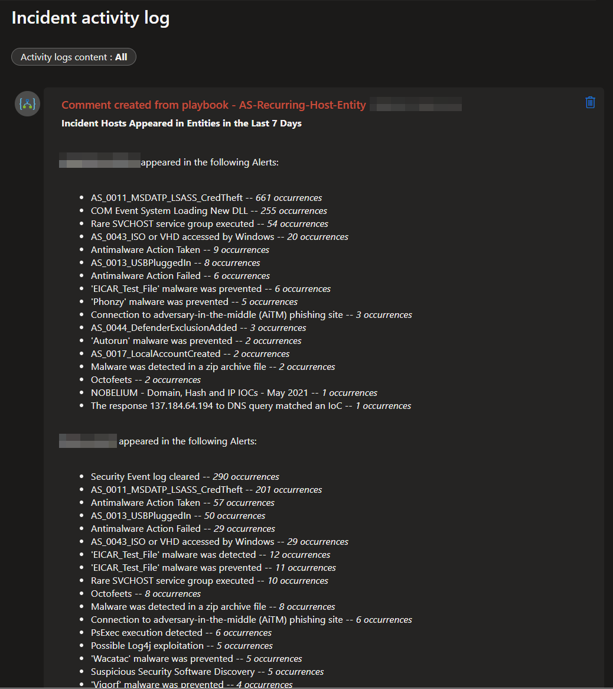

#
### Requirements
                                                                                                                            
The following items are required under the template settings during deployment: 

* The [Microsoft Sentinel Workspace Name](https://github.com/Accelerynt-Security/AS-Recurring-Host-Entity#microsoft-sentinel-workspace-name) your SecurityAlert logs will be pulled from. 

# 
### Setup
                                                                                                                             
#### Microsoft Sentinel Workspace Name:

Navigate to the Microsoft Sentinel page and take note of the Resource/Workspace name this Logic App will be deployed to:

https://portal.azure.com/#view/HubsExtension/BrowseResource/resourceType/microsoft.securityinsightsarg%2Fsentinel

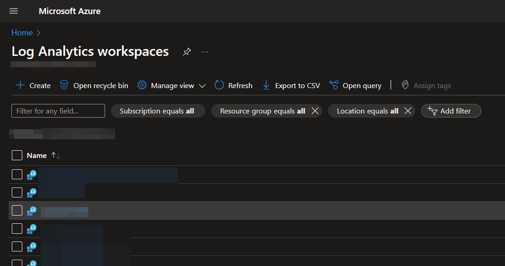

#
### Deployment                                                                                                         
                                                                                                        
To configure and deploy this playbook:
 
Open your browser and ensure you are logged into your Microsoft Sentinel workspace. In a separate tab, open the link to our playbook on the Accelerynt Security GitHub Repository:

https://github.com/Accelerynt-Security/AS-Recurring-Host-Entity

                                             

Click the "**Deploy to Azure**" button at the bottom and it will bring you to the custom deployment template.

In the **Project Details** section:

* Select the "**Subscription**" and "**Resource Group**" from the dropdown boxes you would like the playbook deployed to.  

In the **Instance Details** section:   

* **Playbook Name**: This can be left as "**AS-Recurring-Host-Entity**" or you may change it.

* **Sentinel Resource Name**: Enter the name of the Sentinel Resource/Workspace name noted in [Microsoft Sentinel Workspace Name](https://github.com/Accelerynt-Security/AS-Recurring-Host-Entity#microsoft-sentinel-workspace-name)

Towards the bottom, click on "**Review + create**". 

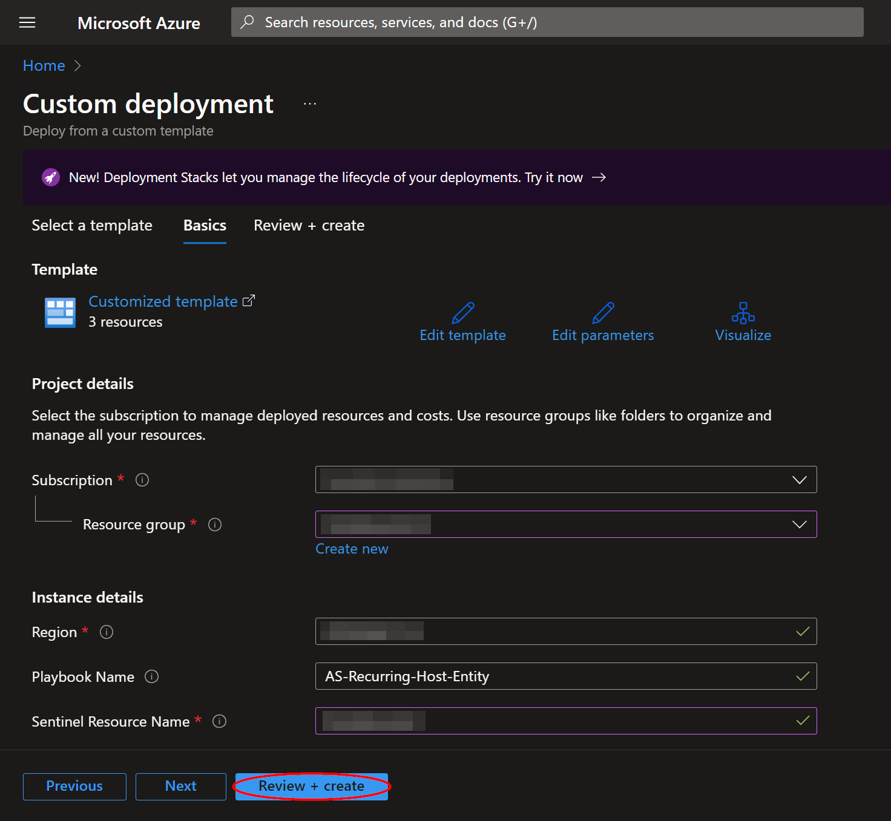

Once the resources have validated, click on "**Create**".

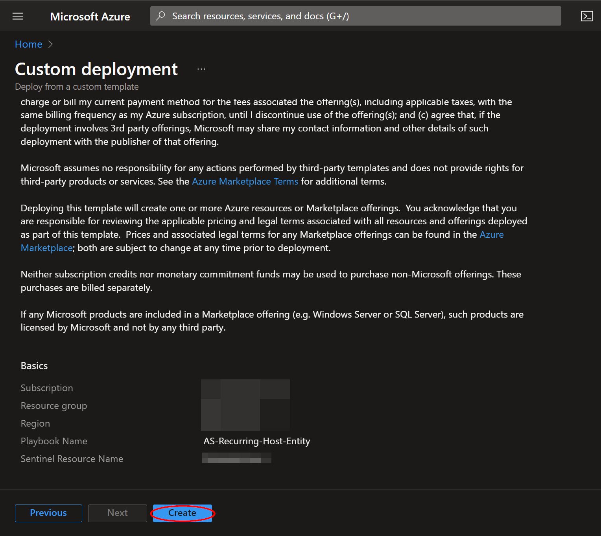

The resources should take around a minute to deploy. Once the deployment is complete, you can expand the "**Deployment details**" section to view them.
Click the one corresponding to the Logic App.

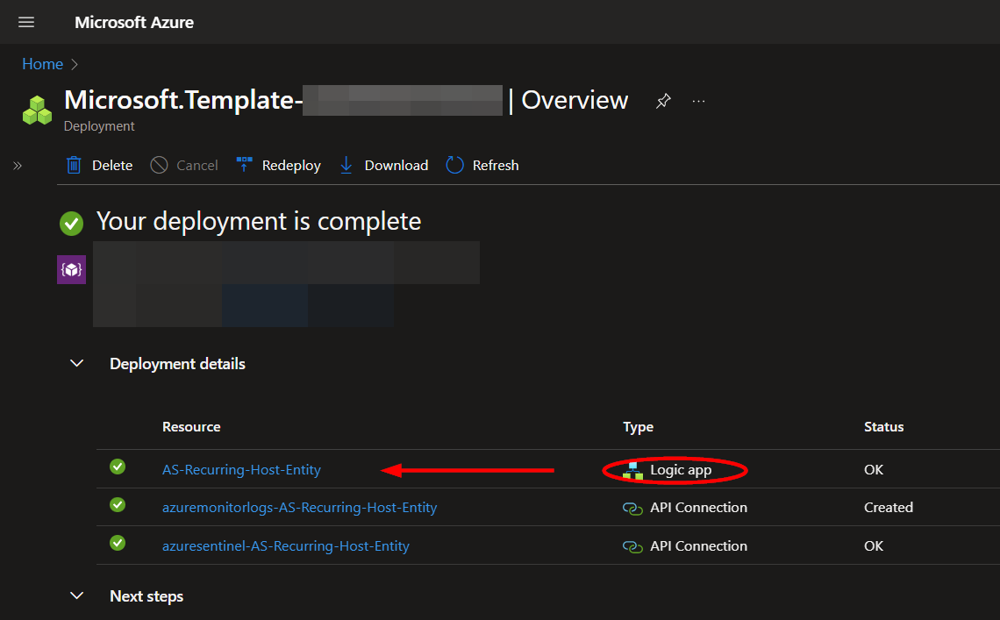

Click on the “**Edit**” button. This will bring you into the Logic Apps Designer.

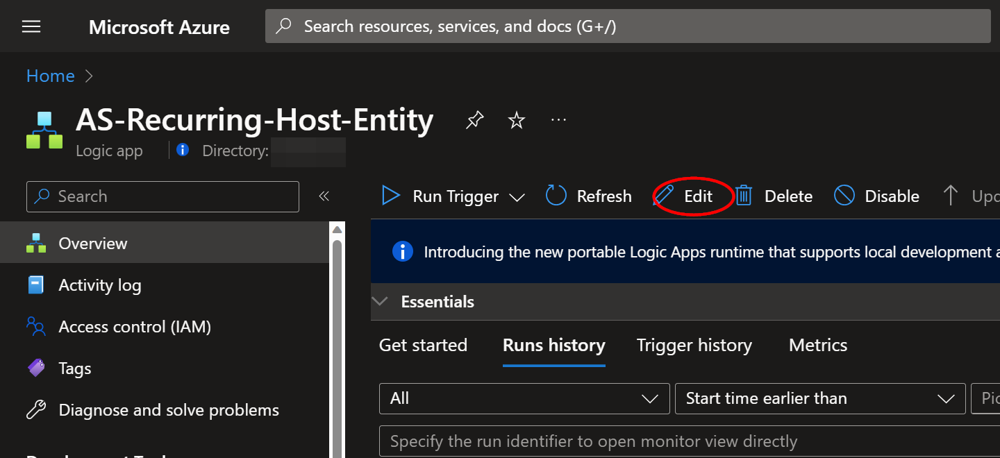

Before the playbook can be run successfully, the "**azuremonitorlogs**" connection used in the first for each loop needs to be authorized, or an existing authorized connection may be alternatively selected. To validate the "**azuremonitorlogs**" connection, expand the first step in the for each loop labeled "**Connections**" and click the exclamation point icon next to the name matching the playbook.

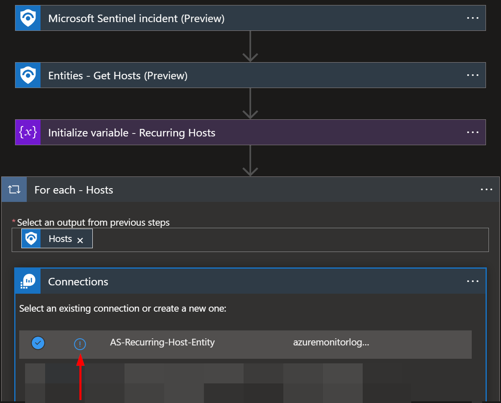

Select "**Logic Apps Managed Identity**" for the "**Authentication Type**", then click "**Create**".  

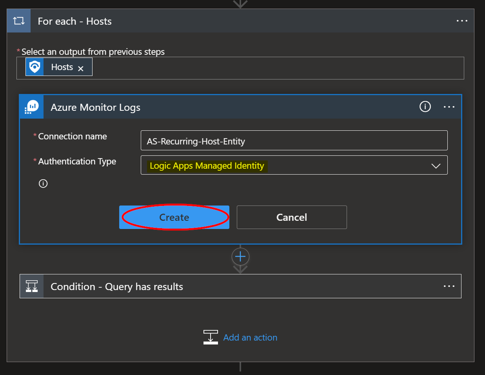

#
### Microsoft Sentinel Contributor Role

After deployment, you will need to give the system assigned managed identity the "**Microsoft Sentinel Contributor**" role. This will enable the Logic App to add comments to Incidents. Navigate to the Log Analytics Workspaces page and select the same workspace the playbook is located in:

https://portal.azure.com/#view/HubsExtension/BrowseResource/resourceType/Microsoft.OperationalInsights%2Fworkspaces

Select the "**Access control (IAM)**" option from the menu blade, then click "**Add role assignment**".

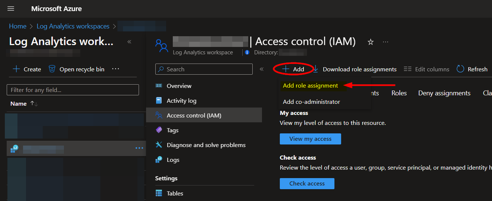

Select the "**Microsoft Sentinel Contributor**" role, then click "**Next**".

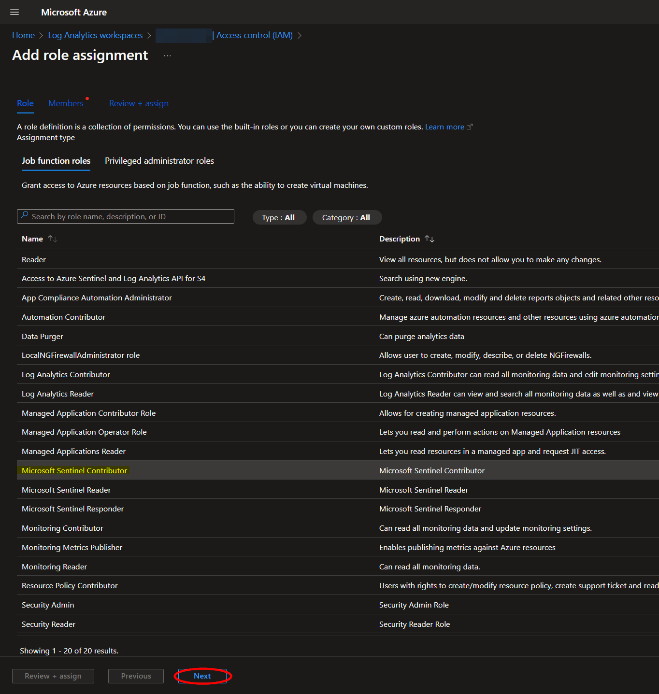

Select the "**Managed identity**" option, then click "**Select Members**". Under the subscription the Logic App is located, set the value of "**Managed identity**" to "**Logic app**". Next, enter "**AS-Recurring-Host-Entity**", or the alternative playbook name used during deployment, in the field labeled "**Select**". Select the playbook, then click "**Select**".

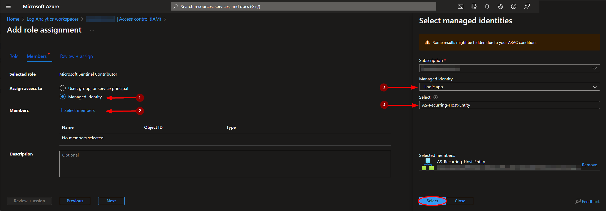

Continue on to the "**Review + assign**" tab and click "**Review + assign**".

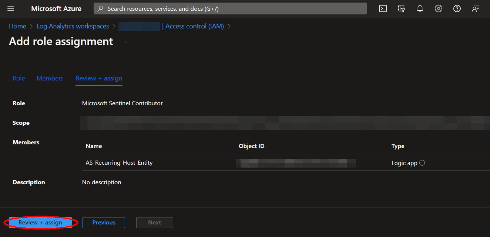