# AS-Revoke-Azure-AD-User-Session-From-Entity

Author: Accelerynt

For any technical questions, please contact info@accelerynt.com  

       

This playbook is intended to be run from a Microsoft Sentinel Entity. It will look up the Azure AD users associated with the account entities and revoke their sessions.
                                                                                                                                     
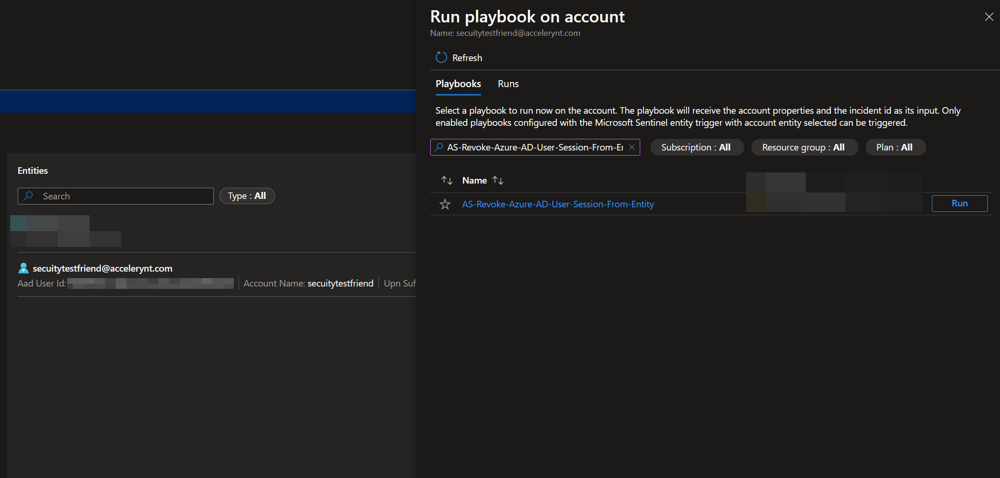

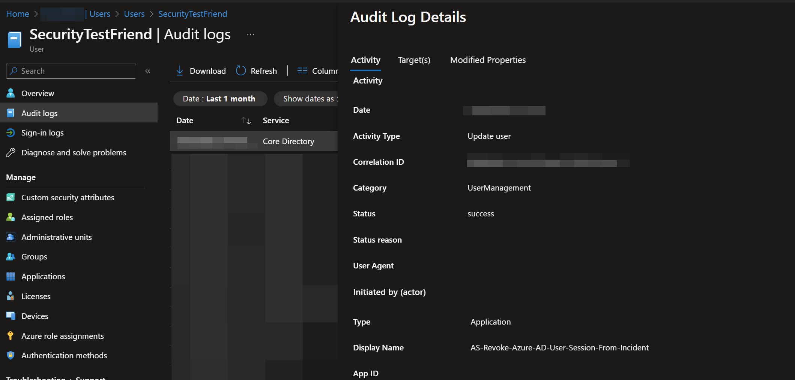

#
### Requirements
                                                                                                                                     
The following items are required under the template settings during deployment: 

* A Microsoft Azure Active Directory [app registration](https://github.com/Azure/Azure-Sentinel/tree/master/Playbooks/AS-Revoke-Azure-AD-User-Session-From-Entity#create-an-app-registration) with admin consent granted for "**User.ReadWrite.All**" in the "**Microsoft Graph**" API
* An [Azure key vault secret](https://github.com/Azure/Azure-Sentinel/tree/master/Playbooks/AS-Revoke-Azure-AD-User-Session-From-Entity#create-an-azure-key-vault-secret) containing your app registration client secret

# 
### Setup

#### Create an App Registration

Navigate to the Microsoft Azure Active Directory app registration page: https://portal.azure.com/#view/Microsoft_AAD_RegisteredApps/ApplicationsListBlade

Click "**New registration**".

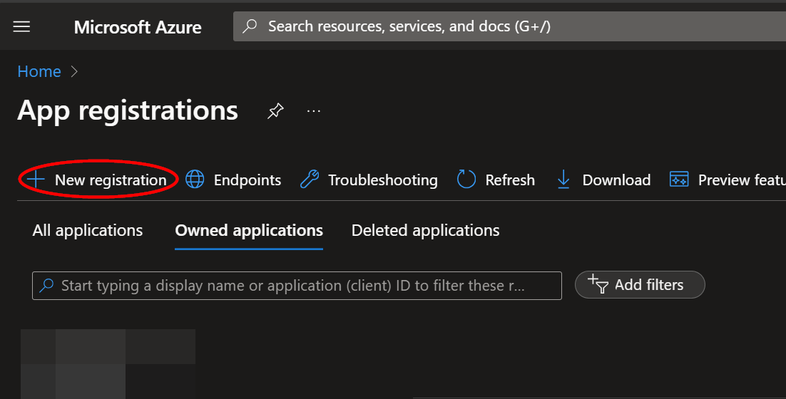

Enter "**AS-Revoke-Azure-AD-User-Session**" for the name, all else can be left as is. Click "**Register**"

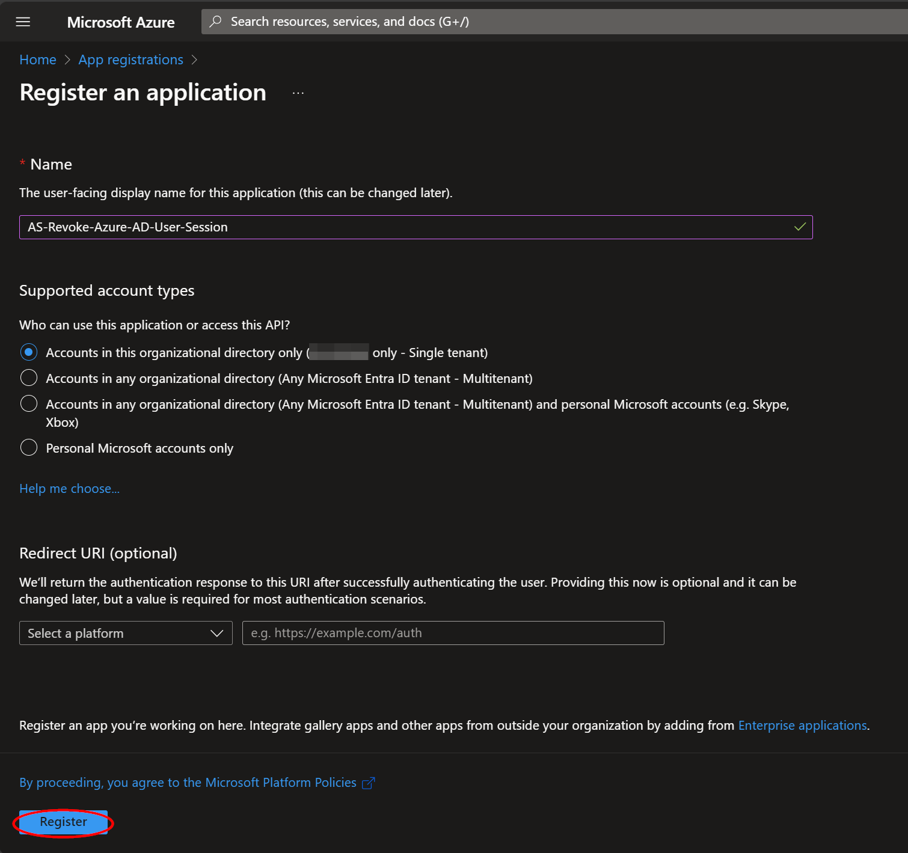

Once the app registration is created, you will be redirected to the "**Overview**" page. Under the "**Essentials**" section, take note of the "**Application (client) ID**", as this will be needed for deployment.

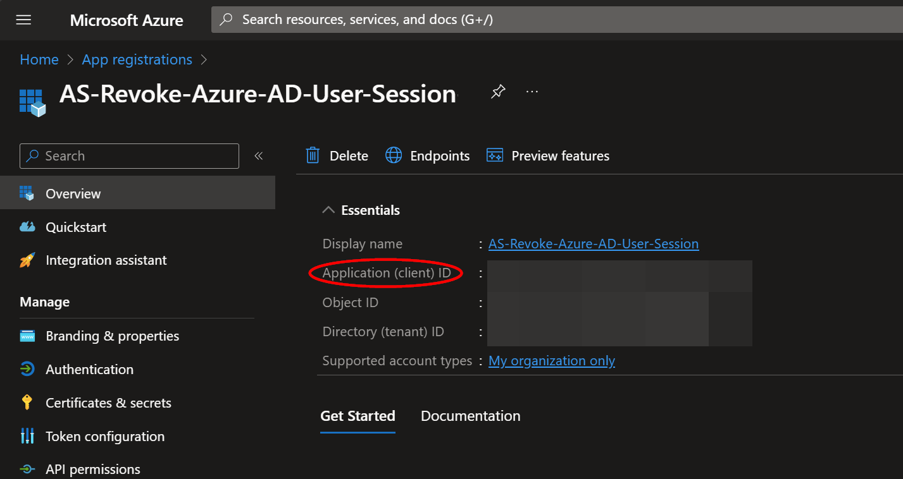

Next, you will need to add permissions for the app registration to call the [Microsoft Graph API revokeSignInSessions endpoint](https://learn.microsoft.com/en-us/graph/api/user-revokesigninsessions?view=graph-rest-1.0&tabs=http). From the left menu blade, click "**API permissions**" under the "**Manage**" section. Then, click "**Add a permission**".

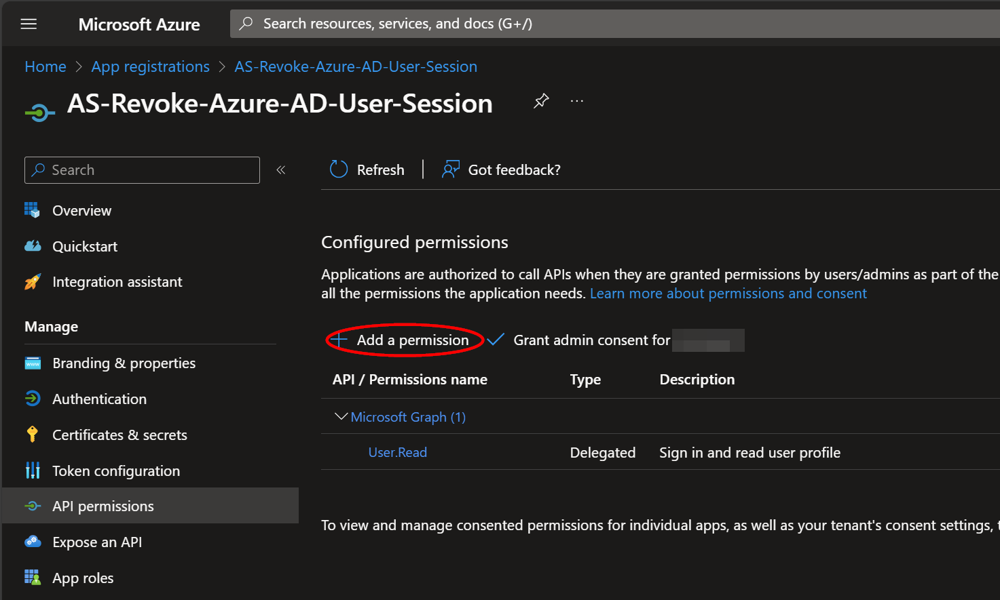

From the "**Select an API**" pane, click the "**Microsoft APIs**" tab and select "**Microsoft Graph**".

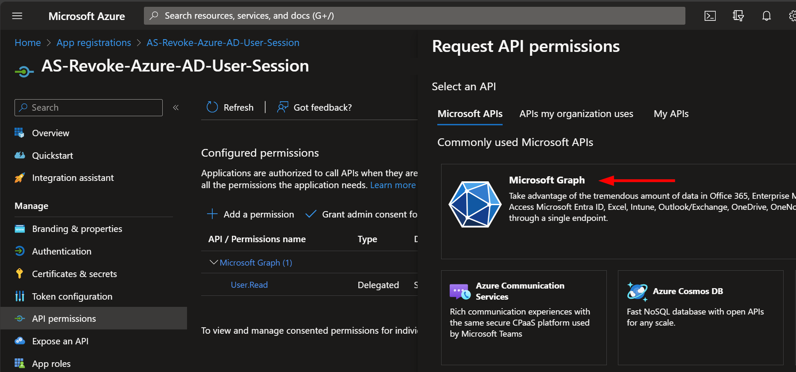

Click "**Application permissions**", then paste "**User.ReadWrite.All**" in the search bar. Click the option matching the search, then click "**Add permission**".

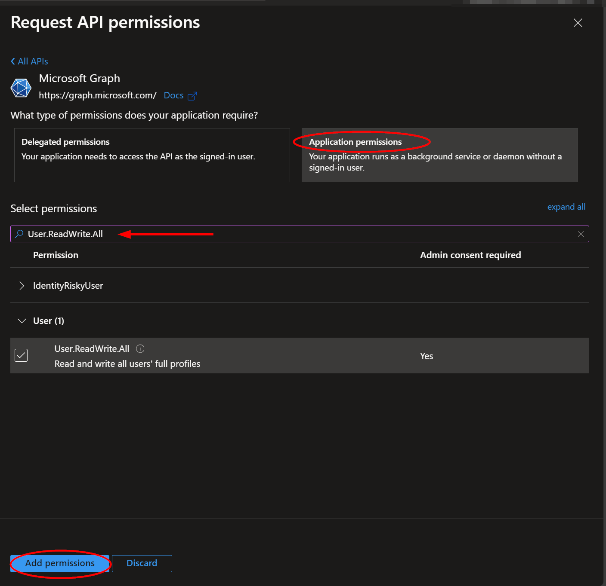

Admin consent will be needed before your app registration can use the assigned permission. Click "**Grant admin consent for (name)**".

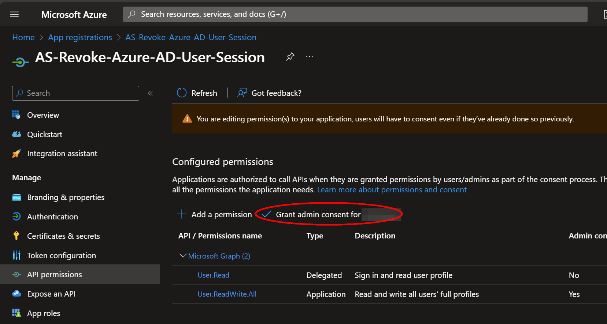

Lastly, a client secret will need to be generated for the app registration. From the left menu blade, click "**Certificates & secrets**" under the "**Manage**" section. Then, click "**New client secret**".

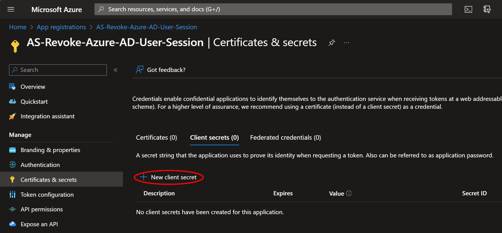

Enter a description and select the desired expiration date, then click "**Add**".

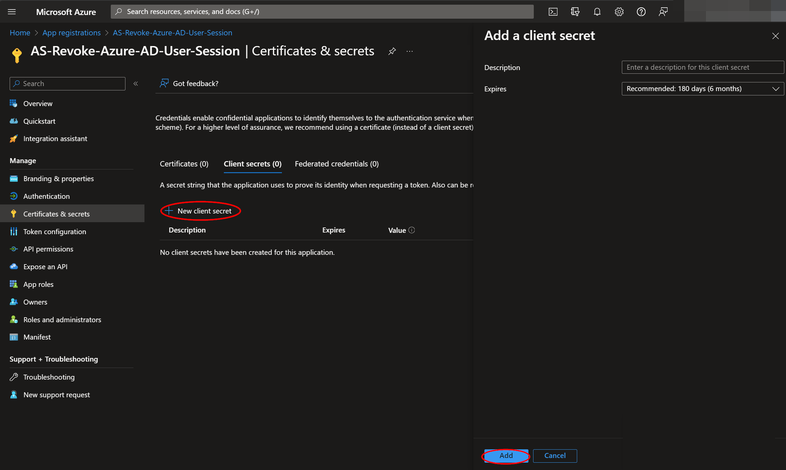

Copy the value of the secret that is generated, as this will be needed for [Create an Azure Key Vault Secret](https://github.com/Azure/Azure-Sentinel/tree/master/Playbooks/AS-Revoke-Azure-AD-User-Session-From-Entity#create-an-azure-key-vault-secret).

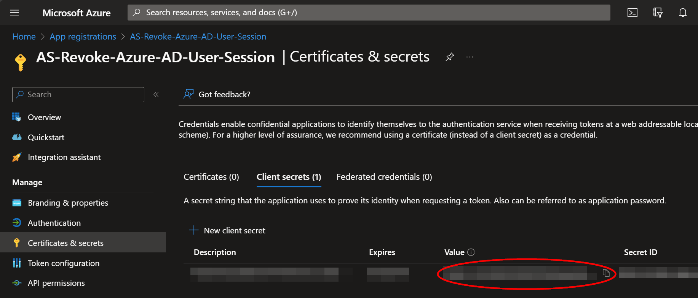

#### Create an Azure Key Vault Secret

Navigate to the Azure key vaults page: https://portal.azure.com/#view/HubsExtension/BrowseResource/resourceType/Microsoft.KeyVault%2Fvaults

Navigate to an existing key vault or create a new one. From the key vault overview page, click the "**Secrets**" menu option, found under the "**Settings**" section. Click "**Generate/Import**".

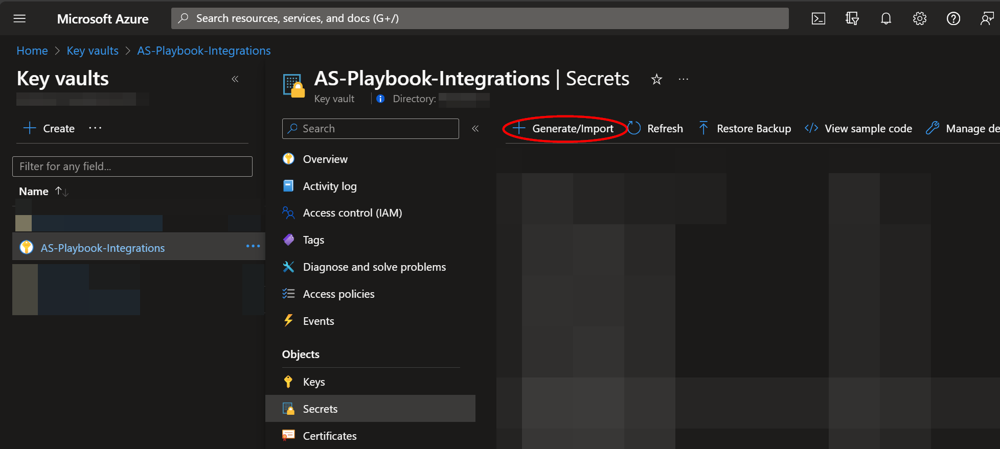

Choose a name for the secret, such as "**AS-Revoke-Azure-AD-User-Session--App-Registration-Client-Secret**", and enter the client secret copied in the [previous section](https://github.com/Azure/Azure-Sentinel/tree/master/Playbooks/AS-Revoke-Azure-AD-User-Session-From-Entity#create-an-app-registration). All other settings can be left as is. Click "**Create**". 

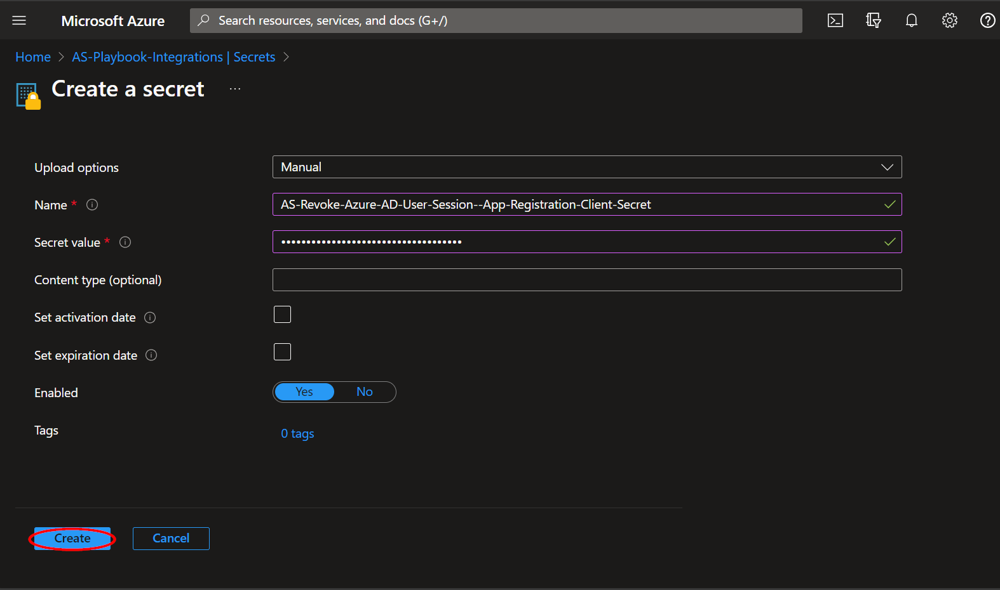

Once your secret has been added to the vault, navigate to the "**Access policies**" menu option. Leave this page open, as you will need to return to it once the playbook has been deployed. See [Granting Access to Azure Key Vault](https://github.com/Azure/Azure-Sentinel/tree/master/Playbooks/AS-Revoke-Azure-AD-User-Session-From-Entity#granting-access-to-azure-key-vault).

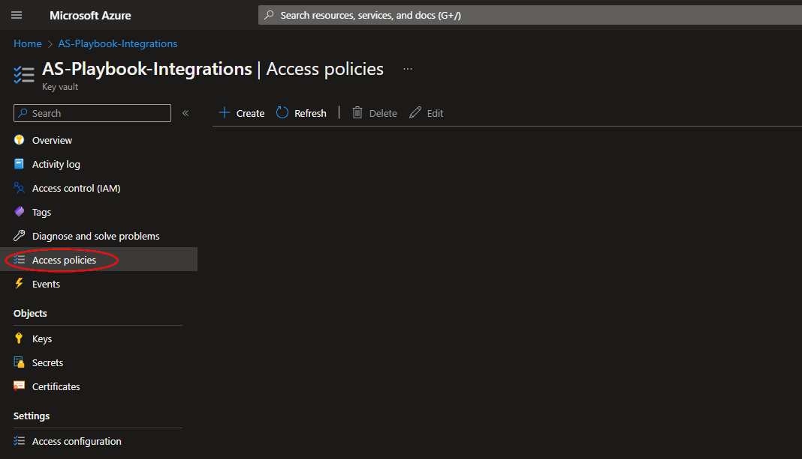

#
### Deployment

To configure and deploy this playbook:
 
Open your browser and ensure you are logged into your Microsoft Sentinel workspace. In a separate tab, open the link to our playbook on the Accelerynt Security GitHub repository:

https://github.com/Accelerynt-Security/AS-Revoke-Azure-AD-User-Session-From-Entity

                                             

Click the "**Deploy to Azure**" button at the bottom and it will bring you to the custom deployment template.

In the **Project Details** section:

* Select the "**Subscription**" and "**Resource Group**" from the dropdown boxes you would like the playbook deployed to.  

In the **Instance Details** section:

* **Playbook Name**: This can be left as "**AS-Revoke-Azure-AD-User-Session-From-Entity**" or you may change it.

* **Client ID**: Enter the Application (client) ID of your app registration referenced in [Create an App Registration](https://github.com/Azure/Azure-Sentinel/tree/master/Playbooks/AS-Revoke-Azure-AD-User-Session-From-Entity#create-an-app-registration).

* **Key Vault Name**: Enter the name of the key vault referenced in [Create an Azure Key Vault Secret](https://github.com/Azure/Azure-Sentinel/tree/master/Playbooks/AS-Revoke-Azure-AD-User-Session-From-Entity#create-an-azure-key-vault-secret).

* **Key Vault Secret Name**: Enter the name of the key vault Secret created in [Create an Azure Key Vault Secret](https://github.com/Azure/Azure-Sentinel/tree/master/Playbooks/AS-Revoke-Azure-AD-User-Session-From-Entity#create-an-azure-key-vault-secret).

Towards the bottom, click on "**Review + create**". 

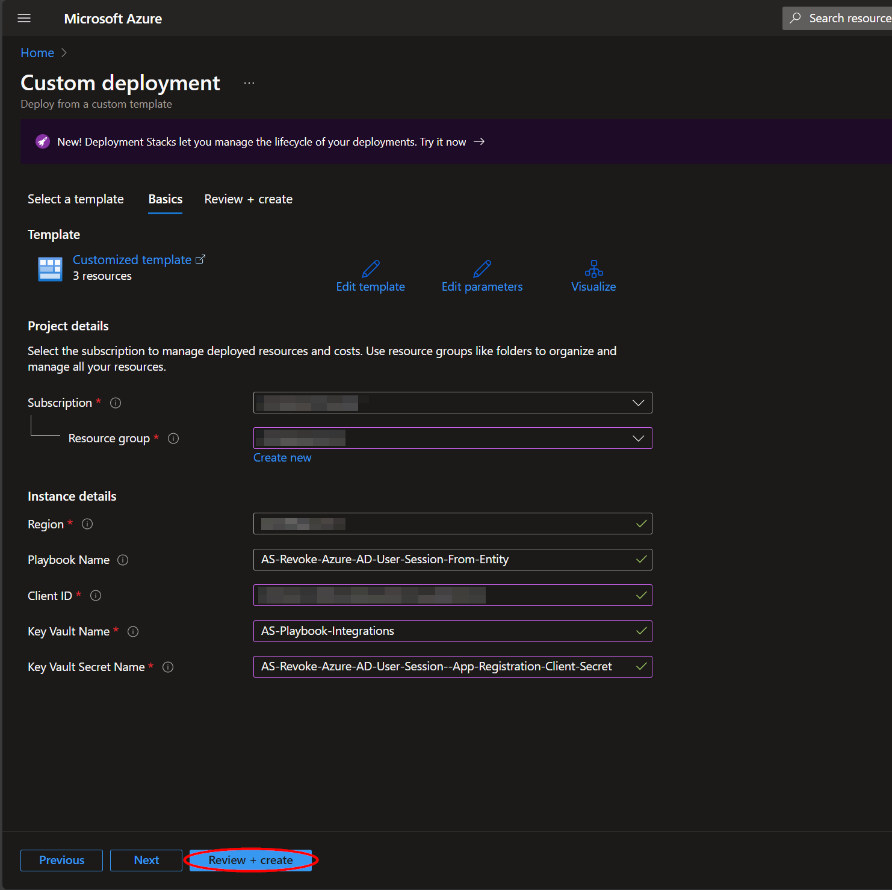

Once the resources have validated, click on "**Create**".

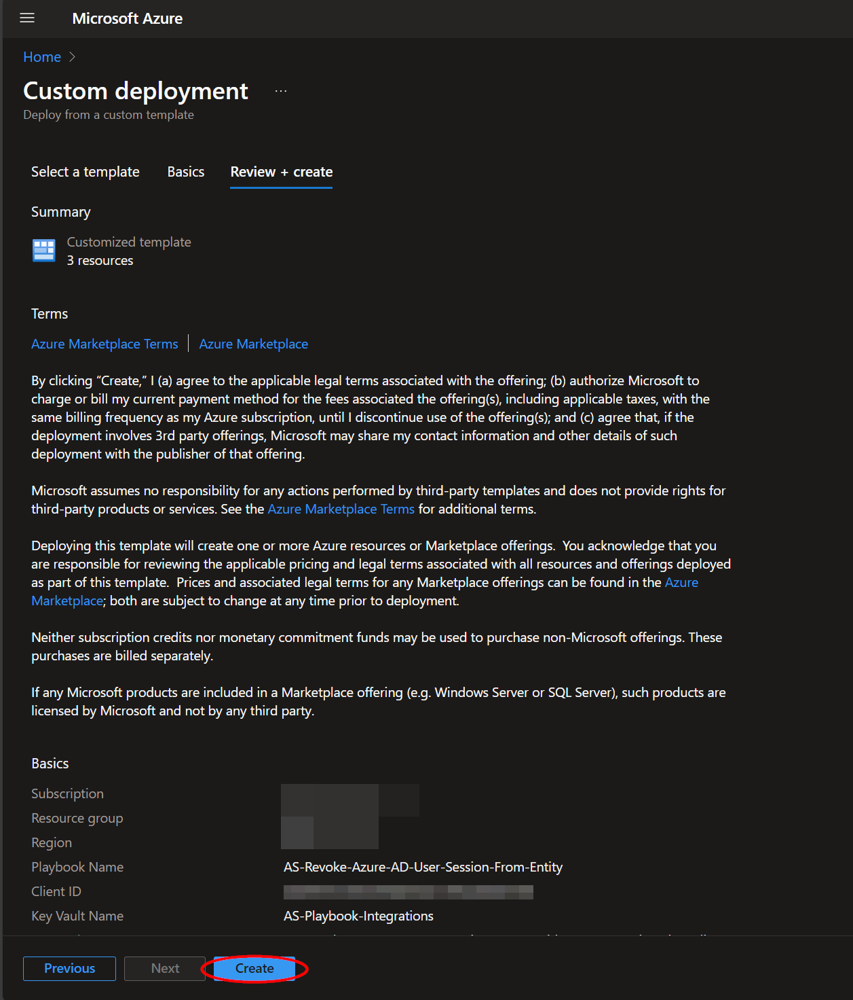

The resources should take around a minute to deploy. Once the deployment is complete, you can expand the "**Deployment details**" section to view them.
Click the one corresponding to the Logic App.

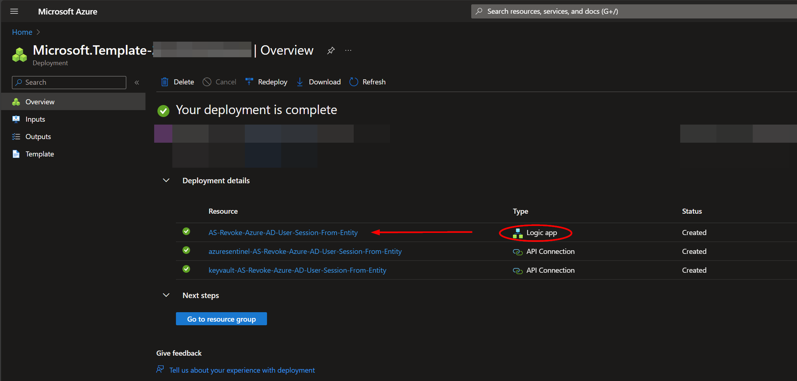

#
### Granting Access to Azure Key Vault

Before the Logic App can run successfully, the key vault connection created during deployment must be granted access to the key vault storing your app registration client secret.

From the key vault "**Access policies**" page, click "**Create**".

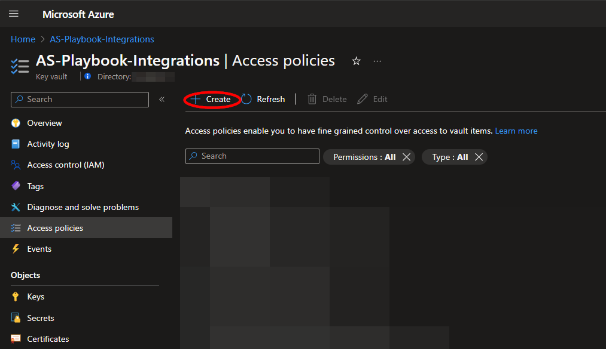

Select the "**Get**" checkbox under "**Secret permissions**", then click "**Next**".

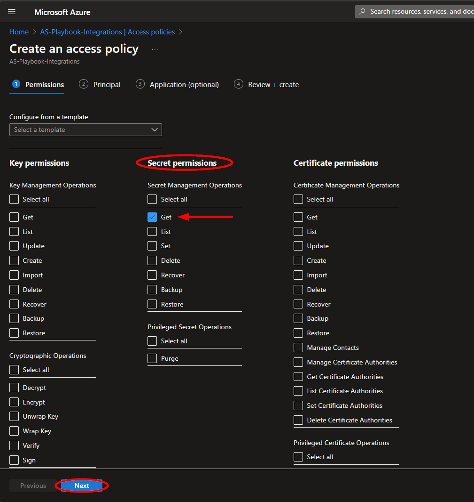

Paste "**AS-Revoke-Azure-AD-User-Session-From-Entity**" into the principal search box and click the option that appears. If the app registration also appears, select the option that does **not** match the Application (client) ID of your app registration. Click "**Next**" towards the bottom of the page.

Navigate to the "**Review + create**" section and click "**Create**".

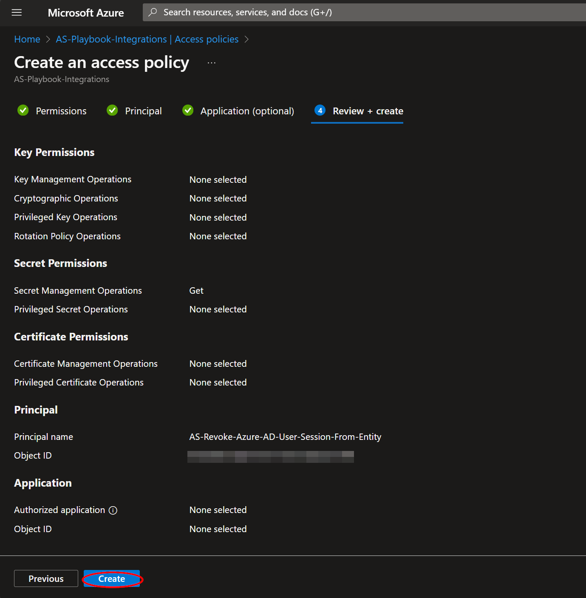
