# AS-Sign-Out-Google-User

Author: Accelerynt

For any technical questions, please contact info@accelerynt.com  

       

This playbook is intended to be run from a Microsoft Sentinel Incident. It will look up the Google Users associated with the Incident Account Entities and sign them out of all Google web and device sessions. This action also resets user sign-in cookies and forces them to reauthenticate. A comment noting the affected Google Users will be added to the Incident.

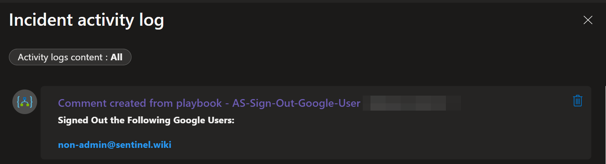

> **Note**
> Please note that this method may not work with all user types. In some cases, actions executed by service accounts could be restricted, particularly when attempting to operate on super admin accounts or accounts with higher privileges.

#
### Requirements
                                                                                                                            
The following items are required under the template settings during deployment: 

* A [Google Service Account](https://github.com/Azure/Azure-Sentinel/tree/master/Playbooks/AS-Sign-Out-Google-User#create-a-google-service-account) with the proper scope and role configurations
* A [Private Key](https://github.com/Azure/Azure-Sentinel/tree/master/Playbooks/AS-Sign-Out-Google-User#create-a-private-key) in JSON format for your Google Service Account
* An [Azure Key Vault Secret](https://github.com/Azure/Azure-Sentinel/tree/master/Playbooks/AS-Sign-Out-Google-User#create-an-azure-key-vault-secret) containing your  private key
* Install [Visual Studio Code](https://github.com/Azure/Azure-Sentinel/tree/master/Playbooks/AS-Sign-Out-Google-User#configure-visual-studio-code) and configure it to deploy an Azure Function to your Azure tenant
* An [Azure Function App](https://github.com/Azure/Azure-Sentinel/tree/master/Playbooks/AS-Sign-Out-Google-User#deploy-the-azure-function-app) that supports Python to deploy an Azure function to

# 
### Setup
                                                                                                                             
#### Create a Google Service Account:

A Google Service Account with User Management Admin role and user.security scope is needed in order to perform the [users.signOut](https://developers.google.com/admin-sdk/directory/reference/rest/v1/users/signOut) action. A Google Cloud project is required to use Google Workspace requirements.txts and is where the Service Account will be housed. If you do not have an existing project, you can create one here: https://console.cloud.google.com/projectcreate

To create a Google Service Account, navigate to the Google Cloud console sign into an account that has administrator access, or have your administrator grant you the necessary [roles](https://cloud.google.com/iam/docs/service-accounts-create#permissions) to create Service Accounts, then navigate to the following page and select the appropriate project:

https://console.cloud.google.com/iam-admin/serviceaccounts/create

Enter a name for your Google Service Account, such as "**Microsoft-Sentinel**", then click "**Done**".

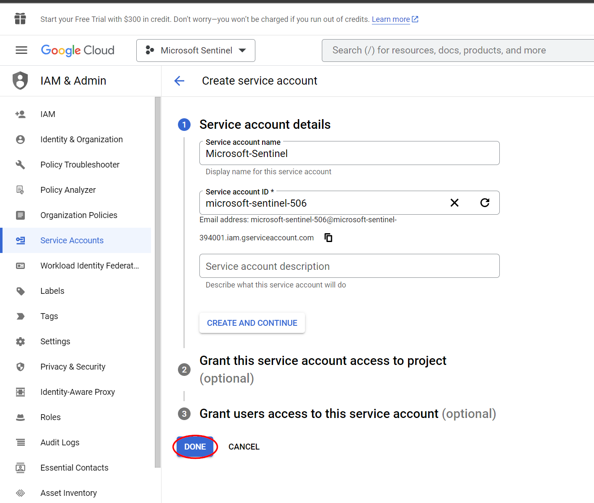

Take note of the client ID and the email address that are generated for your Service Account upon creation, which can be found at https://console.cloud.google.com/iam-admin/serviceaccounts by selecting the project housing your Service Account.

Next you will need to add your newly created Service Account to the User Management Admin role. Navigate to https://admin.google.com/ac/roles and click "**Assign Admin**" for the "**User Management Admin**" role.

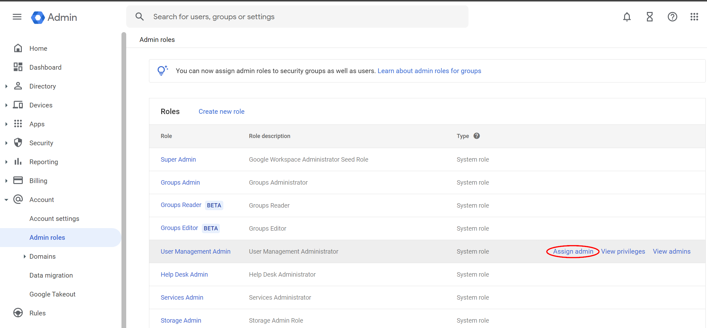

Click "**Assign Service Accounts**".

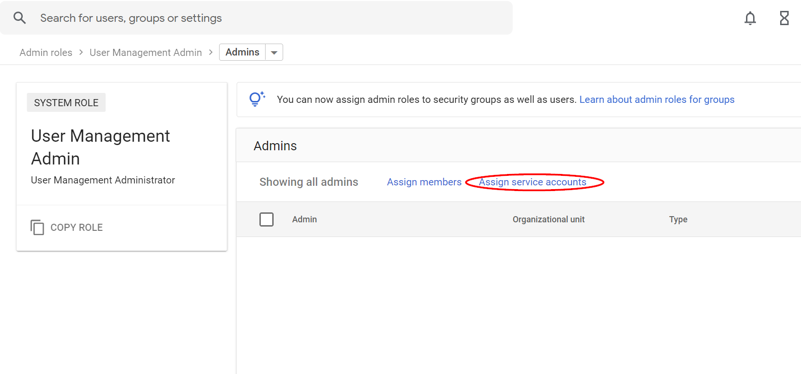

Enter the email generated for your Service Account and click "**ASSIGN ROLE**".

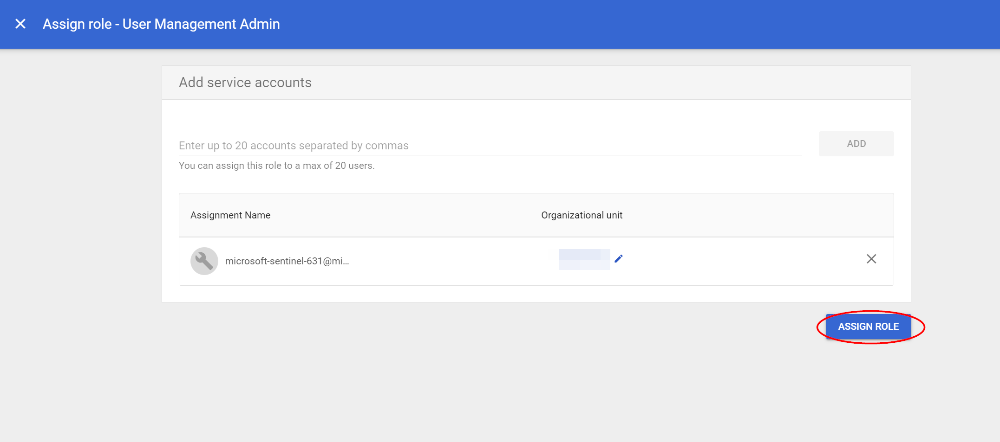
   
Next, you will need to add the necessary scopes to the Service Account. Go to the admin console API controls: https://admin.google.com/ac/owl, and click "**MANAGE DOMAIN WIDE DELEGATION**".

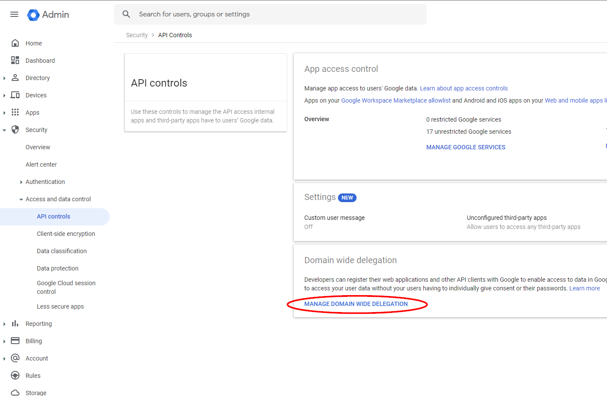

Click "**Add new**", then enter the client ID generated for your Service Account and paste "**https://www.googleapis.com/auth/admin.directory.user.security**" in the OAuth scopes field. Click "**AUTHORIZE**".

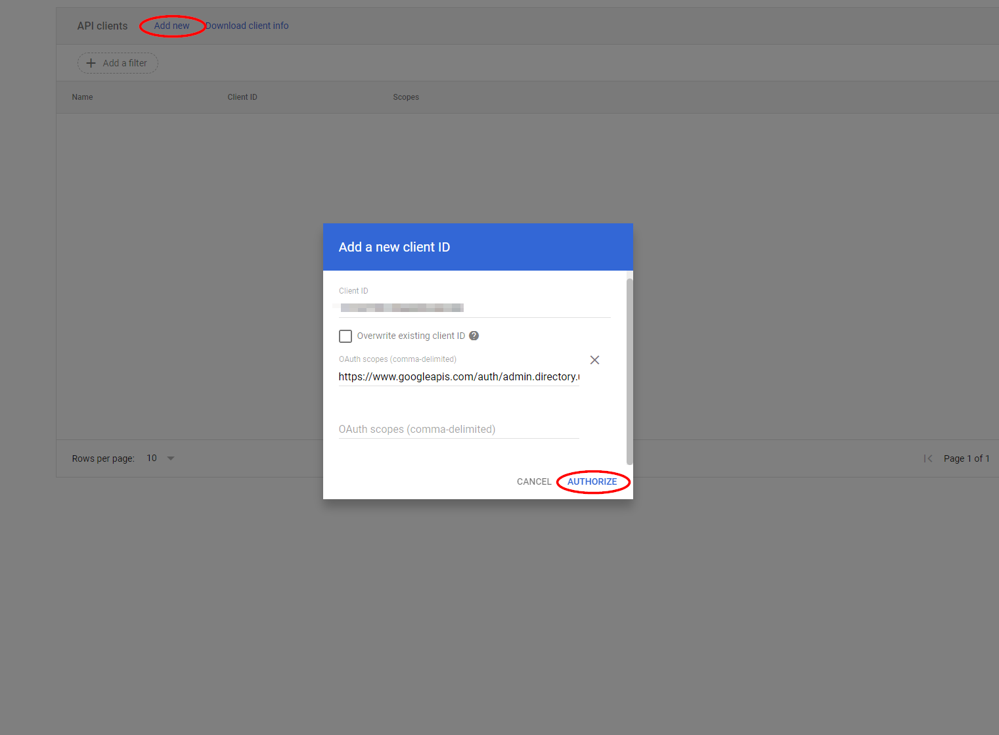

Before this Service Account can successfully use the Google API, you will also need to enable admin SDK for your project. Navigate to https://console.cloud.google.com/apis/api/admin.googleapis.com/metrics and click "**ENABLE**".

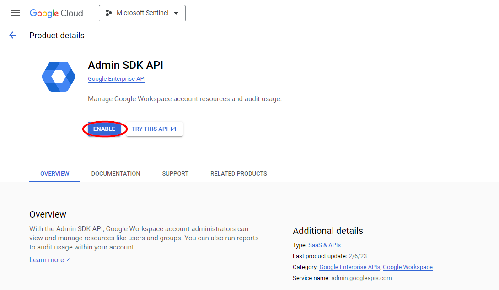

#### Create a Private Key:

Returning to your Google Service Account at https://console.cloud.google.com/iam-admin/serviceaccounts, select your Google Project and Service Account, then navigate to the "**Keys**" tab. Click "**ADD KEY**" and select the "**Create new key**" option.

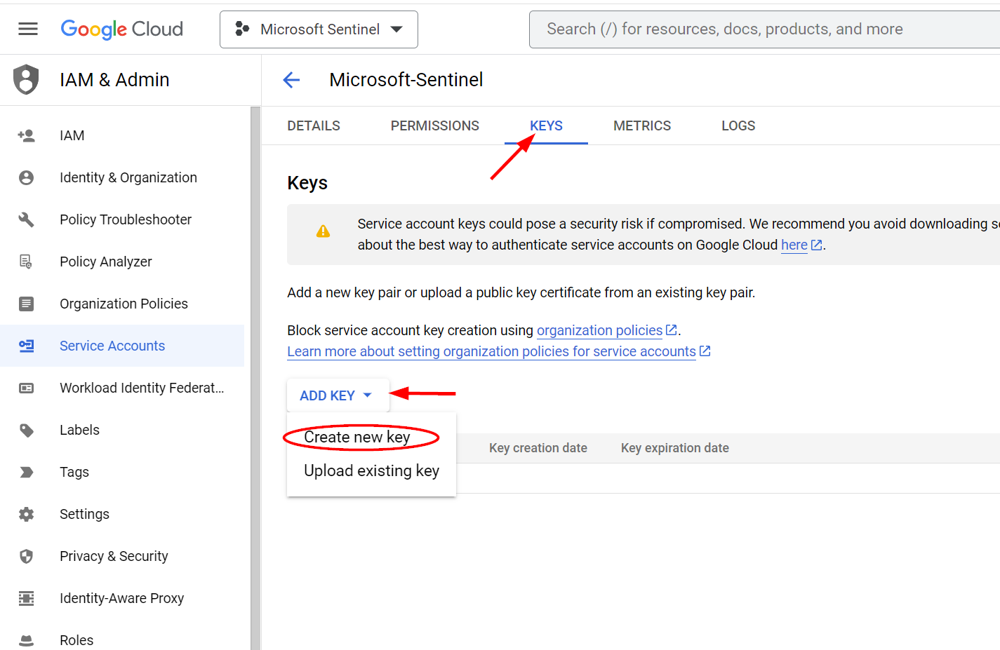

Select the "**JSON**" option, then click "**CREATE**".

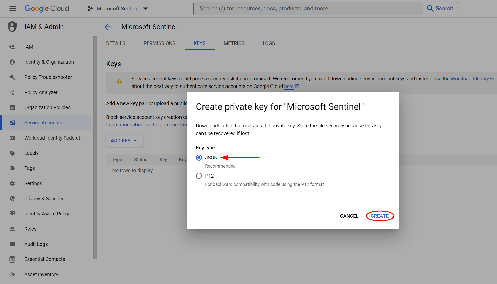

The JSON file containing your private key will download to your computer. Copy the JSON body in the file and save it for the next step.

#### Create an Azure Key Vault Secret:

Navigate to the Azure Key Vaults page: https://portal.azure.com/#view/HubsExtension/BrowseResource/resourceType/Microsoft.KeyVault%2Fvaults

Navigate to an existing Key Vault or create a new one. From the Key Vault overview page, click the "**Secrets**" menu option, found under the "**Settings**" section. Click "**Generate/Import**".

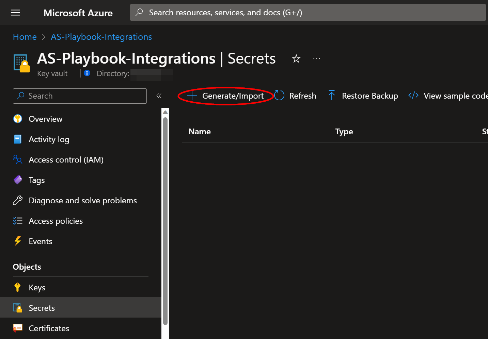

Choose a name for the secret, such as "**Google-App-Private-Key--Sign-Out-User**", and enter the Google private key JSON copied from the [previous step](https://github.com/Azure/Azure-Sentinel/tree/master/Playbooks/AS-Sign-Out-Google-User#encode-the-private-key-for-storage-compatibility-in-azure-key-vault) in the "**Value**" field. All other settings can be left as is. Click "**Create**". 

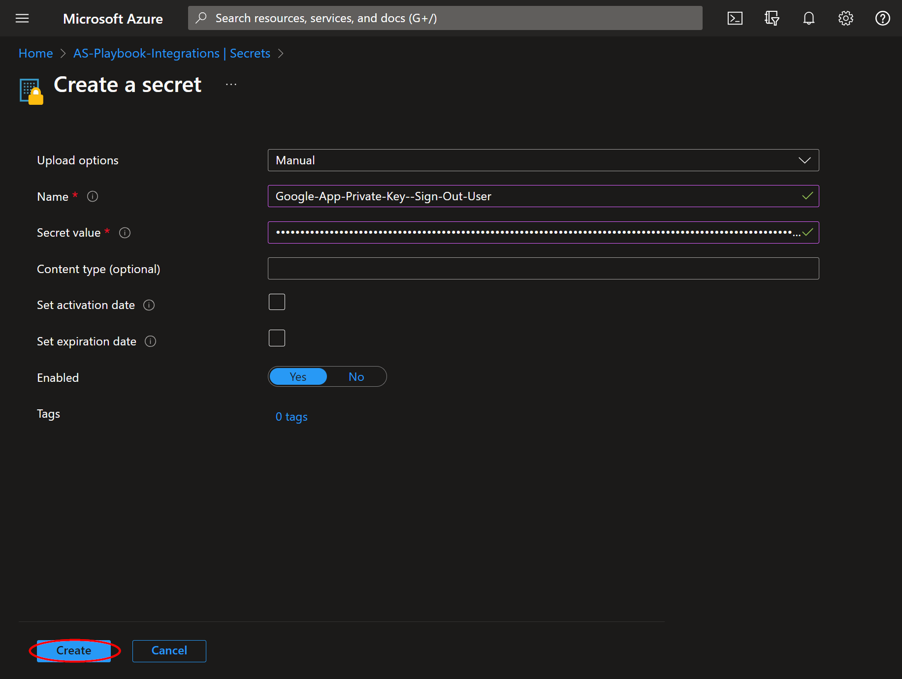

Once your secret has been added to the vault, navigate to the "**Access policies**" menu option on the Key Vault page menu. Leave this page open, as you will need to return to it once the playbook has been deployed. See [Granting Access to Azure Key Vault](https://github.com/Azure/Azure-Sentinel/tree/master/Playbooks/AS-Sign-Out-Google-User#granting-access-to-azure-key-vault).

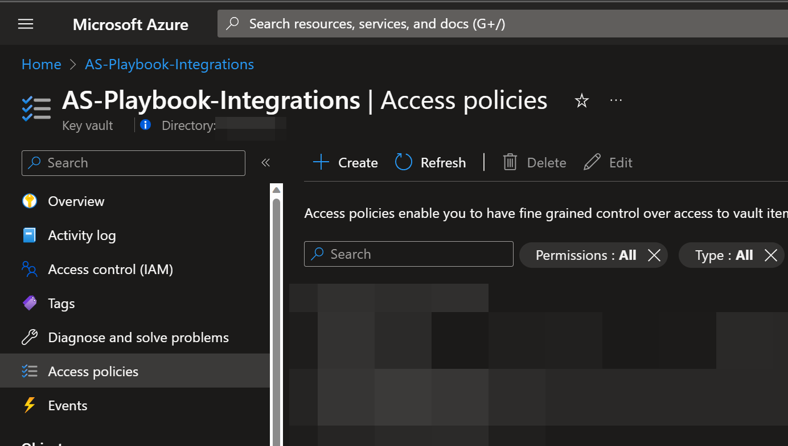

#### Configure Visual Studio Code:

This playbook utilizes an Azure Function to create a JSON Web Token (JWT), which is a required step in authenticating to Google as a Service Account. The Azure Function is included in this repository and will need to be deployed to your Azure tenant before it can be used. This Azure Function relies on the Python libraries "**azure-functions**", "**PyJWT**", and "**cryptography**". These libraries are not included in Python by default, which is why they must be installed in an IDE housing the CreateGoogleJWT project and then deployed to Azure.

> **Note**
> Simply recreating the file structure from this repository in Azure will not actually install the libraries required for the Azure Function; the function must be deployed from an IDE, so that the dependent library packages are recreated and properly installed. Any IDE can be used for this, but this documentation will outline the process using Visual Studio Code (VS Code).

If you have not already, download and install VS Code from the official website: https://code.visualstudio.com/download

Once VS Code has been installed, open it, and navigate to the Extensions view by clicking on the Extensions icon on the left menu blade. 

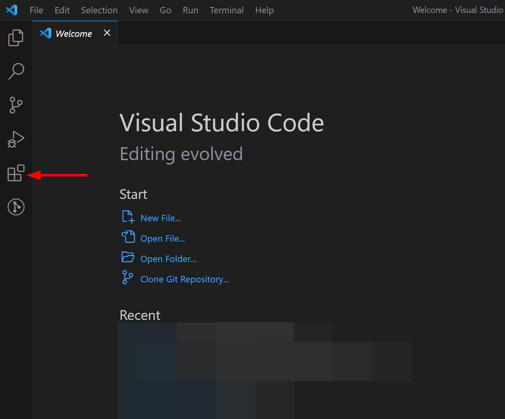

In the Extensions view, search for the following extensions and install them:
* **Azure Account**: This extension provides a single Azure login and subscription filtering experience for all other Azure extensions. It makes Azure's Cloud Shell service available in VS Code's integrated terminal.
* **Azure Functions**: This extension helps in creating, testing, and deploying Azure Functions directly from VS Code. This includes the creation of new Function Apps within your Azure account.

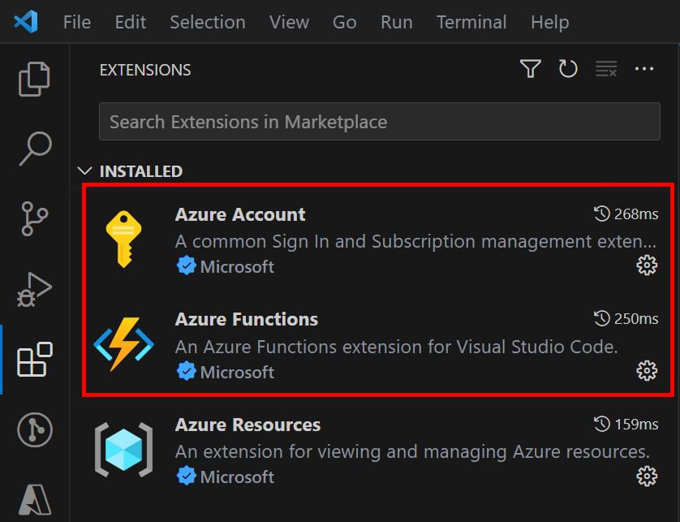

After the extensions have been installed, sign in to your Azure Account. Click on the Azure icon that now appears in the Activity Bar. Under the "**Resources**" section, click "**Sign in to Azure...**". 

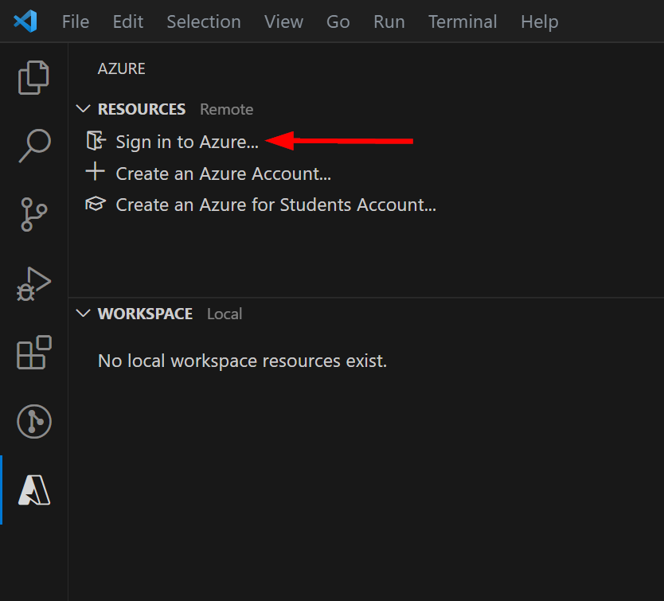

You will be prompted to sign in to your account via web browser. Follow the prompts and use your Azure credentials to log in.

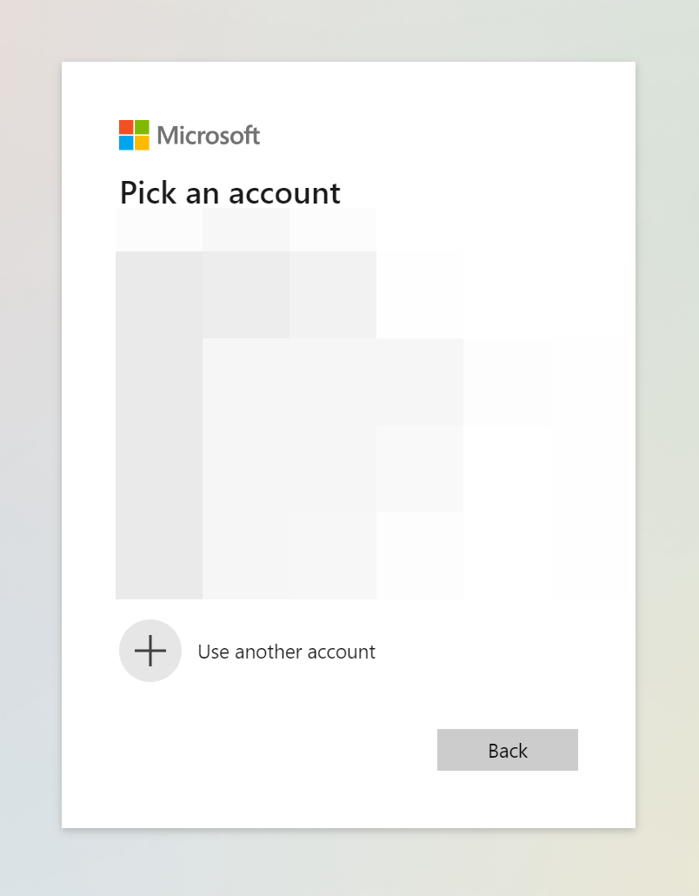

Once you have successfully authenticated, your Azure email will be displayed in the bottom left corner of the VS Code window.

Next, you will need to create an Azure Function project using the code included in this Google repo. Create a folder on your computer for the Azure Function to be housed and label it "**CreateGoogleJWT**". Next, in VS Code, hover your mouse over the "**Workspace**" section in the Azure pane on the left. Click the "**Create Function**" icon. Select the "**CreateGoogleJWT**" folder you just created from the open dialogue window.

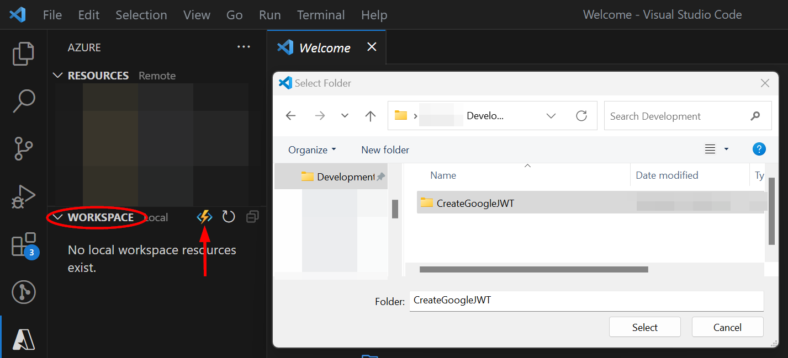

From the command palette in the top-center area of the window, select "**Python**" as the programming language, then select "**Python 3.10.11**" or later for your Python interpreter.

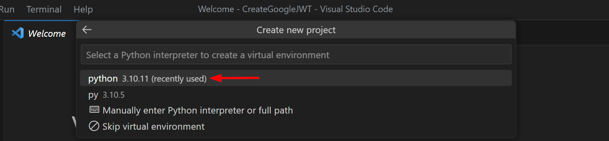

Select "**HTTP trigger**" for the project's function and enter "**CreateGoogleJWT**" for the function name.

Select "**Function**" for the Authorization level, then after selecting the window to open your project in and granting trust, you will be able to view the "**CreateGoogleJWT**" project in the explorer pane of the left side of the window. The "**__init__.py**" file should be opened by default.

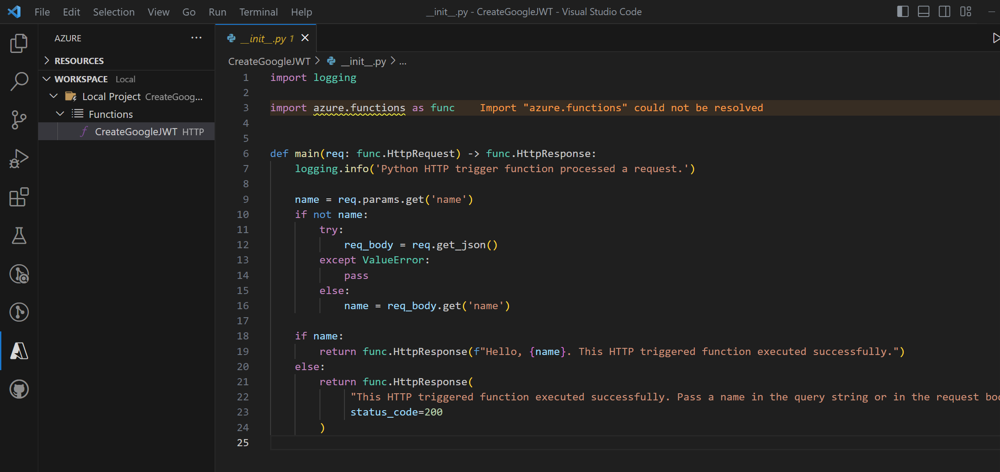

>**Note**
> If you decide to use a different name for the function, you will need to do a -Find + Replace All- for "**CreateGoogleJWT**" in the azuredeploy.json file before deployment.

Replace the contents of "**__init__.py**" in VS Code with the contents of "**CreateGoogleJWT.js**" located in the CreateGoogleJWT-Function folder of this repository.

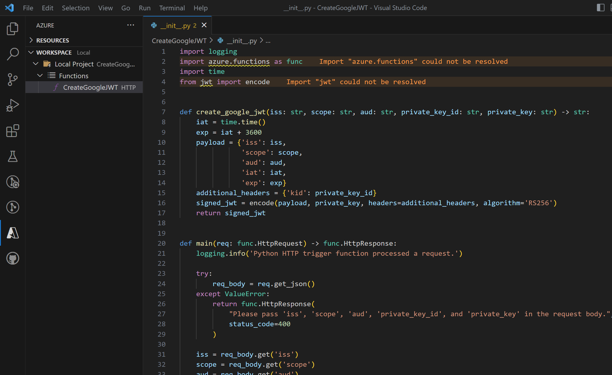

Finally, the Python packages used in __init__.py need to be installed. Download and install the latest versions of Python and pip from the official website:  https://www.python.org/downloads/

Next, in VS Code, click "**Terminal**" from the top menu and select "**New Terminal**".

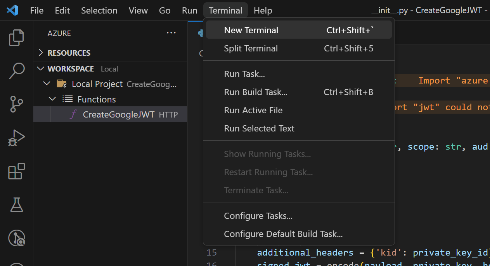

In the terminal window, run the command "**python.exe -m pip install --upgrade pip**" to verify that the latest versions were properly installed.

Next, run the commands "**pip3 install azure-functions**", "**pip3 install cryptography**" and "**pip3 install pyjwt**". The packages will be automatically added to the dependencies in the "**requirements.txt**" file once they have been successfully installed.

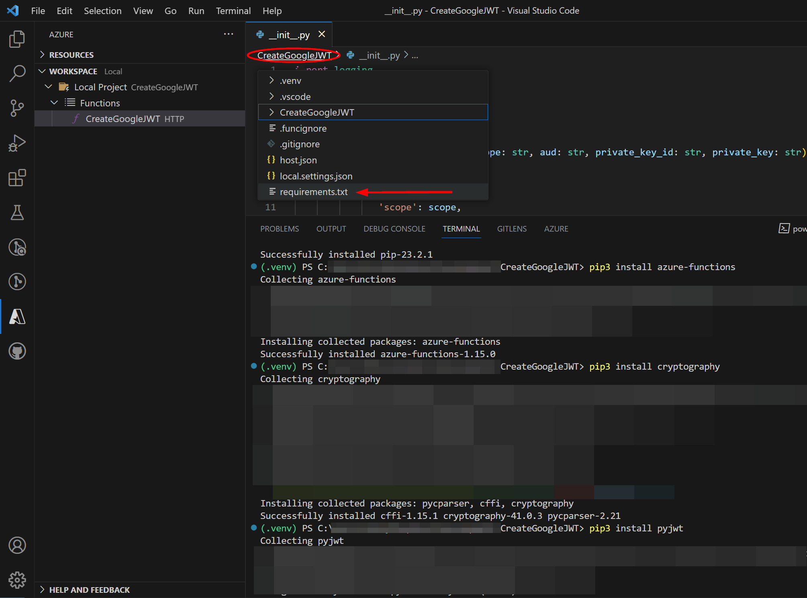

Check the "**requirements.txt**" file to ensure all three dependencies have been added. You may have to add them manually, which is fine, as long as the install commands have already been run. Be sure to save the file if you are updating it manually.

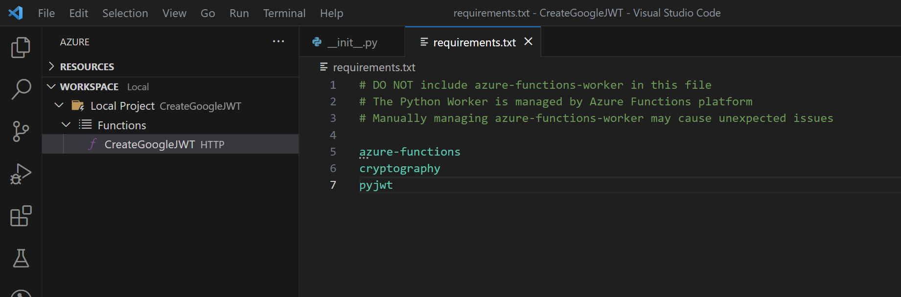

After installing the required packages, the Azure Function can be deployed.

#### Deploy the Azure Function App:

In order to deploy an Azure Function, there must be an existing Azure Function App supporting the language used in the Azure function. If there is an existing Function App that supports Python in your Azure subscription, you can skip the first part of this step. Otherwise, you need to create a new Function App in your Azure subscription before deploying your Function.

Click on the Azure icon in the left side Activity Bar in VS Code. Select the resource you will deploy this playbook to, and then right click on "**Azure Function**" and select "**Create Function App in Azure...**".

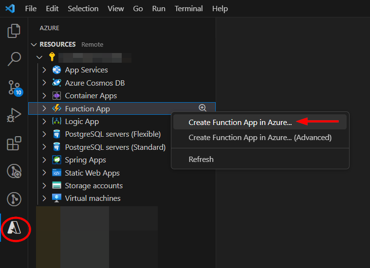

VS Code will guide you through the process. You will need to provide a globally unique name for your Function App, select a runtime stack, and choose an operating system. When asked for the runtime stack, select the latest available version for Python.

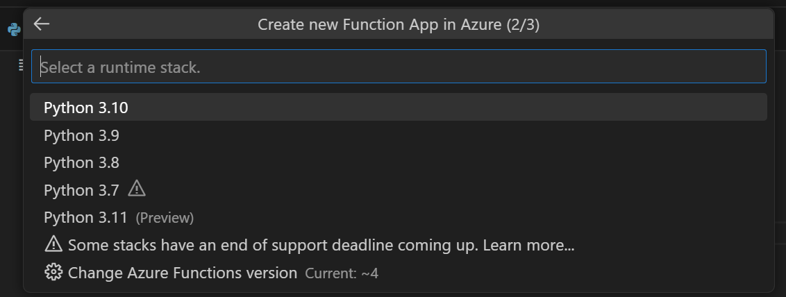

The Azure Function can now be deployed to the Azure Function App from VS Code. 

Click the Function App icon in the workspace section of the Azure extension, then select "**Deploy to Function App...**". 

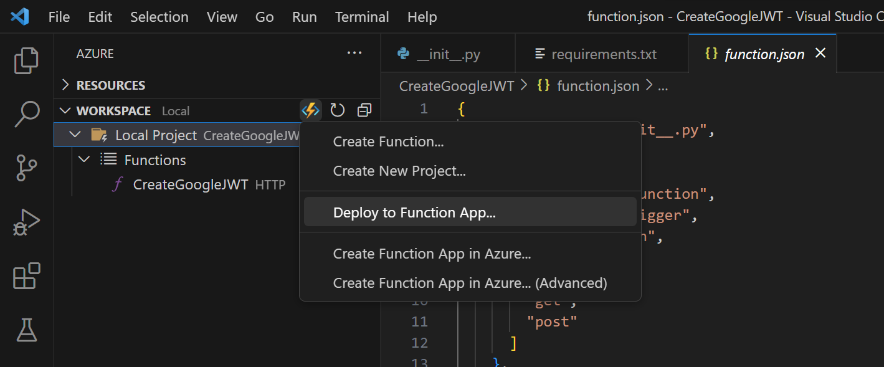

Follow the prompts to choose your subscription and the Function App to which you want to deploy to. Take note of the name of the Function App, as it will be needed for deployment.

Once the deployment is complete, the Function can be accessed from your Azure tenant by the playbook. You can view your Function by navigating to https://portal.azure.com/#view/HubsExtension/BrowseResource/resourceType/Microsoft.Web%2Fsites/kind/functionapp and selecting the Function App your Function was deployed to.

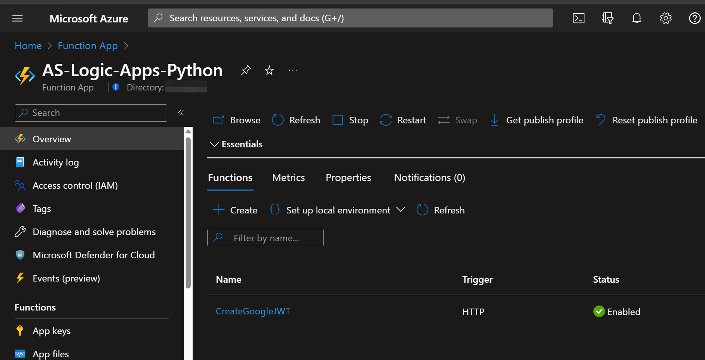

#
### Deployment                                                                                                         
                                                                                                        
To configure and deploy this playbook:
 
Open your browser and ensure you are logged into your Microsoft Sentinel workspace. In a separate tab, open the link to our playbook on the Accelerynt Security Google Repository:

https://Google.com/Accelerynt-Security/AS-Sign-Out-Google-User

                                             

Click the "**Deploy to Azure**" button at the bottom and it will bring you to the custom deployment template.

In the **Project Details** section:

* Select the "**Subscription**" and "**Resource Group**" from the dropdown boxes you would like the playbook deployed to.  

In the **Instance Details** section:   

* **Playbook Name**: This can be left as "**AS-Sign-Out-Google-User**" or you may change it.

* **Function App Name**: Enter the name of your Azure Function App noted in [Deploy the Azure Function App](https://github.com/Accelerynt-Security/AS-Block-GitHub-User#deploy-the-azure-function-app)

* **Key Vault Name**: Enter the name of the Key Vault referenced in [Create an Azure Key Vault Secret](https://github.com/Azure/Azure-Sentinel/tree/master/Playbooks/AS-Sign-Out-Google-User#create-an-azure-key-vault-secret).

* **Secret Name**: Enter the name of the Key Vault Secret created in [Create an Azure Key Vault Secret](https://github.com/Azure/Azure-Sentinel/tree/master/Playbooks/AS-Sign-Out-Google-User#create-an-azure-key-vault-secret).

Towards the bottom, click on "**Review + create**". 

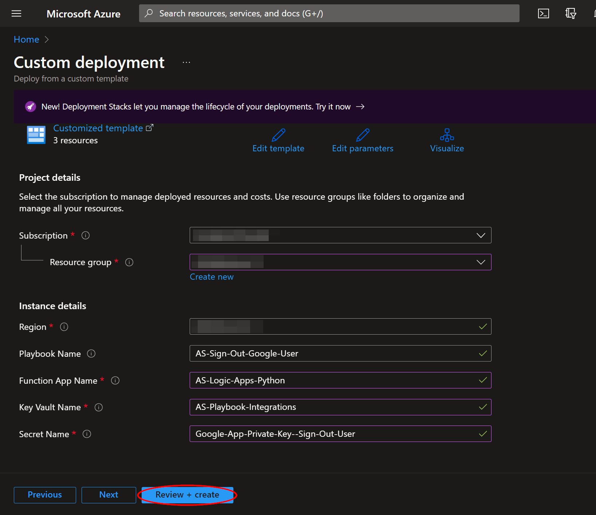

Once the resources have validated, click on "**Create**".

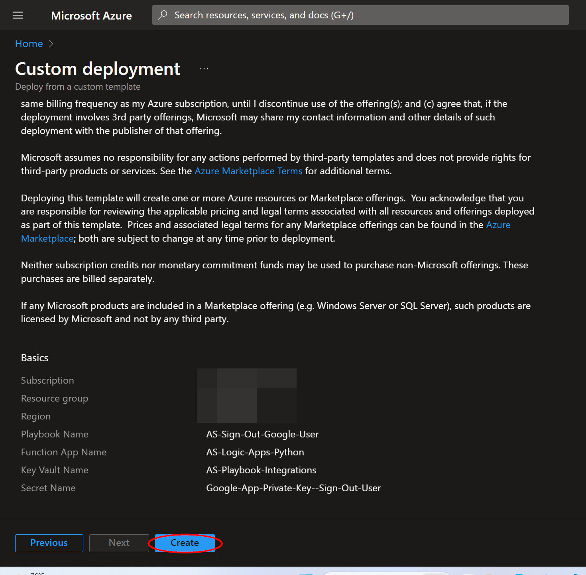

The resources should take around a minute to deploy. Once the deployment is complete, you can expand the "**Deployment details**" section to view them.
Click the one corresponding to the Logic App.

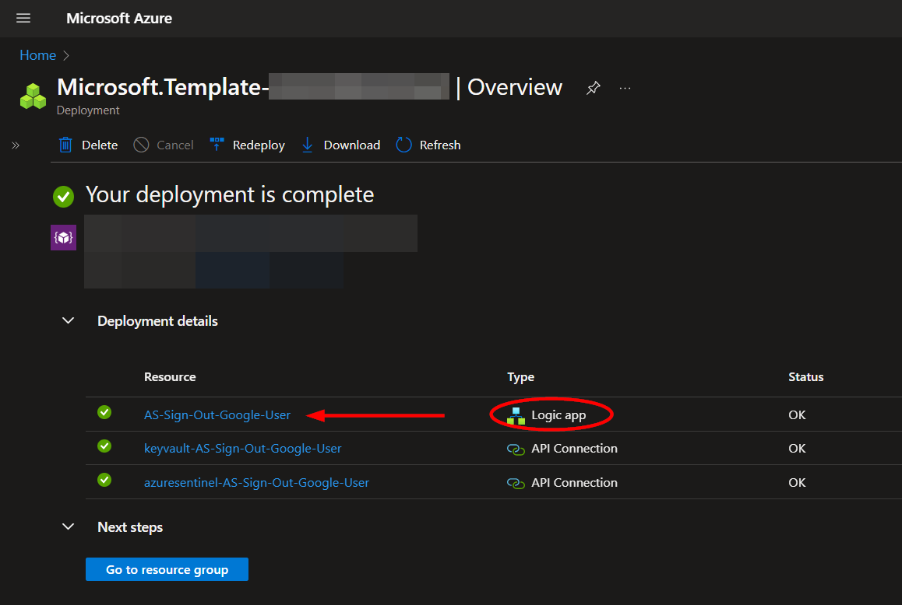

#
### Granting Access to Azure Key Vault

Before the Logic App can run successfully, the Key Vault connection created during deployment must be granted access to the Key Vault Secret storing your Google private key.

From the Key Vault "**Access policies**" page, click "**Create**".

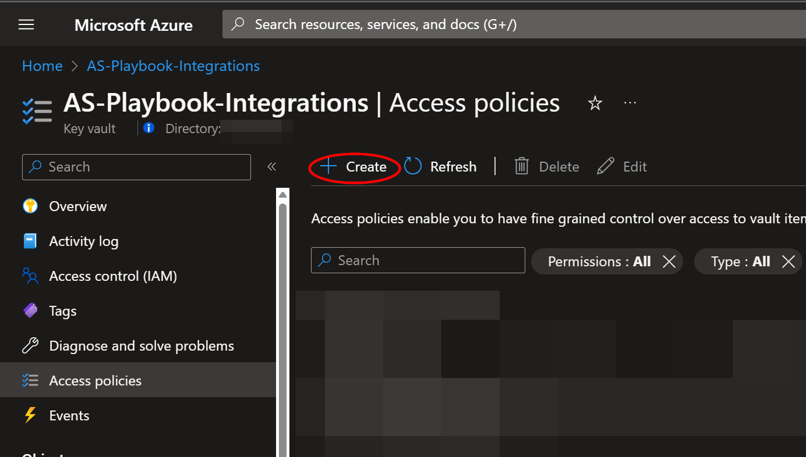

Select the "**Get**" checkbox in the "**Secret permissions**" section. Then click "**Next**".

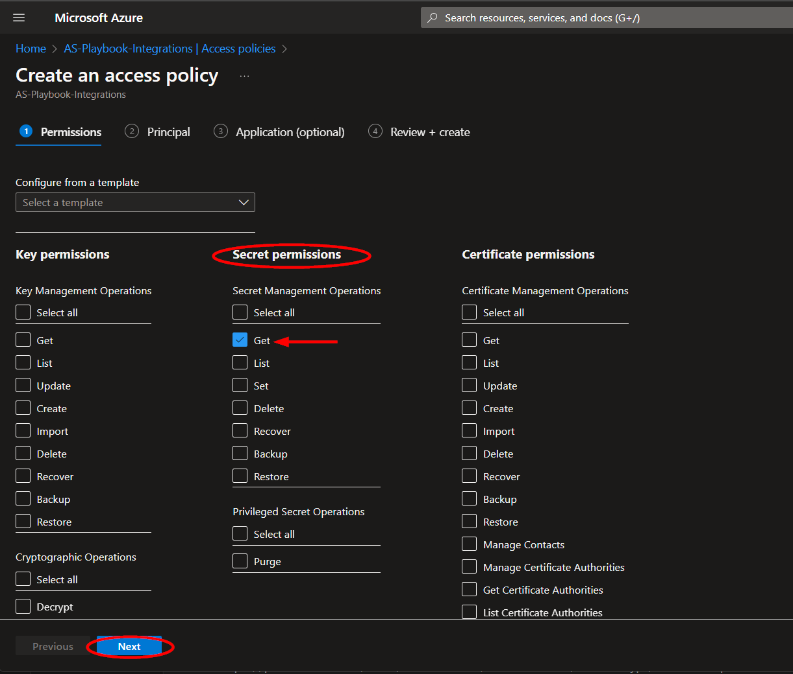

From the "**Principal**" page, paste "**AS-Sign-Out-Google-User**", or the alternative playbook name you used, into the search box and click the option that appears. Click "**Next**".

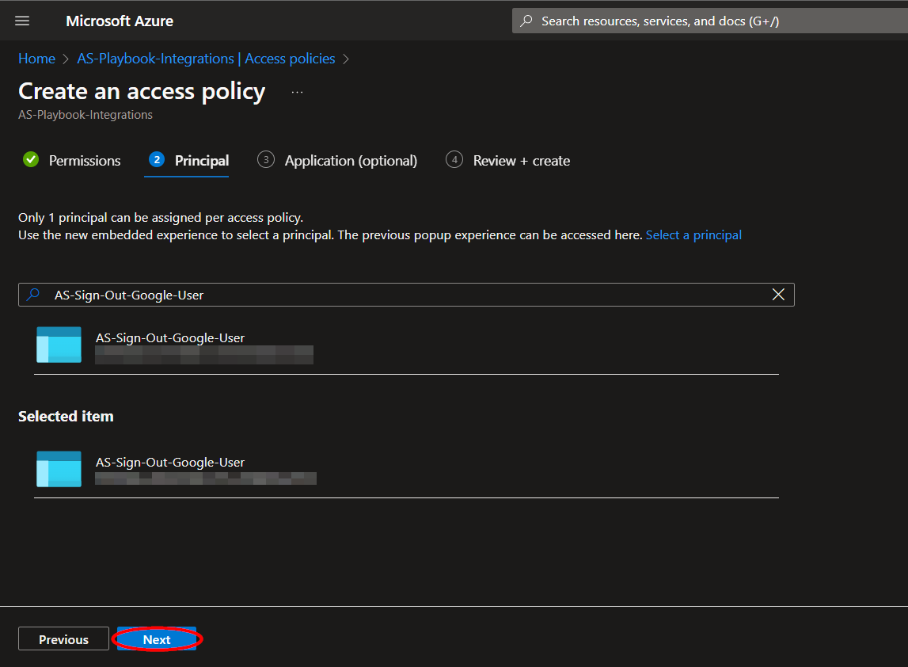

Click "**Next**" in the application section. Then from the "**Review + create**" page, click "**Create**".

#
### Microsoft Sentinel Contributor Role

After deployment, you will need to give the system assigned managed identity the "**Microsoft Sentinel Contributor**" role. This will enable the Logic App to add comments to Incidents. Navigate to the Log Analytics Workspaces page and select the same workspace the playbook is located in:

https://portal.azure.com/#view/HubsExtension/BrowseResource/resourceType/Microsoft.OperationalInsights%2Fworkspaces

Select the "**Access control (IAM)**" option from the menu blade, then click "**Add role assignment**".

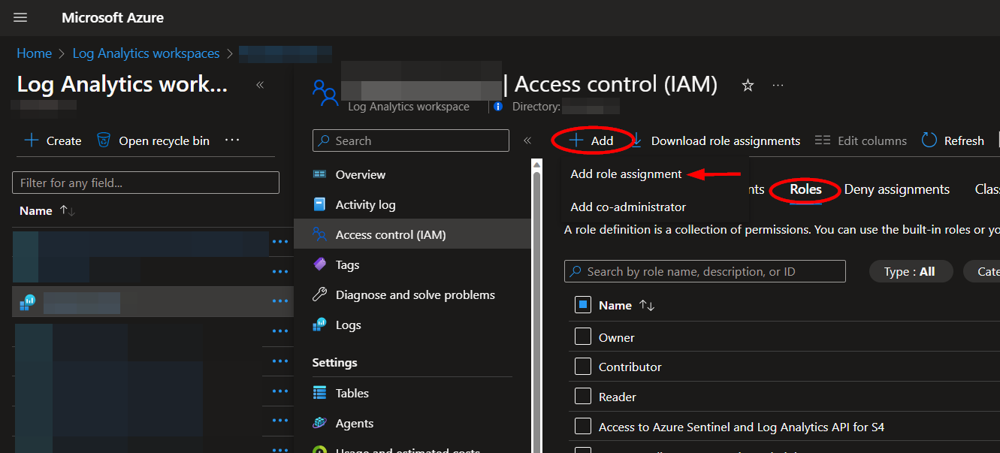

Select the "**Microsoft Sentinel Contributor**" role, then click "**Next**".

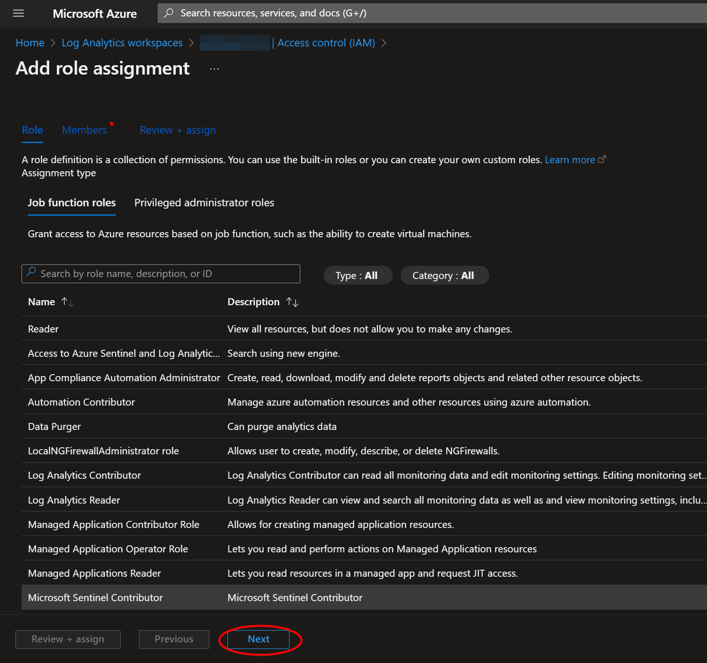

Select the "**Managed identity**" option, then click "**Select Members**". Under the subscription the Logic App is located, set the value of "**Managed identity**" to "**Logic app**". Next, enter "**AS-Sign-Out-Google-User**", or the alternative playbook name used during deployment, in the field labeled "**Select**". Select the playbook, then click "**Select**".

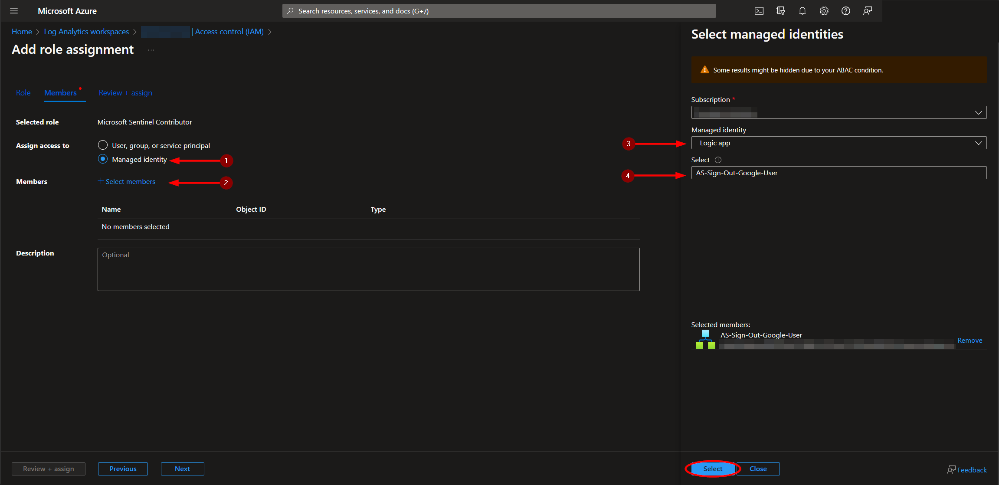

Continue on to the "**Review + assign**" tab and click "**Review + assign**".

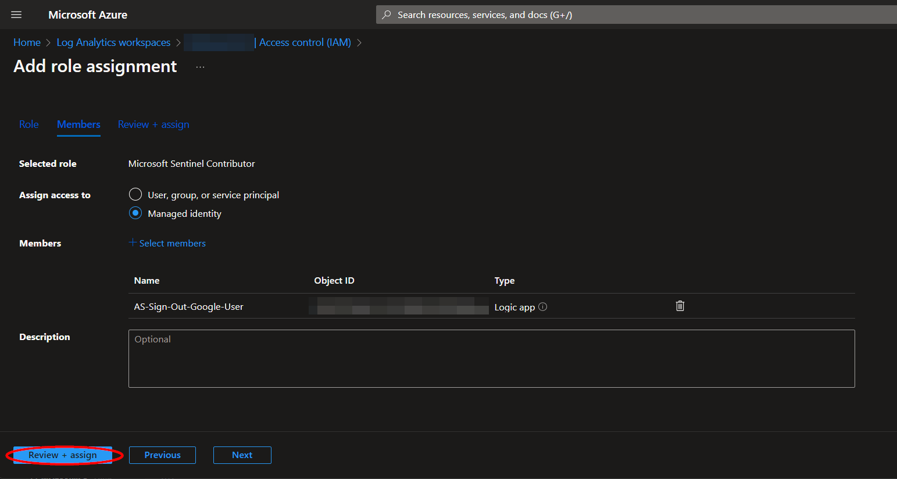

#
### Updating Python Packages for Azure Functions

As part of maintaining a robust and secure application, it's essential to regularly update the Python packages that your Azure Function relies on. There are several reasons for this:

* **Security Fixes**: Developers frequently release updates to their packages to address discovered vulnerabilities. Keeping your packages up-to-date ensures you benefit from these fixes and reduces your application's risk exposure.

* **Bug Fixes and Improved Functionality**: Updates often contain bug fixes or enhancements to functionality, stability, and performance. Regularly updating packages can provide your application with these benefits.

* **Compatibility**: If you're updating your Python runtime or other packages, you need to keep all packages updated to ensure compatibility and prevent breaking changes.

As a general guideline, you should review and test for updates at least once per month. More frequent checks can be performed if your function has higher security requirements or is particularly sensitive to bugs in the underlying packages. Automated tools exist to help manage these updates.

You can update the dependent libraries for your Azure Function in VS Code by executing the commands "**pip3 install --upgrade azure-functions**", "**pip3 install --upgrade cryptography**" and "**pip3 install --upgrade pyjwt**" within your "**CreateGoogleJWT**" project directory in the integrated terminal. Redeploy the Function to Azure afterwards.