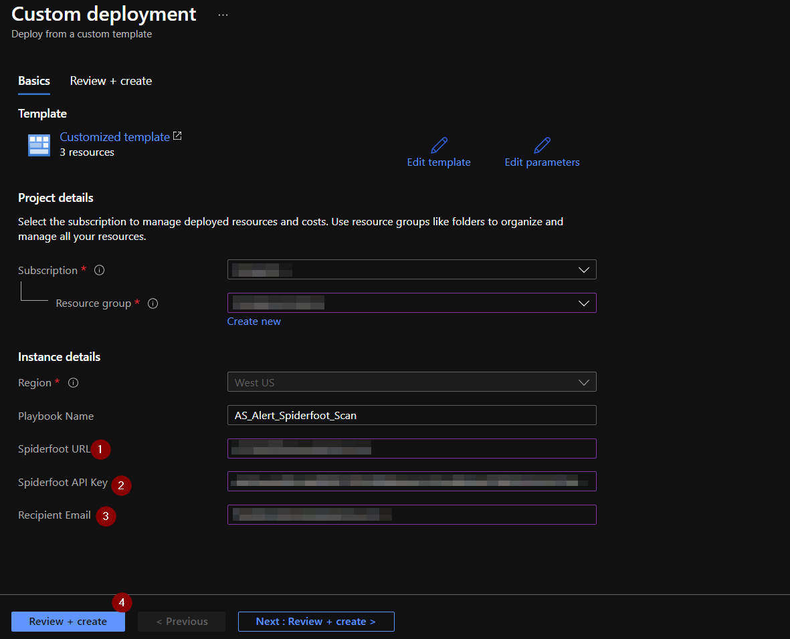
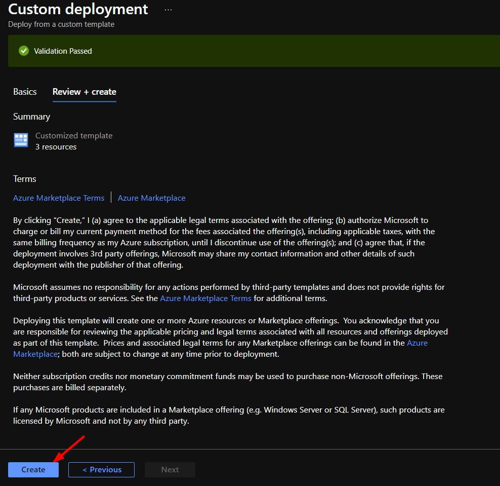
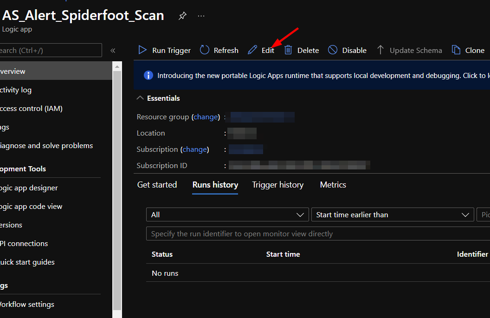
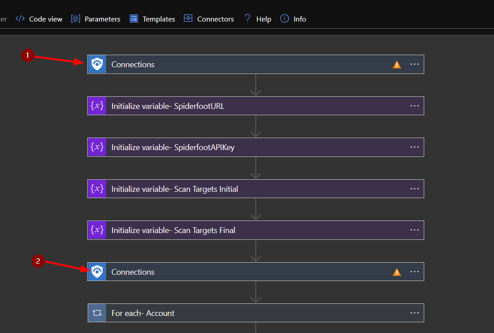
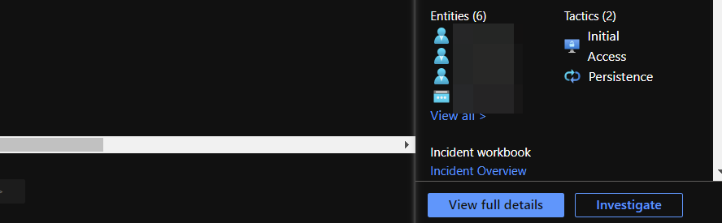
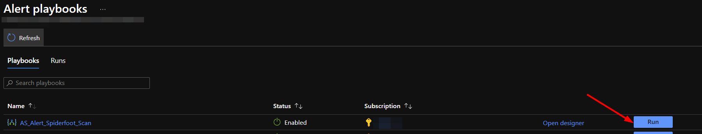

# AS_Alert_Spiderfoot_Scan

Author: Arbala Security

For any technical questions, please contact info@arbalasystems.com   

This playbook is intended to be run from an Azure Sentinel alert. It will pull email addresses from the account entities in an alert and use them as targets in a Spiderfoot scan. By default, the scan is created using the HaveIBeenPwned module. The resulting report of that scan will be emailed to a recipient specified upon deployment.

#

You will need the following items to enter into the template settings during deployment: 

* The URL of your Spiderfoot account.
* Your Spiderfoot API key. 
* The email address you would like to have the completed Spiderfoot report link sent to.

 # 
 To obtain your Spiderfoot API key:
 
 Log into your Spiderfoot account and in the top right-hand corner under your name, click the "API Key" option.
 

 #
To configure and deploy this playbook:
 
Open your browser and ensure you are logged into your Azure Sentinel workspace. In a separate tab, open the link to our playbook on the Arbala Security GitHub Repository:

https://github.com/Arbala-Security/AS_Alert_Spiderfoot_Scan

From there, click the “Deploy to Azure” button at the bottom and it will bring you to the Custom Deployment Template.

In the first section:  

* Select the “**Subscription**” and “**Resource Group**” from the dropdown boxes you would like the playbook deployed to.  

In the **Parameters** section:   

* **Playbook Name**: This can be left as “AS_Alert_Spiderfoot_Scan” or you may change it.  

* **Spiderfoot URL**: Once you have logged into your Spiderfoot account, paste the URL of your homepage here. Your unique subdomain is needed to make API calls. This should replace "example" in "example.hx.spiderfoot.net". Nothing else needs to be changed; do not include "https://".

* **Spiderfoot API Key**: Enter your Spiderfoot API key.

* **Email Addresses**:  Enter the desired email addresses here. If entering more than one, separate with a semicolon. 

Towards the bottom, click on “Review + create”. 

Once the resources have validated, click on "Create".

The resources should take around a minute to deploy. Once the deployment is complete, you can expand the "Deployment details" section to view them.
Click the one corresponding to the Logic App.

Click on the “Edit” button. This will bring us into the Logic Apps Designer.

Click on the bar labeled “Connections”.  

Here you can select an existing connection or create a new one. You will need to do this twice.

Click the save button.

#
To run this playbook on an alert in Azure Sentinel, navigate to "Incidents" under "Threat Management" in the left-hand menu.

From there you can select an incident that has one or more account entities.

Click the "View full details" button in the bottom right-hand corner.

In the middle window, scroll to the right and click "View playbooks".

Find the AS_Alert_Spiderfoot_Scan playbook and click run.

The playbook will run until the Spiderfoot scan it initiates is completed. Once the scan is finished, an email will be sent to the addresses specified in the deployment parameters. The email will contain the account entities pulled from the alert, the modules used in the Spiderfoot scan, and a link to the completed Spiderfoot report.
