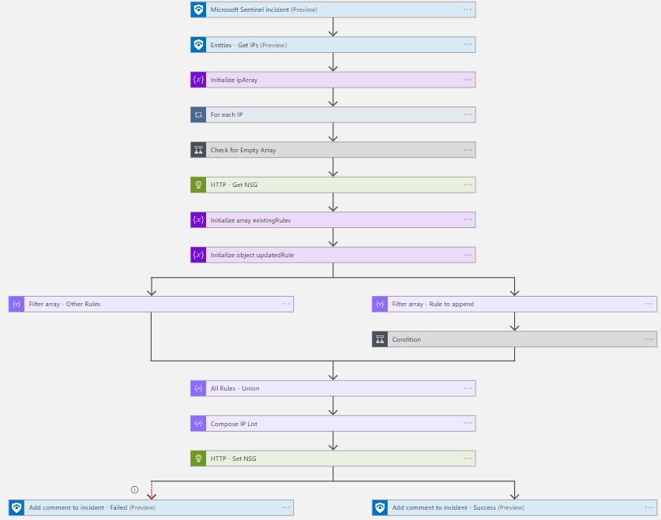

# Add-IP-Entity-To-NSG

author: Brian Delaney

This playbook will execute using an incident based trigger and add the IP entities to a Network Security Group rule.

If a Network Security Group rule does not exist at the configured rule priority, a rule will be created to block all inbound traffic from the IP entities in the Microsoft Sentinel incident to all destinations.

If a Network Security Group rule is already present, the rule source IP addresses will be appended with the IP entities from the Microsoft Sentinel incident.

This playbook will not create, or attach the NSG to any network interfaces or subnets.

## Quick Deployment

 

## Prerequisites

- A Network Security Group should be created and attached to the relevant network interfaces or subnets
- A rule may be precreated in the NSG with the desired settings, otherwise a deny inbound rule will be created automatically by playbook

## After Deployment

- Grant the Logic App Managed Identity access to the Network Contributor RBAC role on the NSG you will be modifying
- Grant the Logic App Managed Identity Microsoft Sentinel Responder on the Resource Group with Microsoft Sentinel, this enables the Logic App to report status messages back to the incident
- Attach this playbook to an **automation rule** so it runs when specified incidents are created.

[Learn more about automation rules](https://docs.microsoft.com/azure/sentinel/automate-incident-handling-with-automation-rules#creating-and-managing-automation-rules)
  
## Screenshots

