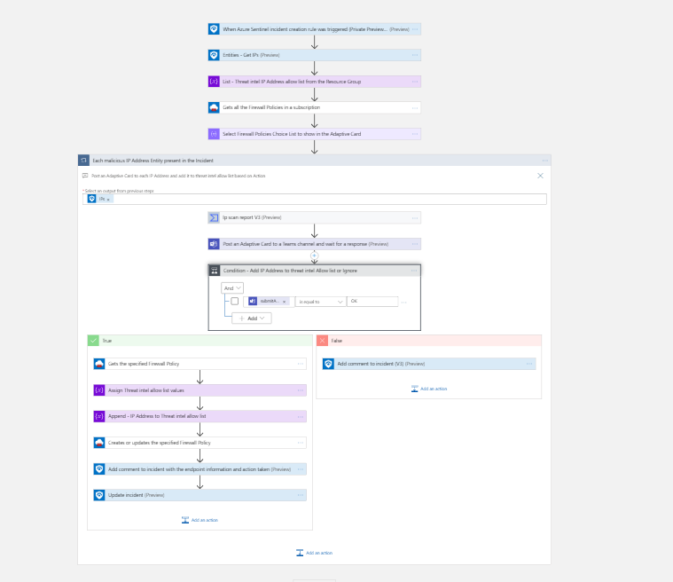
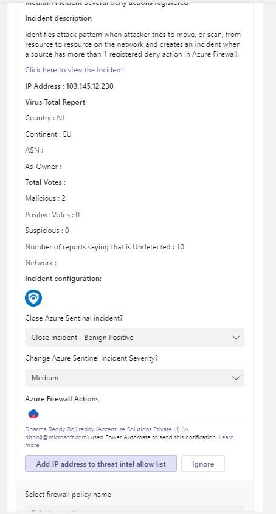

# Azure Firewall - Add IP Address to Threat Intel Allow list

 ## Summary

This playbook allows the SOC to automatically response to Azure Sentinel incidents which includes IPs, by adding the IPs to the TI Allow list in Azure Firewall Policy.
 [Learn more about Threat Intelligence in Azure Firewall Policies](https://docs.microsoft.com/azure/firewall/threat-intel)

When a new Azure Sentinel is created,this playbook gets triggered and performs below actions:
1.  An adaptive card is sent to the SOC channel providing IP address, Virus Total report , showing list of existing firewalls in the Resource group and providing an option to block IP address or Ignore.
2. If SOC user confirms yes, the IP Address gets added to Threat Intel Allow list and incident will get updates with endpoint information, summary of the action taken.
3. Else, incident will get updates with endpoint information and summary of the action taken. 
4. Update the firewall tags "configuration" as key and "sentinel" as value.

  

**This is the adaptive card SOC will recieve when playbook is triggered:**  

**Comment example:**  

### Prerequisites 
1. **This playbook template is based on Azure Sentinel Incident Trigger which is currently in Private Preview (Automation Rules).** You can change the trigger to the Sentinel Alert trigger in cases you are not part of the Private Preview.
1. Azure Firewall connector needs to be deployed prior to the deployment of this playbook under the same subscription. Relevant instructions can be found in the connector doc page.
1. Azure Firewall connector need to be authenticated with a Service Principal that has permissions over Azure Firewall. Relevant instructions can be found in the connector doc page.
1. This playbook will add new rules to existing Network Collections in Azure Firewalls in your subscription. Make sure you have such prior to running the playbook. 
1. **Permissions required for this playbook**  
This playbook **Gets** and **Updates** Azure Firewall Policies in the subscription of Azure Sentinel. The registered application/Service Principal that is authenticated to the connector needs to have the following RBAC Roles:

	* **Contributor** on the Azure Firewall Policies in the Azure Sentinel resource group.

1. To use VirusTotal connector, get your Virus Totan API key. [ how to generate the API Key](https://developers.virustotal.com/v3.0/reference#getting-started)

### Deployment instructions 
1. Deploy the playbook by clicking on "Depoly to Azure" button. This will take you to deplyoing an ARM Template wizard.

2. Fill in the required paramteres:
    * Playbook Name : Enter the playbook name here (ex:AzureFirewall-BlockIP-addNewRule)
    * Teams GroupId : Enter the Teams channel id to send the adaptive card
    * Teams ChannelId : Enter the Teams Group id to send the adaptive card
    [Refer the below link to get the channel id and group id](https://docs.microsoft.com/powershell/module/teams/get-teamchannel?view=teams-ps)
    * ClientId : Enter the ClientId of the application
    * ClientSecret : Enter the Client secret of the application

### Post-Deployment instructions 
#### a. Authorize connections
Once deployment is complete, you will need to authorize each connection.
1.	Click the Azure Sentinel connection resource
2.	Click edit API connection
3.	Click Authorize
4.	Sign in
5.	Click Save
6.	Repeat steps for other connection such as Teams connection and Virus Total (For authorizing the Virus Total API connection, the API Key needs to be provided)
7.  Authorize the Azure Firewall custom connector by followint the below mentioned steps.

	  a. Navigate to playbook

      b. Click Edit

      c. Find the action with the name "Lists all Azure Firewalls in a resource group " , "Gets the specified Firewall Policy", "Creates or updates the specified Firewall Policy" in the workflow.

      d. Click Change connection -- Enter Connection name, ClientId, SecretKey and TenantId captured from AAD. 

#### b. Configurations in Sentinel
1. In Azure sentinel analytical rules should be configured to trigger an incident with IP Entity.
2. Configure the automation rules to trigger this playbook

## Playbook steps explained
### When Azure Sentinel incident creation rule is triggered

### Varialbes 

   * List - Threat intel IP Address allow list from the Resource Group

   * Compose to get the resource group name from the workflow.

### Lists all Firewall Policies in a resource group
Lists - Existing azure firewalls with in a Resource Group

### Select Firewall Policies Choice List to show in the Adaptive Card
Prepare Firewall Policies Choice list to show in the Adaptive Card

### For each-malicious IP received from the incident
Iterates on the IPs found in this incident (probably one) and performs the following:
For the malicious IP Address, playbook uses "Ip scan report" action to get the information from Virus Total.
#### Posts an Adaptive card to  user 
In this step we post a message in Microsoft Teams to the SOC user with Incident details , IP Scan report and ask for his confirmation on the malicious activity described in the incident.

#### If malicious
Preparing an Array with SOC selected Firewall Options

### For each rules collection selected from Adaptive Card
 
 a. Reading the resource group name from the SOC selected

 b. Reading the firewall policy name from the SOC selected

 c. Gets the specified Firewall Policy

 d. Assign Threat intel allow list values

 e. Append - IP Address to Threat intel allow list

 f. Creates or updates the specified Firewall Policy

 g. Add comment to incident with the endpoint information , action taken and virus total scan report

 h. Close the incident with the Severity and Classification reason selected from Adaptive Card

#### Else
 Add comment to incident with the endpoint information , action taken and virus total scan report

